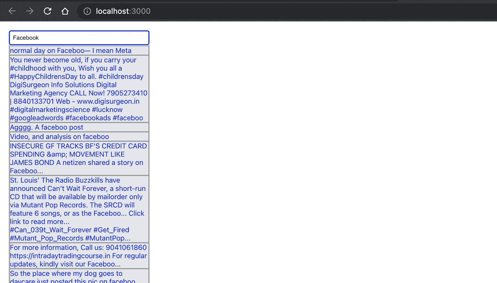
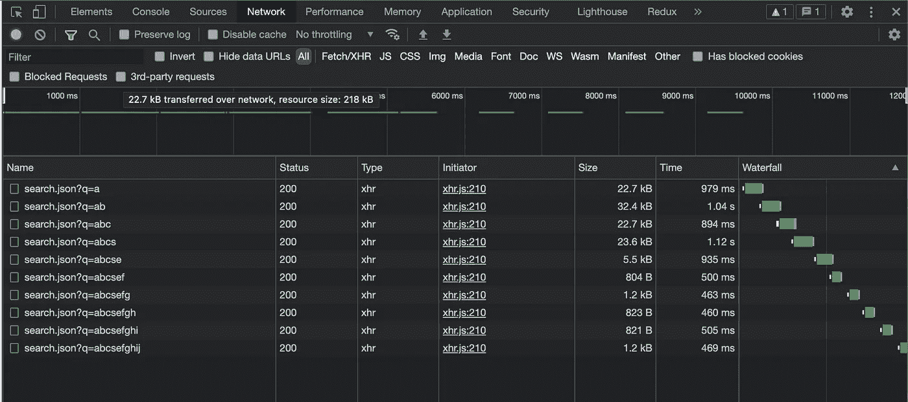
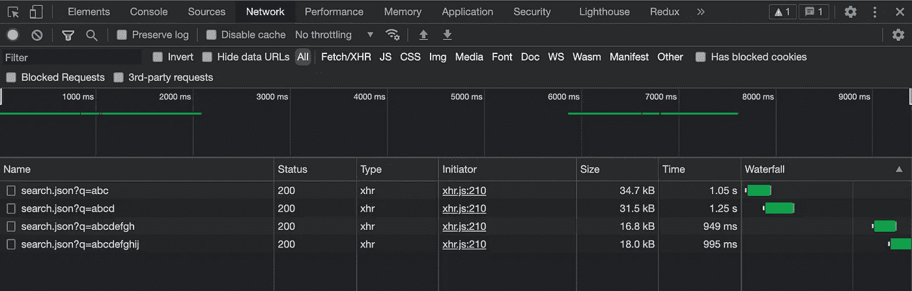

# 如何构建自动完成的反应组件并使用去抖提高其性能

> 原文：<https://javascript.plainenglish.io/how-to-build-auto-complete-react-component-and-improve-its-performance-using-debounce-df8a8b933371?source=collection_archive---------8----------------------->


Photo by [Caio](https://www.pexels.com/@caio?utm_content=attributionCopyText&utm_medium=referral&utm_source=pexels) from [Pexels](https://www.pexels.com/photo/macbook-air-on-grey-wooden-table-67112/?utm_content=attributionCopyText&utm_medium=referral&utm_source=pexels)

自动完成——这意味着预测用户在像[搜索栏](https://en.wikipedia.org/wiki/Search_box)这样的 UI 控件中输入的内容。它有助于改善任何应用程序的用户体验。

我们将实现基于用户输入呈现文本的 react 组件，然后我们将使用 [lodash 的](https://lodash.com/docs/)函数[去抖](https://lodash.com/docs/#debounce)来提高它的性能。

使用去抖是一种强大的技术，可以提高 web 应用程序的任何搜索功能的性能。

# **步骤 1 —建立一个 react 项目**

按照这里提到的[步骤](https://reactjs.org/docs/create-a-new-react-app.html)在机器的任何地方设置新的 react 项目。

```
npx create-react-app my-app-name
cd my-app-name
npm start
```

现在你的基本开发环境已经准备好了，在你喜欢的代码编辑器中打开项目，比如 [Visual Studio Code](https://code.visualstudio.com/) 。

在`src`中新建一个名为`components`的文件夹，并新建两个文件`AutoComplete.js`和`AutoComplete.css`。我们将使用`.js`文件来编写组件的 react 代码，使用`.css`来添加一些基本的样式。

您的文件夹结构将如下所示

```
|- node_modules
|- public
|- src
   |- components
      |- AutoComplete.js
      |- AutoComplete.css
   |- App.js
   |- index.js
|- package.json
```

# **步骤 2 —安装依赖关系**

我们将安装两个依赖项，用于构建这个组件—[axios](https://www.npmjs.com/package/axios)&[lodash](https://www.npmjs.com/package/lodash)

Axios 是一个 HTTP 客户端，它允许我们从 Node.js 发出请求，并帮助我们拦截端点的请求和响应。

```
npm i axios
```

> 注意:也可以用`[*fetch*](https://developer.mozilla.org/en-US/docs/Web/API/Fetch_API/Using_Fetch)`代替`*axios*`。我选择使用`*axios*`，因为我发现它非常简单。

[Lodash](https://lodash.com/) —是一个为处理 JavaScript 数组、数字、对象、字符串等而开发的实用程序库。我们将使用 lodash 的函数——[去抖](https://lodash.com/docs/4.17.15#debounce)——它在调用一些功能之前引入延迟，比如调用一个函数或请求一个 API。

```
npm i lodash
```

# 步骤 3-设置您的应用组件

清除掉不必要的代码，我们将只保留我们需要的。

```
import './App.css';
/*Import your new Auto complete component here*/const App = () => {
  return (
     <div className="App">
        {/* Call your AutoComplete component here */}
     </div>
  );
}export default App;
```

# **步骤 4——创建您的组件**

我们将从设置组件的基础开始—创建一个功能组件`AutoComplete`，我们将使用[钩子](https://reactjs.org/docs/hooks-intro.html)进行状态管理。

1.  您可以使用下面显示的代码片段。该组件将使用类名`wrapper`呈现`div`元素。
2.  `wrapper`将有两个新的子元素:一个类名为`control`的`div`元素和一个类名为`list`的`div`元素。
3.  `control`将包含一个类名为`input`的 input 元素，它将用户的查询作为输入。
4.  我们将向 API 端点发送一个包含用户查询的请求，一旦响应返回，我们将用类名`list`填充`div`元素，并在前端显示结果。
5.  state — `userInput`将管理用户的输入，当`input`控件的`onChange`事件被触发时，将调用方法— `handleOnInputChange`。

```
import React, { useState } from "react";export default const AutoComplete = () => {
    const [userInput, setInput] = useState("");

    const handleOnInputChange = (event) => {};return (
   <div className="wrapper">
       <div className="control">
            <input type="text" 
                   className="input"
                   onChange={handleOnInputChange}
                   value={userInput}
            />
       </div>
       <div className="list">
          ***{/*populate the list of items fetched from the endpoint*/}***
       </div>
    </div>
 )
}
```

现在组件的基础已经准备好了，我们将实现方法`handleOnInputChange`并将我们的请求发送到 API 端点。

为了测试，我使用了 Reddit 的搜索 API。首先，我们将为这个端点初始化一个常量变量。 [Reddit 的](http://reddit.com)搜索 API 接受一个保存用户输入值的查询参数`q`，即`userInput`。

```
const ITEMS_API_URL = "https://www.reddit.com/search.json";
```

我们还将添加三个新状态:

1.  为了存储我们收到的回复，
2.  `isLoading` —标识我是否仍在等待我的回复，以及
3.  `error`在发送请求时捕捉任何错误。

```
const [result, setResult] = useState([]);
const [isLoading, setIsLoading] = useState(false);
const [error, setError] = useState("");
```

为了向端点发送请求，我们将使用`axios`，它是我们之前作为依赖项安装的。

```
import axios from "axios";
```

我们将向我们的 API 发送一个请求以及用户的输入作为查询参数:

```
const handleOnInputChange = (event) => {
     const userInput = event.target.value;
     setInput(userInput);
     setIsLoading(true);
     axios.get(`${ITEMS_API_URL}?q=${userInput}`)
          .then((response) => {
             setResult(response.data.data.children);
             setIsLoading(false);
             setError("");
          }).catch(() => {
             setError("An error occured. Please try again.");
             setIsLoading(false);
    });};
```

现在我们的响应存储在`result`状态中，我们将使用它用类名`list`填充我们的`div`。我们的`result`中的每个字符串都将显示在一个单独的`div`元素中，其类名为`list-item`。

```
{error && <p>{error}</p>}
{isLoading && <p className="loading">Loading...</p>}
<div className="list">
   {**result**.map((item, index) => (
        <div className="list-item"
             key={index}
             id={`list-item-${index}`}
        >
          {item.data.title}
        </div>
   ))}
</div>
```

向组件的元素添加一些基本样式，如下所示:

```
.wrapper {
  margin: 20px;
}.list {
  border: 1px solid #999;
  width: calc(300px + 1rem);
  background-color: #e6e6e6;
}.list-item {
  border: 1px solid #999;
  color: blue;
}.list div:hover {
  color: black;
}
```

现在，您可以使用`npm start`命令运行应用程序，您将能够根据输入框中输入的查询来查看项目列表。



Auto suggestions as per query entered in the input box

我们还想在输入中显示选中的项目。因此，我们将添加一个新方法`onItemSelection`，它将在列表项的`onClick`事件中被调用。

```
{error && <p>{error}</p>}
{isLoading && <p className="loading">Loading...</p>}
<div className="list">
   {result.map((item, index) => (
        <div className="list-item"
             key={index}
             id={`list-item-${index}`}
             **onClick={onItemSelection}**
        >
          {item.data.title}
        </div>
   ))}
</div>
```

在选择项目时，我们希望隐藏列表并在输入框中显示所选项目:-

```
const onItemSelection = (event) => {
   setInput(event.target.innerText);
   setResult([]);
};
```

**如何提升性能？**

在上面的实现中，我们为 input 元素中的每个字符触发一个 API 请求。为了使我们的组件更有性能，我们必须避免在每次按键时发送太多的请求！



The request sent on every keypress

为了避免这种情况，我们将`debounce`请求并保持其超时为`500ms`。

我们现在将使用之前在`Step 2`中安装的`lodash`实用程序库。

```
import lodash from "lodash";
```

更新处理程序并在去抖延迟中环绕逻辑。我们将把`setInput`从[回调](https://reactjs.org/docs/hooks-reference.html#usecallback)中移出，因为我们需要立即更新输入，然后基于输入我们将进行查询。

```
const handler = useCallback(lodash.debounce(handleOnInputChange, DEBOUBCE_DELAY), []);const onChange = (event) => {
  setInput(event.target.value);
  handler(userInput);
};const handleOnInputChange = (userInput) => {
setIsLoading(true);
axios.get(`${ITEMS_API_URL}?q=${userInput}`)
     .then((response) => {
         setResult(response.data.data.children);
         setError("");
         setIsLoading(false);
     }).catch(() => {
         setError("An error occured. Please try again.");
         setIsLoading(false);
 });
}
```

现在，只有在用户停止输入 500 毫秒后，才会调用 API &因此减少了 API 调用的数量。



The reduced number of requests after using debounce

仅此而已。
你可以在这里获得组件[的完整源代码。](https://github.com/mansi-manhas/react-autocomplete-autosuggestion-component/blob/main/src/components/AutoSuggestions.js)

[](https://www.buymeacoffee.com/mansimanhas)

Thanks for your support!

*更多内容请看*[***plain English . io***](https://plainenglish.io/)*。*

*报名参加我们的* [***免费周报***](http://newsletter.plainenglish.io/) *。关注我们上* [***推特***](https://twitter.com/inPlainEngHQ) ， [***领英***](https://www.linkedin.com/company/inplainenglish/) ***，***[***YouTube***](https://www.youtube.com/channel/UCtipWUghju290NWcn8jhyAw)***，以及****[***不和***](https://discord.gg/GtDtUAvyhW) *

****用*** [***电路***](https://circuit.ooo/?utm=publication-post-cta) *为你的科技创业建立认知和采用。**