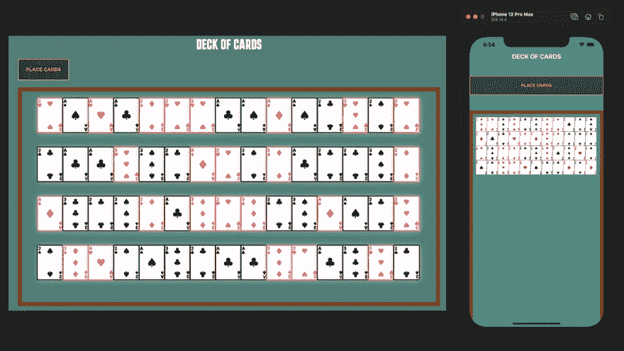

# 如何使用 React、React Native 和 Redux 构建跨平台应用

> 原文：<https://javascript.plainenglish.io/how-to-build-cross-platform-apps-using-react-react-native-and-redux-bcac22dbf817?source=collection_archive---------16----------------------->


如今，开发在各种平台上运行的应用程序是非常正常的。这允许用户使用不同的设备访问相同的应用程序。

在本教程中，您将学习如何创建在 web 和移动设备上工作的跨平台应用程序。web 版本将使用 React 和 Redux 创建，而移动版本将使用 React Native 和 Redux 创建。我们将使用 Expo 框架来创建 React Native 和 Redux 应用程序。

我们将创建的应用程序被称为“纸牌”。这只是一个简单的应用程序，可以让你在牌桌上随机放置卡片，并在设定的时间后自动移除。



# 设置

在我们开始之前，请确保您的开发环境已经安装了正确的包。如果你在 Mac 上工作，那么你将能够使用苹果模拟器和安卓模拟器。如果你在 Windows 或 Linux 上工作，那么你只能使用 Android 模拟器进行测试。然而，你应该能够将你自己的物理设备连接到任何一个操作系统，这样你就可以在你的手机上测试应用程序。

# 所需工具

*   像 Visual Studio 代码这样的 IDE 或代码编辑器。
*   类似 Hyper、iTerm 2、苹果终端等终端/Bash 应用。
*   安装在你的浏览器中的 [Redux DevTools](https://github.com/reduxjs/redux-devtools) 。

# 需要的包

*   [创建 React App](https://reactjs.org/docs/create-a-new-react-app.html)
*   [世博框架](https://expo.io/)
*   [Redux](https://redux.js.org/)
*   [纱线](https://yarnpkg.com/)(可选您可以使用 npm 或纱线)

# 内容

*   [使用 React 和 Redux 创建网页版](https://dev.to/andrewbaisden/how-to-build-cross-platform-apps-using-react-react-native-and-redux-212o#Creating%20the%20web%20version%20using%20React%20and%20Redux)
*   [使用 React Native 和 Redux 创建移动版本](https://dev.to/andrewbaisden/how-to-build-cross-platform-apps-using-react-react-native-and-redux-212o#Creating%20the%20mobile%20versions%20using%20React%20Native%20and%20Redux)

# 使用 React 和 Redux 创建 web 版本

# 项目设置

在桌面上创建一个名为**卡牌**的文件夹，然后在代码编辑器中打开这个项目。现在使用您的终端将 **cd** 放入项目目录，然后使用下面的代码建立一个样板 React 应用程序。

```
npx create-react-app my-app-web
```

设置好应用程序后，使用您的终端应用程序将 **cd** 放入其中，然后运行该应用程序。

```
cd my-app-web
npm run start
```

您应该会看到应用程序在您的浏览器中运行。是时候为 React 应用安装一些包并清理样板文件了。首先，您需要使用您的终端应用程序安装下面的包，因此请确保您位于根目录中，其中包含`package.json`文件。

```
npm i redux react-redux redux-thunk redux-devtools-extension uuid
```

现在删除 **src** 文件夹中的所有文件。该应用程序将崩溃，但不要担心，我们只是摆脱臃肿的软件，所以我们可以从头开始。你的项目应该有一个树状结构，如下所示。

```
└── my-app-web
    ├── README.md
    ├── node_modules
    ├── package-lock.json
    ├── package.json
    ├── public
    │   ├── favicon.ico
    │   ├── index.html
    │   ├── logo192.png
    │   ├── logo512.png
    │   ├── manifest.json
    │   └── robots.txt
    ├── src
    └── yarn.lock
```

现在确保你在 **src** 文件夹中。创建一个 **index.js** 文件，并输入下面的代码。

```
import React from 'react';
import ReactDOM from 'react-dom';
import App from './App';ReactDOM.render(<App />, document.getElementById('root'));
```

接下来，您需要在同一个文件夹中创建一个 **App.js** 文件，并输入下面的代码。

```
import React, { Fragment } from 'react';const App = () => {
    return (
        <Fragment>
            <h1>React App</h1>
        </Fragment>
    );
};export default App;
```

您可能需要重新载入网页或重新启动服务器。之后，您应该会看到处理标题文本的页面。

# 设置 Redux 商店

随着 React 应用程序的安装和运行，我们现在可以开始工作在 Redux 商店。我们将需要一个 **store.js** 文件以及用于**动作**和**减少器**的文件夹。如果你打开你的网络浏览器，进入 Redux DevTools，它应该显示类似于“*没有找到商店”的信息。请务必遵循说明。*”

在 **src** 文件夹中创建一个 **store.js** 文件，然后输入下面的代码来设置 Redux Store。

```
import { createStore, applyMiddleware } from 'redux';
import { composeWithDevTools } from 'redux-devtools-extension';
import thunk from 'redux-thunk';
import rootReducer from './reducers';const initialState = {};const middleware = [thunk];const store = createStore(rootReducer, initialState, composeWithDevTools(applyMiddleware(...middleware)));export default store;
```

现在用下面的代码更新 **index.js** 文件。

```
import React from 'react';
import ReactDOM from 'react-dom';
import App from './App';
import store from './store';
import { Provider } from 'react-redux';ReactDOM.render(
    <Provider store={store}>
        <App />
    </Provider>,
    document.getElementById('root')
);
```

接下来，创建一个名为 **actions** 的空文件夹和一个名为 **reducers** 的空文件夹，并将它们放入 **src** 文件夹。进入 **reducers** 文件夹，创建一个名为 **index.js** 的文件。将下面的代码添加到该文件中。

```
import { combineReducers } from 'redux';export default combineReducers({});
```

完成后，返回浏览器中的应用程序并重新加载页面。如果你去 Redux DevTools，你应该看到它现在工作。

# 创建卡片缩减器

下一步将为动作创建文件，并为 reducer 创建一个 reducer 文件。actions 文件夹还将包含一个集中存放常量的文件，因此您只需在一个地方更改它们。进入**动作**文件夹，创建一个名为 **types.js** 的文件和一个名为 **card.js** 的文件。将下面的代码放到 **types.js** 文件中。

```
export const SET_CARD = 'SET_CARD';
export const REMOVE_CARD = 'REMOVE_CARD';
```

现在进入 **reducers** 文件夹，创建一个名为 **card.js** 的文件。将下面的代码添加到该文件中。这将设置将用于减速器的状态和功能。

```
import { SET_CARD, REMOVE_CARD } from '../actions/types';const initialState = [
    {
        text: 'Deck of Cards',
    },
];export default function (state = initialState, action) {
    const { type, payload } = action; switch (type) {
        case SET_CARD:
            return [...state, payload];
        case REMOVE_CARD:
            return state.filter((card) => card.id !== payload);
        default:
            return state;
    }
}
```

现在更新 **reducers** 文件夹中的 **index.js** 文件，导入 **card.js** 文件。

```
import { combineReducers } from 'redux';
import card from './card';export default combineReducers({
    card,
});
```

接下来，进入**动作**文件夹，将下面的代码添加到 **card.js** 文件中。这将设置发送数据的调度功能。这将把卡信息作为通过状态的动作来分派。

```
import uuid from 'uuid';
import { SET_CARD, REMOVE_CARD } from './types';export const setCard = (msg, cardType) => (dispatch) => {
    const id = uuid.v4();
    dispatch({
        type: SET_CARD,
        payload: { msg, cardType, id },
    }); // Change the value in the set time out to increase or decrease the time. The default is 10000 which equals 10 seconds
    // Alternativly you can comment out the code below so that the cards just stay on the screen and don't get removed
    setTimeout(() => dispatch({ type: REMOVE_CARD, payload: id }), 10000);
};
```

# 将应用程序连接到 Redux 商店

最后，我们将把动作和减少器连接到主 **App.js** 文件。首先创建一个 **App.css** 文件，放在 **src** 文件夹的根目录下。将以下样式添加到 **App.css** 文件中。

```
@import url('https://fonts.googleapis.com/css2?family=Karantina:wght@300;400;700&display=swap');
* {
    margin: 0;
    padding: 0;
    box-sizing: border-box;
}html {
    font-size: 62.5%;
}body {
    font-size: 1.6rem;
    font-family: 'Karantina', cursive;
    background: #4f8a82;
}main {
    margin: 0 auto;
    max-width: 100%;
    width: 120rem;
}.container {
    margin: 2rem 2rem 2rem 2rem;
}.heading-text {
    color: #ffffff;
    margin: 2rem 0 2rem 0;
    font-size: 4rem;
    text-transform: uppercase;
    text-align: center;
}.card-board-container {
    margin: 2rem auto;
    padding: 2rem 0 2rem 4.5rem;
    display: flex;
    flex-flow: row wrap;
    max-width: 100%;
    width: 120rem;
    border: 1rem solid #943807;
    height: 60rem;
}.btn-place-card {
    cursor: pointer;
    padding: 2rem;
    border: 0.2rem solid #ffdd07;
    background: #284743;
    color: #ffdd07;
    font-weight: 700;
    text-transform: uppercase;
    transition: background 0.5s;
}.btn-place-card:hover {
    background: #48726c;
    border: 0.2rem solid #ffea63;
}.btn-place-card:focus {
    outline: 0;
}.card {
    margin-bottom: 2rem;
}/* Use the CSS below as a reference for adding a full deck of cards which is 52 cards in total */
/* Example full deck of cards */
/* https://upload.wikimedia.org/wikipedia/commons/thumb/8/81/English_pattern_playing_cards_deck.svg/1200px-English_pattern_playing_cards_deck.svg.png */.card-spade-1,
.card-spade-2,
.card-spade-3,
.card-heart-1,
.card-heart-2,
.card-heart-3,
.card-diamond-1,
.card-diamond-2,
.card-diamond-3,
.card-club-1,
.card-club-2,
.card-club-3 {
    width: 7rem;
    height: 9.5rem;
    background: #ffffff;
    box-shadow: 0px 0px 17px 0px rgba(199, 199, 199, 1);
}.card-spade-1::before {
    content: '🂡';
    color: black;
    position: relative;
    font-size: 12rem;
    top: -2.54rem;
    left: -0.9rem;
}.card-spade-2::before {
    content: '🂢';
    color: black;
    position: relative;
    font-size: 12rem;
    top: -2.54rem;
    left: -0.9rem;
}.card-spade-3::before {
    content: '🂣';
    color: black;
    position: relative;
    font-size: 12rem;
    top: -2.54rem;
    left: -0.9rem;
}.card-heart-1::before {
    content: '🂱';
    color: #ff5555;
    position: relative;
    font-size: 12rem;
    top: -2.54rem;
    left: -0.9rem;
}.card-heart-2::before {
    content: '🂲';
    color: #ff5555;
    position: relative;
    font-size: 12rem;
    top: -2.54rem;
    left: -0.9rem;
}.card-heart-3::before {
    content: '🂳';
    color: #ff5555;
    position: relative;
    font-size: 12rem;
    top: -2.54rem;
    left: -0.9rem;
}.card-diamond-1::before {
    content: '🃁';
    color: #ff5555;
    position: relative;
    font-size: 12rem;
    top: -2.54rem;
    left: -0.9rem;
}.card-diamond-2::before {
    content: '🃂';
    color: #ff5555;
    position: relative;
    font-size: 12rem;
    top: -2.54rem;
    left: -0.9rem;
}.card-diamond-3::before {
    content: '🃃';
    color: #ff5555;
    position: relative;
    font-size: 12rem;
    top: -2.54rem;
    left: -0.9rem;
}.card-club-1::before {
    content: '🃑';
    color: #000000;
    position: relative;
    font-size: 12rem;
    top: -2.54rem;
    left: -0.9rem;
}.card-club-2::before {
    content: '🃒';
    color: #000000;
    position: relative;
    font-size: 12rem;
    top: -2.54rem;
    left: -0.9rem;
}.card-club-3::before {
    content: '🃓';
    color: #000000;
    position: relative;
    font-size: 12rem;
    top: -2.54rem;
    left: -0.9rem;
}
```

现在打开 **src** 文件夹中的 **App.js** 文件，用下面的代码替换里面的代码。

```
import { connect } from 'react-redux';
import { setCard } from './actions/card';
import PropTypes from 'prop-types';
import { useState, Fragment } from 'react';
import './App.css';function App({ setCard, cards }) {
    const [cardRandomNum, setCardRandomNum] = useState(1);
    const [card] = useState(['spade', 'heart', 'diamond', 'club']);
    const [cardTypeOutput, setCardTypeOutput] = useState('spade'); const btnHandleClick = () => {
        // Change the code below to Math.floor(Math.random() * 13 + 1) if you want to get cards from 1 - 13 which is the full deck. 52 cards in total.
        setCardRandomNum(Math.floor(Math.random() * 3 + 1));
        console.log(cardRandomNum); const cardType = [Math.floor(Math.random() * card.length)]; setCardTypeOutput(card[cardType]);
        console.log(cardTypeOutput); setCard(cardRandomNum, cardTypeOutput);
        console.log(cards);
    };
    return (
        <Fragment>
            <main>
                <section className="container">
                    <div>
                        <h1 className="heading-text">{cards[0].text}</h1>
                    </div>
                    <div>
                        <button className="btn-place-card" onClick={btnHandleClick}>
                            Place Cards
                        </button>
                    </div> <div className="card-board-container">
                        {(cards !== null) & (cards.length > 0) &&
                            cards.map((card) => <div key={card.id} className={`card card-${card.cardType}-${card.msg}`}></div>)}
                    </div>
                </section>
            </main>
        </Fragment>
    );
}App.propTypes = {
    setCard: PropTypes.func.isRequired,
    cards: PropTypes.array.isRequired,
};const mapStateToProps = (state) => ({
    cards: state.card,
});export default connect(mapStateToProps, { setCard })(App);
```

你可能需要重新加载页面或重启服务器，但是当你这么做的时候，你应该会看到纸牌应用程序在工作。你所要做的就是反复点击放置卡片按钮，它会在表格框内随机生成卡片。每组牌最多 3 张，但是你可以通过修改几行代码将它扩展到一副牌中的所有 52 张牌。使用`actions/card./js`文件中的 **REMOVE_CARD** 分派动作，卡片在 10 秒钟后自动移除。如果你想，你可以改变时间或完全删除它，使卡留在屏幕上。

或者，如果你想添加更多的卡，你需要按照 **App.js** 文件和 **App.css** 文件中的注释来做。要添加更多的卡片图标，您只需添加或替换新的 Unicode 字符。你可以在这里找到一些。

# 使用 React Native 和 Redux 创建移动版本

# 项目设置

在桌面上创建一个名为**卡牌**的文件夹，或者使用之前已经创建的文件夹，然后在代码编辑器中打开该项目。现在使用您的终端将 **cd** 放入项目目录，然后使用下面的代码建立一个样板 React 本地应用程序。确保您选择了**空白**选项。我们将在教程中使用**纱线**，但是如果你愿意，你也可以使用 **npm** 。

```
expo init my-app-mobile
```

应用程序设置完成后，使用您的终端应用程序将 **cd** 放入其中，然后运行该应用程序。

```
cd my-app-mobile
yarn start
```

您应该会看到一个带有 Expo Developer 工具的 web 浏览器窗口打开。使用其中一个模拟器运行应用程序，或者通过使用手机扫描条形码来使用设备。是时候安装一些包并清理 React 本机应用程序的样板文件了。首先，您需要使用您的终端应用程序安装下面的包，因此请确保您位于根目录中，其中包含 **package.json** 文件。

```
yarn add redux react-redux redux-thunk redux-devtools-extension uuid
```

你的项目应该有一个树状结构，如下所示。

```
├── App.js
├── app.json
├── assets
│   ├── adaptive-icon.png
│   ├── favicon.png
│   ├── icon.png
│   └── splash.png
├── babel.config.js
├── node_modules
├── package.json
└── yarn.lock
```

# 设置 Redux 商店

随着 React 本地应用程序的安装和运行，我们现在可以开始在 Redux 商店上工作了。我们将需要一个 **store.js** 文件以及用于**动作**、**reducers _ _ 和 __components** 的文件夹。如果你在网络浏览器中运行应用程序，进入 Redux DevTools，它应该会显示类似于“*没有找到商店”的信息。请务必遵循说明。*”

创建一个 **src** 文件夹，然后在其中创建一个 **store.js** 文件，然后输入下面的代码来设置 Redux Store。

```
import { createStore, applyMiddleware } from 'redux';
import { composeWithDevTools } from 'redux-devtools-extension';
import thunk from 'redux-thunk';
import rootReducer from './reducers';const initialState = {};const middleware = [thunk];const store = createStore(rootReducer, initialState, composeWithDevTools(applyMiddleware(...middleware)));export default store;
```

现在用下面的代码更新`App.js`文件。

```
import React from 'react';
import store from './src/store';
import { Provider } from 'react-redux';
import DeckOfCards from './src/components/DeckOfCards';const App = () => {
    return (
        <Provider store={store}>
            <DeckOfCards />
        </Provider>
    );
};export default App;
```

在下一步中，创建一个名为**组件**的文件夹，并将其放入 **src** 文件夹中。现在在其中创建一个名为 **DeckOfCards.js** 的文件。将下面的代码添加到该文件中。

```
import React from 'react';
import { View, Text, StyleSheet, TouchableOpacity, FlatList } from 'react-native';
import { setCard } from '../actions/card';
import { connect } from 'react-redux';
import PropTypes from 'prop-types';
import { useState } from 'react';const App = ({ setCard, cards }) => {
    const [cardRandomNum, setCardRandomNum] = useState(1);
    const [card] = useState(['spade', 'heart', 'diamond', 'club']);
    const [cardTypeOutput, setCardTypeOutput] = useState('spade'); const btnHandleClick = () => {
        // Change the code below to Math.floor(Math.random() * 13 + 1) if you want to get cards from 1 - 13 which is the full deck. 52 cards in total.
        setCardRandomNum(Math.floor(Math.random() * 3 + 1));
        console.log(cardRandomNum); const cardType = [Math.floor(Math.random() * card.length)]; setCardTypeOutput(card[cardType]);
        console.log(cardTypeOutput); setCard(cardRandomNum, cardTypeOutput);
        console.log(cards);
    }; return (
        <View style={styles.appContainer}>
            <View style={styles.appHeading}>
                <View>
                    <Text style={styles.heading}>Deck of Cards</Text>
                </View>
                <View style={{ marginTop: 50 }}>
                    <TouchableOpacity onPress={btnHandleClick}>
                        <Text style={styles.cardBtn}>Place Cards</Text>
                    </TouchableOpacity>
                </View>
            </View>
            <View style={styles.appMain}>
                <View>
                    <FlatList
                        numColumns={11}
                        keyExtractor={(card) => card.id}
                        data={cards}
                        renderItem={({ item }) => {
                            let cardTypeGraphic = '';
                            let cardColorType = ''; const spade = {
                                one: {
                                    graphic: '🂡',
                                },
                                two: {
                                    graphic: '🂢',
                                },
                                three: {
                                    graphic: '🂣',
                                },
                            }; const heart = {
                                one: {
                                    graphic: '🂱',
                                },
                                two: {
                                    graphic: '🂲',
                                },
                                three: {
                                    graphic: '🂳',
                                },
                            }; const diamond = {
                                one: {
                                    graphic: '🃁',
                                },
                                two: {
                                    graphic: '🃂',
                                },
                                three: {
                                    graphic: '🃃',
                                },
                            }; const club = {
                                one: {
                                    graphic: '🃑',
                                },
                                two: {
                                    graphic: '🃒',
                                },
                                three: {
                                    graphic: '🃓',
                                },
                            }; if (item.cardType === 'spade' && item.msg === 1) {
                                cardTypeGraphic = spade.one.graphic;
                                cardColorType = 'black';
                            } else if (item.cardType === 'spade' && item.msg === 2) {
                                cardTypeGraphic = spade.two.graphic;
                                cardColorType = 'black';
                            } else if (item.cardType === 'spade' && item.msg === 3) {
                                cardTypeGraphic = spade.three.graphic;
                                cardColorType = 'black';
                            } else if (item.cardType === 'heart' && item.msg === 1) {
                                cardTypeGraphic = heart.one.graphic;
                                cardColorType = 'red';
                            } else if (item.cardType === 'heart' && item.msg === 2) {
                                cardTypeGraphic = heart.two.graphic;
                                cardColorType = 'red';
                            } else if (item.cardType === 'heart' && item.msg === 3) {
                                cardTypeGraphic = heart.three.graphic;
                                cardColorType = 'red';
                            } else if (item.cardType === 'diamond' && item.msg === 1) {
                                cardTypeGraphic = diamond.one.graphic;
                                cardColorType = 'red';
                            } else if (item.cardType === 'diamond' && item.msg === 2) {
                                cardTypeGraphic = diamond.two.graphic;
                                cardColorType = 'red';
                            } else if (item.cardType === 'diamond' && item.msg === 3) {
                                cardTypeGraphic = diamond.three.graphic;
                                cardColorType = 'red';
                            } else if (item.cardType === 'club' && item.msg === 1) {
                                cardTypeGraphic = club.one.graphic;
                                cardColorType = 'black';
                            } else if (item.cardType === 'club' && item.msg === 2) {
                                cardTypeGraphic = club.two.graphic;
                                cardColorType = 'black';
                            } else if (item.cardType === 'club' && item.msg === 3) {
                                cardTypeGraphic = club.three.graphic;
                                cardColorType = 'black';
                            } return (
                                <View>
                                    {cards.length <= 0 ? (
                                        <View>
                                            <Text></Text>
                                        </View>
                                    ) : (
                                        <View style={styles.cardContainer}>
                                            <View style={styles.card}>
                                                <View>
                                                    <Text
                                                        style={{
                                                            marginLeft: -3,
                                                            // You might need to change the marginTop value if the cards are not aligned on your device
                                                            marginTop: 0,
                                                            padding: 0,
                                                            fontSize: 60,
                                                            color: `${cardColorType}`,
                                                        }}
                                                    >
                                                        {cardTypeGraphic}
                                                    </Text>
                                                </View>
                                            </View>
                                        </View>
                                    )}
                                </View>
                            );
                        }}
                    />
                </View>
            </View>
        </View>
    );
};const styles = StyleSheet.create({
    appContainer: {
        backgroundColor: '#4f8a82',
        height: '100%',
        width: '100%',
    },
    appHeading: {
        marginTop: 50,
    },
    heading: {
        textTransform: 'uppercase',
        color: '#ffffff',
        fontWeight: 'bold',
        textAlign: 'center',
        fontSize: 20,
    },
    cardBtn: {
        backgroundColor: '#284743',
        textAlign: 'center',
        color: '#ffdd07',
        textTransform: 'uppercase',
        padding: 20,
        fontWeight: 'bold',
        borderWidth: 2,
        borderColor: '#ffdd07',
    },
    appMain: {
        marginTop: 50,
        marginBottom: 50,
        height: '100%',
        borderColor: '#943807',
        borderLeftWidth: 10,
        borderRightWidth: 10,
        borderTopWidth: 10,
        borderBottomWidth: 10,
        padding: 10,
    },
    flatlist: {
        flexDirection: 'column',
    },
    cardContainer: {
        display: 'flex',
        flexDirection: 'row',
        flexWrap: 'wrap',
        alignSelf: 'baseline',
    },
    card: {
        backgroundColor: '#ffffff',
        shadowColor: 'rgba(199, 199, 199, 1)',
        height: 46,
        width: 35,
    },
});App.propTypes = {
    setCard: PropTypes.func.isRequired,
    cards: PropTypes.array.isRequired,
};const mapStateToProps = (state) => ({
    cards: state.card,
});export default connect(mapStateToProps, { setCard })(App);
```

# 创建卡片缩减器

接下来创建一个名为**动作**的空文件夹和一个名为**减速器**的空文件夹，并将它们放在 **src** 文件夹中。进入 **reducers** 文件夹，创建一个名为 **index.js** 的文件。将下面的代码添加到该文件中。

```
import { combineReducers } from 'redux';
import card from './card';export default combineReducers({
    card,
});
```

完成后，创建一个 **card.js** 文件，并将其放在同一个 **reducers** 文件夹中。将下面的代码添加到该文件中。

```
import { SET_CARD, REMOVE_CARD } from '../actions/types';const initialState = [];export default function (state = initialState, action) {
    const { type, payload } = action; switch (type) {
        case SET_CARD:
            return [...state, payload];
        case REMOVE_CARD:
            return state.filter((card) => card.id !== payload);
        default:
            return state;
    }
}
```

最后转到**动作**文件夹，然后创建一个 **card.js** 文件和一个 **types.js** 文件。

将以下代码添加到 **types.js** 文件中

```
export const SET_CARD = 'SET_CARD';
export const REMOVE_CARD = 'REMOVE_CARD';
```

现在将下面的代码输入到 **card.js** 文件中

```
import uuid from 'uuid';
import { SET_CARD, REMOVE_CARD } from './types';export const setCard = (msg, cardType) => (dispatch) => {
    // uuid might not work be working properly with this version of Expo so a random number is used in this example instead
    // const id = uuid.v4();
    const id = String(Math.floor(Math.random() * 9000));
    dispatch({
        type: SET_CARD,
        payload: { msg, cardType, id },
    }); // Change the value in the set time out to increase or decrease the time. The default is 10000 which equals 10 seconds
    // Alternativly you can comment out the code below so that the cards just stay on the screen and don't get removed
    setTimeout(() => dispatch({ type: REMOVE_CARD, payload: id }), 10000);
};
```

如果你做的一切都是正确的，你应该看到应用程序在手机上工作。你可能需要重新加载浏览器或重启模拟器或手机才能看到它工作。由于每个设备和设置都不同，如果没有正确渲染，你可能需要在 **DeckOfCards.js** 文件中尝试一下样式。

# 最后的想法

我真的希望你喜欢阅读这篇文章，并从中学到一些东西。作为一名内容创作者和技术作家，我热衷于分享我的知识并帮助其他人实现他们的目标。让我们通过社交媒体联系起来。你可以在 [linktree](https://linktr.ee/andrewbaisden) 上找到我所有的社交媒体资料和博客。

和平。

*更多内容请看*[*plain English . io*](http://plainenglish.io/)