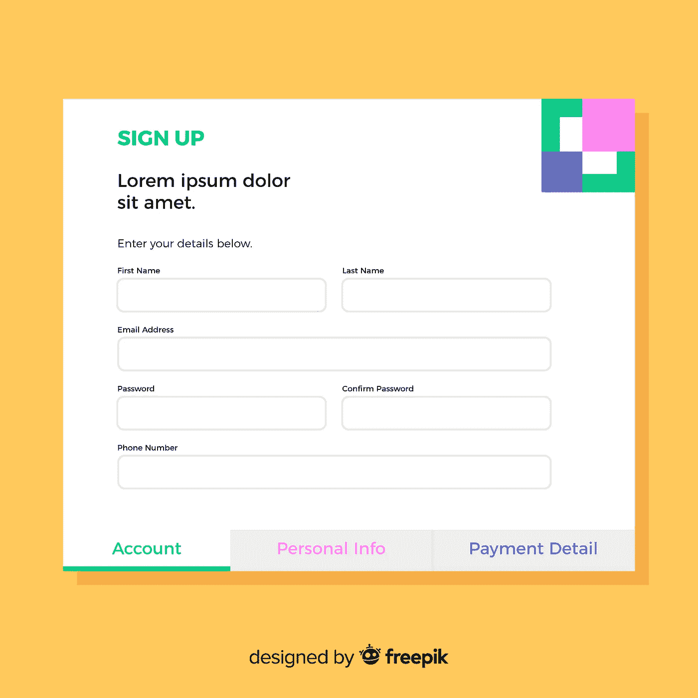
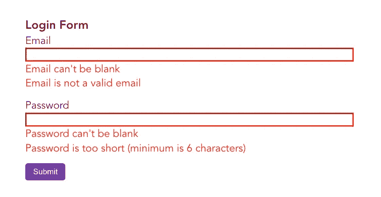
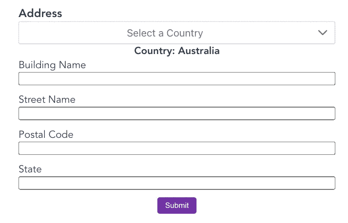
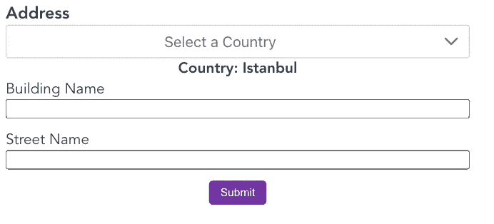
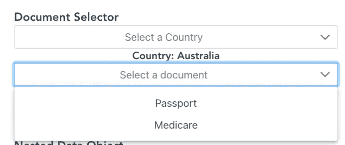
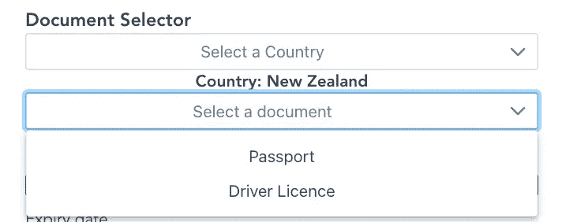
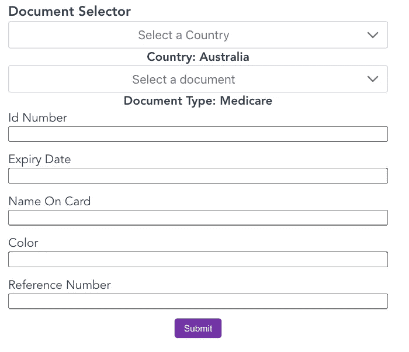

# 如何利用 Vue 3 — Form Builder 模式构建可扩展的表单工厂

> 原文：<https://javascript.plainenglish.io/how-to-build-flexible-form-factory-by-vue-3-form-builder-pattern-b88edaf94776?source=collection_archive---------7----------------------->



Photo on [**freepik**](https://www.freepik.com/free-vector/online-registration-concept_3316715.htm#page=1&query=form%20sign%20up&position=3)

表单几乎出现在每个应用程序中，但制作表单需要付出大量努力，如错误处理、反应、验证……当我们有一个包含表单的新功能时，我们会重复整个过程。为了解决这个问题，我将介绍一种不同的方法来构建一个**表单工厂组件。我们需要声明一个蓝图——一条信息来告诉我们需要为表单呈现什么样的组件和一些额外的元数据。这个解决方案非常完整，我认为它将涵盖我们对不同类型的表单的大多数情况。**

首先，我将展示一些使用我的 **FormBuild 组件**的例子。**为我丑陋的 CSS 道歉，因为我只关注这个主题的功能。**例如， [PDF 表单设计最佳实践](https://www.guru.com/blog/pdf-form-design-best-practices/)还有其他具体考虑事项。

**实例** **可在**:[http://form-builder-vue 3 . S3-website-AP-southeast-2 . Amazon AWS . com/](http://form-builder-vue3.s3-website-ap-southeast-2.amazonaws.com/)

示例 1: **简单登录表单**



例 2: **动态地址表**

所有国家的默认字段将是**建筑物名称**、**街道名称**，但是每个国家将显示不同的字段。例如，澳大利亚有邮政编码，但伊斯坦布尔没有。

这意味着其他字段将相互关联，并不限于字段可见或不可见，也可以是验证，道具，组件类型…或其他你想要的属性。



示例 3: **动态文档选择器**

每个国家都会有不同的文档列表，选择每个文档会显示不同的字段集合。

> *护照是所有国家的默认设置*
> 
> *澳大利亚有额外医疗保险*
> 
> *新西兰多了一张驾照*



选择文档类型后，它会显示该文档类型的字段集合。



好吧，我认为上面的例子已经足够复杂了。现在我们开始构建**表单生成器**。该组件将从蓝图中读取数据，并构建我们想要的表单。

# **蓝图**:

因为我们希望表单灵活、动态且相互关联，所以我们将使用 javascript 编写蓝图，最好使用 Typescript，因为它对类型建议非常有帮助。

蓝图的类型将为**iblue print<type of FormData>**:

*   **路径**:从`formData`对象传递到表单生成器的字段的对象路径。

例如:您将表单数据传递给表单生成器:

`formData = {form: {passport: {idNumber: null}}`

所以如果你想创建一个表单域来再次映射 idNumber，那么这个键就是`form.passport.idNumber`

路径内的道具将是:

*   **值**:是`formData`，我们把它传递给蓝图，让每一个字段都可以再动态改变表单数据。
*   **字段值**:字段值是来自`formData`的特定字段的值。它类似于`_.get(fieldPath, formData)`
*   **component** ():是一个函数，返回用于字段的组件，它将是您自定义的 Vue 组件，将把 value 作为 prop 和$emit 事件`input`的输入改变。
*   **props** ():是一个返回 props 的函数，这个函数将传递给我们上面定义的组件。它会自动将 fieldValue 传递给组件，但是如果您想要修改传递给组件的 props，您可以将 value: customValue 添加到对象中。
*   **可见性**():是一个返回字段可见与否的函数。
*   **validation** ():返回要验证字段的约束条件的函数。我使用 validate js，所以它需要遵循库的格式。例如，如果是电子邮件，它应该返回`{email: true}`
*   **必选**():函数返回字段是否必选。
*   **width** ():返回字段宽度的函数。

*注意:蓝图的所有属性都可以动态访问* `*formData*` *，所以我们可以基于* `*formData*` *使该字段表现不同。例如:*

```
idNumber: {
 visibility(){
   return this.value.country === 'AUS'
 }
}
```

下面是复杂地址形式的例子:

国家是一个下拉列表，值的长度必须为 3。仅当国家为澳大利亚时，才会显示州和邮政编码

# 表单生成器

现在我们知道了蓝图是什么样子，我们将开始构建 FormBuilder:

1.  **模板**:

它将是来自子节点的动态组件列表，我们将从蓝图中转换这些组件。

**子节点**将有接口:

```
export type IChildNode = { component: Component; visibility: boolean; width: string; props: { value?: string | null; options?: IOption[]; error: string[] | boolean; [key: string]: any; };};
```

2.**将蓝图转换为子节点**:

ChildNodes 是一个 getter，它将 blueprint(作为 prop 从父节点传递)转换为 IChildNode 的数组。因为它是一个 getter，所以每次道具改变时，整个表单域都会根据新的道具重新渲染。另外，我们需要给蓝图提供上下文，换句话说，让蓝图能够访问表单数据。除此之外，我们可以将其他实用程序函数或我们想要传递的值传递给 blueprint，这样 blueprint 就可以像` this . helper function()this . upper casevalue `这样做

不要忘记过滤掉可见性为假的字段。

3.**处理事件**:

我们将字段路径作为道具传递给所有的动态组件，所以当组件发出事件(如`VInput, VDropdown, VRadio)`)时，它需要带有字段路径，这让我们知道什么字段在变化。

重要提示:对于所有的自定义输入组件，您需要获取一个道具`name: string`、`value: any`并使用有效负载`$emit('input', {name, value})`发出事件输入

在 lodash 的帮助下，我们根据 fieldPath 和新值更新了`formData`的值。然后我们向父节点发出`formData`。

注意:对于 UX 的事情，什么字段正在更新，我们应该清除特定字段的错误，让用户知道错误是重新计算的。

4.错误处理:

由于我们已经为蓝图中的所有字段定义了所有的约束，现在我们可以将所有的内容收集到一个约束中，并使用 validatejs 来验证`formData`

然后当我们有了所有的错误，我们可以把它发送给父节点。

**如何使用 FormBuilder**

在我的例子中，我使用 composition API 为每个表单绑定逻辑。基本上，对于每个表单生成器，我们都需要通过:

```
props: {
 blueprint: Blueprint;
 error: IError;
 value: FormData;
 validateOnChange?: Boolean
}
```

对于表单验证，我们有两个选项:

*   从包装器按需验证，就像你想触发验证时使用点击按钮提交，但提交按钮停留在表单生成器之外。我们可以使用 ref: `this.ref.validate()`将其存档
*   输入改变时验证:每次输入改变时都会触发验证，只需要通过道具`validateOnChange: true`

请检查我的回购，看看我的例子，如果你喜欢，给一颗星:[https://github.com/Tony1106/form-builder-vue3](https://github.com/Tony1106/form-builder-vue3)

 [## tonybui 是内容共享吗

### 嘿👋我刚刚分享了我的想法，如果你喜欢，请给我买杯咖啡！谢谢

www.buymeacoffee.com](https://www.buymeacoffee.com/tonybui) 

*代表* [***团队，感谢阅读。***](https://plainenglish.io/)