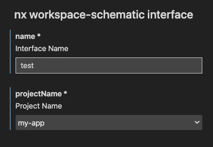
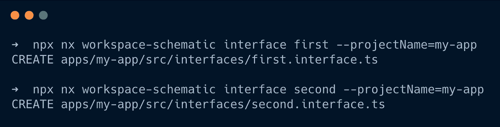
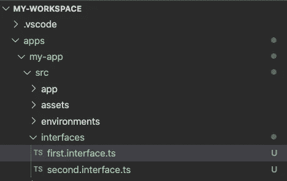
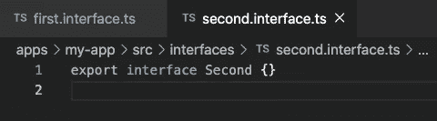

# 如何使用高级 Nx 开发套件构建生成器和原理图

> 原文：<https://javascript.plainenglish.io/how-to-build-generators-schematics-with-the-superior-nx-devkit-689d8f529fa6?source=collection_archive---------3----------------------->

## 我们最终都会变懒，对吗？


Photo by [Joshua Aragon](https://unsplash.com/@goshua13?utm_source=medium&utm_medium=referral) on [Unsplash](https://unsplash.com?utm_source=medium&utm_medium=referral)

> 本文假设了一些关于 [TypeScript](https://www.typescriptlang.org/docs/handbook/typescript-in-5-minutes.html) 和 [Nrwl Nx](https://nx.dev/latest/angular/getting-started/getting-started) 的一般知识。关于[角度](https://angular.io/start)的知识是有帮助的，但不是必需的。如果你没有听说过其中的一个，你也许应该先去看看，然后再回来。

生成代码很棒。Angular Devkit 已经为我们提供了一个构建代码生成器(schematics)的框架，Angular CLI 使用这个框架。Nx 工作区现在比以往任何时候都更具趋势性——你真的应该费心切换吗？

摘自 Nx 文档——Nx 发生器与默认原理图的不同之处在于:

*   副作用和生成由生成器直接执行。相反，Angular schematics 返回一个规则，随后调用该规则。
*   不使用 observables，直接调用 helpers。这使得调试变得简单明了。
*   通过直接调用原理图进行直接测试。不需要复杂的测试工具。
*   多个生成器的组合可以在没有助手的情况下完成，并且一目了然。

# 创建工作空间

好的，目前为止听起来不错。让我们开始构建一个简单的工作空间示意图，我们可以在 Nx 工作空间中使用它，无需任何进一步的设置。让我们首先用一个名为`my-app`的应用创建一个 Nx 工作空间。

此外，如果您还没有看过 Nrwl Nx，那么最好先阅读一下框架，然后继续本教程: [Docs](https://nx.dev/latest/angular/getting-started/getting-started) 。

Creating the workspace

# 生成和配置生成器

是的，你没看错。有一个用于生成工作空间生成器的生成器。在本教程中，我们将创建一个非常基本的生成器来生成空接口。使用`npx g workspace-schematic interface`创建一个名为`interface`的新生成器。

这为我们创建了三个文件。我们先来看看`schema.json`文件。这个文件指定了我们的生成器的 API。

打开`schema.json`让我们看到已经创建了一个默认的生成器 API:

tools/generators/interface/schema.json

*   `cli`指定这是一个 Nx 生成器。如果没有设置，cli 将尝试像常规角度示意图一样执行它。
*   `id`设置用于执行原理图的标识符。
*   保持发电机将接受的所有输入。例如，`name`是可以传递给生成器的输入之一。
*   `type`设置输入的数据类型。像`string`和`number`这样的基本类型都有。要获得完整的参考资料，请查看 JSON 模式规范。
*   `$default`设置默认设置，如果信息没有被显式传递，cli 将从该处读取信息。`argv`和`index: 0`使我们能够自动使用该输入的第一个参数。
*   `required`保存所有必需属性的数组。如果缺少其中一个属性，生成器将出错。

现在调整`schema.json`以符合我们的需求。我们将保留 name 参数，但是将描述改为`"Interface Name"`。另外，添加一个`projectName`属性。该属性将用于标识我们将把生成的接口放在哪个项目中。

tools/generators/interface/schema.json

请注意，`projectName`属性也设置了`"$source": "projectName"`。这将有助于 IDEs 注意到这个输入是一个项目名。如果我们现在打开 VSCode Nx 扩展内部的原理图，看起来棒极了！我们甚至有一个项目名称的下拉列表。



NX Extension in VSCode

如果您没有使用 VSCode 扩展，您可以简单地手工调用生成器。`--dryRun`将确保不会进行任何实际的更改(我们仍然使用最初生成的实现。)

```
nx workspace-schematic interface test --projectName=my-app --dryRun
```

# 为架构添加类型

在我们开始实现实际的生成器之前，我们将添加一个`schema.d.ts`文件，它包含一个与我们的`schema.json`匹配的 TypeScript 定义。

因为我们只有两个必需的`string`参数，所以我们的定义文件非常简单:

tools/generators/interface/schema.d.ts

# 实现生成器

现在终于有意思了。首先，让我们调整生成器签名以接收`InterfaceSchema`并删除自动生成的代码:

tools/generators/interface/templates/file-name.ts

接下来，我们将为想要生成的文件添加一个模板。创建一个名为`templates`的文件夹，并将模板文件放入其中。给模板一个文件名，如:`__fileName__.interface.ts__tmpl__`

tools/generators/interface/templates/__fileName__.interface.ts__tmpl__

您可能已经注意到这不是一个常规的 TypeScript 文件，而是一个 [ejs](https://github.com/mde/ejs) 文件。ejs(嵌入式 JavaScript)的主要目的是将模板文件编译成 js(或者本例中的 TS)。

在文件名中，我们使用`__variableName__`来替换变量。使用`<%= variableName %>`可以替换文件内容。对于更复杂的例子(比如 if，else，…)，请看官方的 [ejs 文档](https://github.com/mde/ejs)。

> 注意，我们在模板文件名的末尾使用了`__templ__`。这将防止 IDEs & TSC 试图解析我们的模板文件，它不是一个有效的 TypeScript 源。

我们可以使用来自`@nrwl/devkit`的`names`实用方法来生成不同格式的名称变量。对于输入`TestName`，它生成一个具有以下属性的对象:

现在我们可以使用`generateFiles`方法在模板之外创建文件。我们将把模板的源文件夹和目标文件夹传递给它。此外，我们提供了一个文件树和一个替换对象。

文件树对象与我们初始生成器函数中名为`host`的对象相同。它抽象文件变化，并使我们能够使用`--dry-run`参数。

substitution 对象使我们能够将替换传递给模板呈现。有了这个参数，我们可以替换文件名和文件内容中的字符串。

所有这些放在一起可能看起来像这样:

tools/generators/interface/index.ts

别忘了把`tmpl: ''`放进换人名单里。否则，您的输出文件将被称为`test.interface.ts__templ__`而不是`test.interface.ts`。

Line **35** 将使用您的工作区格式化程序自动格式化我们刚刚创建/更新的所有文件(在本例中只有一个)。把它放在最后几乎总是一个好主意。例如，当你的漂亮配置改变时，你所有的生成器仍然会与你的配置保持一致。

**别忘了**那边的`await`。格式化程序的调用是异步的，如果您省略了`await`关键字，生成器将在没有格式化的情况下完成。

# 生成一些接口🎊

现在我们已经完成了生成器的创建，是时候让它工作并生成一些接口了。为了简单起见，我将在这里使用 CLI，但是您也可以通过 [VSCode 扩展](https://marketplace.visualstudio.com/items?itemName=nrwl.angular-console)或使用 WebStorms 扩展之一来完成。



File tree looks good 👌



Generated interface also looks good 👌

生成的输出看起来很有希望。文件名都根据我们的输入进行了相应的更改，内容替换也起作用了。

甚至格式化程序也做了它应该做的事情，删除了我们的空行，并在末尾添加了一个新行🎉

# 好了🚀

谢谢你一直坚持到最后！在对 Nx 生成器和 devkit 的简短介绍之后，您应该对如何使用 Nx 构建基本生成器有了很好的了解🔥

发电机和脚手架在更大的工作空间里真的大放异彩。通过快速组装几个生成器，可以节省大量时间。此外，它们使得保持统一的代码结构更加容易。

接下来我们将看看**如何用 npm 发布**这些。这使您能够在您的组织中或与全世界共享生成器。此外，我们将探索如何**轻松测试**这些生成器(使用 Jest)。

如果你不想错过这些未来的话题，请在 [Medium](https://medium.com/@niklaspor) 或 [Twitter](https://twitter.com/niklaspor) 上关注我。

祝你愉快。
尼克拉斯

完整的源代码可以在这个 [GitHub 资源库](https://github.com/NiklasPor/How-to-Build-Generators-and-Schematics-With-the-Superior-Nx-Devkit)中找到👾