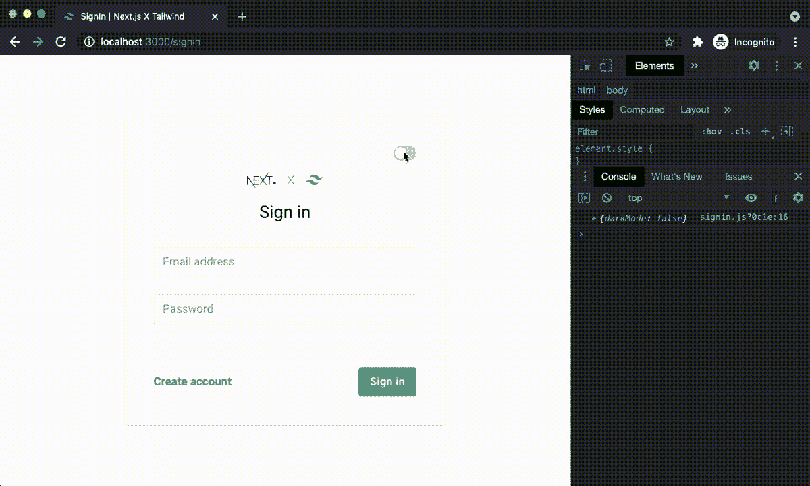
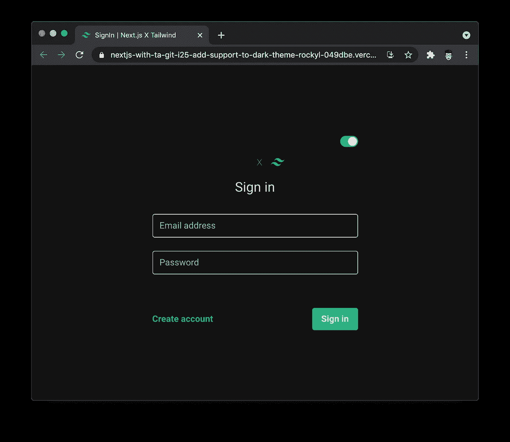
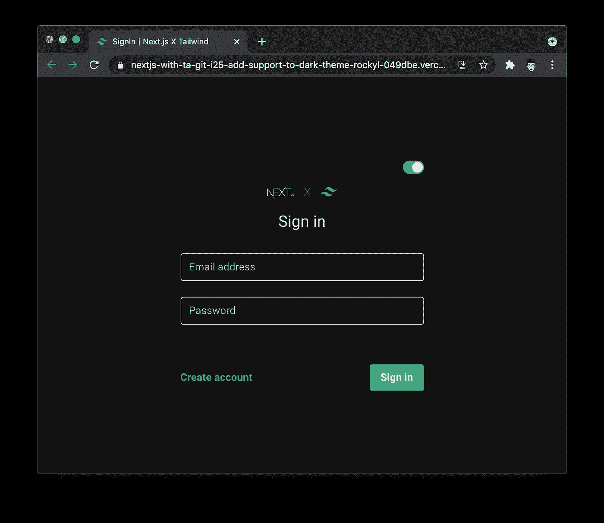
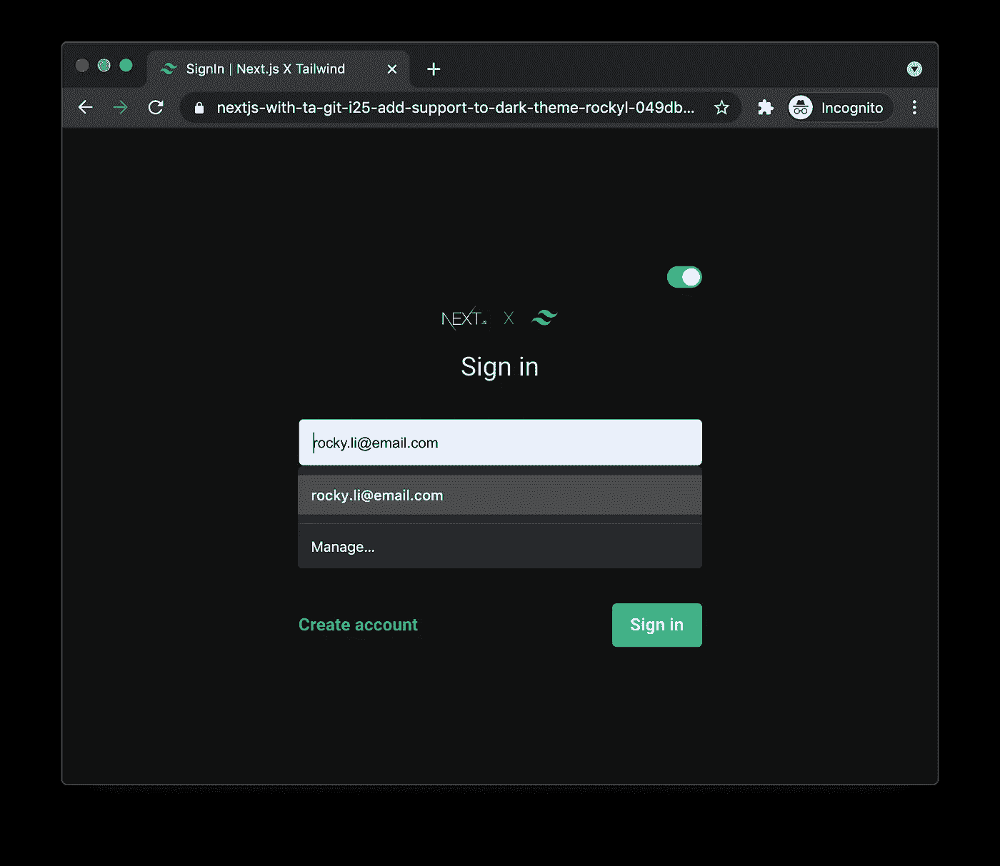
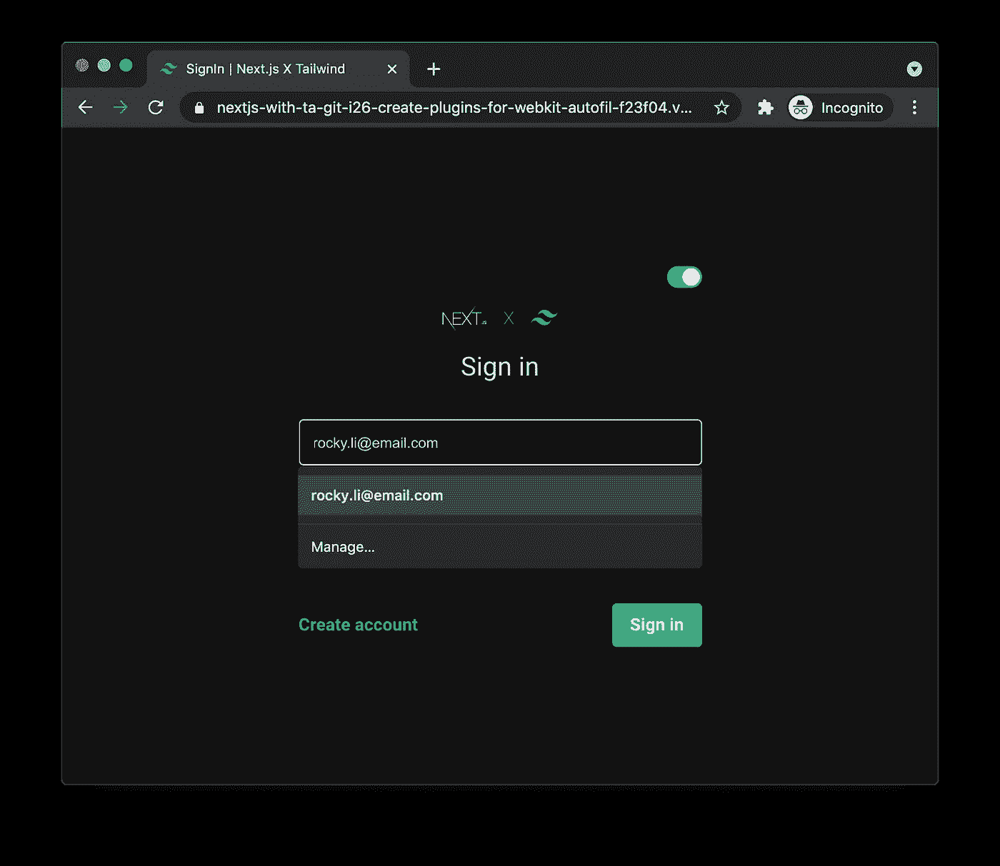
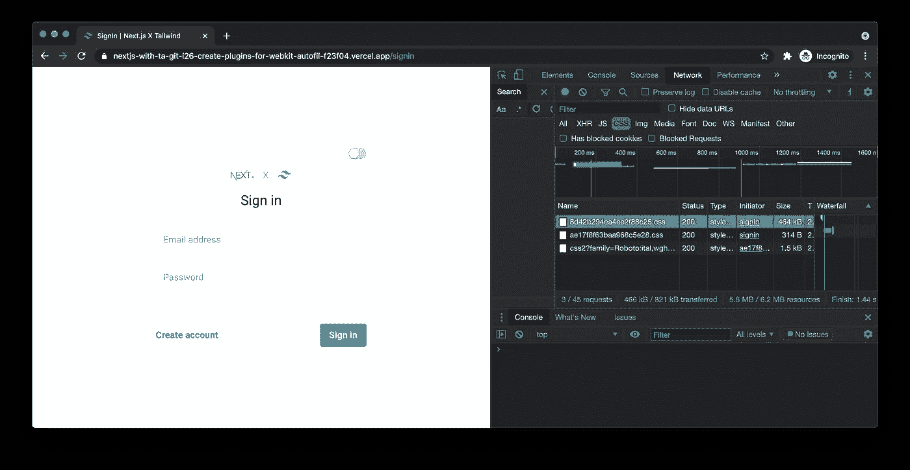
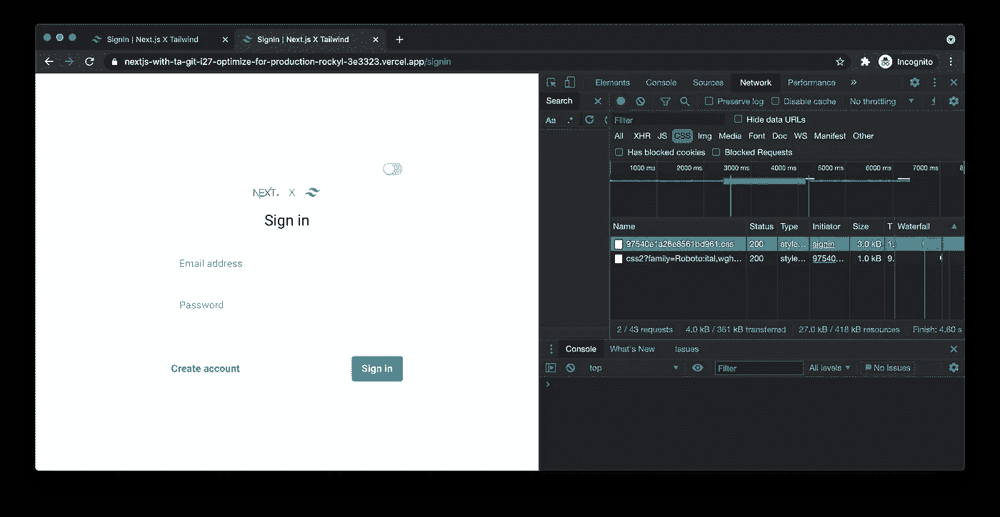

# 如何构建 Tailwind CSS 插件并针对生产进行优化

> 原文：<https://javascript.plainenglish.io/how-to-build-tailwind-css-plugins-and-optimize-for-production-da94f102462a?source=collection_archive---------5----------------------->

用 Next.js 和 Tailwind CSS 创建一个签到页面|第 2 集


Photo by [Zan](https://unsplash.com/@zanilic?utm_source=medium&utm_medium=referral) on [Unsplash](https://unsplash.com?utm_source=medium&utm_medium=referral)

# 介绍

在前面的故事中，我们用 Next.js 和 Tailwind CSS 构建了一个带有表单验证的登录页面。我将在 Next.js 中介绍我们如何使用 Tailwind CSS 添加对黑暗主题的支持，以及如何优化 Tailwind CSS 以用于生产。

请阅读下面关于如何使用 Next.js 和 Tailwind CSS 构建带有表单验证的登录页面的故事，以防您错过。

[](/how-can-tailwind-css-boost-your-development-experience-ed4204500cbd) [## Tailwind CSS 如何提升你的开发体验？

### 用 Next.js 和 Tailwind CSS 构建一个签到页面。

javascript.plainenglish.io](/how-can-tailwind-css-boost-your-development-experience-ed4204500cbd) 

## 为什么是黑暗主题？

黑暗主题已经存在了一段时间，并被大多数操作系统、浏览器和流行的应用程序所采用。对于一些长时间盯着屏幕的人来说，黑暗模式可能有助于减轻眼睛疲劳和干眼症，尤其是在光线较暗的情况下。对于有机发光二极管和 AMOLED 显示器，深色主题更适合您的设备电池。

Figure 1\. Are you afraid of the Dark?

# 增加对黑暗主题的支持

默认情况下，在顺风 CSS 中禁用黑暗模式。黑暗变体 ***黑暗:{class}*** 只有当我们在*中设置了**黑暗模式**时才会启用。/tailwind.config.js* 文件。

如果**黑暗模式**设置为 ***媒体*** ，则用户操作系统启用黑暗模式。 ***暗:{class}*** 将优先于无前缀职业。但是，在这个故事中，我们要将*中的 **darkMode** 设置为**T21***类。/tailwind.config.js 。当 HTML 树中存在 ***黑暗*** 类时，将启用黑暗模式，而不是用户的操作系统。

## 构建一个切换按钮

需要一个切换按钮在亮主题和暗主题之间切换。我们将使用 Tailwind CSS 构建一个切换按钮。

./components/Toggle/index.js

在上面的代码中，toggle 按钮是一个无状态模板，根据 ***活动*** 道具显示 toggle 状态，并在 toggle 按钮被点击时触发 ***onClick()*** 回调道具。

./pages/signin.js

**darkMode** 状态和切换按钮回调函数被添加到签到页面。点击切换按钮时，回调函数负责更新**黑暗模式**状态。在我们实现黑暗模式之前，让我们用 ***console.log*** 打印出**黑暗模式**状态来测试切换按钮。



Figure 2\. Update darkMode state with toggle button

## 启用黑暗模式

如上所述，我们在*中设置 **darkMode** 为 ***类*** 。/tailwind.config.js* 根据 HTML 树中的黑暗类启用黑暗模式。

./tailwind.config.js

根据[材质设计](https://material.io/design/color/dark-theme.html)，推荐深色主题表面颜色为 **#121212** 。我们在 ***主题中添加了深色主题表面颜色作为自定义颜色。***

当 **darkMode** 状态改变时， ***dark*** 类应相应地添加到车身类列表中或从车身类列表中删除。在*中。/pages/signin.js* ，我们用 ***useEffect()*** 钩子根据 **darkMode** 状态为 body 切换 ***dark*** 类。

./pages/signin.js

## 添加深色主题样式

启用深色模式后，我们需要用深色变体 ***dark:{class}*** 定义深色主题样式。在*中。/styles/globals.css* ，我们用 ***@apply*** 指令给基本 css 和输入类添加了实用程序类。自定义颜色 **codgray** 用于深色模式的背景色。

./styles/globals.css



Figure 3\. Apply dark theme styles

## 为深色主题添加图标

除了改变深色主题中的背景颜色和文本颜色，有时我们需要为深色主题提供不同的图像。上图你可能注意到了，Next.js 的 logo 看起来好像消失在了黑暗主题下。徽标的颜色与背景色非常相似。

```
public/
├── svg/
│   └── **nextjs-dark.svg**
│   └── **nextjs-light.svg**
│   └── tailwindcss.svg
```

为深色主题添加一个浅色的 Next.js logo，并重命名原来的 logo。为了在黑暗模式状态下显示不同的 SVG 图像，状态被作为道具传递给`SignInLogos`组件。



Figure 4\. Dark theme with light color logo

# 为 webkit 构建插件-自动填充

到目前为止，在签到页面中添加了黑暗主题支持。当我们在亮模式和暗模式之间切换时，一切看起来都很正常。然而，当我们用自动填充特性填充输入时，输入元素样式并没有像预期的那样显示。



Figure 5\. Unexpected style of input element when auto-fill

从[这个故事](https://dev.to/atndesign/a-trick-to-change-the-autocomplete-background-color-21ll)中，我们知道改变自动完成的输入的背景颜色和文本颜色的关键是***-WebKit-自动填充*** 选择器。在***-web kit-自动填充*** 选择器中，我们可以用***-web kit-box-shadow***声明来改变背景颜色，用***-web kit-text-fill***声明来改变文本颜色。

我们可以通过为***-web kit-自动填充*** 伪选择器构建插件来解决这个问题，这是 Tailwind CSS 不支持的。首先，创建一个插件来注册一个定制的变体`autofill`。这将启用 ***自动填充:{class}*** 语法并创建一个函数来修改后缀类。例如:当我们将 ***自动填充:bg-white*** 类分配给一个元素时，实用程序类 ***bg-white*** 将应用于***{ class }:-WebKit-自动填充*** 选择器，类似于内置的[悬停、聚焦等状态](https://tailwindcss.com/docs/hover-focus-and-other-states)。

./tailwind/plugins/webkit-autofill.js

根据 [**添加变体**文档](https://tailwindcss.com/docs/plugins#adding-variants)、**和*修改选择符()*和**是我们修改基本变体的辅助函数，而**和*分隔符*和**是一个可配置的字符串，用来分隔前缀变体和实用程序名称。

在*中。/tail wind/plugins/web kit-auto fill . js*、我们将***:-web kit-auto fill***添加到具有***modifieselecters()***helper 函数的类名中。该插件还将处理 ***:悬停*** 和 ***:聚焦*** 状态。

## Build -webkit-text-fill-color 实用程序

现在让我们创建一个插件，使用***add utilities()***功能在 Tailwind **utilities** 层注册一个新的样式。

./tailwind/plugins/webkit-text-fill-color.js

./tailwind/utils/flatten-theme.js

正如你所看到的，这个插件将顺风的主题颜色展平，并从展平的调色板中生成多种样式。这些新样式的工作原理类似于 ***text-{color}*** 和 ***bg-{color}*** 的工作原理。我们可以用顺风调色板设置***-WebKit-text-fill-color***。

## 构建-webkit-box-shadow 实用程序

同***-WebKit-text-fill-color***实用程序，我们创建一个插件为***-WebKit-box-shadow***注册一个新的样式。该实用程序使用展平的颜色生成***-WebKit-box-shadow***属性。

./tailwind/plugins/webkit-box-shadow.js

## 注册插件

一旦创建了插件，我们就可以在配置文件中注册插件。

./tailwind.config.js

我们还需要指定我们希望用新样式生成的变体。在我们的例子中，我们应该将**暗**变体和新创建的`autofill`变体添加到`webkitTextFill`和`webkitBoxShadow`实用程序中。

## 应用新的实用程序

到目前为止，我们已经准备好了插件。现在是时候将新的实用程序应用到输入组件了。在*中。/styles/global.css* ，用**暗**变体和`autofill`变体应用`webkitTextFill`和`webkitBoxShadow`样式。我们将文本设置为 ***灰色-300*** 颜色，背景设置为 ***codgray*** 颜色，用于自动填充状态下的深色模式。

./styles/globals.css

插件工作得很好！干得好！



Figure 6\. Customized style of input element when auto-fill

# 针对生产进行优化

在默认配置下，Tailwind CSS 的开发版本超过 *35kB* 未压缩。开发构建生成了数以千计的实用程序类，其中大部分在我们的项目中没有使用。

## 编写可清除的 HTML

因此，我们应该在顺风配置中使用 purge 选项来删除不必要的实用程序类。Tailwind CSS 使用 **PurgeCSS** 库来扫描 HTML 中的类。当我们[编写 purgeable HTML](https://tailwindcss.com/docs/optimizing-for-production#writing-purgeable-html) 时，我们需要注意的一件重要事情是避免在你的模板中用字符串连接动态创建类字符串。否则，该类将不会包含在产品版本中。

❌ **不使用字符串连接来创建类名**

```
<div class="text-{{  error  ?  'red'  :  'green'  }}-600"></div>
```

✅ **动态选择一个完整的类名**

```
<div class="{{  error  ?  'text-red-600'  :  'text-green-600'  }}"></div>
```

## 删除未使用的实用程序类

为了保持产品构建精简，我们可以指定一组路径来清除和删除未使用的实用程序类。在上面的代码中，我们在页面 ***中使用了 Tailwind 实用程序类。/pages/**/*。js*T3，组件**T5。/components/**/*。js** 还有全局风格 ***。/styles/**/*。CSS*。****

./styles/global.css

在我们使用 purge 选项优化生产构建之前，生成的 CSS 文件大小超过 464 *kB* 。



Figure 7\. Generated CSS sized 464kB before optimization

优化后，CSS 文件大小只有 3kB 左右。



Figure 8\. Generated CSS sized 3kB after optimization

# 结论

Tailwind CSS 是一个非常灵活的框架，它使用实用程序优先的方法。这取决于开发人员如何使用这些工具，我们是创建 CSS 组件还是直接将工具类应用到 HTML 中，并使样式从元素中可读。

一旦我们了解了 Tailwind CSS 框架应该如何使用。对于那些不太熟悉普通 CSS 的人来说，它非常强大，对 CSS 专业人员也有好处！

本系列只涵盖了框架的一个非常基础的部分。更多高级用法在 [Tailwind CSS 文档](https://tailwindcss.com/docs)中演示。

请随意使用[演示应用](https://vercel.com/rockyliyanlok/nextjs-with-tailwind-css/cX5gB1Tu5bRLYHNmqBuaHzP63twr)或者在这里克隆或派生存储库[。](https://github.com/rockyliyanlok/nextjs-with-tailwind-css)

编码快乐！

*更多内容请看*[*plain English . io*](http://plainenglish.io/)