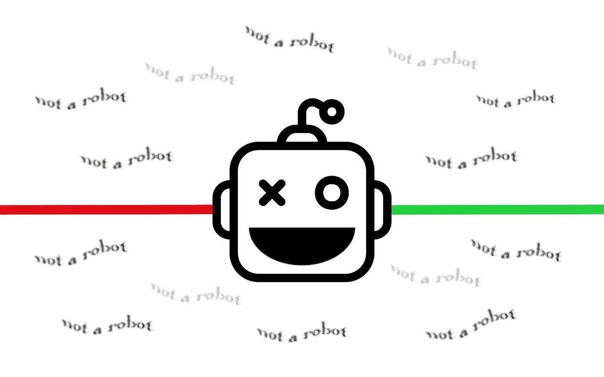
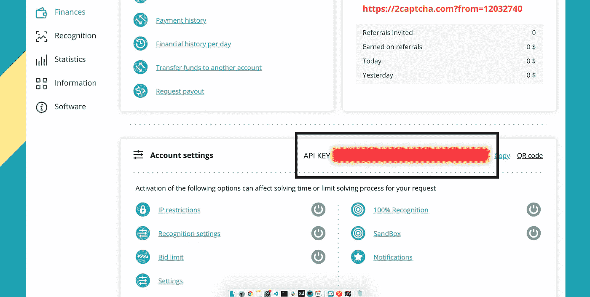

# 如何用 JavaScript 绕过验证码

> 原文：<https://javascript.plainenglish.io/how-to-bypass-captchas-with-javascript-13f6eb126f8?source=collection_archive---------4----------------------->

## 使用 JavaScript、木偶师和 2Captcha 绕过验证码



## 什么是验证码？

当网站想要验证用户不是机器人时，CAPTCHAs(区分计算机和人类的完全自动化的公共图灵测试)被用在各种网站上。我们看到的最常见的 CAPTCHA 形式之一要求用户看着部分模糊的字母图像，并键入他们看到的字母。最近，验证码变得越来越复杂，包括小游戏、图像识别等等。

验证码通常用于阻止不良行为者(如垃圾邮件机器人)出于欺诈或恶意目的操纵内容。考虑到这一点，我们仍然有很多合理的理由来通过编程控制一个网站，并在这个过程中绕过验证码。

## **用木偶师建立一个简单的网络自动化工具**

我们可以编程控制网站的一种方法是使用木偶师。

Puppeteer 是一个 Node.js 库，它提供了一个高级 API 来控制浏览器(通常是 Chrome/Chromium，但是 Puppeteer 也支持其他浏览器，比如 Firefox)。你可以在浏览器中做的大多数事情都可以用 Puppeteer 自动完成。木偶师网站提供了一堆例子，比如截图和生成网页的 pdf，自动化表单提交，测试 UI 等等。

通常我会讲述如何使用木偶师，但我之前已经详细介绍过了。下面是我写的关于这个话题的文章:

[](https://sunilsandhu.com/posts/how-to-scrape-data-from-a-website-with-javascript) [## 如何用 JavaScript 从网站上抓取数据

### 从一个网站(或多个网站)收集信息的过程通常被称为网络搜集或网络…

sunilsandhu.com](https://sunilsandhu.com/posts/how-to-scrape-data-from-a-website-with-javascript) 

所以，假设你有使用木偶剧的经验，或者已经花时间通读了上面的链接文章，让我们继续，看看我们如何用 2Captcha 绕过验证码。

## **什么是 2Captcha？**

[**2Captcha**](https://2captcha.com/) 是一个图像和验证码识别服务。2Captcha 的主要目的是由人类员工以快速准确的方式解决验证码。

2Captcha 解决了许多不同的 Captcha 样式，所有这些样式都具有几乎相同的两个 API 端点。第一个请求传递验证码解析所必需的数据，并返回请求 ID(或者在图像验证码的情况下返回 base64-ed 图像)。一旦您有了请求 ID，那么您将需要向结果端点提交请求，我们经常查询结果端点，直到解决方案准备好。

您得到的响应是一个令牌，需要与表单一起提交，并且需要输入到一个隐藏的文本字段中。

## **注册 2 cap cha**

2Captcha 需要一个 API 密钥，您可以在注册时获得。为了使用这项服务，你还需要存入一些资金。幸运的是，你只需要几美元就可以启动并运行。

# **如何绕过网站注册**

好了，现在 2Captcha 可以用来处理各种各样的 ReCAPTCHAs。为了简单起见，我们将自动创建一个新的 Reddit 帐户，这样我们就可以绕过常见的“我不是机器人”验证码。

让我们回顾一下我们为解决这个问题而设置的流程。

## 第一步。为我们的项目创建一个文件夹

我把我的文件夹命名为 **reddit-bypasser** ，但是你可以随便叫你的文件夹。

## 第二步。将潦草的回购克隆到我们的项目文件夹中

我们可以通过克隆 GitHub 的回购协议来做到这一点:[https://github.com/sunil-sandhu/scrawly](https://github.com/sunil-sandhu/scrawly)

## 第三步。创建附加文件

创建一个名为 **2captcha 的文件夹。**在这里，我们将有三个文件: **apiKey.js** 、 **initiateRequest.js** 和 **getRequestResults.js** 。正如你所想象的， **apiKey.js** 仅仅包含了我们的 2Captcha API 键，我们可以在 2Captcha 仪表板上找到它。*见下图:*



[https://2captcha.com/enterpage](https://2captcha.com/enterpage) — the API can be found where the blurred red box would usually be.

用仪表板中的 API 键替换 **apiKey.js** 中的空字符串。

**initiateRequest.js** 文件用于向 2Captcha 发出 API 请求。您会注意到，在这个文件中，我们有一个对象，它解释了我们计划跳过的 ReCAPTCHA 的类型。让我们一行一行地检查这个对象:

```
const formData = {
  method: "userrecaptcha",
  googlekey: "6LeTnxkTAAAAAN9QEuDZRpn90WwKk_R1TRW_g-JC",
  key: captchaApiKey,
  pageUrl: "https://old.reddit.com/login",
  json: 1,
};
```

`method`:指我们正在绕过的类型或 ReCAPTCHA。有多种类型可供选择，因此如果您不确定要绕过哪种类型，请参考 2 章节文档。这种情况下是`userrecaptcha`。

`googlekey`:这是一个可以在页面上的 ReCAPTCHA DOM 元素中找到的键。您通常可以通过定位 DOM 元素并查找附加到`data-sitekey`的值来找到它。

这往往是一个静态值，所以一旦有了您试图绕过的特定页面的值，您就可以添加该值并继续前进。但是，如果您正在创建一个更复杂的动态 bypasser，您可能希望查询这个 DOM 元素并在加载时获取值，而不是先获取值。

这个 sitekey 在我们的 API 请求期间被发送，以便 2Captcha 可以处理它并返回一个响应。

`key`:这是你的 API 密匙。

`pageUrl`:绕过您正在查看的页面。

`json`:这是一个 0 或 1 的二进制值。这决定了您将从请求中收到的有效负载的类型。如果设置为`0`，将返回纯文本。如果设置为`1`，它将返回一个 JSON 对象，您随后需要用`JSON.parse()`解析该对象。

这是我们整个函数的样子:

```
async function initiateRequest(captchaApiKey) { const formData = {
    method: "userrecaptcha",
    googlekey: "6LeTnxkTAAAAAN9QEuDZRpn90WwKk_R1TRW_g-JC",
    key: captchaApiKey,
    pageUrl: "https://old.reddit.com/login",
    json: 1,
  }; try {
    const response = await request.post("http://2captcha.com/in.php", { form: formData });

    return JSON.parse(response).request;
  } catch (error) {
    console.log(error);
  }}
```

从`JSON.parse(response).request`返回的值然后作为参数传递给我们的`getRequestResults`函数。这个函数可以在 **getRequestResults.js** 中找到。这里我们只是每秒轮询一次 API(这是一种技术上的说法，表示我们定期请求)，直到 ReCAPTCHA 完成。这是因为在 2Captcha 中，ReCAPTCHAs 是由人类完成的。因此，有时可能需要 10-45 秒才能得到结果。

*我不会在这里解释投票过程，但对于任何感兴趣的人，我建议回顾一下* [*这篇文章*](https://jsoverson.medium.com/bypassing-captchas-with-headless-chrome-93f294518337) *作者*[*Jarrod Overson*](https://medium.com/u/a19804ea02f3?source=post_page-----13f6eb126f8--------------------------------)*。*

ReCAPTCHAs 通常在使用它们的页面上有一个隐藏的输入字段。当 ReCAPTCHA 完成时，隐藏的输入字段会填充一个唯一的值来表示它已经完成。

***注意:*** *隐藏输入字段的 ID 通常是* `*g-recaptcha-response*` *。*

当 2Captcha 返回结果时，它实际上是返回需要添加到隐藏字段中的唯一值。因此，当值到达时，我们以编程方式将值添加到隐藏字段中，并继续注册过程。

**main . js 中的完整代码:**

```
const interface = require("./scrawly/api/interface");
const initiateRequest = require("./2captcha/initiateRequest");
const getRequestResults = require("./2captcha/getgetRequestResults");
const credentials = require("./credentials"); // username and password we're going to use when registering on Reddit
const apiKey = require("./2captcha/apiKey");(async () => { await interface.init();
  await interface.visitPage("https://old.reddit.com/login");
  await interface.querySelectorInputAndType("#user_reg", credentials.username);
  await interface.querySelectorInputAndType("#passwd_reg", credentials.password);
  await interface.querySelectorInputAndType("#passwd2_reg", credentials.password); const requestId = await initiateRequest(apiKey);
  const response = await getRequestResults(apiKey, requestId); await interface.evaluatePage(`document.getElementById("g-recaptcha-response").innerHTML="${response}";`);
  await interface.querySelectorButtonAndClick("#register-form button[type=submit]");})();
```

## 结论

我们做到了！我们已经自动化了注册 Reddit 的过程，绕过了 ReCAPTCHA。在这样做的过程中，我们已经了解了 Puppeteer，如何使用该工具，2Captcha 是什么，如何注册 2Captcha，以及如何将其集成到我们的自动化项目中。希望你现在有足够的信心在自己的项目中实现这一点。如果你有任何问题，不要犹豫，在评论中联系我们。

## 资源

潦草的 GitHub:[https://github.com/sunil-sandhu/scrawly](https://github.com/sunil-sandhu/scrawly)

完成本文的代码设置:[https://github.com/sunil-sandhu/reddit-bypasser](https://github.com/sunil-sandhu/reddit-bypasser)*(一旦克隆，您可能还需要将* ***潦草地*** *repo 克隆到该文件夹中)*

*特别感谢*[*Jarrod Overson*](https://medium.com/u/a19804ea02f3?source=post_page-----13f6eb126f8--------------------------------)*，他的* [*原文*](https://jsoverson.medium.com/bypassing-captchas-with-headless-chrome-93f294518337) *关于如何绕过 Reddit 充当了我尝试做同样事情的灵感。如果您想了解更多关于本文中使用的轮询功能的信息，我强烈推荐您阅读他的文章*[](https://jsoverson.medium.com/bypassing-captchas-with-headless-chrome-93f294518337)**，因为它涵盖了更多的细节。**

**更多内容请看*[***plain English . io***](http://plainenglish.io)*