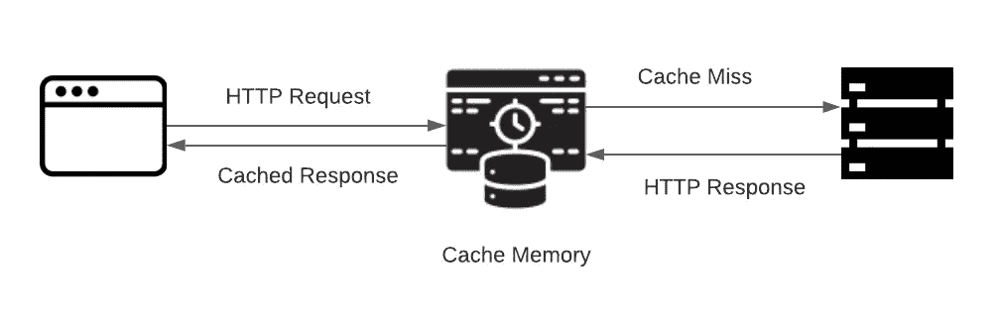

# 如何在 Next.js 中缓存 API 调用

> 原文：<https://javascript.plainenglish.io/how-to-cache-api-calls-in-next-js-f4b6aefa84f1?source=collection_archive---------2----------------------->


# **简介**

Next.js 应用程序对同一 API 的冗余调用是典型的行为。在更新组件或从一个页面转到另一个页面时，可能会发生这种情况。重复调用同一个 API 会花费我们更多的钱，也会影响应用程序的性能。我们可以通过缓存初始调用本身的 API 来避免这种不必要的 API 调用。

通过缓存，我们将特定的 API 调用响应存储在本地内存中，每当再次触发相同的调用时，我们就从本地存储中发送它；因此，我们可以避免调用服务器。

# **缓存流量**



当我们进行 API 调用时，我们首先在缓存内存中检查对应 API 调用的响应是否在内存中。如果响应存在，我们从缓存中获取响应，然后将其发送回客户端。如果特定 API 调用的响应不在缓存内存中，我们将直接调用服务器来获得 HTTP 响应。来自服务器的 HTTP 响应首先保存在高速缓存中，然后将响应发送回客户端。

# 履行

```
npm i memory-cache 
```

为了在 Next.js 应用程序上实现缓存，必须将 memory-cache 包安装到项目中。下面的代码片段演示了如何用这个包进行 API 缓存。

这里我们有两个按钮，一个名为缓存 API 调用，另一个是常规 API 调用。这两个按钮执行相同的过程，从服务器获取一些数据。按钮 Cached API 触发了一个函数，在该函数中实现了用于获取数据的缓存。另一方面，常规 API 按钮只对数据进行常规提取。了解实际打开的开发人员控制台中的差异，并在反复单击常规 API 按钮的同时检查网络，您可以看到对服务器的频繁调用。尽管如此，如果我们重复点击缓存的 API 按钮，您只会看到一个服务器调用。

# 缓存时的注意事项

在缓存 API 时，我们必须遵循一些注意事项。考虑一个 API 调用，它提供一场板球比赛的实况比分；如果我们将这个 API 响应缓存在本地内存中，更新后的匹配分数将不会从服务器中检索到，这将导致填充错误的信息。尽管如此，我们可以缓存一个 API 来获取之前匹配的分数，因为数据在这里是永久的。

# 结论

感谢您的阅读。我希望您发现这很有帮助，并对了解如何在 Next.js 中缓存 API 调用有所了解。

*更多内容尽在*[*plain English . io*](http://plainenglish.io/)