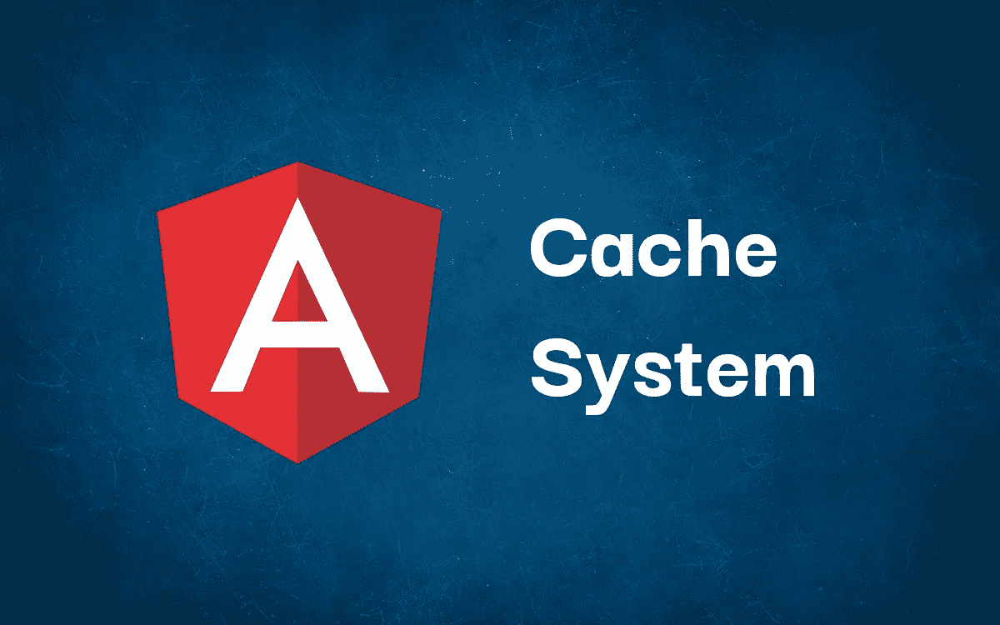

# 如何在 Angular2/10+中缓存 API 响应和其他数据

> 原文：<https://javascript.plainenglish.io/how-to-cache-api-responses-and-other-data-in-angular2-10-d3feebb24bd4?source=collection_archive---------1----------------------->

使用缓存系统可以显著提高 web 应用程序的性能，并允许用户在离线时也能访问数据。



最常见的使用案例是:

*   缓存慢速 API 调用的响应
*   缓存可预测 API 调用的响应
*   缓存需要几秒/几分钟才能完成的本地操作的结果
*   缓存可以脱机使用的数据

保存临时数据似乎是一项简单的任务，但是**开发人员常常低估了一个结构良好的缓存系统的复杂性**，忘记了计划细节并问自己:

*   我应该只在当前窗口还是在每个打开的标签页中缓存结果？
*   应该在每个会话结束时清除数据(内存缓存)还是保存数据并在将来的会话中重用(存储缓存)？
*   缓存应该有定义的过期时间还是应该手动清除？
*   我是否只缓存“通用”API 响应(例如。GET /users)或特定的(例如。GET /users/10)？

正如你所看到的，这些问题的答案可能会深刻地改变缓存系统背后的逻辑，并且*在每个项目中重新发明轮子*在工作时间和代码一致性方面可能会非常昂贵……但是有一种更简单的方法来在你的应用中实现缓存系统，没有麻烦！

> **liquid cache(ngx-liquid-cache on**[**NPM**](https://www.npmjs.com/package/ngx-liquid-cache)**和**[**GitHub**](https://github.com/luckyseven/ngx-liquid-cache)**)**是“一个强大的、自动的、优化的 Angular2/10+缓存系统，适合任何地方！”。

换句话说，一个**现成的**高速缓存系统涵盖了前面提到的所有复杂特性。

# LiquidCache 简介

LiquidCache 使用 decorators 作为它的主要武器，允许你缓存你的方法结果**而不用改变你的代码库**的任何一行。对于更具体的缓存逻辑，您可以使用 LiquidCacheService 并获得对存储数据的完全控制。

> 你可以在这里看到完整的文档:[https://github.com/luckyseven/ngx-liquid-cache](https://github.com/luckyseven/ngx-liquid-cache)

## 设置

LiquidCache 可以以非常简单的方式在您的 web 应用程序中实现。首先，使用 npm 安装最新版本:

```
npm i --save ngx-liquid-cache
```

现在将 NgxLiquidCacheModule 导入到您的 AppModule 中:

您已经准备好使用新的缓存系统了！

## 装修工

使用 decorators 是使用 LiquidCache 最快(也是最常见)的方式。只需在方法的签名前添加一个装饰器，就可以为方法的结果启用缓存:

正如你所看到的， **LiquidCache 自动使用同步和异步方法**。尝试在您的原始方法中添加一个 console.log("TEST ")来测试它是否工作正常:" TEST "将只在您第一次调用该方法时打印出来。从第二次调用开始，您的方法将返回缓存的结果，而不打印任何消息，这证明我们的缓存系统工作正常。

LiquidCache 还有一个**强大的参数解析系统**，允许你使用占位符设置缓存装饰器**:**

由于这种机制，您可以通过调用参数自动缓存不同的调用结果。

**重要提示**:如果你使用的是 Angular 9 和之前的版本，那么在你的产品构建过程中将“优化”设置为“假”。

## LiquidCacheService

您可以使用 LiquidCacheService 直接与缓存系统进行交互:

## 配置

您可以从全局配置(在模块初始化期间)或者直接在 Decorators 和 Objects 中配置您的缓存系统。您可以使用 LiquidCacheConfig 对象来设置配置参数。

**全局示例**:

**装饰示例**:

**对象示例**:

你可以在[官方库](https://github.com/luckyseven/ngx-liquid-cache)中找到全套配置参数。

# 摘要

您不需要在每次需要在 Angular 应用程序中缓存数据时都重新发明轮子:LiquidCache 是一个功能强大且随时可用的系统，涵盖了 web 缓存的每个方面(和问题)。

> 在这里阅读完整的文档:[https://github.com/luckyseven/ngx-liquid-cache](https://github.com/luckyseven/ngx-liquid-cache)。欢迎投稿！