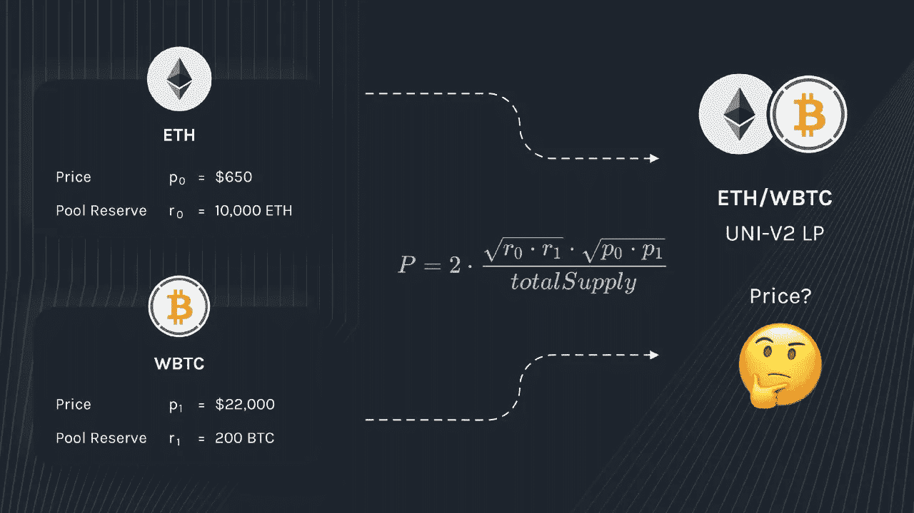

# 如何使用 JavaScript 通过 4 个简单的步骤计算任意 LP 令牌的 APY

> 原文：<https://javascript.plainenglish.io/how-to-calculate-apy-for-any-lp-token-using-javascript-in-four-simple-steps-956d8543a239?source=collection_archive---------3----------------------->


Credits — [https://www.lcmsfoundation.org/investment-services/investment-funds](https://www.lcmsfoundation.org/investment-services/investment-funds)

嘿，我是一名 MERN 堆栈开发人员，最近开始学习区块链领域的一两件事。我试图为农业合同构建一个用户界面，并把前端与智能合同集成在一起。一切都很顺利。然后，我编写代码来计算 LP 令牌的 APY，并将其显示在 UI 上。

我谷歌了很多，也加入了多个开发者论坛，以获得关于我应该如何实现它的帮助。不幸的是，我没有找到一个好的教程，也没有找到一个简单的解决方案。

经过三天的努力，经过无数的项目和文章，我终于找到了答案。我想对全程指导我的 Xoheb 表示感谢。

下面我在分享解决方案。我想一步一步地解释它，以便像我这样的传统软件开发人员和最近开始在区块链领域工作的人可以在需要时轻松地构建相同的功能。

更进一步来说，我从事的农业合同是[厨艺大师合同](https://github.com/sushiswap/sushiswap/blob/master/contracts/MasterChef.sol)的一个分支。以下方法适用于 Kovan Testnet、BSC Testnet、Ethereum Mainnet 和 BSC Mainnet。我还没有在其他人身上测试过，但它应该可以无缝工作。我的项目在 React 中，代码是普通的 JavaScript，只使用几个 npm 包来计算和获取代币的价格。

对于那些想直接查看代码的人，请查看 [calculateAPY.js](https://gist.github.com/bhavya2611/fc379f9ada752c60a6df57bc0fbf2c65)

其他的，开始吧！

**第一步**
如果你还没有安装“web3”、“bignumber.js”和“@ uni WAP/SDK”，我们需要下面的包。

注意——如果你为 BigNumber 使用其他的包，那也可以。

```
To install all of them together -npm install --save web3 @uniswap/sdk bignumber.js
```

**第二步** 让我们现在开始写一些代码，首先我们将添加所有需要的导入。

Imports

**步骤 3** 声明将在整个代码中使用的常量变量。

Declare Constants

**步骤 4**
使用以下公式计算 LP 令牌价格:-



Credits — [https://blog.alphafinance.io/fair-lp-token-pricing/](https://blog.alphafinance.io/fair-lp-token-pricing/)

出于演示目的，我将计算 Dogecoin/ETH 和 Dogecoin/BNB 价格。此外，上述价格(p0 和 p1)必须在同一个单位，就像他们可以在美元或 BTC 或其他任何东西。为简单起见，为了避免额外的计算，我将根据我所在的网络以 ETH/BNB 计算价格。

有人可能会问，为什么用 ETH/BNB 而不用美元，那是因为我只需要计算 Dogecoin 的价格，ETH 的价格在以太坊主网上是 1，同样的，在 BSC 主网上，BNB 的价格是 1。
因此 p0 (ETH/BNB 价格)= 1，下面是计算
p1 (Dogecoin 价格)的方法

*注意——由于我们选择了 Dogecoin，最终用户在农业合同中存入一些 LP 代币后将获得 Dogecoin 奖励，奖励代币最好是您想要奖励的代币或您所在组织的代币。*

Calculate token price in ETH or BNB

要了解更多有关如何从 UniSwap 获取代币价格的信息，请参考[uni WAP/JavaScript-SDK](https://uniswap.org/docs/v2/javascript-SDK/pricing/)。

在撰写本文时，我没有找到使用 PancakeSwap JavaScript SDK 在 BSC Mainnet/Testnet 上获取价格的方法，因此我直接使用了他们的 API。

接下来，我们需要获取 LP 令牌合同中所有令牌的储备，即获取存放在 LP 令牌合同中的 BNB/ETH 和 Dogecoin 的储备。

Get Token Reserve From Lp Token Contract

接下来，我们将编写一个函数来获取市场上 LP 令牌的总供应量。

Get LP Token Total Supply

现在我们可以计算 LP 令牌的价格了

Calculate LP Token Price

**第四步** 最后，我们现在来计算 APY。简而言之，我们将计算每年的**总** **奖励代币价格，将其除以池**中 LP 代币的**总** **价格，然后乘以 **100** 将其转换为百分比。**

Calculate APY for LP Token

我希望你能够实现计算 APY 的目标，我很感谢你花时间阅读这篇文章。

[链接到完整的代码。](https://gist.github.com/bhavya2611/fc379f9ada752c60a6df57bc0fbf2c65)

如果任何信息不正确或您有疑问，您可以在下面评论或通过[电报](https://t.me/iambhavyamehta)或 [LinkedIn](https://www.linkedin.com/in/bhavya-y-mehta/) 联系我。

谢谢大家！

*更多内容请看*[*plain English . io*](http://plainenglish.io/)