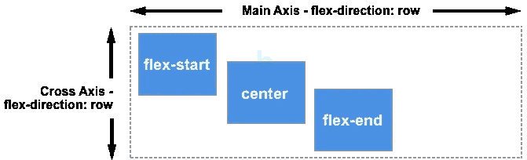

# 如何计算 CSS 选择器特异性

> 原文：<https://javascript.plainenglish.io/how-to-calculate-css-selector-specificity-72aa076c6a18?source=collection_archive---------8----------------------->

## 第 1 部分:关于 CSS 选择器你不知道的事情

Image by [@heylagostechie](https://unsplash.com/@heylagostechie) on Unsplash.

很多时候，当我与初级前端开发人员或那些出于好奇才学习 HTML 和 CSS 的人交谈时，他们说 CSS 是一种简单的语言，是的，CSS 的语法乍一看或在学习 web 开发的最初几个月似乎很简单，这让我感到震惊。

CSS 中的简单语法可能是你在语言本身中遇到的最具欺骗性的东西，因为它包含了在许多 CSS 声明中进行选择以确定给定 CSS 属性的确切值的算法的复杂性，我们在这里谈论的是级联算法。

此外，我们还有令人头痛的*框对齐模块、特异性、*我可以说，掌握这些概念只是初级 CSS 开发人员与高级 CSS 开发人员的区别之一，或者为什么不是 CSS 大师呢？嗨！！我说过:这只是其中之一。

A Photo from [developer.mozilla.org](https://developer.mozilla.org/en-US/docs/Web/CSS/CSS_Flexible_Box_Layout/Aligning_Items_in_a_Flex_Container) (Aligning Items with flexbox).

因为掌握 CSS 涉及到其他事情，如文件组织、命名系统、调试和优化，所以还有更多要说的，但今天让我们把重点放在特殊性上，这是 CSS 开发中的一个重要概念，这就是为什么你应该给它一些时间。

A Photo from [toptal.com (](https://www.toptal.com/css/smacss-scalable-modular-architecture-css)f*ile organization in CSS)*

# 特异性介绍

第一，特异性是什么？好吧，你可以把它想象成一个因素，这个因素将指定哪个样式声明应该应用于一个元素，这个因素作为一个与你的 CSS 选择器相关的分数，它有一些简单明了的目标，比如解决与 CSS 的全局性质相关的问题。

现在事情越来越难看，“CSS 的全球性”，“特异性”。这些东西到底代表什么？好吧，让我们澄清全球性质背后的含义，然后我们将集中于特殊性。

你还记得你第一次尝试学习 CSS 的时候，我猜你已经使用`
`标签创建了几个段落，然后你使用带有`p`选择器的样式声明对它们的文本和背景应用了特定的颜色。

你最终会对每一段都有那种风格感到震惊，你的意图或你设定的期望只是在第一段增加一些风格。

当“全局性质”出现时，CSS 有一个全局范围，所以当你使用`p`元素选择器应用一个样式声明时，这个样式将被应用到你的 HTML 文档中的每个`
`元素，即使这不是你想要的。

Photo by the Author.

当你试图使用组合或单个选择器来解决这些全球自然问题时，事情会变得混乱，例如`**div#para p**`和`**div.para p**`，假设你用这两个选择器写了两个不同风格的声明。

`**Div#para p**`将对段落应用红色背景，`**div.para p**`将应用黑色背景，`
`元素下的`
`元素的背景将应用哪种颜色？

Photo by the Author.

你以为第四段会有黑色背景？不是红色的。为什么会这样？你可能会认为这与它所声明的最后一种风格有关。不，最后一个样式声明已经使用了`**div.para p**` 选择器，但这并没有影响第四段。

这是一个特殊性的问题，正如我前面提到的，它作为一个分数，CSS 中的每个选择器都有一个特殊性分数，基于这个分数，一个样式声明将被应用到所需的元素，在最后一个例子中，我们有一个红色的背景，因为 ID 选择器在其特殊性中有一个高分数。

# 计算特异性

浏览器根据选择器的特异性附加声明的样式，但是我们如何判断哪个选择器的特异性得分高或低呢？我们有一些规则，可以帮助我们计算每个选择器的特异性分数(值)。

计算选择器特异性在[*万维网联盟(W3C)*](https://drafts.csswg.org/selectors-3/#specificity) *:* 中解释如下

*   计算选择器中 ID 选择器的数量(= a)
*   计算选择器(= b)中的类选择器、属性选择器和伪类的数量
*   计算类型选择器和选择器中伪元素的数量(= c)
*   忽略通用选择器(*)

这似乎有点令人困惑，但请仔细看一下，在一个选择器中，值(a，b，c)组合在一起产生一个值，让我们遵循这些规则来确定我们前面使用的选择器的特异性。

`**Div.para p**`包含两个类型选择器 div 和 p，用一个单一的类选择器来确定(a，b，c)的值。

我们在这个组合选择器中没有任何 ID 选择器，这意味着 **a=0，**一个类选择器，所以 **b=1** ，加上两个类型选择器，因此， **c=2，组合** (a=0，b=1，c=2)，这等于(0，1，2)的特异性。

对于`**div#para p**`选择器，我们有一个 ID 选择器(a=1)，两个类型选择器(c=2)，因此特异性值等于(1，0，2)，在这种情况下，我们的值为 0，因为我们有零个属于 b 类型的选择器。

现在让我们比较一下这些特异性值，对于这两个选择器`**div#para p**` (1，0，2)大于对于`**div.para p**`选择器的(0，1，2)，回到前面的例子，红色背景已经被应用，因为`**div#para p**` 选择器具有高特异性值。

# 同等特异性

如果我们有一些具有相同特异性值的组合选择器会怎么样？例如:`input[type=text]`和`input.text.`

在这种情况下，我们有一个带有属性选择器或类选择器的类型选择器，`input[type=text]` = (0，1，1)，`input.text` = (0，1，1)，在这种情况下，将应用您在 CSS 文件中使用的最后一个选择器，或 HTML 文档中的样式标签。

Photo by the Author.

正如您所看到的，输入元素的最后一个样式声明已经被应用，我想这种情况似乎微不足道，因为这是我们过去所做的，最后一个样式声明总是覆盖前一个。

如果你想试试上面的例子，你可以添加一个伪类，比如:hover to the `input[type=text]` selector，在重新加载你的文档后，每次你将鼠标悬停在输入的背景色上，它就会变成蓝绿色，一种介于绿色和蓝色之间的颜色。`input[type=text]:hover`

将悬停伪类添加到`input[type=text]`选择器中，会将其特异性从(0，1，1)更改为(0，2，1 ),这是因为伪类属于类型 b 的选择器，然而，在将鼠标悬停在输入元素上之前，`input[type=text]:hover`特异性不会改变。

Photo by the Author.

# 注意:

*Visual studio 代码的最后一次更新将帮助您计算特异性，选择 CSS 中的任意选择器，编辑器将弹出一个包含特异性值的小窗口，如下所示。*

Photo by the Author.

# 结论

乍一看，计算特异性值似乎很复杂。你需要一段时间来理解它，只要坚持这个过程。

构造太多组合选择器并计算它们的特异性值，再加上检查附加在特异性值最高的选择器上的样式声明是否已经被应用，这对我帮助很大，何乐而不为呢？试试看。

# 下一步是什么？

在下一篇关于 CSS 特异性的文章中，我们将深入到更有趣的带有复杂选择器的情况，何时选择高特异性选择器而不是低特异性选择器，以及如何处理链式类选择器。

# 资源:

**特异性计算器**:specification . keegan . ST

**选择者姓名举例**:【developer.mozilla.org 