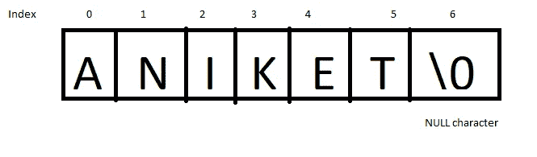

# 如何不用内置函数计算字符串的长度

> 原文：<https://javascript.plainenglish.io/how-to-calculate-the-length-of-a-string-without-using-an-inbuilt-function-51c8835945b7?source=collection_archive---------6----------------------->

## 程序员用两种有效方法求字符串长度的基本指南。


Photo by [CHUTTERSNAP](https://unsplash.com/@chuttersnap?utm_source=medium&utm_medium=referral) on [Unsplash](https://unsplash.com?utm_source=medium&utm_medium=referral)

在当今时代，使用内置函数已经成为大多数新程序员追随的新趋势。使用内置函数没有坏处，在使用内置函数之前，你必须知道一个替代方法。

在一些像工作面试这样的场景中，当面试官要求程序员编写一个需要找到字符串大小的程序，而程序员使用了内置函数，这可能会给面试官留下不好的印象。

因此，我们将寻找一种不使用内置函数的简单的方法来计算字符串的长度。

[](/3-books-every-programmer-should-read-97ac12422cfb) [## 每个程序员都应该读的 3 本书

### 帮助我理解编程基础的书籍。

javascript.plainenglish.io](/3-books-every-programmer-should-read-97ac12422cfb) 

因此，要确定字符串的长度，我们必须了解字符串的基本信息— **每个字符串都以“\ 0”**结尾

这意味着一个**反斜杠**和一个**零**出现在每个字符串的末尾，表示字符串的结束。因此，我们可以使用这个属性来精确地找出在多少个元素之后出现了一个反斜杠和一个零。它将直接给出字符串的**大小**或**长度**，而不使用任何内置函数。



String from the [author](http://aniketz.medium.com)

更准确地说，反斜杠和一个零被称为空字符，它们总是指定一个字符串在内存中的结尾。

我们将看到两种方法来计算字符串的长度。一个使用 **while 循环**，另一个使用**递归。**

[](https://python.plainenglish.io/fundamental-python-tutorial-for-absolute-beginners-2d848e66850d) [## 绝对初学者的 Python 基础教程

### 用最简单的方式解释了 Python 的基础知识。

python .平原英语. io](https://python.plainenglish.io/fundamental-python-tutorial-for-absolute-beginners-2d848e66850d) 

## 使用 While 循环

我们将使用一个计数器来计算空字符之前的元素数。让我们假设一个**字符串 s** 中包含了一个 **aniket** 单词。我们还将使用一个整数变量 **i** 来跟踪索引，并通过递增来遍历字符串。

```
int counter;
counter=0;string s="aniket";int i;       //index variable to traverse string s
i=0;while(s[i]!='\0')  //to check if string gets empty 
{
  counter++;      //increment counter as string is not empty 
  i++;            //increment index to traverse next element
}print(counter); **result-->6
Time Complexity-->O(n)** 
```

## 使用递归

我们将使用递归函数来计算字符串的长度。一旦我们找到了空元素，我们将返回 0 并结束递归函数。

```
string s="aniket";LengthOfString(string s)
{
   if s is Null
           {
            return 0;    // terminate recursive function 
            }
    else
    {
       return 1+ LengthofString(s+1);  
       //add 1 to result and search for rest of string 
     }
}**result-->6
Time Complexity-->O(n)**
```

我希望这两种方法对你在现实生活中的编程实践和解决我们不能使用内置函数的不同问题有所帮助。如果你在必要的时候避免使用内置功能，会给你的面试官留下一个好印象。

坚持编程，坚持练习。祝你编程之旅好运。

[](https://aniketz.medium.com/membership) [## 通过我的推荐链接加入 Medium-Aniket

### 作为一个媒体会员，你的会员费的一部分会给你阅读的作家，你可以完全接触到每一个故事…

aniketz.medium.com](https://aniketz.medium.com/membership) [](/technologies-that-will-trend-in-2022-122d2dcf5ca3) [## 2022 年的技术趋势

### 2022 年需要的技能。

javascript.plainenglish.io](/technologies-that-will-trend-in-2022-122d2dcf5ca3) [](/3-code-editors-i-have-been-using-for-the-past-3-years-33abb5b88c5a) [## 3 个代码编辑器，我已经用了 3 年了

### 轻便快速的代码编辑器比一些笨重的编辑器更好。

javascript.plainenglish.io](/3-code-editors-i-have-been-using-for-the-past-3-years-33abb5b88c5a) 

*更多内容看*[***plain English . io***](http://plainenglish.io/)