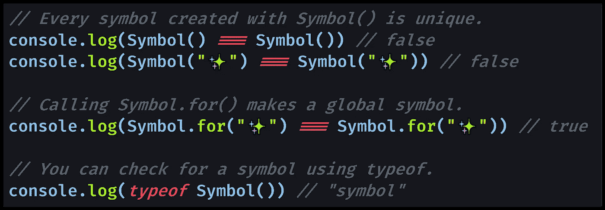

# 如何在 JavaScript 中检查符号

> 原文：<https://javascript.plainenglish.io/how-to-check-for-a-symbol-in-javascript-30c3f294ea65?source=collection_archive---------11----------------------->

## 在 JavaScript 中使用符号基本数据类型？以下是如何检查您是否有符号或其他类型的数据。

Photo by [Sven Brandsma](https://unsplash.com/@seffen99?utm_source=medium&utm_medium=referral) on [Unsplash](https://unsplash.com?utm_source=medium&utm_medium=referral)

# JavaScript 中的符号是什么？

> 数据类型**符号**是一个[原始数据类型](https://developer.mozilla.org/en-US/docs/Glossary/Primitive)。`Symbol()`函数返回一个类型为**符号**的值— [MDN 文档](https://developer.mozilla.org/en-US/docs/Web/JavaScript/Reference/Global_Objects/Symbol)

符号是一种不太常见的基元，它被用作对象属性，有时还需要唯一的值。

> 具有数据类型**符号**的值可以被称为‘符号值’[一个符号是]一个匿名的、唯一的值。符号可以用作对象属性。”— [MDN 文档](https://developer.mozilla.org/en-US/docs/Web/JavaScript/Reference/Global_Objects/Symbol)

符号作为对象属性的优点是它不会与任何其他符号冲突；每个都是独一无二的。

> 请注意，`Symbol("foo")`并没有将字符串`"foo"`强制转换成符号。它每次都会创造一个新的符号。”— [MDN 文档](https://developer.mozilla.org/en-US/docs/Web/JavaScript/Reference/Global_Objects/Symbol)

您可以创建一个全局符号，这将允许您通过在全局`Symbol`对象上使用一个名为`[Symbol.for()](https://developer.mozilla.org/en-US/docs/Web/JavaScript/Reference/Global_Objects/Symbol/for)`的方法来重用符号。

> `**Symbol.for(key)**`方法使用给定的键在运行时范围的符号注册表中搜索现有的符号，如果找到就返回它。否则，将在全局符号注册表中用此键创建一个新符号。— [MDN 文档](https://developer.mozilla.org/en-US/docs/Web/JavaScript/Reference/Global_Objects/Symbol/for)

用`Symbol.for()`创建的符号将被保存为全局符号，这意味着您可以重复使用它。

# 用`typeof`检查 JavaScript 中的符号

当试图检查变量的类型以查看它是否包含符号时，可以使用`[typeof](https://medium.com/better-programming/how-to-check-data-types-in-javascript-using-typeof-424d0520a329)`[关键字](https://medium.com/better-programming/how-to-check-data-types-in-javascript-using-typeof-424d0520a329)。

要检查符号值，您可以尝试`typeof symbol`，它将返回符号的字符串`"symbol"`。

[View raw code](https://gist.github.com/DoctorDerek/77943326fbd8dd204ee714c34675eea5) as a GitHub Gist

我们可以在代码中看到，每个符号都是不同的值，除非你在创建全局符号。此外，我们看到`typeof`为任何符号原语返回`"symbol"`。

[View raw code](https://gist.github.com/DoctorDerek/77943326fbd8dd204ee714c34675eea5) as a GitHub Gist

使用符号的优点是:

1.  用`[Symbol()](https://developer.mozilla.org/en-US/docs/Web/JavaScript/Reference/Global_Objects/Symbol)`制作的符号总是不同的，避免名称空间冲突(同名的对象属性)。
2.  用符号定义的对象键不会出现在`[Object.keys()](https://developer.mozilla.org/en-US/docs/Web/JavaScript/Reference/Global_Objects/Object/keys)`中，但它们不是真正的“私有键”。

[托马斯·亨特二世](https://medium.com/u/ac187d616e0b?source=post_page-----30c3f294ea65--------------------------------)有一篇很棒的文章解释了符号和私有对象属性之间的区别:

 [## JavaScript 符号:但是为什么？

### 符号是最新的 JavaScript 原语，它给语言带来了一些好处，尤其是在用作…

medium.com](https://medium.com/intrinsic/javascript-symbols-but-why-6b02768f4a5c) 

希望本教程能帮助你使用和检查 JavaScript 中的符号。

**快乐编码！**🔕🔣☯🎯🚭

德里克·奥斯汀博士是《职业规划:如何在 6 个月内成为成功的 6 位数程序员》一书的作者，该书现已在亚马逊上出售。