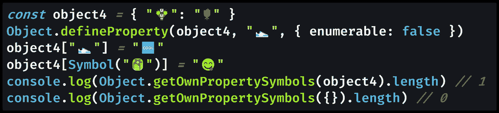

# 如何检查 JavaScript 对象是否没有属性

> 原文：<https://javascript.plainenglish.io/how-to-check-if-a-javascript-object-is-empty-of-properties-fdf981e816df?source=collection_archive---------9----------------------->

## 空的 JavaScript 对象`{}`似乎是不言而喻的:没有用户定义的对象属性(也称为对象键)。但是在 JavaScript 中如何检查一个对象是否为空呢？

Photo by [DaYsO](https://unsplash.com/@dayso?utm_source=medium&utm_medium=referral) on [Unsplash](https://unsplash.com?utm_source=medium&utm_medium=referral)

# 空对象`{}`的长度是否为 0？

与数组不同，通用 JavaScript 对象没有`.length`方法来检查条目(对象键值对)的数量。

这意味着知道您是否有一个空对象`{}`并不是一个显而易见的任务——您如何检查一个对象的“长度”?

这里有 4 种方法来检查一个 JavaScript 对象是否是一个空对象，也就是说它没有对象键(对象属性)。

1.  **检查** `**.length**` **数组中的** `**Object.keys()**`
2.  **勾选**中的 `**.length**` **中的`**Object.getOwnPropertyNames()**`**
3.  **使用一个** `**for...in**` **回路配合** `**.hasOwnProperty()**`
4.  **检查对象是否没有作为关键字的符号**

在我们进行的过程中，我将包含简短的 JavaScript 代码示例，比较每个方法来检查对象是否为空。

# 1.检查`Object.keys()`数组的`.length`

在 JavaScript 中计算对象键的最直接的方法是在全局`[Object](https://developer.mozilla.org/en-US/docs/Web/JavaScript/Reference/Global_Objects/Object/)`对象上使用`[Object.keys()](https://developer.mozilla.org/en-US/docs/Web/JavaScript/Reference/Global_Objects/Object/keys)` helper 方法，它将给定对象的键作为一个[数组](https://medium.com/javascript-in-plain-english/how-to-check-for-an-array-in-javascript-6ad20f7a0e21)返回。

一个数组有一个`.length`属性(`[Array.prototype.length](https://developer.mozilla.org/en-US/docs/Web/JavaScript/Reference/Global_Objects/Array/length)`)，所以可以快速统计键的个数。使用`[Object.values()](https://developer.mozilla.org/en-US/docs/Web/JavaScript/Reference/Global_Objects/Object/values)`或`[Object.entries()](https://developer.mozilla.org/en-US/docs/Web/JavaScript/Reference/Global_Objects/Object/entries)`你会得到相同的数字，但我使用`Object.keys()`。

[View raw code](https://gist.github.com/DoctorDerek/c5030801a83c0b5f1297c3fa656b071b) as a GitHub Gist

这里需要注意的一点是，您将错过任何用作对象键的[符号](https://medium.com/p/30c3f294ea65/)，以及任何使用`[Object.defineProperty()](https://developer.mozilla.org/en-US/docs/Web/JavaScript/Reference/Global_Objects/Object/defineProperty)`设置为“不可枚举”的对象属性。

> "`Object.keys()`不检查不可枚举的属性或符号。你需要用`Object.getOwnPropertyNames()`和`Object.getOwnPropertySymbols()`来代替。”— [杰西](https://stackoverflow.com/users/268083/jesse) [上 StackOverflow](https://stackoverflow.com/questions/679915/how-do-i-test-for-an-empty-javascript-object#comment86472631_32108184)

那个词*可数*很重要。下面是定义。

> "`enumerable` : `true`当且仅当该属性在相应对象的属性枚举期间出现。"— [MDN 文档](https://developer.mozilla.org/en-US/docs/Web/JavaScript/Reference/Global_Objects/Object/defineProperty)

可枚举属性是典型的对象属性，在对象初始化时用`{}`花括号[对象文字语法](https://medium.com/p/d6d309383106)添加，或在以后用`.`点号或`[]`方括号[属性访问器](https://medium.com/p/5a1bfb4339c4)添加。

记住`Object.keys(object).length`只包括定义为[字符串](https://medium.com/javascript-in-plain-english/how-to-check-for-a-string-in-javascript-a16b196915ff)的可枚举属性是很重要的。

这意味着，如果一个包含不可枚举属性或用作对象键的符号的对象不包含典型的对象属性，则使用此方法该对象将被视为空。

# 2.检查`Object.getOwnPropertyNames()`的`.length`

要计算不可枚举的属性，但仍然不计算符号，用`[Object.getOwnPropertyNames()](https://developer.mozilla.org/en-US/docs/Web/JavaScript/Reference/Global_Objects/Object/getOwnPropertyNames)`代替`Object.keys()`。

> "`**Object.getOwnPropertyNames()**`方法返回在给定对象中直接找到的所有属性的数组(包括不可枚举的属性，使用 Symbol 的属性除外)。"— [MDN 文档](https://developer.mozilla.org/en-US/docs/Web/JavaScript/Reference/Global_Objects/Object/getOwnPropertyNames)

像以前一样，您将把目标对象传递给助手函数，并且您将得到一个数组，您可以检查它的`.length`。

[View raw code](https://gist.github.com/DoctorDerek/c5030801a83c0b5f1297c3fa656b071b) as a GitHub Gist

与`Object.keys()`的区别在于`[Object.getOwnPropertyNames()](https://developer.mozilla.org/en-US/docs/Web/JavaScript/Reference/Global_Objects/Object/getOwnPropertyNames)`返回的计数中包含了不可枚举的属性。这可能是您在检查[空对象](https://differ.plainenglish.io/p/how-to-check-for-an-empty-object-in-javascript-dvjxdkyal)时想要的。

# 3.使用带有`.hasOwnProperty()`的`for...in`回路

您可以通过使用一个`[for...in](https://developer.mozilla.org/en-US/docs/Web/JavaScript/Reference/Statements/for...in)`循环来实现与`Object.getOwnPropertyNames()`相同的行为，并检查每个键的`.hasOwnProperty()` ( `[Object.prototype.hasOwnProperty()](https://developer.mozilla.org/en-US/docs/Web/JavaScript/Reference/Global_Objects/Object/hasOwnProperty)`)。

> "`**hasOwnProperty()**`方法返回一个布尔值，表明对象是否将指定的属性作为自己的属性(相对于继承它)。"— [MDN 文档](https://developer.mozilla.org/en-US/docs/Web/JavaScript/Reference/Global_Objects/Object/hasOwnProperty)

我不确定这样做有什么好处，除了可能对微性能有很小的提升。

[View raw code](https://gist.github.com/DoctorDerek/c5030801a83c0b5f1297c3fa656b071b) as a GitHub Gist

我个人认为`for...in`是 JavaScript 中最令人困惑的概念之一，尤其是因为`[for...of](https://developer.mozilla.org/en-US/docs/Web/JavaScript/Reference/Statements/for...of)`循环，它被用于数组和其他[可迭代对象。](https://developer.mozilla.org/en-US/docs/Web/JavaScript/Reference/Iteration_protocols)

这确实是技术面试中的一个“陷阱”问题——招聘经理有时希望你将`Object.hasOwnProperty()`理解为[原型继承链](https://developer.mozilla.org/en-US/docs/Web/JavaScript/Inheritance_and_the_prototype_chain)的一部分。

# 4.检查对象是否没有作为键的符号

你需要使用`[Object.getOwnPropertySymbols()](https://developer.mozilla.org/en-US/docs/Web/JavaScript/Reference/Global_Objects/Object/getOwnPropertySymbols)`来检查一个对象是否没有符号作为对象属性。

正如您所料，调用`Object.getOwnPropertySymbols()`会返回一个数组，就像`Object.getOwnPropertyNames()`一样。

因为符号是不可枚举的，除非被 `[Object.defineProperty()](https://stackoverflow.com/questions/31029612/why-can-es6-symbol-properties-be-made-enumerable-by-object-defineproperty)`明确地指定为[，`Object.getOwnPropertySymbols()`通常是你访问一个对象上所有符号的方式。](https://stackoverflow.com/questions/31029612/why-can-es6-symbol-properties-be-made-enumerable-by-object-defineproperty)

[View raw code](https://gist.github.com/DoctorDerek/c5030801a83c0b5f1297c3fa656b071b) as a GitHub Gist

如果返回的数组是空的，那么对象就没有作为对象属性的符号，就像空对象`{}`一样。

# 哪种检查对象键的方法最快？

我在某处读到过一个`for...in`循环比`Object.keys()`快 10 倍，但这将取决于浏览器的实现——所以我怀疑现代浏览器表现出这样的差异。我认为性能在这里真的不重要。为什么不呢？因为你在检查一个空的对象，数到 0 属性很快。

如果你在一个有 10，000，000 个属性的对象上调用`Object.keys()`，那么创建这个数组并返回它的`.length`属性将会花费一些时间和内存，但是这种情况发生的可能性有多大呢？

既然你正在检查一个你期望为空的对象，那么你似乎不太可能以数百万个属性结束。当你实际上有一个空的对象，`{}`时，在速度上`for...in`和其他方法应该没有区别。

# 如何检查一个对象是否没有键(和/或符号)

如上所示，在 JavaScript 中应该使用哪种方法来检查空对象取决于如何定义 empty。通常，您将检查由`Object.keys(object)`返回的数组的`.length`来计算对象属性:`Object.keys({}) === 0 // true`。

但是您可能还需要检查由`Object.getOwnPropertySymbols()`返回的数组的`.length`来计算符号，或者检查由`Object.getOwnPropertyNames()`返回的数组的`.length`来计算对象上不可枚举的属性。

记住`Object.keys()`只计算用户定义的、可枚举的属性:我们添加到对象中的属性。原型继承链(从全局`[Object](https://developer.mozilla.org/en-US/docs/Learn/JavaScript/Objects/Object_prototypes)` [原型](https://developer.mozilla.org/en-US/docs/Learn/JavaScript/Objects/Object_prototypes)继承)上的属性不会是空的。

如果你真的需要一个“真正空”的对象，没有原型，那么你需要调用`Object.create(null)`:指定 no prototype ( `[null](https://medium.com/javascript-in-plain-english/how-to-check-for-null-in-javascript-dffab64d8ed5)`)作为原型，用于用`[Object.create()](https://developer.mozilla.org/en-US/docs/Web/JavaScript/Reference/Global_Objects/Object/create)`创建的新对象。这个特殊的空对象的`[.__proto__](https://developer.mozilla.org/en-US/docs/Web/JavaScript/Reference/Global_Objects/Object/proto)`[属性](https://developer.mozilla.org/en-US/docs/Web/JavaScript/Reference/Global_Objects/Object/proto)的值为`[undefined](https://medium.com/coding-at-dawn/how-to-check-for-undefined-in-javascript-bcedd62c8ad)`，并且确实没有对象属性和方法，但我从未见过这种空对象的实际用途。

通常，我们所说的空对象是指`{}`:一个典型的 JavaScript 对象，带有典型的原型继承，我们没有给自己添加任何额外的可枚举属性。并且使用全局`Object.keys()`帮助器方法可以很容易地对可枚举属性进行计数。

> 可枚举属性是那些其内部可枚举标志被设置为 true 的属性，这是通过简单赋值或通过属性初始化器创建的属性的缺省值(通过 [Object.defineProperty](https://developer.mozilla.org/en-US/docs/Web/JavaScript/Reference/Global_Objects/Object/defineProperty) 定义的属性，这种缺省值可枚举为 false)。在循环中，可枚举属性显示在[for…中，除非属性的键是一个](https://developer.mozilla.org/en-US/docs/Web/JavaScript/Reference/Statements/for...in)[符号](https://developer.mozilla.org/en-US/docs/Web/JavaScript/Reference/Global_Objects/Symbol)。— [MDN 文档](https://developer.mozilla.org/en-US/docs/Web/JavaScript/Enumerability_and_ownership_of_properties)

当我们使用对象文字符号(使用花括号`{}`)声明一个变量时，我们添加了可枚举的属性。当然，我们也可以通过使用赋值操作符(`=`)结合`.`点语法或`[]`进行属性赋值来添加可枚举属性。

相比之下，要添加不可枚举的属性，您必须使用`[Object.defineProperty()](https://developer.mozilla.org/en-US/docs/Web/JavaScript/Reference/Global_Objects/Object/defineProperty)`，除非您手工编写定制的 JavaScript 对象原型，否则您通常不会这样做。

要计算属性数并检查对象是否为空，我推荐使用`Object.keys()`——但是您应该知道其他方法，以防您需要检查不可枚举的属性或符号。

**快乐编码！**🍧🍨🧁🍫🍪

德里克·奥斯汀博士是《职业规划:如何在 6 个月内成为成功的 6 位数程序员 的作者，该书现已在亚马逊上架。