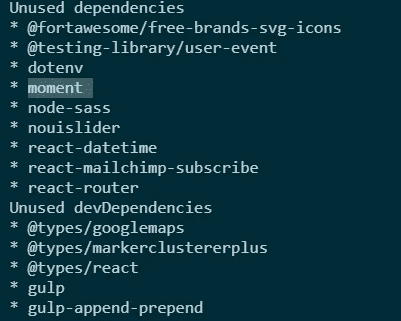
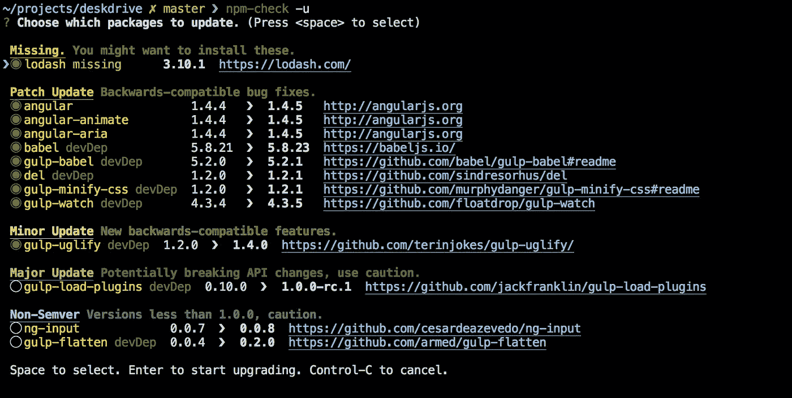
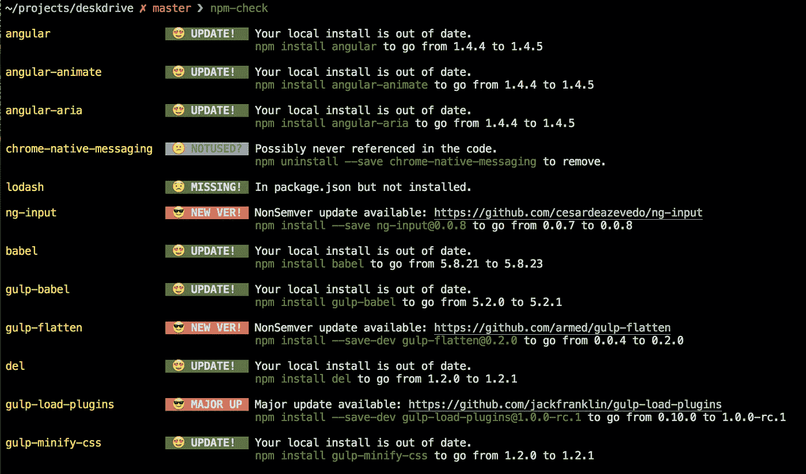

# 如何检查您的 JavaScript 应用程序中是否有未使用的依赖项

> 原文：<https://javascript.plainenglish.io/how-to-check-if-you-have-unused-dependencies-in-your-javascript-app-2c69dd97c49e?source=collection_archive---------5----------------------->

## 查看未使用的节点模块并将其移除


无论你是在开发个人项目还是专业项目，我们有时都会使用依赖来解决问题，尝试一些东西，或者开发一个客户端用例。然而，应用程序的最后一个版本与它的开始状态相比可能包含各种各样的依赖，我们不一定最终在应用程序中使用它们。出于几个原因，客户端需要改变，修复应用程序中的问题，等等。

这就是为什么在某个时候检查应用程序的一般状态很重要。拥有我们不使用的依赖项真的是一种浪费。最终，它会在维护、优化方面耗费成本，并显著降低应用程序的性能。因此，我们最终得到一个包大小，其中有我们需要的和我们不需要的。

这就是为什么我选择谈论如何检查这些未使用的 dep 并删除它们！因为对于一个大项目来说，手动跟踪它们是一件令人头疼的事情。因此，我在本文中提出了一个解决方案来保护您的神经，并有效地杀死那些未使用的依赖项。


如果你准备好了，让我们开始吧！

# 解决方案 1。深度检查

[*Depcheck*](https://www.npmjs.com/package/depcheck) *是一个分析项目中依赖关系的工具，看看:每个依赖关系是如何使用的，哪些依赖关系是无用的，* `*package.json*` *缺少哪些依赖关系。—Npmjs.com*

首先，我们需要安装软件包。别担心，我们可以在打扫完之后把它拿掉。在命令行启动:

```
npm install -g **depcheck**
```

第二，简单地通过以下方式启动依赖分析器:

```
depcheck
```

第三，检查未使用的依赖项部分，并通过启动。

```
npm uninstall [package-name]
```

最后，这里有一个真实的例子:



```
npm uninstall @fortawesome/free-brands-svg-icons @testing-library/user-event dotenv moment ...
```

# 解决方案 2。NPM-检查

Npm-check 的工作是检查您的包是否都是最新的并且正在使用。这个包提供了一个漂亮的总结包需要更新和更新，因为一些主要的更新可以打破你的应用程序。



[NpmJs](https://www.npmjs.com/package/npm-check)

首先，我们将使用以下命令安装这个包:

```
npm install -g npm-check
```

二、启动神奇命令 xD:

```
npm-check
```

第三，通过`npm uninstall`命令进行一些清理。未使用的包装用灰色标记:



# 警告

这些包主要是检查一个依赖项是否被导入到您的应用程序中。这意味着，如果您有一个未使用的导入，这不会给您整个未使用的包。

好消息是那是做一些清洁的时间。在 React 应用程序中，当您启动应用程序时，通常会收到未使用的导入作为警告。所以基于这个导入，你可以反应并清除那些导入。

对于角度，默认情况下不显示。您需要手动完成它，这不是我们真正想要的，或者通过在您的 TypeScript 编译器配置文件中激活未使用的导入来智能地完成它。

```
"noUnusedLocals":true
```

有关更多细节，请查看这篇关于我们不知道的 TypeScript 编译器的隐藏功能的文章！

[](https://levelup.gitconnected.com/how-to-get-the-most-from-the-typescript-compiler-angular-aae7fb53e0cf) [## 如何充分利用 TypeScript 编译器— Angular

### 让 TypeScript 编译器为您服务

levelup.gitconnected.com](https://levelup.gitconnected.com/how-to-get-the-most-from-the-typescript-compiler-angular-aae7fb53e0cf) 

本文到此为止，谢谢！

我希望你和你的家人无论在哪里都平安无事！坚持住。明天会更好！

**关注我上** [**中**](https://medium.com/@famzil/) **，** [**领英**](https://www.linkedin.com/in/fatima-amzil-9031ba95/) **，** [**脸书**](https://www.facebook.com/The-Front-End-World) **，以及** [**推特**](https://twitter.com/FatimaAMZIL9) **获取更多文章。**