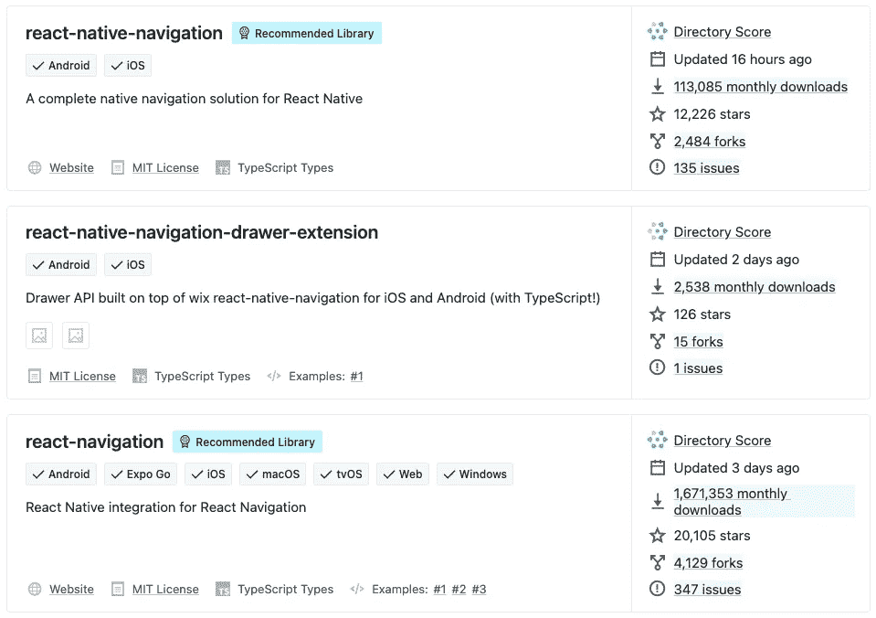
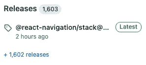
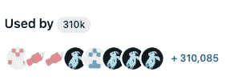
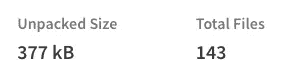
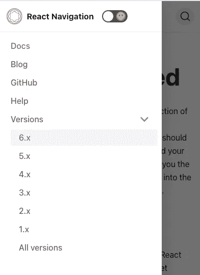
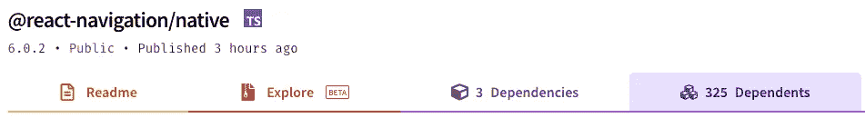
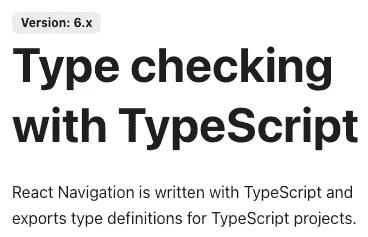
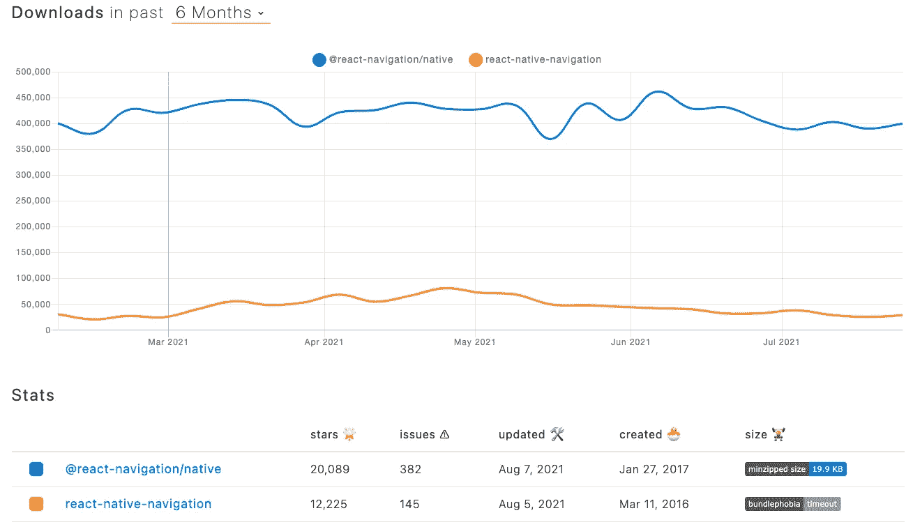

# 如何为你的下一个 React 原生项目选择最好的库

> 原文：<https://javascript.plainenglish.io/how-to-choose-the-best-library-for-your-next-react-native-project-in-2021-44a12ef4ca17?source=collection_archive---------12----------------------->

## 最佳 React 原生库搜索指南。

Photo by [Edu Grande](https://unsplash.com/@edgr?utm_source=medium&utm_medium=referral) on [Unsplash](https://unsplash.com?utm_source=medium&utm_medium=referral)

React Native 生态系统需要社区支持来简化和加速整个开发过程，就像目前的其他开发栈一样。开源社区通过世界上最大的名为节点包管理器(NPM)的软件注册中心来支持它。

NPM 通过跨越国界和提高前端和后端工程的标准来帮助业余爱好者和有经验的 Javascript 开发者。

## 为什么我们需要一个外部库？

使用外部库的主要原因是通过运行我们的代码和预先存在的代码来快速入门。另一件事是，没有人愿意重写已经公开可用并被许多开发伙伴广泛使用的代码。开发人员是对的，因为当他们可以下载一个可以立即在他们的应用程序中使用的 NPM 库时，他们为什么要浪费时间在冗长的编程上。

在 React Native 生态系统中使用外部库还有一个好处。因为 React Native 在使用单一代码库开发 Android 和 iOS 应用程序时非常方便，但我们还需要特定于平台的代码来配置一些特定于设备和平台的可访问性和功能。

但许多 React 本地开发人员还没有准备好学习 Android 的 Kotlin 和 iOS 开发的 Swift。因为选择 React Native 的一个突出原因是用单一编程语言开发应用程序，并将应用程序发布到两个不同的应用程序商店。

那些开发人员发现使用可以在后台处理本机代码的外部库非常舒服。使用这些库，开发精彩的下一代应用程序变得很容易。

## **为什么我们不能完全信任 NPM？**

NPM 不会评估和审查创作者提交的库，然后再把它们放到注册中心。如果我知道基本的编程，我可以编写和部署任何可能如此简单和无用的库。有些情况下，NPM 的一些图书馆被发现利用安全漏洞。

它是一个公共注册中心，建立在开发者社区的信任之上，并在其中发挥作用。因此，我们可以在那里找到许多低质量和不安全的图书馆。因此，选择一个最佳的库是开发者真正的游戏。

## **如何选择 React 原生库？**

在 [React 本地目录](https://reactnative.directory/)中搜索库是选择维护良好的库的最佳方式。

React Native Directory 是一个专门为 React Native 开发人员构建的可搜索的库数据库。这是为您的 React 本机开发寻找库的第一个地方。您将在目录中找到的许多库都来自 React 本地社区、Expo 和可信任的其他贡献者。与 NPM 搜索引擎相比，这是一个搜索 React 本地库的好地方。

The screenshot is taken from the [React Native directory](https://reactnative.directory/?search=navigation)

开发人员可以使用目录分数、上次更新、总下载数、星级数、分叉数、发行数、推荐的库标签和操作系统支持(Android、iOS 和其他)等属性来轻松筛选最佳库。

我们将如何选择合适的库来提升我们的移动应用程序的标准？从成千上万的图书馆中选择一个合适的将是困难的。因此，在选择合适的库之前，以下是必须要问的问题。

1.  它将如何解决我的问题？

与其他类似库相比，解决问题的容易或困难的方式。

2.会被创作者和贡献者积极维护吗？

没有一个图书馆是完美的。修复错误和发布新更新的速度必须很高。

The screenshot is taken from the React Navigation [Github page](https://github.com/react-navigation/react-navigation)

3.创作者和贡献者正在帮助用户解决问题吗？

如果他们回答新问题并接受有效的拉取请求，这是一个很好的库。

The screenshot is taken from the React Navigation [Github page](https://github.com/react-navigation/react-navigation)

4.有多少人在用？

如果使用开发者社区非常高和强大，那么这个库是非常可信的。但如果其他因素符合，一些用户较少的新图书馆也是首选。

The screenshot is taken from the React Navigation [Github page](https://github.com/react-navigation/react-navigation)

5.图书馆的规模大吗？

如果库的未打包大小很大，则忽略该库。(比如 [Moment.js](https://momentjs.com/docs/) )

The screenshot is taken from the React Navigation [NPM page](https://www.npmjs.com/package/@react-navigation/native)

6.文档怎么样？

我们将在文档的帮助下使用这个库。因此，用您的用例检查、理解和验证文档。

The screenshot is taken from the React Navigation [documentation page](https://reactnavigation.org/docs/getting-started/)

7.从属库呢？

如果创建者和贡献者提供连续的定期更新，并且用户社区非常大和强大，我们就不必担心依赖库。否则不要安装，如果它有任何不稳定的依赖库。

The screenshot is taken from the React Navigation [NPM page](https://www.npmjs.com/package/@react-navigation/native)

8.它支持 Typescript 吗？

一些开发人员在他们的 React 本机代码中使用 Typescript。所以选择一个具有良好的 Typescript 类型声明支持的库对他们来说至关重要。

The screenshot is taken from the React Navigation [documentation page](https://reactnavigation.org/docs/typescript/)

你可以使用 NPM 趋势和 NPM 比较工具来比较这些库，如下所示。

The screenshot is taken from [NPMTrends](https://www.npmtrends.com/@react-navigation/native-vs-react-native-navigation)

**为你的下一个 React 原生项目选择库时要聪明** **📦**

# ❤️感谢你的阅读

玩得开心，不断学习，一直坚持编码。

# 👏喜欢，分享，留下你的评论

如果你有任何问题或反馈，请在下面的评论中告诉我👇

*更多内容请看*[***plain English . io***](http://plainenglish.io/)