# 如何在 45 秒内清理你的 LinkedIn Feed

> 原文：<https://javascript.plainenglish.io/how-to-clean-your-linkedin-feed-in-45-seconds-5707747e079d?source=collection_archive---------14----------------------->

你的饲料是一堆胡扯吗？

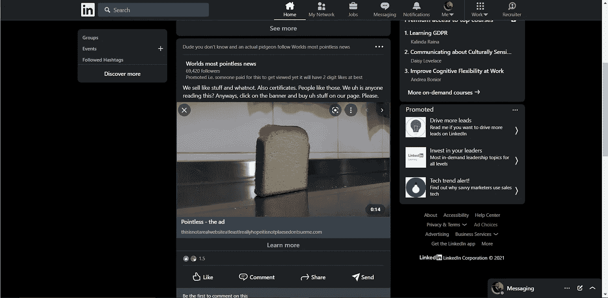

也许你已经发送了数百个连接请求，并附上了推介和申请的说明？

也许你浏览了好几页 LinkedIn 上的工作，却总是忘记取消勾选“关注 ExampleCompanyInc”？

如果你对这些问题中的任何一个回答是肯定的，你可能会被迫默认使用*linkedin.com/messaging,*并完全跳过你的 feed，或者手动取消选中下面数百个框。

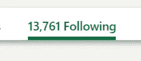

This could take a while

当然，你也可以安装一些扩展(祈祷它不会窃取你的数据，到处捣乱或者天知道什么)。

让我们用聪明的方法做它。所以事不宜迟，这里是

# 清洁进料的 6 个步骤(现在开始计时)

1.  去 https://www.linkedin.com/feed/following/[的](https://www.linkedin.com/feed/following/)
2.  向下滚动。

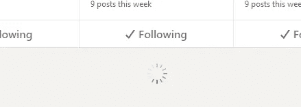

All the way.

3.右键单击🗸下列框之一，然后单击检查

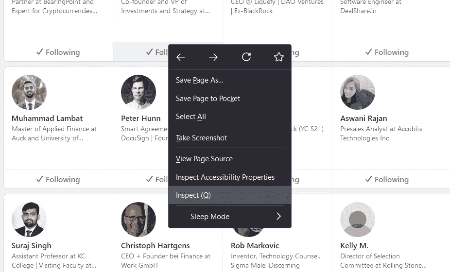

4.复制该类

这将我们带到一个挤满代码的窗口，但我们并不关心这些。我们只需要找出我们盒子的第一个“类名”aka。巴顿是。

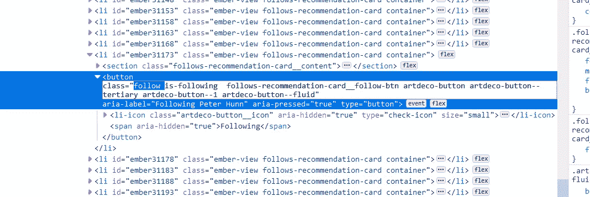

The first one “follow”

5.前往控制台

记住或复制它(在我们的例子中是“follow”)并转到控制台选项卡。

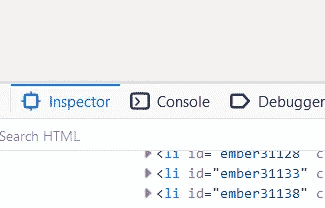

你的主机可能装满了东西，忽略它，没关系。

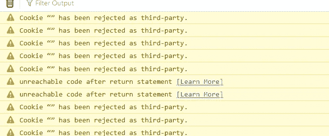

Just ignore all that. No matter what it might say on your end.

6.将以下代码粘贴到控制台中

```
const button = document.querySelectorAll('.follow')
button.forEach(btn=> btn.click() )
```

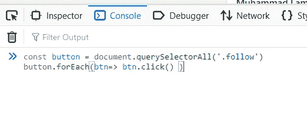

If your class name was not follow, type/paste whatever it was on your end. Should be the first word after class =

现在都没人关注了，就这样。

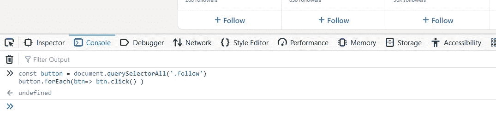

Automatically unsubscribe thousands of people and companies you never signed up for.

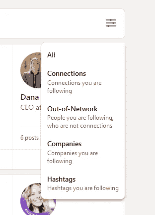

Gg wp。你当然也可以调整你的过滤器，不显示每个人。

有了这个，你的 feed 就像你注册的那天一样干净，你就可以关注你真正关心的事情了！

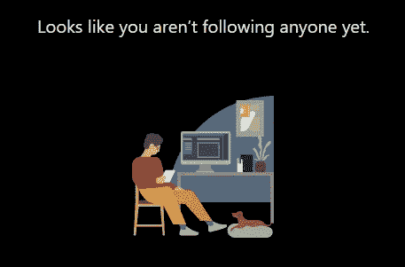

All clean

关注我这里的更多无代码/低代码小工具和简单的技术文章:【https://medium.com/@valeriasbangert】T5

*更多内容请看*[***plain English . io***](http://plainenglish.io/)