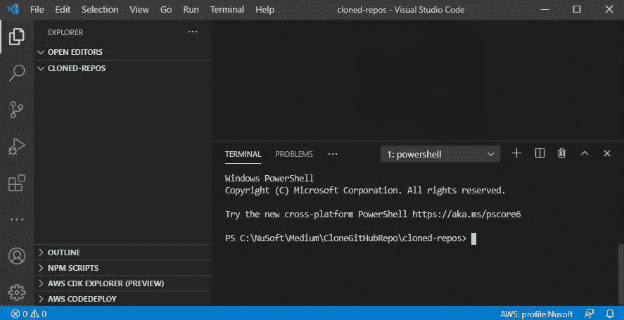

# 如何克隆 GitHub 存储库

> 原文：<https://javascript.plainenglish.io/how-to-clone-a-github-repository-e8b963b93f2b?source=collection_archive---------5----------------------->

## 源代码控制

## 获取您最喜欢的 JavaScript 开发人员的公共代码的本地副本，并在您的本地机器上运行它。


Photo by [Victor Serban](https://unsplash.com/@victorserban?utm_source=medium&utm_medium=referral) on [Unsplash](https://unsplash.com?utm_source=medium&utm_medium=referral)

因此，您找到了您最喜欢的 JavaScript/React 开发人员的公共 GitHub 帐户，并希望运行他们存储库中的一些示例。或者一个教程提到“完整的解决方案可以在这里找到。” ***伟大。现在怎么办？***

> 克隆是通过命令“git clone”完成的，这是一个将所有代码文件接收到本地机器的过程。

# 我们将做什么

在本教程中，我们将使用我的一个 GitHub 帐户和一些库，但是你可以使用任何你想要的 GitHub 帐户。我们将克隆一个包含简单 React 应用程序的存储库，并让它启动和运行。

# 一张便条

大多数 GitHub 库都是公开的。然而，当克隆一个存储库时，仍然要检查使用、重用、修改和再分发的许可证类型。这些信息通常可以在不同的地方找到。通常是许可证降价文件(许可证。MD)或 package.json 文件中。

许可证类型列表可以在[这里](https://docs.github.com/en/github/creating-cloning-and-archiving-repositories/licensing-a-repository)找到。更多信息可以通过谷歌搜索“开源许可类型”找到

# 我们开始吧

我们将克隆一个显示产品列表的简单 React 应用程序。

## 虚拟代码

1.  在你的硬盘上创建一个名为**的目录。**
2.  打开您最喜欢的代码编辑器。我将使用 [VSCode](https://code.visualstudio.com/) 。导航到您刚刚创建的文件夹。
3.  使用**终端/新终端打开一个终端窗口。**



VSCode with Terminal window.

## 开源代码库

1.  现在转到你选择的 GitHub 账户。如果需要，你可以用我的这个。
2.  在顶部你会看到单词 **Repositories** ，通常是 repo(s)的缩写。


GitHub account menu

3.点击 **Repositories** ，你将看到 GitHub 账户中的回购列表。


Sample repos: source-author

4.点击名为**product-lister-ReactSandbox**的 repo。这就是我们将要克隆的。你会看到源文件和一个绿色的下拉按钮，标签为 **Code i** n 在右上角。

5.点击标有**代码的绿色下拉按钮。**您将看到此回购的链接。这就是我们想要的。


The link to the repo

6.点击回购链接右侧的**复制**按钮。

## 返回 VSCode

1.  回到 VSCode 的终端窗口，键入 **git clone** 并粘贴从 GitHub repo 复制的链接。按回车键。

```
git clone [https://github.com/Gravity-Well/product-lister-ReactSandbox.git](https://github.com/Gravity-Well/product-lister-ReactSandbox.git)
```

你会看到这样的东西，


Cloned GitHub repo.

该应用程序在 VSCode 的文件资源管理器中可见。


The cloned application

## Git 对 GitHub

我们使用了一个 **git** 命令来访问 GitHub repo。Git 和 GitHub 不一样。Git 位于您计算机的本地。GitHub 在云端。然而，两者都是为了源代码版本控制。

> **Git** 是一个版本控制系统，可以让你管理和跟踪你的源代码历史。 **GitHub** 是一个基于云的托管服务，可以让你管理 **Git** 仓库。如果您有使用 **Git** 的开源项目，那么 **GitHub** 旨在帮助您更好地管理它们。

**由于这是一个 React 应用程序，**您将希望在终端窗口中运行 **npm install** 。这将安装该应用程序需要的所有 **npm 包依赖关系**，它们列在 **package.json** 文件中。

2.**重要**！首先，我们必须将 **cd** 放入应用程序目录，在本例中是**product-lister-ReactSandbox**。在终端窗口中键入以下内容，然后按 enter 键。

```
cd product-lister-ReactSandbox
```

3.验证您是否在应用程序目录中，并键入以下内容。

```
npm install
```

> 这可能需要几分钟的时间，喝杯咖啡吧。

**可能的错误**:如果您看到此消息，说明您在尝试安装 npm 时不在应用程序目录中。


**Error** if not in the application directory and npm install is used.

# 运行应用程序

1.  在终端窗口中键入以下命令，在端口 3201(在 package.json 中指定)上启动 React development server

```
npm start
```

这是我编写的一个小应用程序，用来教授基本的 React 概念。但是重要的一点是从 GitHub 克隆，而不是应用程序。


The running application.

当您准备好关闭应用程序时，关闭浏览器选项卡，并在 VSCode 的终端窗口中使用 **CTRL-C** 停止 React 开发服务器。

# 那么分叉呢？

> **分叉**是一个概念，而**克隆**是一个过程。**分叉**只是包含了一个单独的库副本，不涉及任何命令。**克隆**是通过命令‘git**clone**完成的，它是一个将所有代码文件接收到本地机器的过程。

当你进行回购时，你会在你的 GitHub 账户中创建一个副本。不在您的本地机器上。

更多可以在[这里](https://www.toolsqa.com/git/difference-between-git-clone-and-git-fork/)找到。

# 结论

在本教程中，我们介绍了将一个公共 GitHub 库(repo)克隆到本地机器的步骤。此外，由于这是一个 React 应用程序，我们看到了如何使用 npm install 安装所需的依赖项。

> 满怀信心地前进，探索推荐的 GitHub 帐户。

**感谢您的阅读和关注！**

*尽情阅读，加入灵媒帮我继续写作*

[](https://bobtomlin-70659.medium.com/membership) [## 通过我的推荐链接加入灵媒——重力井(罗伯·汤姆林)

### 作为一个媒体会员，你的会员费的一部分会给你阅读的作家，你可以完全接触到每一个故事…

bobtomlin-70659.medium.com](https://bobtomlin-70659.medium.com/membership)