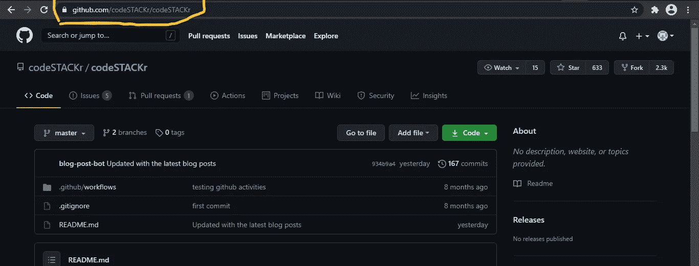
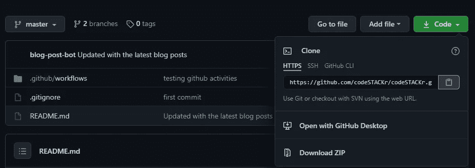
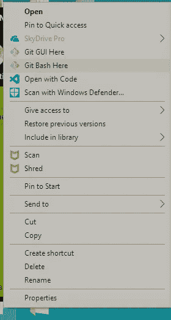
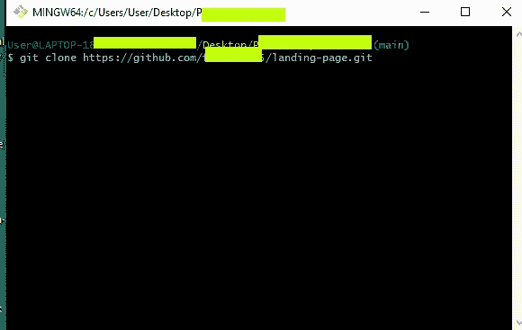

# 如何从 GitHub 克隆一个应用

> 原文：<https://javascript.plainenglish.io/how-to-clone-an-app-from-github-446541a0302d?source=collection_archive---------0----------------------->

## 使用此详细教程克隆并运行 React 应用程序


Photo by [olia danilevich](https://www.pexels.com/@olia-danilevich?utm_content=attributionCopyText&utm_medium=referral&utm_source=pexels) from [Pexels](https://www.pexels.com/photo/man-sitting-in-front-of-three-computers-4974915/?utm_content=attributionCopyText&utm_medium=referral&utm_source=pexels)

克隆 React 应用程序的 GitHub 回购看起来像是克隆任何其他回购，但并不像看起来那么简单。

在本教程中，我们将有效地从 GitHub 克隆一个 React 应用程序。我们将使用:

*   [Node.js](https://nodejs.org/en/download/)
*   [VScode](https://code.visualstudio.com/download)
*   Git /Git bash，以及
*   [GitHub](https://github.com/)

所以事不宜迟，我们开始吧！

```
Table of contents· [1\. Cloning the React App](#3608)
  ∘ [Creating a New Folder](#9028)
  ∘ [Getting the Code URL](#c1bc)
  ∘ [Cloning the React app's Github Repo](#32d2)
· [2\. Configuring your Cloned App](#bc11)
  ∘ [ The node_modules](#06e0)
  ∘ [Working on the Config Files.](#0331)
  ∘ [Setting up your own Node Modules Folder and package-lock.Json File](#f2bc)
· [3\. Starting the React app](#eaf2)
· [In Conclusion](#8b41)
  ∘ [Helpful resources](#7d4b)
```

# 1.克隆 React 应用程序

现在，让我们采取以下步骤:

## 创建新文件夹

因此，我们将创建一个新文件夹。你想叫它什么都可以。我建议您选择一个与要克隆的回购相关的名称，以便于检测。但是名字最终取决于你的选择。

## 获取代码 URL

要克隆上述 React app GitHub repo，您必须拥有在浏览器上打开 GitHub repo 的特定 URL。



Credit to CodeSTAKr/ Screenshot by Author

```
*Note: You can clone a public github repo since you have access to it. You can't clone a private github repo unless you are given access to that repo.*
```

在 React app 的 GitHub repo 中，点击按钮，代码。将出现一个下拉列表，您可以在其中下载 Zip 文件中的代码或复制代码 URL。

在本教程中，我们将利用代码的网址。因此，让我们复制它。



Screenshot by Author

## 克隆 React 应用程序的 GitHub Repo

现在，通过右键单击文件夹并单击 git bash here，打开刚刚创建的新文件夹的 Git bash 窗口。



Screenshot by Author



Screenshot by Author

在 git bash 窗口中，键入`git clone`，粘贴 GitHub repo 的代码 URL，然后按 enter 键运行命令。

```
git clone ‘the code URL of the github repo’
```

在该过程结束时，如果您做的一切都正确，您将不会遇到任何错误，这意味着克隆过程已成功完成。

# 2.配置克隆的应用程序

一旦你完成了前面的步骤，我们需要创建我们自己的`package-lock.json`文件和`node_modules`文件夹。我们不需要手动创建它们，因为我们运行的以下命令会创建它们。

在 windows 上按`ctrl + j`或者在 Mac 上按`command + j`，在 VSCode 上打开你的终端。

在您的终端上，将您的目录更改为克隆文件夹的名称。

*假设克隆的文件夹名为“我的克隆应用程序”*

```
cd my-cloned-app
```

一旦成功完成，您需要运行`npm install`。这将需要一些时间来完成运行。

如果你做的一切都是正确的，在这个过程的最后，你会在你的终端上看到这些文字。

```
run `npm fund` for details
found ..... severity vunerablity
run `npm audit fix` to fix them or `npm audit` for details
```

您还会在窗口左侧看到您的`package-lock.json`文件和`node_modules`文件夹。

*太好了，配置过程很成功。我们在进步！*

# 3.启动 React 应用程序

所以，在你的终端上运行`npm start`。

在运行此命令之前，请确保您位于正确的目录中，以避免出现错误。

如果您不是，或者您不确定您是，请 cd 到正确的目录。

一旦命令运行完毕，React 应用程序将在本地主机上的默认浏览器上打开。

```
https:// local host:3000
```

*祝贺您，您已经成功克隆并启动了 React 应用程序。*

# 结论

我们刚刚克隆了一个 React 应用程序，在那里我们学习了如何克隆 GitHub repo，配置了该应用程序，并在我们的浏览器上成功地在我们的本地主机上运行了它。

现在，如果你愿意，你可以修改代码并在线部署应用程序。

这很有趣吗？有帮助吗？感谢您的宝贵时间！

## 有用的资源

1.[Git 和 GitHub 简介(教程)](https://m.youtube.com/watch?v=SWYqp7iY_Tc)

2.下面的文章:

[](/the-complete-developers-guide-to-github-31060f667002) [## GitHub 开发人员完全指南

### 深入了解最受开发人员欢迎的版本控制平台之一

javascript.plainenglish.io](/the-complete-developers-guide-to-github-31060f667002) [](/github-basics-5eb93567c86d) [## GitHub 基础知识

### Github 是很多开发者和公司使用的源代码控制资源。Github 允许开发者做出改变…

javascript.plainenglish.io](/github-basics-5eb93567c86d) 

## 进一步阅读

[](/5-tips-to-scale-up-your-react-apps-8fb68319062e) [## 扩展 React 应用的 5 个技巧

### 1.将 Bit 用于可组合设计 2。设计令牌 3。网络请求的定制钩子 4。客户端与服务器状态 5。一个…

javascript.plainenglish.io](/5-tips-to-scale-up-your-react-apps-8fb68319062e) 

*更多内容看* [***说白了。报名参加我们的***](https://plainenglish.io/) **[***免费周报***](http://newsletter.plainenglish.io/) *。关注我们关于* [***推特***](https://twitter.com/inPlainEngHQ) ，[***LinkedIn***](https://www.linkedin.com/company/inplainenglish/)*，*[***YouTube***](https://www.youtube.com/channel/UCtipWUghju290NWcn8jhyAw)*，* [***不和***](https://discord.gg/GtDtUAvyhW) *。对增长黑客感兴趣？检查* [***电路***](https://circuit.ooo/) *。***