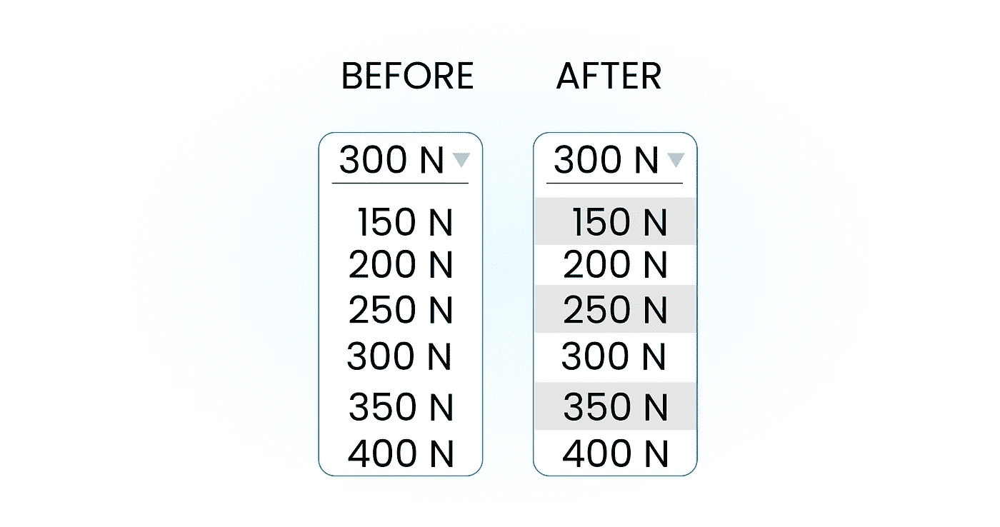

# 如何在 React 中有条件地应用一个类

> 原文：<https://javascript.plainenglish.io/how-to-conditionally-apply-a-class-in-react-d0e7e34cccf4?source=collection_archive---------11----------------------->

Photo by [Kaidi Guo](https://unsplash.com/@kaidi_guo?utm_source=unsplash&utm_medium=referral&utm_content=creditCopyText) on [Unsplash](https://unsplash.com/s/photos/mountains?utm_source=unsplash&utm_medium=referral&utm_content=creditCopyText)

我敢肯定，当你在构建 React 组件的时候，你曾经想要有条件地应用一个类。也许，你想根据某个状态制作一个 div 的背景色，但是想不出办法——这里有一个解决问题的方法。

做这件事有几种方法。我们将在我们的例子中解释它们。

# 示例 1:下拉菜单

我们希望每隔一个菜单项背景颜色为灰色。它应该是这样的:

我们的下拉菜单只是一排按钮。这就是为什么我们的函数看起来像:

每一项都有一个类似整数值的键。所有的项目都是按关键字排列的。这意味着 150N 的键值为 0，200N 的键值为 1，依此类推。首先，我们将解释最快的方法— **三元(条件)运算符。**

## 三元运算符

正如您现在可能已经知道的，三元运算符是唯一一个接受三个操作数的 JavaScript 运算符:一个条件后跟一个问号(`?`)，如果条件是 [truthy](https://developer.mozilla.org/en-US/docs/Glossary/truthy) 后跟一个冒号(`:`)，则是要执行的表达式，最后是如果条件是 [falsy](https://developer.mozilla.org/en-US/docs/Glossary/falsy) 则是要执行的表达式。这个操作符经常被用作`[if](https://developer.mozilla.org/en-US/docs/Web/JavaScript/Reference/Statements/if...else)`语句的快捷方式。

在我们的例子中，我们希望每隔一个菜单项有一个灰色背景。我们想看看我们的键值 mod 2 是 0 还是 1。

# 示例 2:按钮

好了，我们解开了第一个谜团。这很简单，因为我们只有一个条件。如果我们有多个条件呢？

如果我们的按钮很大并且是蓝色的，但是一旦我们点击它就变成红色了怎么办？

## [类名库](https://github.com/JedWatson/classnames)

它的一个主要用例是使动态的和有条件的`className`道具更容易操作(尤其是比有条件的字符串操作更容易)。所以你可以用下面的代码为 React 中的`<button>`生成一个`className`道具。这是一个普通的 JavaScript 库，所以它可以很好地与 React 和其他 JavaScript 框架一起工作。

我们的按钮函数需要两个道具:按钮的大小和文本。

我们可以把我们的`classNames`写成下面这样，因为如果与给定键相关联的值是 falsy，那么这个键就不会包含在输出中。