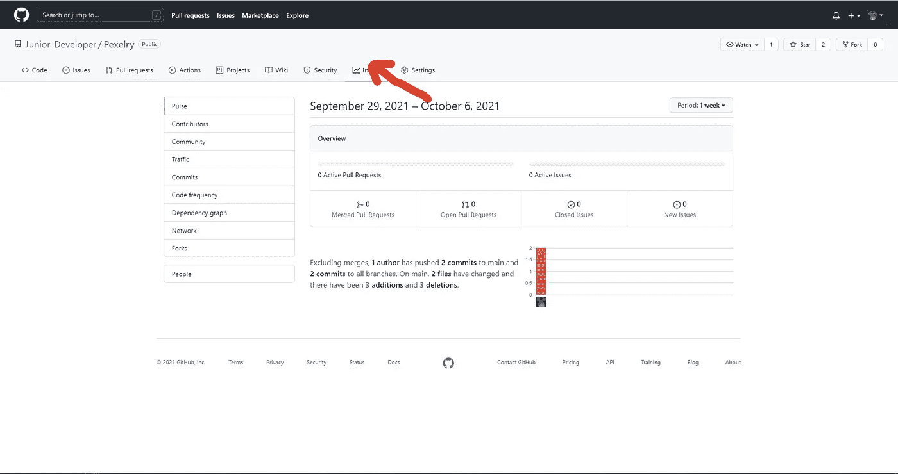

# 如何在 Nuxt.js 项目中配置 Dependabot

> 原文：<https://javascript.plainenglish.io/how-to-configure-dependabot-in-a-nuxt-js-project-cb4d19953364?source=collection_archive---------9----------------------->

## 使用 Dependabot 自动更新您的依赖项

Image by [John Philip](https://medium.com/u/c2cdb19c0977?source=post_page-----cb4d19953364--------------------------------)

你是否发现偶尔手动更新你的依赖关系到最新版本很困难？我想你已经知道随之而来的麻烦了。首先，这很乏味。

不如我告诉你，你可以一次设置好所有这些，让你所有的依赖项在每次新版本出来时都更新到最新版本。

我们将看看如何在 NuxtJS 项目中设置 Dependabot，以确保我们的依赖项自动更新，从而节省我们大量的时间。

## **什么是 Dependabot？**

Dependabot 是一个自动化的依赖关系更新机器人。它创建“拉”请求来保持您的依赖关系安全和最新。

它是如何做到这一切的？

*   它会检查更新。
*   在更新时打开拉取请求(PR)。
*   您执行检查和合并。

想了解更多关于塌实机器人的信息，请访问 [***这里***](https://dependabot.com/) 。

**如何用 NuxtJS 项目配置 Dependabot】**

导航到您的 GitHub 存储库，其中包含您想要配置 Dependabot 的 NuxtJS 项目。

Image by Author

导航到给定的存储库后，选择 Insights 上的选项卡并单击 in。

您将看到一个与下图所示相同的标签。

Image by Author

在右侧导航栏中，选择 ***依赖图*** ，如下图所示。

Image by Author

在从属机器人图上选择 ***从属机器人*** 标签。点击**按钮*启用依赖机器人。***

Image by Author

点击按钮后，Dependabot 将配置必要的设置，并用另一个选项卡提示您。选项卡应该类似于下面的那个。

Image by Author

现在点击创建一个配置文件。这将提示 Dependabot 在您的应用程序中创建一个配置文件，用于更新您的存储库。

## **配置您的软件包生态系统**

不同的框架有不同的包生态系统，大多数时候你要么使用*要么使用 ***YARN*** 。*

*根据您对给定项目使用的包管理器，您应该在-package-ecosystem 选项卡的花括号下输入它。*

*从下图中，我输入了 ***npm*** 。如果使用 ***纱线*** ，则应在给定的选项卡中输入。*

**

*Image by Author*

*之后，向下走并提交新文件。这将确保给定的更改被合并到您的存储库中，并且 Dependabot 将从现在开始接管更新过程。*

*如果有任何更新，Dependabot 将提交一个拉请求(PR)。您需要自己检查并合并更改。*

**

*Image by Author*

***现在下一步是什么***

*Dependabot 现在已经配置到您的 NuxtJS 存储库中了。*

*用其他框架配置 Dependabot 相当容易，几乎是一样的。*

## ***结论***

*感谢您阅读这篇文章。此外，如果你觉得我的内容有用，而你不是媒体会员，你可以在这里(媒体推荐链接)获得你的媒体会员资格，无限制地访问所有内容，并支持我们作为作家。*

## ***更读***

* [## JavaScript 数据结构:堆栈实现

### JavaScript 中栈数据结构的实现

javascript.plainenglish.io](/javascript-data-structures-stack-implementation-bb85141a3f78)  [## JavaScript 挑战:检查两个字符串是否是字谜

### 检查两个字符串是否是字谜的 JavaScript 挑战

javascript.plainenglish.io](/javascript-challenge-check-if-two-strings-are-anagrams-e2efe65c6ef) 

*更多内容请看*[***plain English . io***](http://plainenglish.io/)*