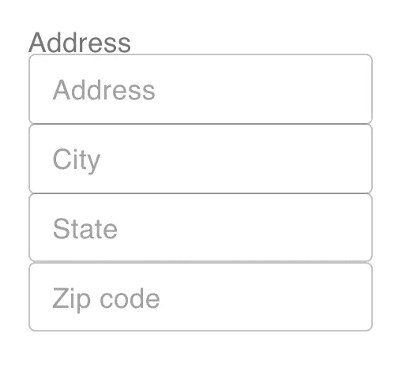
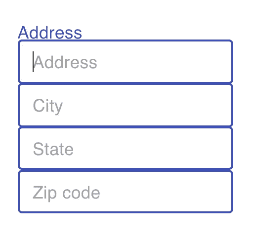
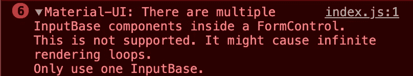
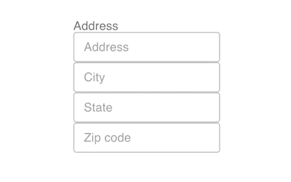

# 如何在 Material-UI 中将多个输入连接到一个标签

> 原文：<https://javascript.plainenglish.io/how-to-connect-multiple-inputs-to-one-label-in-material-ui-cd4348d86191?source=collection_archive---------4----------------------->

## 关注具有多个输入的一个标签。


Photo by [Florian Olivo](https://unsplash.com/@florianolv?utm_source=medium&utm_medium=referral) on [Unsplash](https://unsplash.com?utm_source=medium&utm_medium=referral)

有一天，我试图创建一个基本的地址表单，输入地址、城市、州和邮政编码。这是我试图构建的一个总体思路(请忽略不那么好的设计)。



对于这个表单，我使用了 Material-UI 组件库。正如您从上面看到的，我想要创建的表单在顶部有一个*地址*标签。然后有 4 个输入字段，分别用于地址、城市、州和邮政编码输入。够简单吧？

# 问题

我面临的挑战是，当用户关注地址中的任何输入时，我希望顶部的*地址*标签变成不同的颜色。通常，有一个标签连接到一个输入；但是，我想将多个输入连接到一个标签。

Material-UI 可以选择使用带有`OutlinedInput`和`FormLabel`组件的`FormControl`包装类来创建自定义文本输入字段。我试图用下面的代码创建一个自定义输入控件字段。我认为我定制的表单有一个标签和多个输入。

```
<FormControl>
  <FormLabel>Address</FormLabel>
  <OutlinedInput margin="dense" placeholder="Address" />
  <OutlinedInput margin="dense" placeholder="City" />
  <OutlinedInput margin="dense" placeholder="State" />
  <OutlinedInput margin="dense" placeholder="Zip code" />
</FormControl>
```

但是，下图显示了结果。每当我关注任何输入时，`FormControl`内的所有其他输入，包括`FormLabel`都会被关注。



当我检查控制台时，我还遇到了以下警告。



仔细想想，这是有道理的。就像一个 HTML 标签怎么只能连接一个输入；`FormControl`组件是一个工作方式相同的包装器。一个控件中不能有多个输入。

# 解决办法

我想到的解决方案包括使用 React 的`useState`钩子，并为`OutlinedInput`组件的`onFocus`和`onBlur`道具创建函数。

首先，用`useState`钩子创建一个名为 focused 的状态值，并将初始值设置为 false。

```
const [focused, setFocused] = useState(false);
```

然后，创建两个函数，`onFocus`和`onBlur`，它们将焦点值的状态设置为 true 或 false。

```
const onFocus = () => {
  setFocused(true);
};const onBlur = () => {
  setFocused(false);
};
```

接下来，在每个`OutlinedInput`组件上添加这两个函数作为道具，并移除`FormControl`包装器组件。最后，别忘了给经过聚焦状态的`FormLabel`添加一个`focused`道具。

```
<FormLabel focused={focused}>Address</FormLabel>
<OutlinedInput
  margin="dense"
  placeholder="Address"
  onFocus={onFocus}
  onBlur={onBlur}
/>
<OutlinedInput
  margin="dense"
  placeholder="City"
  onFocus={onFocus}
  onBlur={onBlur}
/>
<OutlinedInput
  margin="dense"
  placeholder="State"
  onFocus={onFocus}
  onBlur={onBlur}
/>
<OutlinedInput
  margin="dense"
  placeholder="Zip code"
  onFocus={onFocus}
  onBlur={onBlur}
/>
```

如果您不熟悉`onFocus`和`onBlur`，它们是输入字段的事件处理程序。`onFocus`发生在输入聚焦时，而`onBlur`发生在输入失去聚焦时。

现在，只要我们关注任何输入，关注状态就会设置为真，表格顶部的*地址*标签会变成蓝色。当我们没有聚焦于任何输入时，聚焦状态被设置为假，并且*地址*标签失去颜色。



**总结解决方案:**

1.  使用`useState`钩子创建一个新的状态变量。
2.  创建`onFocus`和`onBlur`功能来设置变量的状态。
3.  将两个功能作为道具传递给`OutlinedInput`组件。
4.  向传递聚焦值的`FormLabel`添加`focused`道具。

# 结论

谢谢你的阅读！我不知道这是否是解决问题的最好办法，但是，它确实有效。如果您确实知道任何其他解决方案，请在下面的评论中分享。

这是我喜欢做开发人员的原因之一。对同一问题有许多解决办法。

如果您想了解更多关于 Material-UI 和 TextField 组件是如何工作的，请查看下面的文章。

[](https://medium.com/geekculture/what-really-happens-when-you-use-the-textfield-component-in-material-ui-1e62652196f) [## 当您在 Material-UI 中使用 TextField 组件时，真正会发生什么？

### 让我们深入调查一下

medium.com](https://medium.com/geekculture/what-really-happens-when-you-use-the-textfield-component-in-material-ui-1e62652196f) 

*更内容于* [*浅显易懂的英语中*](http://plainenglish.io/)