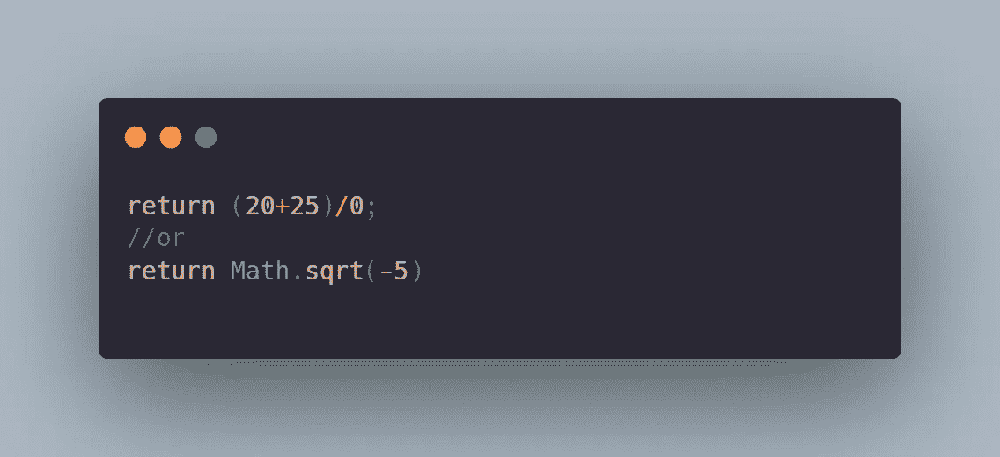
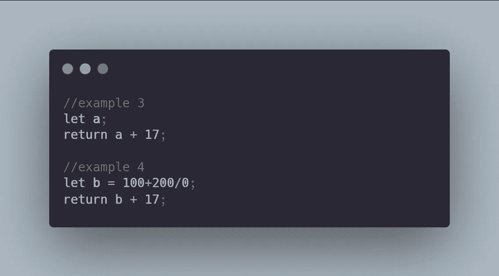
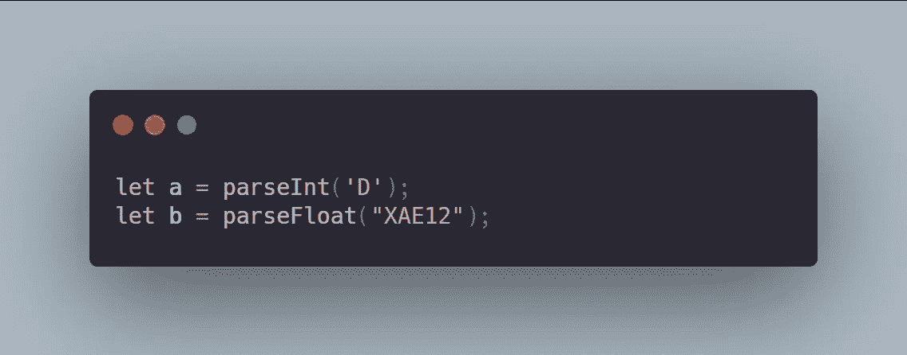

# 如何用 JavaScript 征服 NaN

> 原文：<https://javascript.plainenglish.io/how-to-conquer-nan-in-javascript-b8a08511187?source=collection_archive---------1----------------------->

## 这就是 NaN 不断出现在您的 JavaScript 程序中的原因

我们已经讨论过 [null 和未定义的](https://medium.com/@kyledeguzmanx/3-differences-between-null-and-undefined-fb93fedd4fe7)以及这些值如何在您的代码中发挥作用。现在，我们来谈谈另一个价值:南。

NaN 代表**不是一个数字。NaN 非常有趣，因为它是一个没有法律意义的数字。你可以说是非法号码。这是一个不存在的数字。因此程序员不能用它来进行计算。**

令人惊讶的是，尽管 NaN 不是我们可以使用的合法数字，NaN 的数据类型仍然是一个数字。

这是为什么呢？什么是非法号码？

南来自许多情况…

# 有效的操作，不可能的结果

在第一个 return 语句中，整行代码都使用了非常有效的数学运算。但是，它的结论是将总和除以零。任何数除以 0，除了 0，都会得到一个未定义的商。如果看逆运算，任何数乘以 0 都不可能得到非零的答案。

因为第一个 return 语句接受数字输入，所以通过 return 语句发送的数据类型也是数字。但是，在这种情况下，该号码是非法号码。这个数字没有定义，也不存在。这将返回南。

在第二个 return 语句中，它在寻找一个负数的平方根。坦率地说，这是不可能的。如果看逆运算，不可能两个数平方，收获一个负数。

第二个 return 语句接受数字输入，并期望输出数字的数据类型。在这种情况下，号码是非法的。它没有定义，也不存在。这将返回南。

在示例 3 中，当 a 未定义时，语句返回+ 17。不可能给任何数加上一个未定义的值。与前面的示例类似，return 语句接受数字输入，并期望输出数字的数据类型。这将返回南。

在示例 4 中，变量 b 将包含值 NaN。在下面一行中，return 语句将返回 NaN + 17。非法数字加上合法数字会产生一个非法数字。这也将回报南。

# 类型变换

最后，我们有类型转换函数。这些函数接收输入，并将其转换为整数或浮点数。当输入是类似“89”、“229”或“119”的字符串时，这些函数非常有用。这些字符串实际上可以转换成数字。

另一方面，当字符串包含字母或其他非数字符号时，有时这些解析函数无法将它们转换为数字。无论如何，该函数仍然需要一个数值类型的返回值。将返回的值是 NaN。

在了解了导致 NaN 的极少数途径之后，你现在就具备了避免它的知识！

*更多内容看*[***plain English . io***](http://plainenglish.io/)