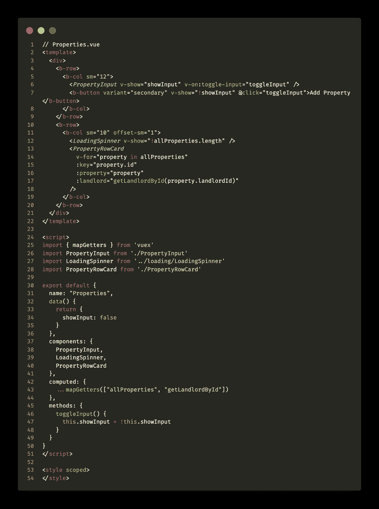
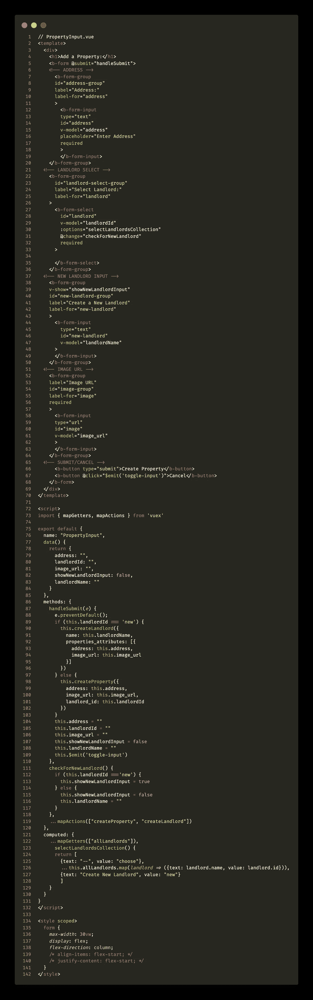

# 如何将 React 应用转换为 Vue.js

> 原文：<https://javascript.plainenglish.io/how-to-convert-a-react-app-to-vue-js-39030c37a11c?source=collection_archive---------8----------------------->

## 第 2 部分:Vue 指令


# 介绍

上周我画了一张…的鸟瞰图。 [Vue](https://vuejs.org/) 以及它与[相比可能如何反应](https://reactjs.org/)。要赶上进度，请点击第 1 部分的。本周我想直接进入 Vue 指令，这样你就可以一瞥`.vue`组件和 React 的`.jsx`之间的渲染语法差异

# Vue 指令

> 指令是带有`v-`前缀的特殊属性。指令属性值应该是一个单独的 JavaScript 表达式(除了`v-for`，这将在后面讨论)。指令的工作是当它的表达式的值改变时，对 DOM 反应性地应用副作用。— [Vue 文档](https://vuejs.org/v2/guide/syntax.html#Directives)

## 模板中指令的常见用法

1.  If 语句
2.  For 循环
3.  基于布尔值的元素可见性
4.  将值绑定到本地状态的项目(类似于 React 中受控表单的行为)
5.  用户事件处理程序

## If 语句

它们的一个常见用途是显示模板元素和加载微调器。

```
<LoadingSpinner v-if="!allProperties.length" />
```

这里我告诉 Vue，只有当我的`allProperties`数组长度等于一个 falsy 值(又名`0`)时，才显示要渲染的`LoadingSpinner`组件。幸运的是，有一种更加语义化的方式来表达这一点:

```
<LoadingSpinner v-show="!allProperties.length" />
```

那不是更好吗？

## 对于循环

呈现项目列表非常简单，有几种方法可以做到。第一个看起来非常熟悉，你可能习惯于任何语言和使用 JSX。这非常相似，但是在引号内编写 JS 相关的东西可能看起来有点奇怪，并且肯定需要一些时间来适应。正是因为这个原因，我强烈建议确保你有一些像样的语法高亮。在 VSCode 扩展市场中查看 [Vetur](https://marketplace.visualstudio.com/items?itemName=octref.vetur) 和 [vue](https://marketplace.visualstudio.com/items?itemName=jcbuisson.vue) 扩展。

```
// JSX Syntax
<ul>
  {properties.map(property => <li key={property.id}>{property.address} - {property.landlord}</li>)}
</ul>// Vue Syntax
<ul>
  <li v-for="property in allProperties" 
    :key="property.id" 
    :property="property"    :landlord="getLandlordById(property.landlordId)">
</ul>// An even cooooooler way to render items in a collection via Vue is calling the v-for directive on a component itself that is destined to be an instance component =><Property
  v-for="property in allProperties"
  :key="property.id"
  :property="property"
  :landlord="getLandlordById(property.landlordId)"
/>
```

这很好，因为您避免了传统 for 循环中的旧式“三明治代码”。你能相信吗？

## 模型绑定

假设您正在 Vue 中构建一个组件(React 称之为“受控表单”)，您通过`onChanges`将表单值存储在本地状态中。在 React 中，您必须为每个字段设置`onChange`事件处理程序，除非您能够创建一个动态处理程序。在 Vue 中，所有的`onChange`业务都在幕后处理，并被轻松地抽象出来，用于您想要的双向数据绑定。您甚至可以访问`.preventDefault`方法，而不必用`@submit.prevent=”handleSubmit”`在提交处理程序中调用它

```
<template>
  // can also be written, more verbosely, as 
  // <form v-on:submit.prevent="handleSubmit" > <form @submit.prevent="handleSubmit">
    <input
      type="text"
      id="name"
      v-model="firstName"
    /> <input
      type="email"
      id="email"
      v-model="emailAddress"
    />

    <input type="submit" />
  </form>
</template><script>
import { mapActions } from 'vuex'export default {
  name: "Form",
  data() {
    return {
      firstName: "",
      emailAddress: ""
  },
  methods: {
    handleSubmit() {
      this.createUser({
        firstName,
        emailAddress
      })
    },
    ...mapActions("createUser")
  }
}
</script>
```

其他事件处理程序包括所有常见的类型:

```
<button @click="coolMethodHere" /><button @mouseover="coolMethodHere" />// when user releases the enter key
<button @keyup.enter="coolMethodHere" />// when user attempts to copy via CTRL+C
<button @keyup.ctrl.c="coolMethodHere" />
```

# 例子

## 属性组件(索引)



Properties.vue

## 属性输入表单



PropertyInput.vue

# 结论

现在，您可以看到通过指令和事件来控制 Vue 模板的呈现是多么容易。在某些情况下，样板代码被精简或完全抽象。

在 [Twitter](http://www.twitter.com/_dan_foley_) 和 [GitHub](http://www.github.com/d-otis) 上关注我！