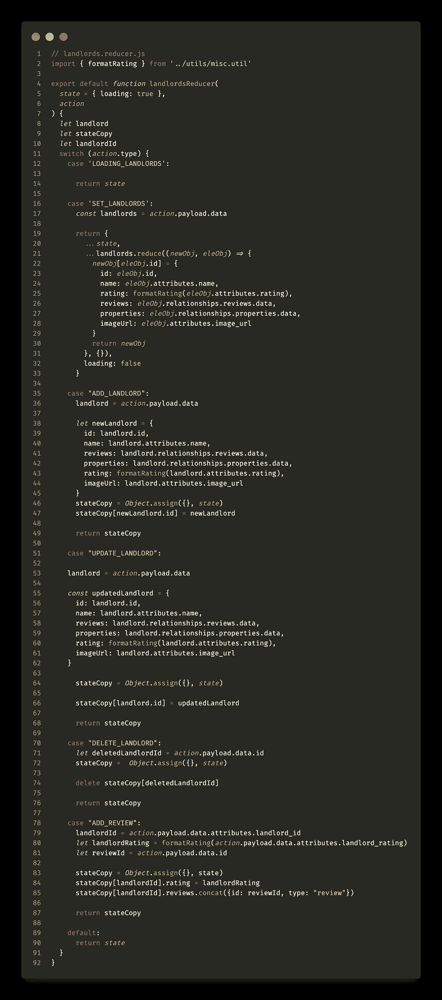

# 如何将 React 应用转换为 Vue.js

> 原文：<https://javascript.plainenglish.io/how-to-convert-a-react-app-to-vue-js-f96723951a1a?source=collection_archive---------10----------------------->


1.  Vuex 概述
2.  商店
3.  模块
4.  状态、获取者、动作、突变

# 介绍

> Vuex 是 Vue.js 应用程序的状态管理模式+库。它充当应用程序中所有组件的集中存储，规则确保状态只能以可预测的方式变化。它还与 Vue 的官方 [devtools 扩展(打开新窗口)](https://github.com/vuejs/vue-devtools)集成，以提供高级功能，如零配置时间旅行调试和状态快照导出/导入。— [Vuex 文档](https://vuex.vuejs.org/)

我会像本系列的其他部分一样引用你的房东应用程序的一个等级。你可以点击查看回购[。不要大惊小怪——有很多截图，但这不是一个疯狂的长期阅读！与 Redux devtool 不同，Vue devtool 不需要疯狂的配置或样板文件来使用它的 Vuex 特性:它就是工作。](https://github.com/d-otis/rate-your-landlord-vue)

 [## d-Otis/rate-your-房东-vue

### 此时您不能执行该操作。您已使用另一个标签页或窗口登录。您已在另一个选项卡中注销，或者…

github.com](https://github.com/d-otis/rate-your-landlord-vue) 

## 反应/还原

当然，如果您是老板，您可以在任何环境中以任何方式设置您的文件结构——关于使用 Redux 作为状态管理工具，React 遵循一些约定。例如，人们经常将他们的操作和 reducers 分离到不同的目录和文件中。下面是我的应用 React 版本的面向商店的文件结构。

```
// React
src
├── actions
│   ├── landlords.actions.js
│   ├── properties.actions.js
│   └── reviews.actions.js
├── assets
├── components
├── containers
...
├── reducers
│   ├── index.js
│   ├── landlords.reducer.js
│   ├── properties.reducer.js
│   └── reviews.reducer.js
└── utils
```


landlords.actions.js in React app



landlords.reducer.js in React app

React 约定让我们将`mutators`、`getters`和`state`都滚动到我们的 reducer 文件中，通常通过一个`rootReducer`(在这种情况下通过我的`/reducers/index.js`)连接，同时保持`.actions`独立。也许我可以把我的动作和 reducers 都放在一个名为`store`的目录中，但是这是 JavaScript 开发的狂野西部。


## Vue/Vuex

让我们来看看 Vue/Vuex 文件结构。请记住，这是一种潜在的“tom-ay-to”、“tom-ah-to”情况:

```
// Vue
src/store
├── index.js
└── modules
    ├── landlords.js
    ├── properties.js
    └── reviews.js
```

这是同样的资源，地主，在 Vuex 生态系统中表达:


landlords store module

# Vuex 商店模块的元素

## 状态

这是不言自明的。它包含了你从 API 中获取的所有信息，你已经用一个动作和 mutator 对它进行了设置，见下文。

## 吸气剂

这些都是你的前端访问前述状态的方法。在我的例子中，我们可以查询所有房东的状态，并通过 id 检索某个房东。


你可能会问我如何在我们的 Vue 组件中访问这些 getters。下面是我的`Landlords.vue`组件的`<script></script>`部分。首先，我从第 2 行的`vuex` npm 模块导入`[mapGetters](https://vuex.vuejs.org/guide/getters.html#the-mapgetters-helper)`(还有`[mapActions](https://vuex.vuejs.org/guide/actions.html#dispatching-actions-in-components)`)。然后使用扩展操作符，我分别在第 17 行和第 22 行混合了我的`allLandlords()` getter 和`deleteLandlord()`动作。


我可以在这个模板部分的第 1、2、3 和 13 行调用我的`allLandlords()` getter。我的缩进在这里可能看起来有点不稳定——只是为了减少字符长度！


## 行动

它们负责从 API 获取数据，或者 post、patch、put、delete 请求，然后立即触发本地状态的突变。Vuex 神奇地将一个`commit`函数参数传递给每个动作，这样您就可以启动您的变化(在下一节中概述)。这类似于在 Redux 操作中返回`dispatch`。


Vuex store actions for Landlords

这是相同的动作，但是在我的 React 版本的项目中。这有点冗长，因为我在 React 应用程序中使用的是`fetch`而不是`axios`。


Redux store actions for Landlords in React app

你可以看到几幅图片之前我是如何将`deleteLandlord`放入脚本部分的`Landlords.vue`组件文件中的，但这里是我在实际模板中使用它的方式。记住`handleDelete`调用`this.deleteLandlord()`并传递`id`，因为我们可以访问模板中 for 循环内的`landlord`对象。稍后显示完整的 Vue 组件…


## 突变

这些实际上做，或者说`commit`，我们变异状态的脏活。这些不是从我们的 Vue 组件中访问的，而是由组件中的动作触发的*,这些动作通过每个动作中自动传递的`{ commit }`参数来访问。*


a human with a mutation


# 模块

想知道如何整合我们所有的商店吗？在 React 中，我们使用`combineReducers()`。Vuex 非常相似:


然后，我们将最近合并的商店放入我们的`main.js` 文件中。


# 不要有一个复杂的多资源的 App？

如果你的应用程序不是那么复杂，或者你的组件需要访问一个商店模块中的许多项目，你可以很容易地把所有东西都放在一个商店模块中——写出来会变得非常冗长。改为在 Vue 组件中导入并使用`mapState`助手。

```
computed: mapState([
  // map this.count to store.state.count
  'count'
])
```

# 完整的地主. vue 组件


# 结论

我们做到了！在`Redux`中，你可以做很多你习惯做的事情，也许在`Vuex`中不那么罗嗦。感谢阅读！

在[推特](http://www.twitter.com/_dan_foley_)和 [GitHub](http://github.com/d-otis) 上关注我

## 顺便说一句:树

查看[家酿](https://formulae.brew.sh/)公式，`[tree](https://formulae.brew.sh/formula/tree)`在命令行中可视化或显示目录结构的好方法。许多不同的选项标志可供选择:

[](https://formulae.brew.sh/formula/tree) [## 树

### 将目录显示为树(可选颜色/HTML 输出)http://mama.indstate.edu/users/ice/tree/许可证…

formulas . brew . sh](https://formulae.brew.sh/formula/tree)