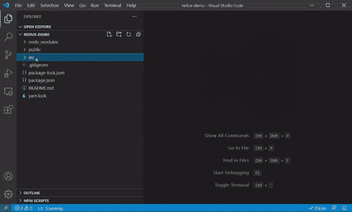
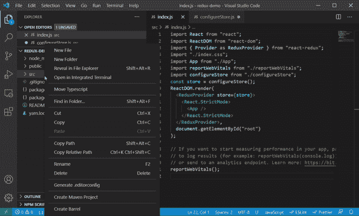
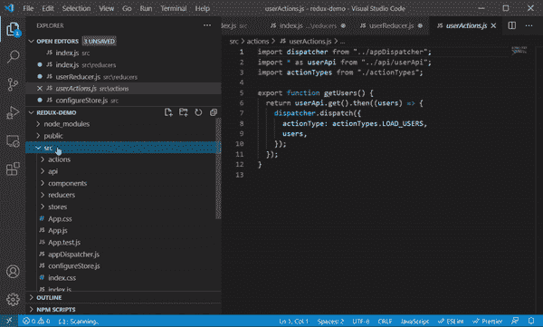

# 如何在 React 中将 Flux 转换为 Redux

> 原文：<https://javascript.plainenglish.io/how-to-convert-from-flux-to-redux-in-react-7550bd3ea1a9?source=collection_archive---------6----------------------->


> 这个循序渐进的指南应该可以帮助你将现有的 Flux React 应用程序转换为 Redux。

## 商店

Flux 和 Redux 之间最显著的区别之一是对存储的使用。

Flux 有多个，Redux 有一个单店。

在根目录下创建一个名为 **configureStore.js** 的新文件

configureStore.js to setup the Redux store and middleware

我包含了 thunk 和 redux 不可变状态不变中间件，因为我发现它们很有用。我不会深入这个故事的细节，但是，如果你感兴趣的话，我建议你去看看。

> 您将需要为这个构建添加所需的包，请参考本文的包部分，了解运行这个示例所需的所有包的详细信息。

现在，您需要修改您的 **index.js** 来将应用程序包装在一个 ReduxProvider 中。

index.js modified to use Redux



## 还原剂

Flux 和 Redux 之间的下一个主要区别是引入了减速器。Reducers 基于传递的操作返回一个新状态。

让我们创建一个文件来合并我们生产的特定减速器。

在一个名为“reducers”的新目录下创建一个文件 **index.js**

index file to import all reducers

在 Flux 中，你可以把修改状态的方法放在存储中，而在 Redux 中，我们把它放在一个 reducer 文件中。

在这个例子中，我导入了一个 userReducer，让我们来看看。

您将看到我们在 Flux **userStore.js** 中向 dispatcher 注册的操作，即

userStore using Flux

被移动到减速器:

userReducer returning new state based on the action type

缩减器接收两个属性:状态和动作。

基于动作类型，返回新的状态。



## 行动

要将 Flux 动作转换为 Redux 动作，只需做一个小的改动。

而不是使用它来导入 appDispatcher 和 dispatch 操作，即

userActions using Flux

您使用 dispatcher 作为输入参数返回一个函数，并使用它来调度操作，也就是说。

userActions modified to use Redux

移除 appDispatcher 的导入，更改导出的函数以返回以 dispatch 作为输入参数的函数，并将 dispatch actionType 属性重命名为 Type。



## 成分

Redux 简化了处理动作的组件实现。

让我们看看当前使用 Flux 编写的用户列表组件:

userList component using Flux

您需要做的第一个更改是用对 Redux 方法 connect 的调用来包装您的导出。Connect 需要两个道具，为了可读性，我喜欢把它们分开:

```
import { connect } from 'react-redux';
...function mapStateToProps(state, ownProps) {
}function mapDispatchToProps(dispatch) {
}export default connect(mapStateToProps, mapDispatchToProps)(UserList);
```

然后，我们修改 useEffect 挂钩来删除变更侦听器。

之前:

```
useEffect(() => {
    userStore.addChangeListener(onChange);
    if (!users) {
         getUsers();
    }
    return () => {
        userStore.removeChangeListener(onChange);
   };
}, [users]);
```

之后:

```
useEffect(() => {
    if (users.length === 0) {
         getUsers();
    }
}, [users, getUsers]);
```

我们移除对 useState 挂钩的调用，并更改传递给 UserList 的属性。

之前:

```
function UserList(props)
```

之后:

```
function UserList({users, getUsers})
```

以我们的 UserList 组件为例，这是最终的 Redux 版本:

userList component converted to use Redux

## 包装

您将需要以下包来运行本文中列出的示例。

```
npm install redux
npm install react-redux
npm install redux-immutable-state-invariant
npm install redux-thunk
```

## 源代码

此示例的源代码副本可以在此处找到:

通量:[https://github.com/adriver-kwiboo/flux-demo](https://github.com/adriver-kwiboo/flux-demo)

https://github.com/adriver-kwiboo/redux-demo

我希望你觉得这个故事有用，感谢阅读。

[*更多内容看 plainenglish.io*](http://plainenglish.io/)