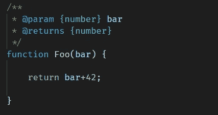
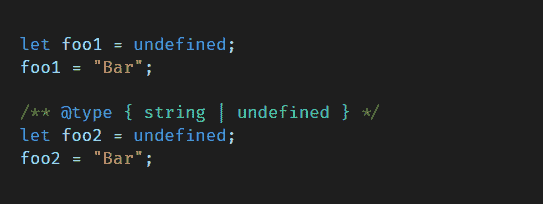
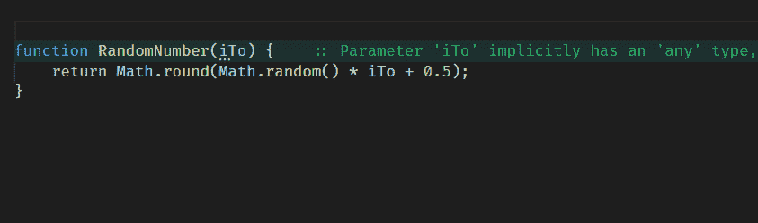
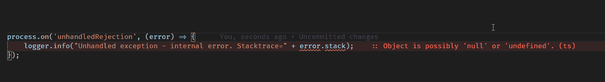
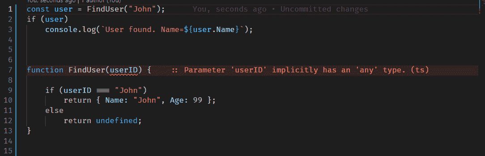
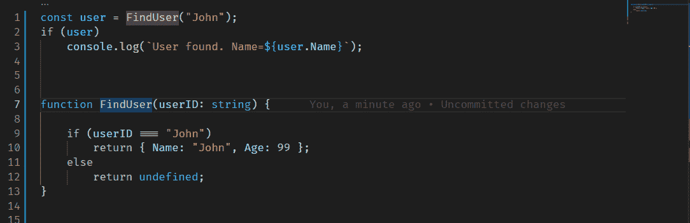
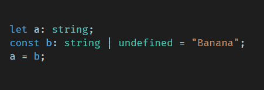
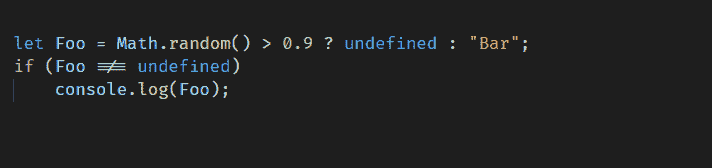

# 如何将 Node.js 代码从 JavaScript 转换为 TypeScript

> 原文：<https://javascript.plainenglish.io/how-to-convert-node-js-code-from-javascript-to-typescript-8e7d031a8f49?source=collection_archive---------1----------------------->


Photo by [Tudor Baciu](https://unsplash.com/@baciutudor?utm_source=medium&utm_medium=referral) on [Unsplash](https://unsplash.com?utm_source=medium&utm_medium=referral)

# 介绍

本指南包含大量关于如何开始将现有 JavaScript 项目转换为 TypeScript 的信息。

## 循序渐进的方法…

本文从建立一个项目(仍然是 JavaScript)开始，该项目带有一个 TypeScript“编译无错误”设置(将所有文件保留为。js)。一步一步来，我们将解决发现的问题，并最终成为只支持打字稿的(。仅限 ts)。

我建议阅读这份文件两遍。首先建立一个所有待办事项的列表，其次实际处理它们。有很多事情非常重要(“这应该在文件的最顶端”)，但这并不真正可行。

## 一些打字稿基础

如果您从未使用过 TypeScript，这将是一个额外的挑战。有几个重要的“提及”需要完成:

*   TypeScript 只存在于“编译”时，在运行时它仍然是 JavaScript
*   TypeScript 并不真正编译，它转换文件。
*   类型脚本传输程序被命名为“tsc”
*   node(node.exe)只能运行 JavaScript 代码，但是通过添加“插件”ts-node，实现了类型脚本支持。
*   VSCode 对 TypeScript 有很好的支持，ESLint 也是(用正确的插件)

最重要的可能是:*运行*代码和*传输*代码是两回事。你需要让两个世界都工作。

如果你想签出一个工作(空)项目，那么签出[https://github.com/tomnil/emptyts](https://github.com/tomnil/emptyts)。

## 类型…

虽然有解决常见类型脚本问题的技巧，但这里几乎没有关于如何实际编写类型的信息。尽管如此，一些建议还是很重要的。

**任何**

Any 基本上禁用变量的类型检查(read:make it“JavaScript”)。`any`应该避免，但在某些情况下非常有用。

```
let a : any = {}
a.name = "Sarah";   // TypeScript checking is disabled here
```

**未知**

`unknown`和`any`是“远程好友”，但是`unknown`不允许通过他们的名字访问属性。

```
let myBox: unknown = {};       // OK!
myBox = { foo: "bar" };        // OK!
console.log(myBox.foo);        // Error
myBox.foo = "FooBar";          // Error
```

**对象**

两种方式都可行:

```
let user1: **{ Name: string, Age: number };**
user1 = { Name: "John", Age: 16 };
console.log(user1.Name);**type User = { Name: string, Age: number };**
let user2: User = { Name: John", Age: 16 };
console.log(user2.Name);
```

现在，基本的东西都在路上了，让我们开始转换。

# 建立工具链

为了能够使用 TypeScript，必须有许多工具。还有许多工具可以让它变得更容易:)

## tsc +类型脚本

首先对`tsc`(trans piler)和`typescript` 本身进行全局安装。

```
npm install tsc -gnpm install typescript --save-dev
```

## ts 节点

ts-node 是添加支持直接运行 TypeScript 的模块(即；*非* 先编自。ts 到。js 然后运行. js. ts-node 就可以运行了。ts 直接)。

该工具必须安装在本地。

```
npm install ts-node --save-dev
```

## 类型同步(可选)

这是一个很好的工具，可以自动下载所有你引用的模块的定义文件(它不是内置在你引用的模块中的)。使用 npm 安装。

```
npm install -g typesync
```

## eslint(可选)

eslint 同样重要，但不在本文讨论范围内。

# 为 TypeScript 配置项目

## 创建 tsconfig.json

在项目的根目录下，创建`tsconfig.json`。从以下内容开始:

```
{
  "compilerOptions": { /* Docs: [https://www.typescriptlang.org/tsconfig](https://www.typescriptlang.org/tsconfig) */
    "target": "ES2020",
    "module": "commonjs",
    "outDir": "bin",
    "rootDir": "src",
    "strict": true,
    "noImplicitAny": false,
    "strictNullChecks": true,
    "checkJs": true,
    "allowJs": true,
    "moduleResolution": "node",
    "types": [
      "node"
    ],
    "lib": [
      "es6"
    ],
    "esModuleInterop": true,
    "skipLibCheck": true,
    "forceConsistentCasingInFileNames": true,
    "allowUnreachableCode": true,
     "useUnknownInCatchVariables": false,  // TypeScript 4.4+ only!
},
  "include": [
    "src/**/*.ts",
    "src/**/*.js"
  ],
  "exclude": [
    "node_modules",
    "<node_internals>/**",
  ]
}
```

相应地更改 include 和 exclude(注意，这些设置将 ***而不是*** 被一些工具使用，除非环境变量`TS_NODE_FILES`被设置为`true`)。

## 关于配置设置的一些快速注释

**《目标》:“es 2020”**

如果你在做后端开发，那么尽可能使用新的 EcmaScript 版本是最合理的。

**"rootDir": "src"**

如果您遵循大多数标准，您的源代码在“src”中

**"outDir": "out"**

Typescript 是围绕从/src/文件夹到目标目录/out/的“编译”(实际上是传输)而构建的。

本指南避免使用/out/文件夹，因为它会降低开发和调试过程的速度。按原样运行代码(如。ts)的效率要高得多。但是，必须设置“outDir”。

**“allow js”——传输 javascript 文件**

如果需要，打开`allowJs`和`checkJs`。要处理的 js 文件。ts 文件。此外，确保两者。ts 和。js 包含在`include`部分。

```
"include": [
        "src/**/*.ts",
        "src/**/*.js"
    ],
```

"**useunknowincatchpavariables**"

这是从 TypeScript 4.4 开始的新设置。默认情况下，它被设置为 true，这意味着 catch 中的`error`将是`unknown`，并且默认情况下不可能访问`.message`。

简单的解决方法是(，目前，将`useUnknownInCatchVariables`设置为`false`，或者进行适当的修复。有关此主题的更多信息，请参见下文。

## 。gitignore 出文件夹

使用 git？修改`.gitignore`以从`tsc`中排除`out`文件夹和临时文件。

```
out/
# TS -incremental file
tsconfig.tsbuildinfo
node_modules
```

## 从搜索结果中删除文件夹“out”

英寸 vscode/settings.json，使用以下设置:

```
{
  "search.exclude": {
     "**/node_modules": true,
     "**/package-lock.json": true,
     "**/package.json": true,
     "out/**": true // Don't search the TypeScript "out" folder
   }
}
```

## vscode:重新加载窗口以确保正确加载 tsconfig.json

vscode 将处理`tsconfig.json`，但此时重新加载 vscode 可能是个好主意:按`ctrl-shift-p`并搜索命令“开发人员:重新加载窗口”。

# 添加现有类型

从 npm 注册表安装的模块类型可以通过四种不同的方式进行解析:

*   这些类型包含在模块所有者中
*   这些类型可以单独安装
*   手动编写缺少的类型
*   将模块设置为“任意”

`typesync`是一个很酷的工具，可以检测缺失的类型(如果没有找到，用 npm 安装它)

```
> typesync📦 projectname — package.json (1 new typings added, 0 unused typings removed)
└─ + @types/**packagename1**✨  Go ahead and run npm install or yarn to install the packages that were added.> npm install
```

如果找不到需要的类型，只有两种方法可以解决。要么自己编写类型，要么将整个*模块声明为 any。后者通常是最容易的:在根目录下创建一个名为“declarations.d.ts”的文件，并允许它只包含**和**“declare module”语句(**没有其他内容**，否则它将停止工作)。*

```
declare module 'excel4node';
```

如果你想要一些关于如何写类型的信息，去看看 https://github.com/DefinitelyTyped/DefinitelyTyped。

## 设置变量的类型

如上所述，本指南不是打字稿指南。但是给个提示大概是好事吧。有三种方法可以将类型分配给变量:

```
type User = { Name: string, Age: number };let a : User | undefined = undefined;
let b = <User>{ Name: "Karin", Age: 40 };   // Type Assertion
let c = { Name: "Karin", Age: 40 } as User; // Type Assertion
```

# 传输文件并决定如何修复错误

在第一个 TypeScript transpile 中，您当前的 javascript 文件几乎肯定会生成大量的警告和错误。在尝试切换到 TypeScript 之前，很可能必须修复现有 javascript 文件中的许多问题。从命令行运行:

```
tsc -b -v
```

…或者，如果您喜欢使用文件监视器以增量方式运行`tsc`:

```
tsc --build --verbose --incremental --watch# or shorter:tsc -b -v -i -w
```

逐个解决错误时，让编译器在窗口中以监视模式运行。

## 固定顺序

如果可能的话，从“最深”层次的代码开始，即从磁盘/互联网加载数据的代码。基本上，如果`LoadWeatherDataFromRemoteAPI()`返回`{ Temparature: 25 }`，这个函数应该是这样的:

```
function LoadWeatherDataFromRemoteAPI() : { Temparature: number } {
 // ... code for fetching here 
}
```

这个主题将在下面详细讨论(包括如何处理承诺/等待/异步)。

## JsDoc 机会

TypeScript transpiler 理解 JsDoc 注释，vscode 识别它们，但是一旦转换完成，一些(很多？)是不需要的。TypeScript 应该为类型获胜(并且可以选择为其他内容保留 JsDoc)

如果您的代码在这一点上完全缺乏 JsDoc，那么将它作为中间解决方案来编写/生成可能会有所帮助。它*将*帮助你解决错误，但也是朝着错误的方向迈出的一步。一旦转换完成，这个新编写的 JsDoc 可能会被删除。JsDoc 示例:



和变量使用`/** @type { *thetype* } */`



## 自动编写文档/解析类型

考虑下面的 JavaScript 代码。该函数缺少参数类型:

```
function RandomNumber(iTo) {
    return Math.round(Math.random() * iTo + 0.5);
}
```

自动推断类型是可能的:)但是我强烈建议在文件被重命名为`.ts`之后*进行推断，因为它将编写真正的类型脚本代码(而不是 jsDoc)。阅读下面关于这个话题的更多内容。*



# 解决错误

同时将文件保存为。js，有可能解决很多问题。现在，如果您已经决定重命名为。ts，没关系。先看重命名部分:)

## 运算符“xyz”不能应用于“string”和“number”类型。

看起来很简单，不要混合类型。:)

```
// Incorrect type set
let a="0";
console.log(a+1);   // Disallowed, a is a string// toFixed converts to string!
const a = 3.1415926;
const b = a.toFixed(2);
const c = 2 * b;     // Disallowed, b is a string
```

## fs.readFileSync 和 JSON.parse 问题

```
Argument of type 'Buffer' is not assignable to parameter of type 'string'.ts(2345)
```

解决方案:

```
# Change from:
let result1 = JSON.parse(fs.readFileSync(fileName));To:
let result2 = JSON.parse(fs.readFileSync(fileName, 'utf-8'));
```

## 如果没有别的，就忽略这个错误

嗯，现在可能有一些很难修复的错误。只需用`@ts-ignore`标记该行即可(也许可以将其添加到 backlog 中，以便稍后修复):

```
process.on('unhandledRejection', (error) => {
    //@ts-ignore
    logger.info("Unhandled exception - internal error. Stacktrace=" + error.stack);
});
```



# 关于全局变量和 Express 的特殊注释

并非所有项目都包含全局变量或使用 Express。本节专门讨论与此相关的问题。

## 声明全局

```
error TS2339: Property ‘myVariable’ does not exist on type ‘Global & typeof globalThis’.
```

解决方案:在一个 **.d.ts** 文件中，定义对象。这里有一些解决这个问题的例子:

```
var myVariable: boolean;
    var myClass1: Object;
    var myClass2: any;
    var myObject3: { Name: string, Username: string };
    var myObject3Array: { Name: string, Username: string }[];
}
```

通常你会看到下面的风格作为建议，但上面的风格将与 tsc 一起工作，同时用智能感知运行代码*和*。

```
declare global {
    namespace NodeJS {
        interface Global {
            myVariable: boolean,
            myClass1: Object,
            myClass2: any,
            myObject3: { Name: string, Username: string },
            myObject3Array: { Name: string, Username: string }[],
        }
    }
}
```

无论哪种方式，请使用最适合您的方式。

## 表达

将类型 Express 类型添加为(不要忘记导入 Express):

```
import Express from "express";app.get(`/ping`, (req: **Express.Request**, res: **Express.Response**) => {
   return res.json({ result: "pong"});
});
```

例如，如果您希望在`Express.Request`上有额外的属性，您可能会得到如下错误:

```
error TS2339: Property ‘User’ does not exist on type ‘Request<ParamsDictionary>’.
```

解决方案是修改全局名称空间(参见上面的另一个例子)。

```
declare global {
  namespace Express {
    interface Request {
      User: { Name: string }
    }
  }
}
```

# 尝试按原样运行项目

如果您成功运行 tsc，并且没有任何错误，那么项目*可能*会在此时运行。同样，*编译*代码和*运行*代码是两回事。

## 从命令行

我们将避免使用构建步骤“编译”(read:trans pilling)到/out/ destination 目录，最好设置所有工具按原样运行 typescript。

运行代码而不传输很容易，只需在 start 命令中包含 ts-node:

```
# Faster startup
node.exe **-r ts-node/register/transpile-only** ./src/index.js# Or use:
node.exe **-r ts-node/register** ./src/index.js# Read more at: [https://github.com/TypeStrong/ts-node](https://github.com/TypeStrong/ts-node)
```

没有成功？想要一个工作项目？在 github 上查看 [emptyts](https://github.com/tomnil/emptyts) 项目。

## 直接从 vscode 调试

现在，我们还没有配置 vscode。您需要进行额外的更改才能使其工作。打开“launch.json”并使用以下内容。修改参数以匹配启动文件的名称。

```
{
 // Detailed docs:
 // [https://code.visualstudio.com/docs/nodejs/nodejs-debugging](https://code.visualstudio.com/docs/nodejs/nodejs-debugging)
 "version": "0.2.0",
 "configurations": [
 **{
   "name": "Debug typescript",
   "type": "node",
   "request": "launch",
   "smartStep": false,
   "sourceMaps": true,
   "args": [
    "${workspaceRoot}/src/index.ts"
   ],
   "runtimeArgs": [
    "-r",
    "ts-node/register/transpile-only"
   ],
   "cwd": "${workspaceRoot}",
   "protocol": "inspector",
   "internalConsoleOptions": "openOnSessionStart",
   "env": {
    "TS_NODE_FILES": "true" // Respect include/exclude in tsconfig.json => will read declaration files  (ts-node --files src\index.ts)
   },
   "skipFiles": [
    "<node_internals>/*",
    "<node_internals>/**",
    "<node_internals>/**/*",
    "${workspaceRoot}/node_modules/**",
    "${workspaceRoot}/node_modules/**/*"
   ],
   "outputCapture": "std",
   "stopOnEntry": false
  }**
 ]
}
```

按“ctrl-shift-p”调出命令面板。搜索并选择“调试:选择并开始调试”。在出现的菜单中，选择“调试类型脚本”(如上所述)。

提示:断点是通过在一行上按 F9 来切换的。

## Nodemon？ts-node？

如果您想运行 nodemon，请查看 [emptyts](https://github.com/tomnil/emptyts) 项目，那里有相关文档。

# 将 require 更改为 import，将 module.exports 更改为 export

确切地说，如何编写导入和导出语句超出了本指南的范围，但是值得一提。此外，这可能不适用于您的项目。

请理解:仅仅解决需求是不够的，*需求和导出都需要完成。*

## 将“要求”替换为“进口”。

示例:

```
const stack = require('callsite');
const winston = require('winston');
const path = require("path");
require('winston-daily-rotate-file')
```

会变成:

```
import stack from 'callsite';
import winston from 'winston';
import * as path from 'path';
import 'winston-daily-rotate-file';
```

**搜索并替换**

不可能成功地进行搜索和替换，因为导入的工作方式略有不同。从修复一些常见的需求开始，比如`fs`和`path`。

```
Search: const fs = require("fs");
Replace: import * as fs from 'fs';Search: const path = require("path");
Replace: import * as path from 'path';
```

因为 require 在幕后施展了一些魔法，而 import 没有:不可能从 require 到 import 直接进行搜索/替换。根据模块的使用方式，可以使用以下任何一种:

```
// Entire module
import * as xyz from 'xyz';
import xyz from 'xyz';// Specific object
import { User } from 'xyz';// Both
import xyz, { User} from 'xyz';
```

现在，这很可能会失败，但至少可以避免一些手动编写。按“ctrl-shift-h ”,并确保勾选“regex”:

```
Search: ^\w+\s+(\w+)\s+=\s+require\((["'].*["'])\);{0,2}$
Replace: import * as $1 from $2;
```

检查 tsc 的输出并尝试修复一些明显的问题，但请注意**在修复导出之前不可能解决所有问题。所以继续读下去吧…**

## 将“module.exports”替换为“export”

示例:

```
module.exports.Function1 = Function1;
module.exports.Function2 = Function2;
module.exports.Function3 = Function3;// or:
module.exports = { Function1, Function2, Function3}
```

变成了:

```
export { Function1, Function2, Function3 }# Or use export before the function keyword:export function CreateOrder() {
    // Do work
}# If you want a default export, use: export default { Function1, Function2, Function3 }
```

## 修复“module.exports”

嗯，这很难。没有简单的方法来进行搜索和替换。需要大量的手工修复。试试这个:

```
Search: (module\.exports\s=\s)(.*)$
Replace: export default $2
```

现在修复 tsc 报告的问题。

## package.json 可能面临的挑战

如果将`type`设置为`module`，可能会让事情变得更糟。

```
{
	"name": "my project1",
	"version": "1.0.0",
	"private": true,
	"type": "module",
	 ...
}
```

没有成功？想要一个工作项目？在 Github 上查看 [emptyts](https://github.com/tomnil/emptyts) 项目。

# 重命名所有文件。js 到。分时（同 timesharing）

这就是有趣的地方。重命名文件将禁用一些功能，并启用许多其他功能。

重命名中的所有源文件。js 到。ts，使用您选择的工具。还要把 launch.json(以及其他地方)从`index.js`开始改成`index.ts`

**重要提示**:重命名后重启 VSCode。

重命名后，TypeScript 的每个检查都将被激活。大概 VSCode 和`tsc`都会报告新的错误。其中一些问题很容易解决，而其他问题甚至可能需要重新设计代码。尽管如此，您仍然可以让 TypeScript 退回到旧的 javascript 特性——这在许多情况下可能是可以的(只需使用`// @ts-ignore`)。将一个项目变成 100%的 TypeScript 不是一蹴而就的。:)

## 删除导入语句的文件扩展名

如果您引用了包含扩展名的完整路径的文件，您可能会在运行代码的*上失败，但是在使用 tsc 传输文件时*不会失败。**

```
# Bad
import MeasureTime from "./include/measuretime.js";# Good
import MeasureTime from "./include/measuretime";
```

搜索/替换为:

```
Search:   (import.*)['|"](.*).js['|"]
Replace:     $1 '$2'
```

## 从传输文件中排除文件夹

如果您有与“src”相同级别的文件夹，可能会出现以下错误:

```
TS6059: File ‘abc’ is not under ‘rootDir’
```

通过排除“tsconfig.json”中的文件夹来排除文件夹，但确保设置了`TS_NODE_FILES`(如果为真，将使用包含/排除)

```
"include": [
	"src/**/*.js",
	"src/**/*.ts"
],
"exclude": [
	"test",
	"bin",
	"out",
	"additionalFolderToSkip"
]
```

# 推断类型(也称为自动文档)

**这部分文档包含了最好的提示:)**考虑下面的代码。我们很容易理解 FindUser 接受一个参数 userID，通过查看代码，您和 TypeScript 都知道它是一个字符串。

```
const user = FindUser("John");
if (user)
    console.log(`User found. Name=${user.Name}`);function FindUser(userID) {     // No type on param or return if (userID === "John")
       return { Name: "John", Age: 99 };
    else
        return undefined;
}
```

..但如果是这样会更好:

```
function FindUser(userID**: string**) **: { Name: string, Age: number } | undefined** {     // We're clear on expectations! ... code follows}
```

要么手写，**要么使用以下技巧**:

要推断参数，点击**一个参数**并允许黄色建议出现“从用法推断参数”。这将检查代码，确定参数的类型。有时结果不正确，所以检查它是否有意义。



现在返回参数*也可以*被推断出来。设置光标光标需要在**函数名称**处，并按 ctrl + shift + r。可选地使用命令调色板并搜索“重构…”。



最后一个技巧是对返回参数使用这种样式。这种构造代码的方式确保了该类型只编写一次。

```
function FindUser(userID: string): typeof result { let result: { Name: string, Age: number } | undefined = undefined; if (userID === "John")
    result = { Name: "John", Age: 99 }; return result;}
```

或者使用这种风格，但是返回承诺的方法将具有挑战性:

```
function FindUser(userID: string): { Name: string, Age: number } | undefined { let result: ReturnType<typeof FindUser> = undefined; if (userID === "John")
        result = { Name: "John", Age: 99 }; return result;}
```

# 解决中的错误。ts 文件

## 对象可能“未定义”

由于`tsconfig.json`指定了`strickNullChecks: true`，那么 TypeScript 将为所有没有特别检查未定义的代码给出错误。这会导致以下错误:

```
TS2532: Object is possibly 'undefined'.
```

例如:可能找不到所寻找的用户。SendResetPasswordLink()将因此失败。

```
# Bad code
let user = userlist.find("admin");
user.SendResetPasswordLink();  // No check if user is undefined# Correct code:
let user = userlist.find("admin");
if (user)
   user.SendResetPasswordLink();
```

## 函数参数

所有参数都必须使用或指定为可选。

```
TS2554: Expected 2 arguments, but got 1.
```

示例:

```
let user = FindUser("admin");
function FindUser(userName: string, region: string) {
    // ... implementation here
}
```

解决方案是用两个参数调用，使区域可选或有一个默认值:

```
function FindUser(userName: string, region?: string) {
    // ... region can now be a string | undefined.
}function FindUser(userName: string, region= "Europe") {
    // ... region can now be a string 
}
```

## 异步函数和关键字 Promise

如果你写一个异步函数，函数的返回值必须是一个承诺。考虑这个函数:

```
function UserExists(userID: string): boolean {
    return (userID === "John");
}
```

如果需要异步，那么返回参数将从`boolean`变为`Promise<boolean>`。

```
**async** function UserExists(userID: string): **Promise<boolean>** {
    // Additional code here requiring it to be async.. :)
    return (userID === "John");
}
```

## 现在很多对象不都是“任何”吗？

嗯，是的。`let a;`基本等于`let a : any;`

这意味着您可以对该对象做任何您想做的事情(就像在 JavaScript 中一样)，但这并不是我们真正想要的类型脚本。我们希望控制和*知道我们在做什么。*

如果你想禁用`any`，那么打开`tsconfig.json`，将`noImplicitAny`从`false`改为`true`，享受错误:)

## 在 TypeScript 中使用{}。

这在 JavaScript 中可能行得通，但在 TypeScript 中却很烦人。变量将被声明为`{}`，仅此而已。示例:

```
let myBox = {};
myBox.contents = "fruit";
# ^^^ Will render "TS2339: Property 'contents' does not exist on type '{}'."
```

如果您确实想使用{}，那么您至少可以通过三种不同的方式来解决这个问题:

```
# Set the type (Works since contents is optional)
let myBox1: { contents?: string } = {};
myBox1.contents = "fruit";# Better
let myBox2: { contents: string };   // Variable is unused
myBox2 = { contents: "fruit" };# Or in this case, best (the type for myBox3 is inferred automatically)
let myBox3 = { contents: "fruit" };# Basically turn of type checking (not recommended)
let myBox4 : any = {};
myBox4.contents = "fruit";
```

## 类型“xyz”不可分配给类型“never”(第 1 部分)

举个例子。对已经在对象中定义的数组进行推送将会产生此错误。


另一个更简单的例子:

```
let users = [];
users.push("John");
```

将导致:

```
TS2345: Argument of type 'string' is not assignable to parameter of type 'never'.
```

解决方案是指定类型:

```
let users**: string[**] = [];
users.push("John");
```

如果在进行修复时类型未知，请执行以下操作:

```
let users: any[] = [];// or, if possible, use unknown. It's a stronger typelet result : unknown[] = [];
```

## 类型“xyz”不可分配给类型“never”..(第二部分)

对于带有数组的对象，这个问题至少有三种不同的解决方案。

```
const payload = {
    name: "Tomas",
    accessrights: []       // Will become "never[]"
};payload.accessrights.push("Admin"); // Error: "Argument of type 'string' is not assignable to parameter of type 'never'."
```

**解决方案 1 —内嵌类型**

```
const payload: **{
    name: string,
    accessrights: string[]
}** = {
    name: "Tomas",
    accessrights: []
};
```

**解决方案 2—定义类型(或接口)**

```
**type ThePayload = { name: string, accessrights: string[] }** // interface IThePayload { name: string, accessrights: string[] }const payload**: ThePayload** = {
    name: "Tomas",
    accessrights: []
};
```

**解决方案 3—类型推理**

这是最快的实现，但是它给出的代码可读性较差:

```
const payload: ThePayload = {
    name: "Tomas",
    accessrights: **<string[]>**[]
};
```

## 日期和毫秒

您不能执行这样的操作:

```
let t1 = new Date();
let t2 = new Date();
console.log(t2 - t1);
```

使用 TypeScript，您需要精确和具体:

```
let t1 = new Date().getTime();
let t2 = new Date().getTime();
console.log(t2 - t1);
```

## 类型不同/ TypeScript 很智能

考虑下面的代码。a 是字符串，b 可以是字符串*或者*未定义。第三行的作业是怎么发生的？

```
let a: string;
const b: string | undefined = "Banana";
a = b;
```

嗯，打字稿很聪明。不知道 b 是一个字符串。悬停在 b 上给出:



If 语句是形象化这一点的最佳方式。Foo 显然可以是一个字符串或未定义的，但在 if 语句后它只能是一个字符串:



# 目的地代码应该有多严格？

嗯，那是见仁见智的问题。以下设置控制大部分严格性:

## tsconfig.json — strictNullChecks

使用此设置，所有代码都需要正确处理未定义的。

```
function GetTemparature(): **number | undefined** {
    // A piece of code should return the temparature,
    // but that occasionally returns undefined
}const temp = GetTemparature();
if (temp > 50)  **// Error, temp may be undefined**
    console.log("It's hot.");
```

## ts config . JSON-useunknowincatchpavariables

如果该设置开启，必须正确处理`catch`中使用的变量:

**错误代码:**

```
try {
   // Some bad code that generates an exception
} catch (error) {
   console.log(error.message);  // Fail!
```

**好代码:**

```
try {
   // Some bad code that generates an exception
} catch (error) {
 **if (error instanceof Error)** console.log(error.message);  // OK!
}
```

## tsconfig.json — noImplicitAny

设置为 true 时，不允许使用`any`:

```
const user: **any** = { name: "Tomas", Foo: "Bar" };
```

## //@ ts-忽略

即使以上所有设置都打开了，仍然可以忽略这些错误。一个完全转换的代码库应该争取没有到很少`// @ts-ignore`。

当然，还有更多转换的技巧，但我希望这个指南能给你一些提示。

**享受**:)

*更多内容请看*[***plain English . io***](http://plainenglish.io/)