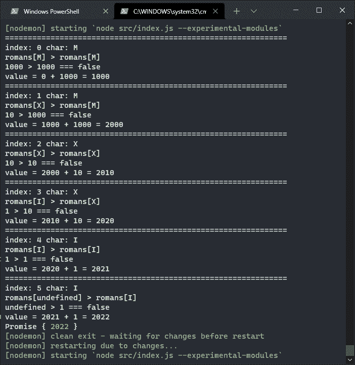

# 如何用 JavaScript 转换罗马数字

> 原文：<https://javascript.plainenglish.io/how-to-convert-roman-numerals-to-arabic-with-javascript-e038c8214ba0?source=collection_archive---------3----------------------->

Photo by [Kedar Gadge](https://unsplash.com/@kedar9?utm_source=unsplash&utm_medium=referral&utm_content=creditCopyText) on [Unsplash](https://unsplash.com/s/photos/roman-numerals?utm_source=unsplash&utm_medium=referral&utm_content=creditCopyText)

精灵们对新技术感到兴奋。他们说服圣诞老人让一切现代化。他们正在将数千年的书面文件转换成数字文件。然而，他们意识到，他们越回到过去，就越困难。很久很久以来，精灵们一直使用罗马数字系统。有字母而不是数字的那个。现在都是阿拉伯数字，从 0 到 9 的数字。将罗马数字转换成阿拉伯数字的最快方法是什么？

# 谜题:数字转换🏛️

将罗马数字转换成小数不是一个容易的问题。使用本地 JavaScript 方法是不可能的:我们必须自己创建一个特别的函数。此外，拉丁编号是基于分组字母。该字母的含义因其前后字母的不同而不同。

例如，字母`I`代表数字`1`。字母`V`代表数字`5`。我们可以用两种不同的方式组合这两个符号:`IV`和`VI`。在我们的数字系统中，它们会变成`15`和`51`。但事实并非如此。因为`V`前面的`I`表示`minus 1 to 5`，或者说`4`。相反，`V`后的`I`表示`5 plus 1`，或`6`。

# 将罗马数字转换成十进制数字

因此，从罗马数字到阿拉伯数字的转换需要两种类型的操作。首先，我分析字符串中单个字母的位置。然后我提取单个值，并把它们加起来。

为了解决这个难题，我使用了几年前在 StackOverflow 上发布的一个讨论。这些意见提出了许多可能的解决方案。从那里开始，我写下了我的解决方案:

它是如何工作的？

首先，我用罗马数字字母定义一个对象作为属性。每个属性的值就是字母的值:

然后我接受要转换的数字，它将是一个字符串，并将其转换为包含字符的数组:

首先我把所有内容变成大写字符；这样我可以简化后面的分析。

为了遍历所有的字母，我使用了 [Array.prototype.reduce()](https://developer.mozilla.org/en-US/docs/Web/JavaScript/Reference/Global_Objects/Array/Reduce) 方法。与其他时候不同，我使用它的扩展形式:

我想做的是将我正在分析的值与它后面的值进行比较:

我以这个数字为例:`["M","X","X","I","V"]`。

使用`index = 0`，条件变为:

下一个是:

我现在要做什么？

现在我要计算这个字符表示的值。

因此，如果下面的值大于前面的值，我们必须从总数中减去当前值:

相反，如果下面的值更小，我可以把它加到总数中:

如果我按顺序运行所有步骤，我会得到:

gif 上的小备注。为了延迟 JavaScript 代码的执行，我使用了一个`sleep()`函数:

# 将阿拉伯数字转换为罗马数字

在这一点上，我想知道如何做相反的事情。然后我寻找如何将十进制数字转换成罗马数字。我发现了一篇有趣的文章，作者是卡洛斯·达·科斯塔，解释了如何做到这一点。我稍微修改了一下他的代码，试图简化它。这是我的方法:

虽然我希望精灵们不要决定把所有的阿拉伯数字都转换回十进制数字。

感谢阅读！敬请关注更多内容。

***不要错过我的下一篇文章—报名参加我的*** [***中邮箱列表***](https://medium.com/subscribe/@el3um4s)

 [## 通过我的推荐链接加入 Medium—Samuele

### 阅读萨缪尔的每一个故事(以及媒体上成千上万的其他作家)。不是中等会员？在这里加入一块…

el3um4s.medium.com](https://el3um4s.medium.com/membership) 

*原载于 2021 年 12 月 14 日*[*https://blog.stranianelli.com*](https://blog.stranianelli.com/how-to-convert-roman-numerals-to-arabic-with-javascript/)*。*

*更多内容请看*[***plain English . io***](http://plainenglish.io/)***。*** *报名参加我们的* [***免费每周简讯这里***](http://newsletter.plainenglish.io/) ***。***