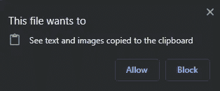

# 如何使用 JavaScript 将文本复制/粘贴到剪贴板

> 原文：<https://javascript.plainenglish.io/how-to-copy-paste-text-into-clipboard-using-javascript-1bb5f96325e8?source=collection_archive---------2----------------------->

Photo by [Hannah Olinger](https://unsplash.com/@hannaholinger?utm_source=medium&utm_medium=referral) on [Unsplash](https://unsplash.com?utm_source=medium&utm_medium=referral)

可以使用`Navigator`将文本复制/粘贴到剪贴板。

一个`Navigator`是 JavaScript 中的一个接口，它给出关于用户代理(这里是 browser)的信息，帮助管理浏览器权限，并附带一些非常有用的实用函数来了解用户代理的状态和身份。

`Navigator` 对象可以通过只读 `window.navigator`或简单的`navigator` 属性来使用。

导航器的一些有用属性是

1.  `navigator.onLine` —如果浏览器具有网络连接，则返回 true，否则返回 false。
2.  `navigator.clipboard` —用于将内容复制/粘贴到剪贴板
3.  `navigator.geolocation` —用于获取设备位置。
4.  `navigator.permissions` —用于获取[权限 API 覆盖的 API 的权限状态。](https://developer.mozilla.org/en-US/docs/Web/API/Permissions_API)

在本文中，我们将检查`navigator.clipboard`属性。

# 复制文本

1.  从输入框中复制文本

HTML for clipboard copy from an input box

这里我们从按钮点击的输入框中复制内容。

JS for clipboard copy from an input box

`navigator.clipboard.writeText()` 接受一个 [DOMString](https://developer.mozilla.org/en-US/docs/Web/API/DOMString) ，这里我们从文本框中读取值。

该函数返回一个承诺，一旦剪贴板上的内容被更新，这个承诺就会得到解决。

2.从 HTML 标记内容复制

HTML for clipboard copy from a tag

JS for clipboard copy from a tag

在`writeText()`中你可以通过目标元素的`innerText` 来复制文本。

# 粘贴文本

要将内容粘贴到剪贴板，使用`navigator.clipboard`上的`readText()`。

HTML for clipboard paste

我们将内容粘贴到`clipboard-paste`标签`innerText`中。

JS for clipboard paste

与`writeText()`类似，`readText()`也返回一个承诺，当有权限粘贴内容时，该承诺被解析。当试图粘贴时，浏览器会询问以下权限。

如果您阻止了该权限，则承诺将被拒绝，并显示消息“DOM exception:Read permission denied”。

# 结论

*   使用`navigator.clipboard`访问剪贴板。
*   使用`writeText()`将文本复制到剪贴板。
*   使用`readText()`粘贴文本。
*   请确保您已授予剪贴板的浏览器权限，以避免承诺被拒绝。

## 参考资料:

[https://developer . Mozilla . org/en-US/docs/Web/API/Navigator/clipboard](https://developer.mozilla.org/en-US/docs/Web/API/Navigator/clipboard)

仅此而已！希望这篇文章有用！。

*更多内容尽在*[***plain English . io***](http://plainenglish.io/)