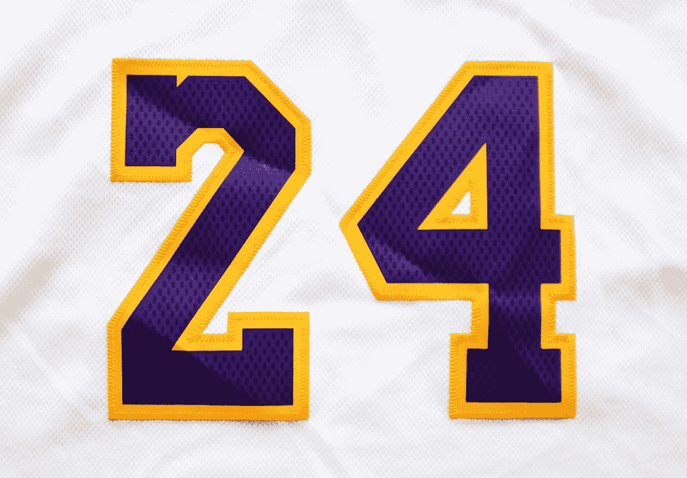

# 如何在 JavaScript 中以编程方式将文本复制到剪贴板？

> 原文：<https://javascript.plainenglish.io/how-to-copy-text-to-a-clipboard-programmatically-in-javascript-2ea3a23e0255?source=collection_archive---------13----------------------->



Photo by [Olivier Collet](https://unsplash.com/@ocollet?utm_source=medium&utm_medium=referral) on [Unsplash](https://unsplash.com?utm_source=medium&utm_medium=referral)

以编程方式将文本复制到系统剪贴板是我们有时不得不做的事情。

我们可以在 web 应用程序中用普通的 JavaScript 代码做到这一点。

在本文中，我们将研究如何以编程方式用 JavaScript 将文本复制到剪贴板。

# 老办法

老办法是创建一个文本区域，把我们要复制的文本放进去，然后调用`document.execCommand`运行`copy`命令把文本复制到剪贴板。

例如，我们可以写:

```
const text = 'hello world'
const textArea = document.createElement("textarea");
textArea.value = text;
textArea.style.top = "0";
textArea.style.left = "0";
textArea.style.position = "fixed";document.body.appendChild(textArea);
textArea.focus();
textArea.select();try {
  const successful = document.execCommand('copy');
  const msg = successful ? 'successful' : 'unsuccessful';
  console.log(msg);
} catch (err) {
  console.error(err);
}document.body.removeChild(textArea);
```

`text`变量有我们想要复制到剪贴板的文本。

然后我们创建`document.createElement`方法来创建一个`textarea`元素。

然后我们将`textArea`的值设置为`text`，将文本放入文本区域。

接下来，我们设置`top`、`left`和`position`样式，防止滚动到底部。

然后我们用`textArea`调用`document.body.appendChild`将文本区域添加到主体中。

接下来，我们把重点放在带有`focus`的`textArea`上。

然后我们调用`select`来选择文本区域中的文本，这样我们就可以复制它。

接下来，我们用`'copy'`调用`document.execCommand`来发出复制命令，复制我们在文本区域中选择的文本。

它返回一个布尔值来指示命令是否成功运行。

然后我们可以将文本粘贴到任何我们想要的地方。

# 新的方式

用 JavaScript 以编程方式将文本复制到剪贴板的新方法更加简洁。

我们只需调用`navigator.clipboard.writeText`方法，将想要复制的文本作为参数，以编程方式将文本复制到剪贴板。

为此，我们写道:

```
const text = "abc";
(async () => {
  await navigator.clipboard.writeText(text);
})();
```

我们只是用`text`调用`navigator.clipboard.writeText`来复制文本。

它返回一个带有复制状态的承诺，因此我们可以将它放在一个`async`函数中。

较新的浏览器支持这一功能。

# 结论

有多种方法可以用 JavaScript 以编程方式将数据复制到剪贴板。

*更多内容尽在* [***说白了***](http://plainenglish.io)