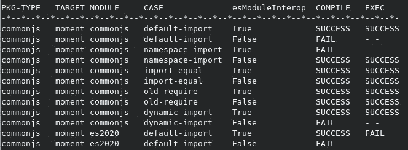
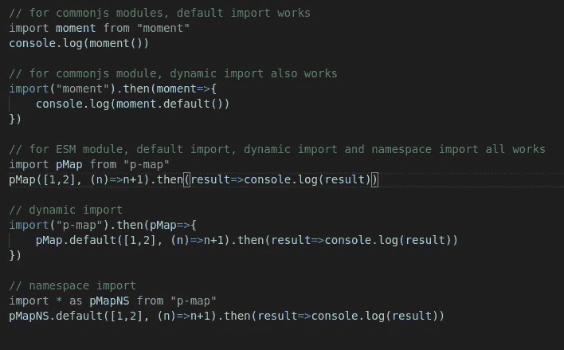
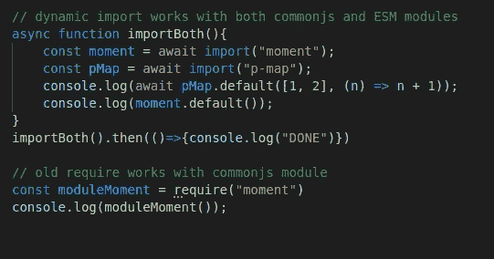

# 如何在各种情况下正确使用 TypeScript 模块导入语法和设置

> 原文：<https://javascript.plainenglish.io/how-to-correctly-use-typescript-module-import-syntax-and-settings-in-various-circumstances-e98bfa87f70f?source=collection_archive---------2----------------------->

将模块导入 TypeScript 代码，然后用 Node.js 编译并运行代码并不总是像听起来那么简单。事实上，结果取决于几个因素的共同作用。在某些情况下，正确设置所有这些因素并不容易使它们发挥作用。

如果您正在努力在 CommonJS 包中导入和使用新的 esM 模块，或者您被诸如*(模块只能使用‘esModuleInterop’标志默认导入)；“当定位 ECMAScript 模块时不能使用导入分配”、“ES 模块范围中未定义 require，您可以使用 import 代替”*之类的错误消息所迷惑，请继续阅读。

我做了一个项目，测试了这些因素的各种设置的所有组合，以找到这个问题的简单而可靠的答案，*“什么时候使用这个或那个设置？”*我寻找的答案必须比“视情况而定”更好。

# 影响结果的球员和因素

我们应该首先了解这个游戏中的三个玩家:TypeScript 编译器 tsc、Javascript 运行时 Node.js 以及我们想要导入到代码中的模块。在这个过程中，每个玩家都有一些影响整体结果的设置或属性。

我们用打字稿写代码。我们的代码包括用于导入我们使用的其他模块的 import 语句。我们使用 tsc 进行类型检查，并将我们的类型脚本代码(包括导入语句)编译成 Javascript。在此过程中，导入语句的语法(在 TypeScript 中)以及 tsc 选项“模块”、“allowSyntheticDefaultImports”和“esModuleInterop”会影响类型检查和生成的 JavaScript，包括 JavaScript 文件中的结果导入语句。

我们将生成的 JavaScript 文件放在一个包中，在包的根目录中有一个“package.json”文件，并使用 Node.js 来运行它们。在运行时，Node.js 将我们的 JavaScript 文件视为 CommonJS 模块或 es 模块(但不是两者都是)，并相应地为 JavaScript 代码提供 CommonJS 或 es 模块系统。Node.js 根据“package.json”中的“type”字段确定我们模块的类型。阅读[此处](https://nodejs.org/api/packages.html#packages_type)了解更多细节。

这两个模块系统提供了非常不同的语法和实现。带有 CommonJS 的 JavaScript 可以使用“require()”导入其他 CommonJS 模块，但是只能使用[动态导入](https://developer.mozilla.org/en-US/docs/Web/JavaScript/Reference/Statements/import#dynamic_imports)“import()”导入 es 模块。使用 ES 模块的 JavaScript 可以使用“导入”语句(例如`import moment from “moment”`)和动态导入来导入 CommonJS 和 ES 模块。如果您不了解这两个模块系统的基础知识和它们的主要区别，请在此停下来，在继续之前对这两个模块系统进行一些研究。

简要回顾一下这些因素以及它们如何影响结果:

*   类型脚本代码中导入语句的语法和编译器(tsc)选项(“module”和“esModuleInterop”)一起影响类型检查，并确定最终 JavaScript 代码中的导入语句，
*   “package.json”中的“type”字段—确定包的类型以及 system Node.js 为其中的 JavaScript 代码提供的模块，以及
*   正在导入的模块的类型(CommonJS 或 ES 模块)与上面的其他因素一起决定了结果。

# 实验

由于所有这些因素相互作用影响结果，在特定情况下使用的正确组合并不总是显而易见的。我开发了一个[脚本](https://github.com/bingtimren/experiment-n-learn-typescript-module-settings/blob/main/test.sh)来测试这些因素的完整组合以及这些因素的每种组合的最终结果——在每种组合下，类型脚本代码是否都能成功编译和执行。项目可以在[这里](https://github.com/bingtimren/experiment-n-learn-typescript-module-settings)找到。

在实验中，这些因素被定义为:

(1)PKG-类型:“package.json”中的“类型”字段确定包的类型，取值为“commonjs”(对于 CommonJS)或“module”(对于 es 模块)

(2)目标:要导入的模块。我选择了“[矩](https://www.npmjs.com/package/moment)”作为 CommonJS 模块的代表，“ [p-map](https://www.npmjs.com/package/p-map) ”作为 es 模块的代表。最后，我添加了“混合”，在这种情况下，我试图导入“时刻”和“p-map”并一起使用它们

(3)模块:tsc 设置中的“模块”选项(在 tsconfig.json 中设置或通过命令行参数设置)，取值为“commonjs”(指示 tsc 发出 CommonJS 导入语句，如“require()”)或“es2020”。“es2015”、“es2020”或更高设置指示 tsc 发出 es 模块导入语句。“es2015”产生的结果与“es2020”相同，但是，此选项不支持动态导入。有关该选项的更多信息，请参见 tsconfig.json [参考](https://www.typescriptlang.org/tsconfig)。

(4)用例:使用不同类型脚本导入语法的测试用例。对于包“moment”(代表 CommonJS 包)和“p-map”(代表 es 模块包)，这包括:

*   “默认导入”:例如`import moment from “moment”`
*   “名称空间导入”:例如`import * as moment from “moment”`
*   “import-equal”:import = require()语法，例如`import moment = require(“moment”)`
*   “动态导入”:如`import(“moment”).then()`或`await import("moment")`
*   “old-require”:旧的 CommonJS require()语法，例如`const moduleMoment = require(“moment”)`

对于导入混合模块(TARGET=mixing)，提供了两个测试用例，以展示和证明在 CommonJS 或 es 模块包中使用混合包的正确语法和设置。

(5)esmoduleineterop:TSC 设置中的“esmoduleineterop”选项修复了在处理类似 es 模块的 CommonJS 模块时的一些不匹配问题。启用`esModuleInterop`也会启用`[allowSyntheticDefaultImports](https://www.typescriptlang.org/tsconfig#allowSyntheticDefaultImports)`。取“真”和“假”之间的值。

[脚本](https://github.com/bingtimren/experiment-n-learn-typescript-module-settings/blob/main/test.sh)使用不同的 tsc 选项(“模块”和“esModuleInterop”)将每个测试用例——一个导入不同模块(“目标”)的. ts 文件(“case”)编译成 Javascript，并将其放在不同的包中(“PKG 类型”)。如果编译成功，脚本将使用 Node.js 执行 Javascript 来检查最终结果。

# 原始结果

该实验生成如下所示的报告，完整的报告可以在[这里](https://github.com/bingtimren/experiment-n-learn-typescript-module-settings/blob/main/test.log)找到。报告的每一行都表示一种组合下的结果。

# 简明指南

有了测试的完整组合，我们就可以回答这个问题:在某种情况下，我们应该使用什么导入语法和选项来导入一个模块？先说简单的案例。

## 当一个 CommonJS 模块导入另一个 CommonJS 模块时

当我们的“package.json”中的“type”为“commonjs”或不存在，并且我们正在导入另一个 CommonJS 模块时，将 tsconfig.json 中的“module”选项设置为“commonjs”。然后，我们可以使用任何“默认导入”、“名称空间导入”或“import = require()”语法。但是，请注意，有时“名称空间导入”和“默认导入”语法中只有一种有效，这取决于“esModuleInterop”的设置。

我们也可以使用旧的“require()”语法。但是，该语法丢失了类型(模块作为“any”导入)。或者，如果有必要，我们可以使用动态导入。然而，如果可能的话，静态导入是更可取的，因为它更容易从静态分析工具和树抖动中受益。

## 当一个 ES 模块导入另一个 ES 模块时

当我们的“package.json”中的“type”是“module”并且我们正在导入另一个 ES 模块时，将 tsconfig.json 中的“Module”选项设置为“es2020”。然后，我们可以使用“默认导入”或“名称空间导入”语法。“esModuleInterop”并不重要。

同样，我们可以使用动态导入，但只是在必要的时候。从静态分析工具和树抖动的好处来看，静态导入更好。

## 当 ES 模块导入 CommonJS 模块时

当我们的“package.json”中的“type”是“module”并且我们正在导入一个 CommonJS 模块或混合类型的模块时，将 tsconfig.json 中的“module”选项设置为“es2020”并将“esModuleInterop”设置为“True”。然后，我们可以使用“默认导入”语法或动态导入来导入 CommonJS 模块，并使用“默认导入”、“名称空间导入”或动态导入来导入 es 模块。同样，仅在必要时使用动态导入。

代码如下所示:

## 当 CommonJS 模块导入 ES 模块时

现在是最棘手的部分。当我们的“package.json”中的“type”为“commonjs”或不存在，并且我们正在导入一个 ES 模块或混合类型的模块时，将 tsconfig.json 中的“Module”选项设置为“es2020”(！！)和“esModuleInterop”转换为“True”。然后，使用动态导入来导入 ES 模块，并使用旧的“require()”语法或动态导入来导入 CommonJS 模块。代码如下所示:

将 tsc 的“模块”选项设置为“es2020”很奇怪，因为我们正在处理一个 CommonJS 模块。原因是，Node.js 在使用 CommonJS 模块系统时，导入 ES 模块的唯一方法就是使用动态导入。

然而，在撰写本文时，当“模块”选项设置为“commonjs”时，tsc transpiles 动态导入为“require()”(详见本[未决问题](https://github.com/microsoft/TypeScript/issues/43329))。因此，我们别无选择，只能使用“es2020”，即使我们正在构建一个 CommonJS 包。然后我们可以使用动态导入来导入 CommonJS 和 ES 模块。并且我们还可以使用旧的 require()语法(不会被 transpiled)来导入 CommonJS 模块。除此之外，导入会在编译时或运行时失败。

# 结论

从 CommonJS 模块导入一个 CommonJS 模块或者从 ES 模块导入一个 ES 模块并不难。然而，当我们把它们混在一起时就变得棘手了。本文就如何在这种情况下设置您的项目以使其工作提供了简单的指导。

*更多内容尽在*[***plain English . io***](http://plainenglish.io/)