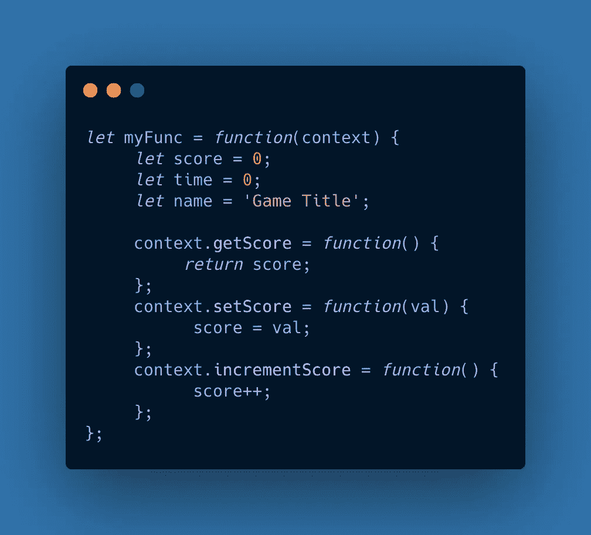

# 用 Carbon 创建代码片段

> 原文：<https://javascript.plainenglish.io/how-to-craft-your-code-snippets-with-carbon-71573c03ee4e?source=collection_archive---------6----------------------->


A code image created with Carbon. Background photo by [liu qiaojun](https://unsplash.com/@mrjunjun?utm_source=unsplash&utm_medium=referral&utm_content=creditCopyText) on [Unsplash](https://unsplash.com/@mrjunjun?utm_source=unsplash&utm_medium=referral&utm_content=creditCopyText)

当我开始编写代码教程时，我努力解决的一个问题是如何以一种吸引人、易于阅读的方式最好地展示我的代码片段。当我寻找例子时，我看到了一个教程，里面有看起来非常精美的源代码图片。每张图片都有突出的语法，带有阴影的粗边框，左上角的三个按钮给人一种真实性的感觉。大致的外观是这样的:



A sample image created in carbon.

每个代码样本看起来如此干净和详细，给我留下了深刻的印象，并开始思考，哦，这些图像一定花了很多工作来设置。不知道作者用的是什么图片编辑工具？Photoshop？Pixelmator？

在浏览一个评论帖子时，我发现这些图片是用一个叫做 [Carbon](http://carbon.now.sh) 的免费在线工具制作的。由[黎明实验室](https://twitter.com/dawn_labs)创建的 Carbon 是用多种编程语言创建漂亮的代码样本图像的绝佳资源。虽然有一个名为 [carbon-now-cli](https://github.com/mixn/carbon-now-cli) 的命令行版本，但本文主要关注的是位于 [carbon.now.sh](https://carbon.now.sh) 的免费在线版本，其中有一个界面演示和七个充分利用该工具的技巧。

# 界面概述

Carbon 界面最大的部分是代码窗口，在这里你可以输入或者粘贴你的代码。您也可以将文件从桌面拖放到窗口中，使文件的代码自动出现。在代码窗口上方，您会注意到用于配置配色方案、突出显示的语言和边框颜色的选项。


The basic Carbon interface.

## 选择配色方案

虽然有许多配色方案预设可供选择，如 Monokai 和 Night Owl，但您也可以使用下拉菜单顶部的 **Create+** 按钮创建自己的自定义预设。


The “Create” button on the color scheme dropdown.

这个定制功能将从当前的预设主题开始。从那里，您将能够修改代码的各个方面。


The custom theme color selection tool.

我最喜欢的现成配色方案是夜猫子、熊猫、VSCode 和 Monokai。

## 选择语言

语言菜单默认设置为**自动**，将尝试自动检测您正在使用的语言。下面，它检测到了 JavaScript 的使用，并相应地突出显示了代码。然而，我注意到它不太容易理解 HTML 和 CSS。


Here while in Auto mode, Carbon detects the use of JavaScript.

您也可以从下拉列表中选择一种语言。有很多可以选择，包括比较深奥的，比如 OCaml。


The language selection menu.

## 边框颜色和图像

在语言菜单的右侧，您会发现一个边框颜色小部件，它允许您使用 RGBA、十六进制符号或标准颜色选择器工具来选择颜色。


The border color widget.

您还可以使用图像选择小部件为您的边框选择一个图像。我发现从 Unsplash 中随机生成的图片是一个有用的灵感来源——事实上，我在本文的主图片中使用了其中的一张。


The image selection widget.

下面代码图像的边框也是使用上传的图像文件创建的。


A code image created using a background photo by [Matt Hardy](https://unsplash.com/@matthardy?utm_source=unsplash&utm_medium=referral&utm_content=creditCopyText) on [Unsplash](https://unsplash.com/s/photos/ocean?utm_source=unsplash&utm_medium=referral&utm_content=creditCopyText).

## 窗口和编辑器配置

单击该图标将显示一些配置预置和一组窗口配置选项。在那里，您可以调整填充、阴影、样式和宽度自动调整行为。


The window configuration panel.

在编辑器配置中，您可以切换行编号和隐藏字符，同时还可以调整字体系列、字体大小和行高。


The code editor configuration panel.

## 保存配置

您可能想知道在做了所有这些调整后，如何保存这些配置。嗯，碳覆盖了你。您可以将配置导出为 JSON 文件，然后在浏览器中打开该工具后导入相同的文件。


Use this panel to export and import configurations, format code, or return settings to defaults.

顺便说一下，你也可以使用“美化代码”功能自动格式化你的代码。

## 导出您的图像

在最右边的导出面板中，您可以设置即将到来的图像的文件名和大小。然后，您可以在浏览器中打开它或将其作为文件下载。无论哪种情况，您都可以获得 PNG 或 SVG 文件格式的图像。虽然 SVG 可以保证图像的清晰度，但它不是介质上支持的图像格式，也可能不支持其他无代码博客平台。我还发现 Carbon 的 PNG 代码图像通常足够清晰，即使是 1 倍大小。


The image export panel.

# 七种碳技术

现在你已经熟悉了这个界面，看看这七种技术，它们可以调整你的碳图像，并在你的教程和文章中最大化它们的影响。

## 1.对于一系列片段，用粗体显示新行。

如果您正在构建增量代码片段，将新的文本行用粗体显示会有所帮助。假设您从下面的代码片段开始。


A simple code snippet depicting an object literal in JavaScript.

现在，假设在教程的下一部分中，您想要添加第二个代码片段，其中有一行新代码非常突出。

添加新代码行后，通过将光标从左向右移动来突出显示新文本。一个字体格式小部件将出现在重心之后。


Highlight text to make the formatting widget appear.

我喜欢使用这个文本格式小部件将新行用粗体显示。因为粗体是一种微妙的效果，所以我也经常添加注释。


A code snippet with a new line in bold paired with a comment.

## 2.控制出口规模。

当您创建窄宽度的片段时，导出大小的三个选项(1x、2x 和 4x)变得特别重要。例如，下面的代码片段，每行只有几个字符，以 2 倍的速度导出。虽然它在移动设备上看起来不错，但在宽屏上看起来会不自然地大。


A code snippet with narrow width exported at 2x.

对于像这样的小代码片段，最好以 1 倍的大小导出，这样它们的自然分辨率就限制了它们的宽度。


The same code snippet exported at 1x.

## 3.尝试手动调整图像尺寸。

您也可以在导出之前控制图像的宽度。在编辑器配置面板中，你会看到**自动调整宽度** *，*默认为上的**。**


The editor configuration panel with auto-adjust width turned on.

取消选中此框将允许您通过键入所需的值来手动调整宽度，当前值为 680。


The config panel with auto-adjust width turned off and a new width input field.

您还可以通过拖动图像的右侧边缘来调整图像的宽度，在悬停时右侧边缘会以蓝色突出显示。


Resize the code window by dragging the blue line.

如果你想保持自动宽度，你也可以在给定代码行的末尾手动添加空格或制表符来使你的窗口变宽。

## 4.从现有的 Github gists 中提取。

GitHub gists 是您可以创建的代码片段，作为存储库托管在 GitHub 上。当你创建了一个要点，它将在一个类似下面的网址访问。注意末尾的长散列。

```
[https://gist.github.com/nevkatz/**e3792c08bd8e58afbef28eccda089b1a**](https://gist.github.com/nevkatz/e3792c08bd8e58afbef28eccda089b1a)
```

以下是上述网址的实际要点。

A Github gist of a JavaScript method.

虽然 gist 是嵌入式的，可能非常适合您的教程需求，但是您也可以通过在 Carbon URL 的末尾添加 gist URL 散列来将您的 gist 拉入 Carbon，如下所示。

```
[https://carbon.now.sh/**e3792c08bd8e58afbef28eccda089b1a**](https://carbon.now.sh/e3792c08bd8e58afbef28eccda089b1a)
```

上面的 URL 会带你到 Carbon 中[对应的代码片段](https://carbon.now.sh/e3792c08bd8e58afbef28eccda089b1a)。有一点需要注意的是，通过使用 gist URL，窗口和编辑器配置将被设置为它们的默认设置，带有暗淡的灰色边框——但是如果您已经提前准备好了要导入的导出配置文件，那么您应该已经准备好了。你可以在下面看到它的蓝色边框和夜猫子配色方案。


The resulting image from pulling a Github gist into Carbon.

使用 Carbon 时，引入 gists 是最大限度减少复制/粘贴步骤的一个好方法，它允许您在一个地方调整代码片段。

## 5.使用非碳代码样本构建大型代码片段。

任何好看的东西如果出现得太频繁就会失去光彩——所以对于有很多代码片段的长教程，我更喜欢使用带有可选文本的非碳代码样本来逐步构建代码。这让我可以用碳来突出教程中最重要的点。

下面是带有简单文本的代码片段:

```
function init() {
   populateMap();
}
```

我在这里添加了一行粗体代码:

```
function init() {
   populateMap();
   **addListeners();**
}
```

又过了几行，我终于用碳完成了下图:


The Carbon image for the completed function.

## 6.将边框颜色与语言相匹配。

对于大多数教程，我坚持在帖子中使用一种特定语言的边框颜色。也就是说，如果我的文章包含多种语言的片段，我可能会为每种语言使用不同的边框颜色来帮助读者定位。在下面的例子中，我使用 HTML5、CSS3 和 JavaScript 的标准调色板颜色来设计边框。


HTML markup with a bright orange border.


CSS styles with a blue border.


JavaScript with a yellow border.

虽然将我最喜欢的配置导出到 JSON 文件是一项了不起的技术，但我也喜欢保留一个我最喜欢的边框颜色十六进制代码的列表，以便于参考。

## 7.添加标题和替代文本。

请记住，您可以为源代码图像添加标题和替代文本。添加它们将有助于您阐明代码的总体目的，使有视觉障碍的读者更容易理解代码，并增强搜索引擎优化。您可以通过单击图像，然后单击可选文字或标题来添加。

凭借其众多的配置选项和与 Github gists 的无缝集成，Carbon 工具为制作漂亮的源代码图像提供了许多可能性，这将使您的文章和教程更易于访问。

感谢阅读！

下面是另外两篇你可能会喜欢的科技文章。

[给技术演示团队的 9 条建议](https://medium.com/geekculture/9-tips-for-tech-demo-teams-c22ffb4d099f?sk=ebe1f6d501cb8728e7900cb55d9fed71)

[找到代码中最棘手 bug 的 7 个策略](https://betterprogramming.pub/7-strategies-for-finding-the-toughest-bugs-in-your-code-19b40573b4c2?sk=b3a91b91d1be9369ffec8cd900c9fd4a)

*更多内容尽在*[***plain English . io***](http://plainenglish.io)