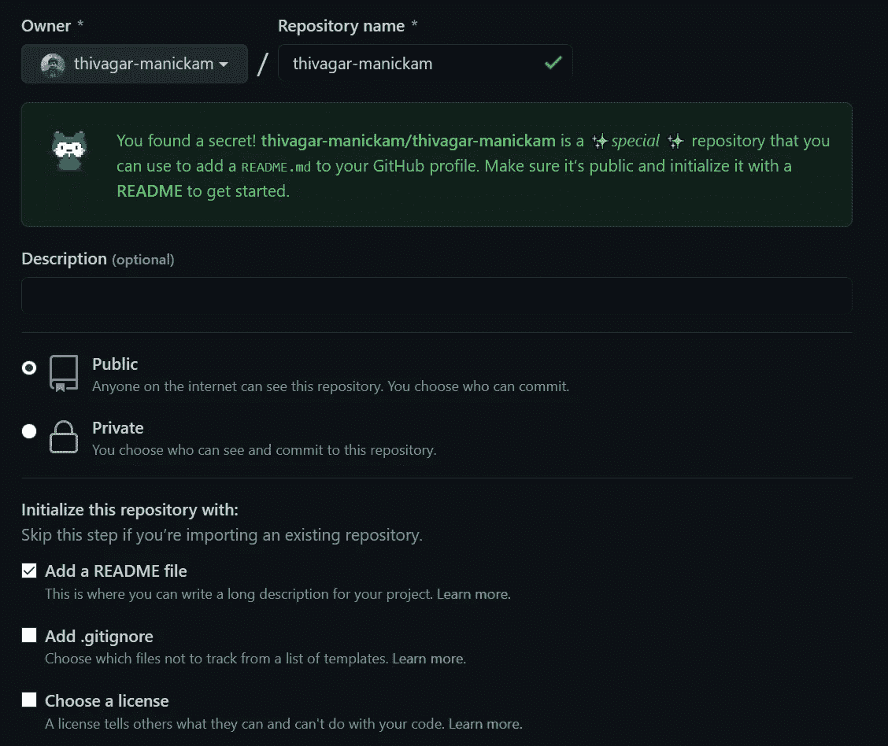
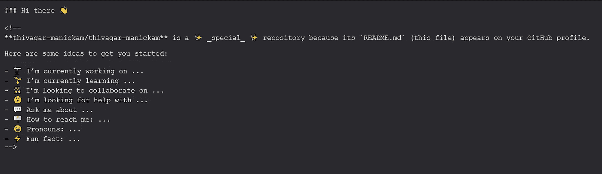
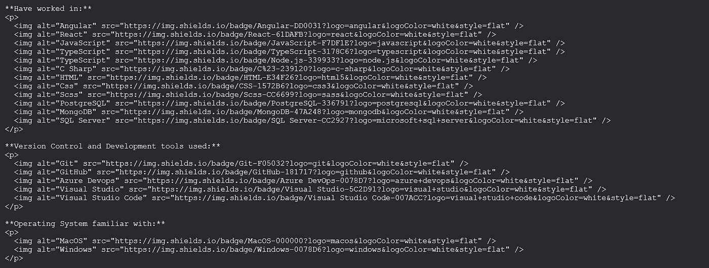
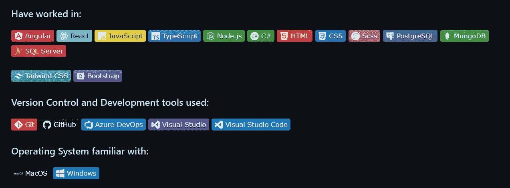
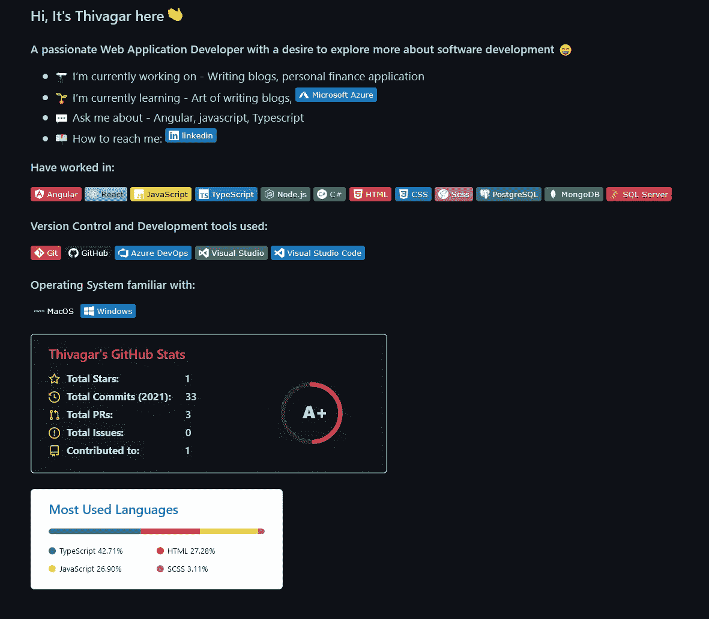

# 如何创建一个牛逼的 GitHub 个人资料页面？

> 原文：<https://javascript.plainenglish.io/how-to-create-a-awesome-github-profile-page-ca40d38dc3a8?source=collection_archive---------6----------------------->


Photo by [Roman Synkevych](https://unsplash.com/@synkevych?utm_source=medium&utm_medium=referral) on [Unsplash](https://unsplash.com?utm_source=medium&utm_medium=referral)

如果你碰巧是一名软件开发人员/工程师，你可能会知道在这里学习是一个永无止境的过程(类似于其他领域)。随着技术和工具的发展，我们必须不断更新自己的最新技术，才能在该领域长期生存。

在这个竞争激烈的世界里，光靠学习是不足以脱颖而出的。你需要能够向公众展示你的作品。还有什么能比 GitHub 更受欢迎来展示 case 你所有的作品和学习。作为一名开发人员，最近我明白了拥有一个好的 GitHub 个人资料的重要性，以及通过公共回购获得的免费资源对知识共享的重要性。

拥有一个好的 GitHub 个人资料页面是维护一个好的 GitHub 账户的重要部分。这将使你在 LinkedIn、Twitter 等平台上展示你所有的作品以及你的电子简历变得容易。

最近，我利用网上资源和阅读了一些媒体文章，完成了我的个人资料设置。我们将看到整个设置过程；还将共享一个公共回购和用于调整配置文件的备忘单。

# **创建存储库**

GitHub 有一个隐藏的特性，我们将利用它来创建个人资料页面。点击 GitHub 主页上的 new repository 按钮。在资源库名称中，输入您的 GitHub 名称。



GitHub new repository page

确保将其创建为公共存储库，并使用自述文件初始化存储库。

创建回购后，您将看到一个初始设置文件，如下所示:



Initial README.MD file

现在是时候开始定制了。

您可以使用 GitHub 文件编辑器定制 markdown，它提供了一个预览面板，或者使用任何您喜欢的代码/文本编辑器并提交这些更改。如果你熟悉 GitHub 使用的 markdown，可以在 GitHub 上查看这个 [**Markdown 小抄**](https://github.com/adam-p/markdown-here/wiki/Markdown-Cheatsheet) 。

让我们将个人资料页面分成 3 个部分:

*   **简介部分**
*   **使用的技术**
*   **捐款**

首先，我们将使用我们拥有的初始降价代码创建一个介绍部分。给出一个好的标题或引语来开始介绍部分。你也可以描述你目前在做什么，你的爱好是什么等等。，您可以参考 [**表情符号备忘单**](https://github.com/ikatyang/emoji-cheat-sheet) 获取您需要的任何表情符号的降价名称。

**使用的技术:**

在这一部分，添加你接触过的所有技术，你熟悉的开发环境，以及你想分享的任何其他与工作相关的东西。

我使用了技术徽章，使其在我的个人资料页面中脱颖而出。 [**简单图标**](https://simple-icons.github.io/simple-icons-website/) 网站有一个巨大的徽章集合，几乎包括所有可用的技术栈和公司。

将它们添加到您的个人资料中相当容易。

```

```

让我们来看看每个参数:

*   BadgeText —这是您可以为工卡指定的自定义名称。
*   颜色代码—这将是徽章的颜色。您可以以 Hexcode 格式给出自己的颜色，或者从简单图标中复制原始颜色代码(确保您删除了颜色代码前的#符号)
*   徽标—这将是简单图标站点中给出的徽标名称。如果工卡有两个名称，请使用-或+号将它们连接起来。例如，要获得 Microsoft Azure 徽标，请将徽标名称命名为“Microsoft-Azure”或“Microsoft+Azure”。
*   logo color——它可以是任何单一颜色或 hexcode 配色方案，但我建议保持白色，因为它给个人资料一个干净的外观。
*   样式—您可以选择四个可用值中的一个(塑料、扁平、扁平方形或徽章)。根据价值，徽章的外观和形状会有所不同。

徽章可以用来显示你的联系信息，如你的电子邮件帐户、LinkedIn、Twitter、脸书，甚至你的 YouTube 页面。

以下是我的专业详情部分的降价和最终结果片段:



Markdown code



Final output of the Technology used section

**投稿版块:**

作为个人资料页面的结尾，明智的做法是添加一些很酷的统计数据，让访问您页面的人可以快速查看您的工作以及您目前正在做的工作。GitHub 上有一个 [**很酷的 repo**](https://github.com/anuraghazra/github-readme-stats) ，可以帮助你为你的页面设置很棒的统计数据。我在我的页面上使用的两个统计数据是 GitHub 统计数据卡和顶级语言卡。

**如何添加 GitHub 统计卡:**

```
[](https://github.com/anuraghazra/github-readme-stats)
```

或者

```

```

我们可以使用查询参数定制卡片的统计数据和外观。让我们快速了解一下可用于定制的查询参数

*   用户名:在空白处输入您的 GitHub 用户名
*   隐藏:统计数据分组在 5 个标志下(星号、提交、prs、问题、贡献)。您可以通过将这些值设置为 hide query param 作为 ***& hide=stars、commits、prs、issues、contribs 来隐藏它们。***
*   count_private:设置为 True 时，除了公共回购贡献之外，还将计算私有回购中创建的提交和 PR 的数量
*   show_icons:这将显示数据分组的 5 个标志的图标。
*   主题:这是我最喜欢的。他们有很多可以利用的主题。只需从现有的主题库中选择一个名称，或者随意将您自己的主题添加到他们的回购中。

如何添加顶级语言卡:

```
[](https://github.com/anuraghazra/github-readme-stats)
```

或者

```

```

有不同的方式来定制卡片，如改变布局，增加或减少显示的语言数量(1-10)，隐藏任何语言或回复，以保留该统计卡

除了这两个，他们还有一个统计卡，显示你一周内最受欢迎的回复和花在每种编程语言上的时间。

添加所有这些元素后，页面的最终输出如下所示



Final image of the GitHub profile

是不是很酷？有不同的方法来定制你的页面，选项数不胜数。

你可以查看我的 [**个人资料页面**](https://github.com/thivagar-manickam) ，在那里我使用了本博客中提到的选项和建议。

*更多内容请看*[***plain English . io***](http://plainenglish.io/)