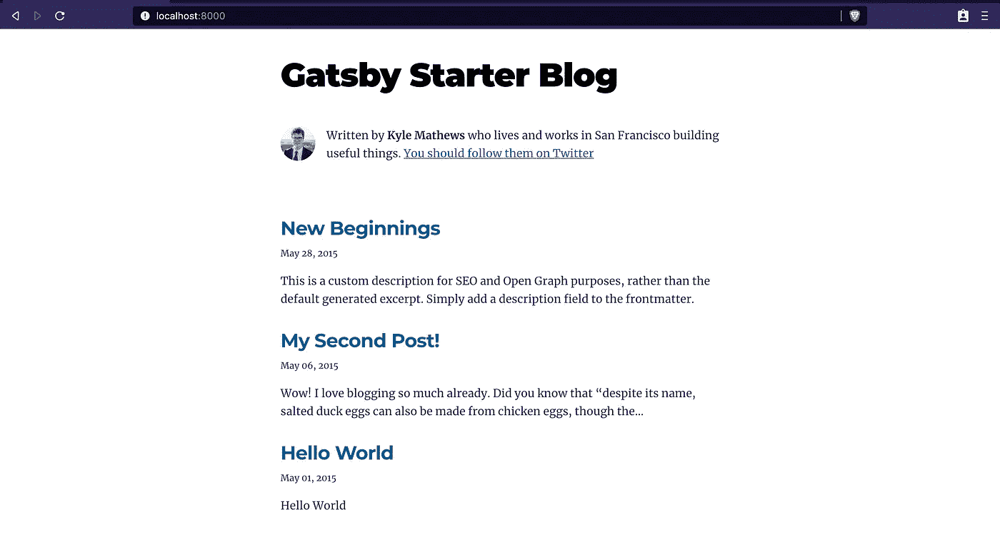
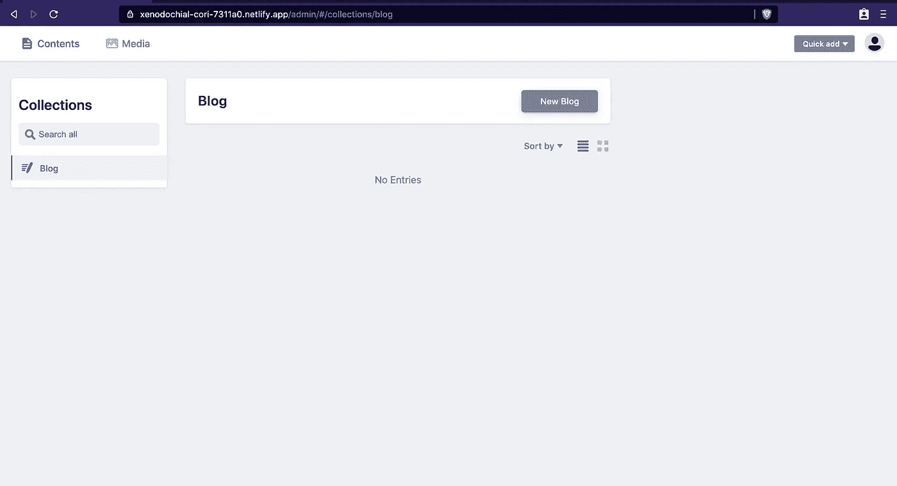
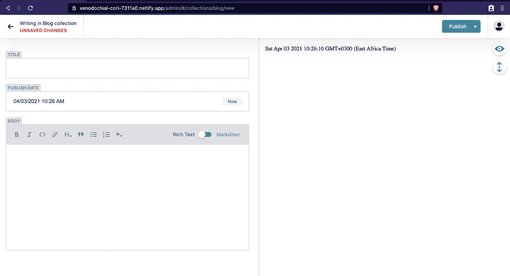

# 如何用 Gatsby 和 Netlify CMS 创建博客

> 原文：<https://javascript.plainenglish.io/how-to-create-a-blog-with-gatsby-and-netlify-cms-c8616861bd1b?source=collection_archive---------10----------------------->


[Christin Hume](https://unsplash.com/@christinhumephoto)

对于初涉开发的人来说，博客是一个有用的工具。这有助于你将所学内化。写作时，你可以研究一下能让你更清楚理解的主题。以后需要回到某个话题进行澄清的时候，博客可以作为参考。此外，你会成为一个更好的开发人员和沟通者。你也可以一边写作一边赚钱。

对于大多数开发者来说，从头开始开发一个博客可能是一项艰巨的任务。你可能需要一个登陆页面，文章页面，最重要的是，你需要一个内容管理系统来简化你的发布过程。考虑到这一点，大多数开发人员选择 medium 等其他媒介来创建他们的文章。然而，如果你希望对你的出版物有更多的控制权，那么开发你自己的博客将是正确的方法。

本指南旨在帮助你用 Gatsby 轻松建立博客，用最少的代码用 Netlify 添加内容管理系统。

## 安装盖茨比

> Gatsby 是一个基于 React 的开源框架，用于创建网站和应用。

简而言之，它可以用于构建静态网站，这些网站是渐进式 web 应用程序，遵循最新的 web 标准，并针对速度和安全性进行了优化。要了解更多关于盖茨比的事情，你可以参考这个[链接](https://www.mediacurrent.com/blog/what-is-gatsbyjs/#:~:text=GatsbyJS%20is%20a%20React%2Dbased,GraphQL%20powered%2C%20static%20site%20generator.&text=It%20uses%20powerful%20preconfiguration%20to,asset%20optimization%2C%20and%20data%20prefetching.)或者官方文件[这里](https://www.gatsbyjs.com/docs/)。

本指南假设您已经安装了 Node，并且具备 HTML、CSS 和 JavaScript 的基础知识。

使用下面的命令全局安装 Gatsby。

```
npm install -g gatsby-cli
```

要基本了解您将使用的一些命令，请运行下面的命令。

```
gatsby help
```

您应该在终端中看到以下输出。

```
Usage: gatsby <command> [***options***]

Commands:
    gatsby develop                      Start development server. Watches files, rebuilds, and hot reloads if something changes
gatsby build                        Build ***a*** Gatsby project.
    gatsby serve                        Serve previously built Gatsby site.
    gatsby info                         Get environment information for debugging and issue reporting
gatsby clean                        Wipe the local gatsby environment including built assets and cache
gatsby repl                         Get ***a node*** repl with ***context of*** Gatsby environment, see (https://www.gatsbyjs.com/docs/gatsby-repl/)
gatsby recipes [recipe]             [EXPERIMENTAL] Run ***a*** recipe
gatsby plugin <cmd> [plugins...]    Useful commands relating to Gatsby plugins
gatsby new [rootPath] [starter]     Create new Gatsby project.
    gatsby telemetry                    Enable or ***disable*** Gatsby anonymous analytics collection.
    gatsby ***options*** [cmd] [key] [***value***]  View or ***set*** your gatsby-cli configuration settings.
```

## 创建你的盖茨比网站

《盖茨比》的美妙之处在于，你实际上不必从头开始创建你的网站。有一些入门模板可以帮助你快速建立并运行你的网站。点击这里，查看数百个入门模板[。本指南将使用 gatsby-starter-blog 模板。你可以从](https://www.gatsbyjs.com/starters?)[这里](https://www.gatsbyjs.com/starters/gatsbyjs/gatsby-starter-blog/)看到一个现场演示。

继续运行下面的命令，从起始模板创建站点。

```
gatsby new my-blog https://github.com/gatsbyjs/gatsby-starter-blog
```

1.  gatsby **new** :创建新站点的命令。
2.  gatsby new **my-blog:** 你的站点/项目名称。
3.  盖茨比新我的博客[**https://github.com/gatsbyjs/gatsby-starter-blog**](https://github.com/gatsbyjs/gatsby-starter-blog)**:**包含我们的启动模板的回购的 URL。

完成后，导航到我的博客目录并运行下面的命令。

```
gatsby develop
```

上面的命令构建您的代码，并在 localhost:8000 启动一个开发服务器。导航到您的浏览器并尝试访问 [http://localhost:8000。](http://localhost:8000.)



恭喜你！您已经正式创建了您的新博客。

博客需要帖子。下一步是配置一个内容管理系统，允许您创建、删除或更新新帖子。

## 添加网络版 CMS

Netlify 是一个静态站点生成器的内容管理系统。它通过一个简单易用的界面简化了向网站添加内容的过程。更多详情，请点击查看文档[。](https://www.netlifycms.org/)

对于这一部分，您需要:

1.  Github 回购
2.  Netlify 帐户。

首先，您将使用下面的命令安装 Netlify cms 插件。

```
npm install netlify-cms-app gatsby-plugin-netlify-cms
```

下一步是注册你的插件。在您的项目目录中，用您最喜欢的文本编辑器打开 gatsby-config.js 文件，并将下面的代码添加到插件部分。

```
plugins: [`gatsby-plugin-netlify-cms`],
```

## 配置网络 CMS

最后一步是为您的 cms 添加配置。导航到项目文件中的**静态**目录，并添加一个新文件夹。将文件夹命名为 **admin。**在文件夹内创建一个新的 **config.yml 文件。**这是您的配置将驻留的位置。

您可以粘贴下面的配置。

```
backend:
  name: git-gateway
  branch: master

media_folder: static/assets
public_folder: /assets

collections:
  - name: "blog"
    label: "Blog"
    folder: "content/blog"
    create: true
    slug: "{{year}}-{{month}}-{{day}}-{{slug}}"
    fields:
      - {label: "Layout", name: "layout", widget: "hidden", default: "blog"}
      - {label: "Title", name: "title", widget: "string"}
      - {label: "Publish Date", name: "date", widget: "datetime"}
      - {label: "Body", name: "body", widget: "markdown"}
```

1.  **后端:**指定认证的后端协议。在本例中是 Github/Gitlab。还指定要使用的分支。
2.  **media_folder** :这是我们所有媒体将驻留的地方。
3.  **收藏**:描述你内容的结构。有各种方法可以做到这一点。上面的结构就是一个例子。一旦我们启动并运行 cms，您将能够看到这个结构。关于结构和部件的更多细节，你可以点击链接[这里](https://www.netlifycms.org/docs/widgets/)。

记得在静态文件夹中也创建您的**资产**和**内容**目录。

完成前面的步骤后，在 GitHub 上创建一个存储库，并推送您的代码。当我们整合 Netlify 时，这将派上用场。

## 与网络集成

对于这一步，请确保您有一个 Netlify 帐户。

1.  登录您的帐户并选择“**从 Git 新建网站”。选择你的网站的托管地址，如 Github。**
2.  如果您没有授权 Netlify 访问 Github，请按照提供的步骤操作。
3.  最后，选择你的回购。现在，使用提供的默认配置。
4.  部署完成后，您可以通过使用带有奇怪名称的绿色突出显示链接来访问您站点的 URL。

恭喜你！您的博客网站现已开通！你还没说完。

**访问 Netlify CMS**

要访问您博客的 cms，请在您网站的 URL 中添加 **'/admin'** 。但是，你会发现你并不能真正访问仪表盘。您需要配置管理员访问权限。

1.  转到**站点设置。**
2.  导航至**标识**选项卡。
3.  点击**启用身份。**

在**注册下，**你可以选择让你的站点**开放**或者**只接受邀请。**开放，允许任何访问您网站的人注册并登录到管理仪表板。邀请，发送电子邮件邀请用户访问您的管理控制面板。

最后，启用 Git 网关。这使得您添加的任何身份用户都可以使用 Netlify CMS 编辑站点内容，而无需 GitHub/GitLab 帐户或访问存储库。

1.  导航到**身份**选项卡下的**服务**。
2.  点击**启用 Git 网关。**

恭喜你！您已经成功地将您的站点与 Netlify cms 连接。

## 访问您的管理仪表板

你可以在'mysite.netlify.com/admin'访问你的网站。

应该会提示您注册或登录。只有在选择了**注册**下的**打开**时，这才是可能的。

如果您选择了仅邀请，您应该仍然在**注册**选项卡下邀请自己。邀请函将发送到所提供的电子邮件地址。

如果一切正常，您应该能够在浏览器中看到管理仪表板。



和你的新文章入口页。



添加一个新的 post 条目应该相对简单。发布后，会自动创建您的帖子，并将更改推送到您的存储库中。Netlify 会处理所有这些事情，几分钟后，你的帖子就会上线。

最后，在您的项目目录中，清理 **content** 文件夹下的文件和帖子。确保将您的更改也推送到您的回购协议中。

## 结论

如果你已经做到了这一步，祝贺你！您已经成功部署了自己的博客网站，并配有内容管理系统来帮助您发布文章。

就是这样！

*更多内容请看*[***plain English . io***](https://plainenglish.io/)