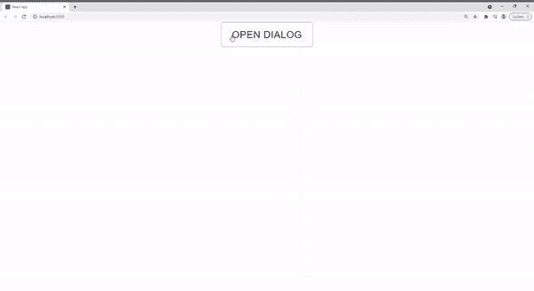
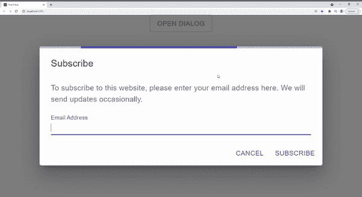

# 如何为你的 React 对话框创建一个内置的加载栏

> 原文：<https://javascript.plainenglish.io/how-to-create-a-built-in-loading-bar-for-your-react-dialog-4765f5aab383?source=collection_archive---------16----------------------->

## 创建带有加载进度条的可重用材料表单对话框的分步指南。


表单对话框非常常见和有用，尤其是当你不想把用户重定向到一个单独的页面时。一个常见的例子是时事通讯订阅对话框，无论用户是否选择订阅，他们都不应该返回到初始页面。

一个好的做法是，一旦用户向服务器提交请求，就触发一个加载栏。下面是我使用材料线性进展创建的一个示例:



但是如果在一个项目中有其他表单对话框需要以同样的方式运行呢？在本文中，我将一步一步地介绍如何创建一个可重用的自定义对话框，该对话框继承了 React Material 并扩展了功能以包括一个内置的加载栏。这样，我们在每个对话中都有一致的体验，没有任何冗余。

## 步骤 1:设置 React 项目

[创建 React App](https://create-react-app.dev/docs/getting-started/) 并安装 [React Material](https://material-ui.com/getting-started/installation/)

```
npx create-react-app react-material-dialog
npm install @material-ui/core
```

## 步骤 2:创建自定义对话框

让我们创建一个新的`Dialog.js`组件，它继承自材质对话框并使用一个`LinearProgress`组件。

我们将 LinearProgress 作为 MatDialog 中的第一个元素，后面是最终将由消费者传递的子元素。另外，`...props`应该进入 MatDialog 以访问所有组件的特性(比如 open，onClose，aria…)。

> **注意:**我之所以将材质对话框作为`MatDialog`导入，是为了避免与我们刚刚创建的自定义`dialog.js`产生命名冲突。

## 步骤 3:测试加载杆

在主`App.js`组件中，让我们尝试刚刚创建的自定义对话框，并检查加载栏是否显示。我们将使用来自 [React Material](https://material-ui.com/components/dialogs/) 的一个表单对话框示例，但不是从`@material-ui/core`导入对话框，而是导入自定义对话框`./Dialog`



## 步骤 4:创建有条件加载

正如我们在上面看到的，当前组件并没有像加载栏一直显示的那样完整。

我们可以通过添加一个新的可由消费者传递的`loading`道具来轻松调整这一点。它将指示何时触发加载:

现在我们已经准备好了完整的组件，它接受了一个`loading` prop，让我们在提交表单时触发加载栏。我们将包括一个超时功能来模拟 API 调用，然后关闭对话框:


你就完事了！现在，任何时候你有一个表单对话框，你需要做的就是使用新的自定义对话框并传递给它`loading`属性。

你可以在这里访问[的全部储存库。我希望你喜欢从这篇文章中学习，如果你有任何问题，请在下面留下评论。](https://github.com/muhimasri/react-material-loading-dialog)

再见了。

更多相关文章，你可以[访问我的网站](https://muhimasri.com/)或[注册获取最新文章和更新](https://muhimasri.com/signup/)。

*原载于 2021 年 4 月 26 日 https://muhimasri.com**的* [*。*](https://muhimasri.com/blogs/how-to-create-a-built-in-loading-bar-for-your-react-dialog/)

[*更多内容尽在 plainenglish.io*](http://plainenglish.io/)