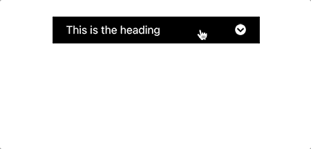
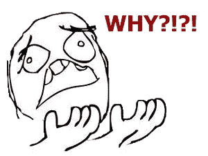
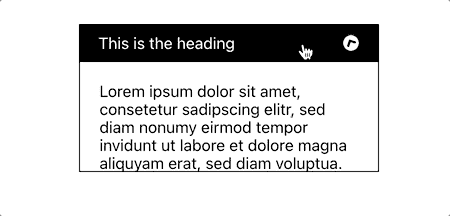

# 如何在 React 中创建带有平滑动画的可折叠面板

> 原文：<https://javascript.plainenglish.io/how-to-create-a-collapsable-panel-with-smooth-animations-in-react-bb10c22edb5e?source=collection_archive---------3----------------------->

collapsable panel 是一个非常流行的 UI 组件，它已经包含在许多 UI 库中，所以当您需要使用它时，找到它并不是那么困难。但作为一个好奇的开发者，有时我只想重新发明轮子，这一次，它是可折叠的面板。

可折叠面板可以折叠或展开，我们可以使用名为' ***isCollapsed*** '的 React 状态来跟踪这个 UI 状态信息，并相应地呈现 UI，就像下面的代码一样:

它非常简单，任何具有 React 基础知识的人都可以构建它。但是，当您在项目中使用这个基本的可折叠面板组件时，您会发现它在折叠状态和展开状态之间切换，没有任何动画。

每个人都喜欢流畅的动画，为什么我们不多花一点时间来实现它呢？

说到在 React 中实现动画，我的首选库是[***React Spring***](https://github.com/pmndrs/react-spring)，因为:

*   它功能强大且易于使用
*   它比大多数 React 动画库具有更好的性能，因为它应用动画而不依赖 React 逐帧渲染更新

让我们用 React Spring 重构之前的代码，然后我将讨论重构后的代码中的变化。

1.  我们进口反动弹簧
2.  我们移除了***ToggleButtonWrapper***样式的组件，因为它只包含“transform”属性，我们将使用 React Spring 来制作动画
3.  我们指定 ***PanelContent*** 是 ***animated.div*** 的一个样式化组件，并且我们从其中移除了“高度”CSS 属性，因为该属性稍后将由 React Spring 制作动画
4.  我们为切换按钮包装和面板内容创建动画样式
5.  我们将动画样式应用于切换按钮包装
6.  我们将动画样式应用于面板内容

现在让我们看看我们的可折叠面板在现实生活中是如何工作的:

正如您所看到的，切换按钮现在有一个漂亮的旋转动画，但是内容面板仍然在折叠和展开状态之间跳跃，没有任何动画。为什么？

原来，用 ***useSpring、***we**不能动画化'****auto****' CSS 属性，相反，我们需要给它一个精确的值。但是，我们如何获得内容面板的高度值，因为不同的面板可以有不同的内容，高度也可以不同？**

*幸运的是，我们有 [***【反应-使用-测量】***](https://github.com/pmndrs/react-use-measure) 前来救援。这是一个小工具，将测量边界(例如宽度，高度，顶部，左侧)的看法，我们参考。让我们把它引入到我们的代码中，然后看一下变化。*

1.  *我们引入反应-使用-测量*
2.  *我们使用 ***useMeasure()*** 钩子来获取引用和被引用组件的边界*
3.  *我们从***use measure()****钩子返回的*【界限】* *对象中得到***PanelContentInner***组件的高度，然后我们用这个高度作为****panel content***组件 **的高度****
4.  我们将包含内容的***PanelContentInner***组件设置为引用组件

感谢您的关注，让我们看看我们的最终产品:)

如果你觉得这篇文章有帮助，请访问[我的 YouTube 频道](https://www.youtube.com/channel/UCoQ7C3JajfBOIjp7yWDj8Yg)，在那里你也可以找到一些有用的编程技巧。