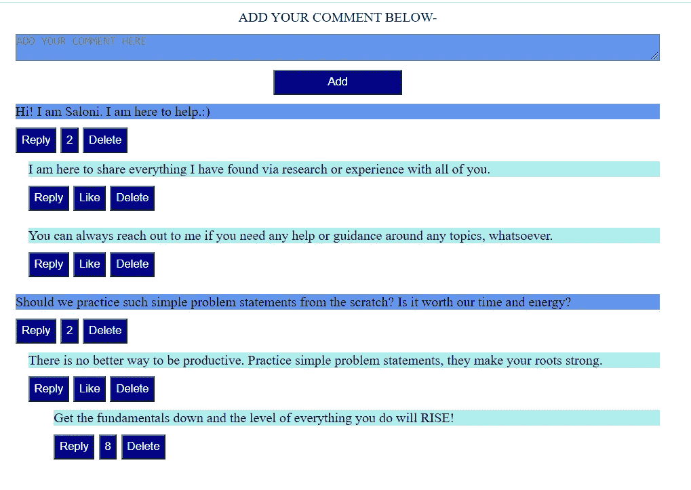

# 如何使用 HTML 和普通 JavaScript 创建评论区？

> 原文：<https://javascript.plainenglish.io/how-to-create-a-comment-section-using-html-and-vanilla-js-aa6b6a53b9cf?source=collection_archive---------1----------------------->


Photo by [Brett Jordan](https://unsplash.com/@brett_jordan?utm_source=medium&utm_medium=referral) on [Unsplash](https://unsplash.com?utm_source=medium&utm_medium=referral)

新的一天，新的问题陈述！今天我们将使用纯 JavaScript 和 HTML 创建一个评论部分。许多公司如瑞士、优步、Flipkart、Ola、Cred 等。使用机器编码轮作为他们的主要过滤器，以消除候选人。任何机器编码都不允许你使用依赖项或库，比如 React、Lodash、jQuery、Bootstrap 等等。因此，你应该使用普通的 JavaScript 和 HTML 来解决一些问题，以提高你的速度，获得这些行的舒适性，并最终赢得这一轮比赛。

正如我常说的，把你的问题分成几个子集，然后逐一解决每个子集。

**子集—**

1.  页面总是在顶部有一个静态文本区和一个允许用户添加评论的添加按钮。
2.  添加的每条评论都会有回复、赞和删除按钮。
3.  回复按钮将在父评论下启动一个新的文本区，允许用户添加回复或取消添加。
4.  一个喜欢的按钮会不断增加每次点击相应评论的喜欢数。
5.  删除按钮将删除整个评论链。
6.  评论可以像树状结构一样被链接，其中每个子评论将在父评论的左边对齐一些像素。
7.  添加的评论应该在页面重新加载时保持不变——这是一个改进，如果您有时间，可以在最后进行处理。

在您进入代码之前，后退几分钟，看看您的需求并评估哪些部分可以使用相同的代码。记住这句话——“最好的代码就是没有代码”。不要从字面上理解。这个短语试图告诉我们，一个人的代码的质量是由它的可重用性和紧凑性决定的。我们希望提供高质量的产品，不是吗？

我们可以通过查看我们的需求来评估的一个因素是，自始至终创建的注释看起来都是相似的，与子注释的左边距不同。因此，我们可以有一个可重用的函数来处理评论的创建。

让我们一起编码吧！

# 顶部有一个静态文本区和一个添加评论的按钮—

```
***<div class="container">
    <label for="newComment" name="newComment">Add your comment below-</label>
    <textarea id="newComment"></textarea>
    <button id="addComments">Add Comment</button>
    <div id="allComments"></div>
</div>***
```

我们通过在页面顶部添加一个接受新评论的文本区域和一个在我们的部分添加新评论的添加按钮来开始代码。

我还创建了一个 div — `**allComments**`,我计划在其中添加所有添加到页面的评论。

# 动态添加评论—

```
***const commentContainer = document.getElementById('allComments');
document.getElementById('addComments').addEventListener('click', function (ev) {
   addComment(ev);
});

function addComment(ev) {
    let commentText, wrapDiv;
    const textBox = document.createElement('div');
    const replyButton = document.createElement('button');
    replyButton.className = 'reply';
    replyButton.innerHTML = 'Reply';
    const likeButton = document.createElement('button');
    likeButton.innerHTML = 'Like';
    likeButton.className = 'likeComment';
    const deleteButton = document.createElement('button');
    deleteButton.innerHTML = 'Delete';
    deleteButton.className = 'deleteComment';
    const wrapDiv = document.createElement('div');
    wrapDiv.className = 'wrapper';
    wrapDiv.style.marginLeft = 0;
    commentText = document.getElementById('newComment').value;
    document.getElementById('newComment').value = '';
    textBox.innerHTML = commentText;
    wrapDiv.append(textBox, replyButton, likeButton, deleteButton);
    commentContainer.appendChild(wrapDiv);

}***
```

在上面的代码中，我们首先在 Add Comments 按钮上添加一个事件监听器。监听器调用`**addComment**` 函数。用自我解释的名称来定义您的函数是一个很好的做法。总是增加代码的可读性。

在`**addComment**` 函数中，我们正在创建评论，稍后会添加到我们的页面中。我们在 textarea 中选取上面输入的注释文本，将其附加到我们新创建的 div 中。我们还为新创建的评论创建了回复、喜欢和删除按钮。我们将所有的元素包装在一个新的 div 中，然后追加到`**allComments**` div 中。此外，可以这样假设，一旦新的注释被添加到下面的部分，文本区将再次为空，以便输入新的注释。因此，我们删除了上面文本区中输入的文本。

# 处理回复、喜欢和删除按钮—

```
***function hasClass(elem, className) {
    return elem.className.split(' ').indexOf(className) > -1;
}******document.getElementById('allComments').addEventListener('click', function (e) {
    if (hasClass(e.target, 'reply')) {
        const parentDiv = e.target.parentElement;
        const wrapDiv = document.createElement('div');
        wrapDiv.style.marginLeft = (Number.parseInt(parentDiv.style.marginLeft) + 15).toString() + 'px';
        wrapDiv.className = 'wrapper';
        const textArea = document.createElement('textarea');
        textArea.style.marginRight = '20px';
        const addButton = document.createElement('button');
        addButton.className = 'addReply';
        addButton.innerHTML = 'Add';
        const cancelButton = document.createElement('button');
        cancelButton.innerHTML = 'Cancel';
        cancelButton.className='cancelReply';
        wrapDiv.append(textArea, addButton, cancelButton);
        parentDiv.appendChild(wrapDiv);
    } else if(hasClass(e.target, 'addReply')) {
        addComment(e);
    } else if(hasClass(e.target, 'likeComment')) {
         const likeBtnValue = e.target.innerHTML;
         e.target.innerHTML = likeBtnValue !== 'Like' ? Number.parseInt(likeBtnValue) + 1 : 1;
    } else if(hasClass(e.target, 'cancelReply')) {
        e.target.parentElement.innerHTML = '';
    } else if(hasClass(e.target, 'deleteComment')) {
        e.target.parentElement.remove();
    }
});***
```

一种模块化的方式，在点击回复、喜欢和删除按钮时为每个评论添加事件监听器。

定义事件来捕捉主`**allcomments**` div 中的任何点击。一旦事件被捕获，您可以通过检查附加到该元素的类来找到触发事件的元素。除了采用这种方法，您还可以在`**addComments**` 函数中创建事件的地方为回复、删除和喜欢按钮单独定义事件。但是，当我们可以从一个事件处理程序中实现相同的行为时，我们真的需要一堆事件处理程序吗？

在点击添加回复按钮时，我再次使用 addComments 功能。但是，我们必须在函数中处理这个问题，因为目前它只知道如何将注释添加到主注释容器中。

```
***function addComment(ev) {
    let commentText, wrapDiv;
    const textBox = document.createElement('div');
    const replyButton = document.createElement('button');
    replyButton.className = 'reply';
    replyButton.innerHTML = 'Reply';
    const likeButton = document.createElement('button');
    likeButton.innerHTML = 'Like';
    likeButton.className = 'likeComment';
    const deleteButton = document.createElement('button');
    deleteButton.innerHTML = 'Delete';
    deleteButton.className = 'deleteComment';
    if(hasClass(ev.target.parentElement, 'container')) {
        const wrapDiv = document.createElement('div');
        wrapDiv.className = 'wrapper';
        wrapDiv.style.marginLeft = 0;
        commentText = document.getElementById('comment').value;
        document.getElementById('comment').value = '';
        textBox.innerHTML = commentText;
        wrapDiv.append(textBox, replyButton, likeButton, deleteButton);
        commentContainer.appendChild(wrapDiv);
    } else {
        wrapDiv = ev.target.parentElement;
        commentText = ev.target.parentElement.firstElementChild.value;
        textBox.innerHTML = commentText;
        wrapDiv.innerHTML = '';
        wrapDiv.append(textBox, replyButton, likeButton, deleteButton);
    }
  }***
```

这就是我们修改后的`**addComments()**`函数的样子。现在它负责向主容器或注释链添加注释。而且可以重复使用！

# 重新加载评论—

我们的评论区已经准备好了。只剩下最后一点需要补充。评论部分必须在页面刷新时维护，因为评论不仅仅与会话相关，而是永远相关，直到被删除。

我们将使用浏览器 localStorage 的强大功能来实现这一点。localStorage 保存其数据，直到被手动清除或删除。

我们可以以最适合我们需求的任何格式存储数据。在上面的例子中，我们可以直接存储整个模板。重新加载整个部分的简单方法。

```
***function setOnLocalStorage () {
    localStorage.setItem('template', document.getElementById('allComments').innerHTML);
}***
```

上面的函数将使用`***allComments***` div 的 innerHTML 设置 localStorage 中的`***template***` 键。每当您向该部分添加新的评论、添加对评论的回复(如评论)或删除评论时，都应该调用该函数。

这就对了。你的个性化评论区已经准备好了，你可以生活在你自己的虚拟世界里了。😆



但是不要停下来！你带了一个向导，他让你的旅程轻松了许多。现在是时候让你独自行走，探索风景，获得更深刻的见解了。

我有一些任务给你，你可以自己完成，对自己的技能更有信心。

1.  将 username 属性添加到 comments 中(它保存了进行评论的用户的一些模拟名称)。
2.  like 按钮目前有一个简单的实现。它应该显示 1 喜欢，2 喜欢等，而不是 1，2，3 喜欢的增量。
3.  允许用户编辑现有评论。
4.  为每个评论添加一个发布属性，显示上次编辑/发布的日期和时间。
5.  一种扩展和折叠父评论的方法(通过手风琴)或者任何可能的更好的方法。
6.  如果目标文本区为空，则禁用添加/回复按钮，这将限制用户添加空评论。

一旦您完成了将这些特性添加到您的项目中，您一定会对您对我们这里所采用的方法的理解更有信心。

坚持练习，自己感受不同。:)

完整代码，请访问 GitHub 链接—【https://github.com/SaloniMishra/Comment-section 

*更多内容尽在*[***plain English . io***](http://plainenglish.io/)