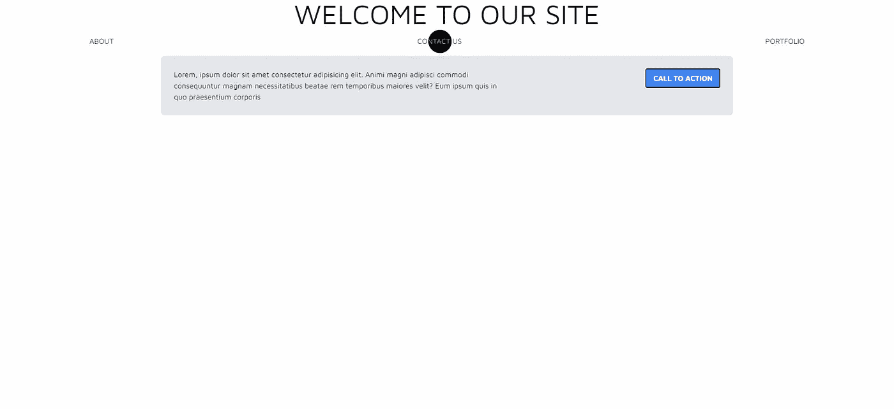
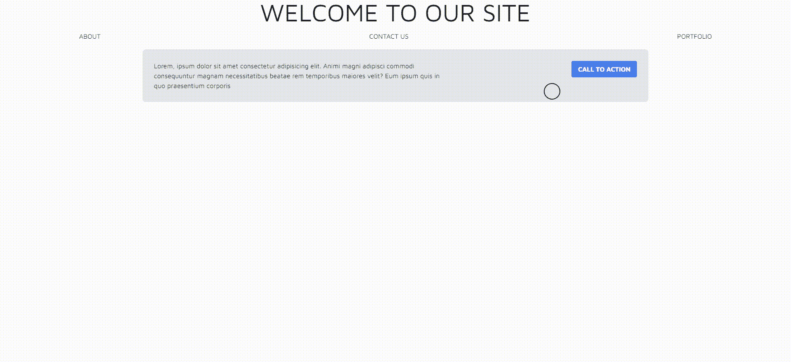
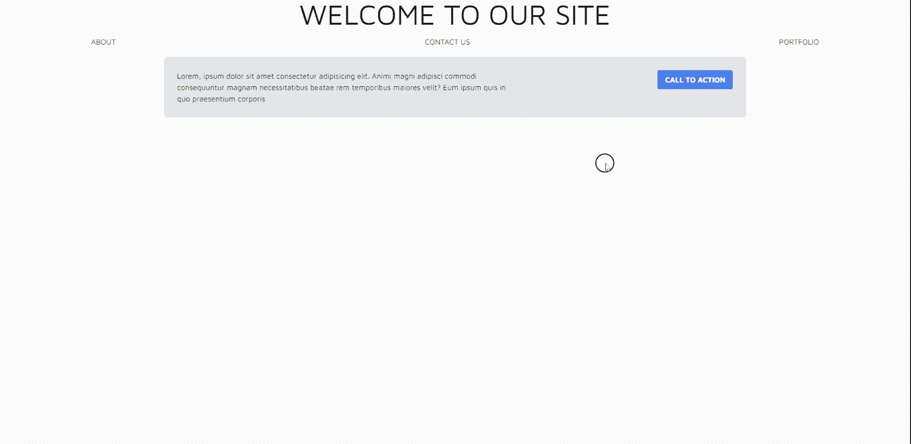
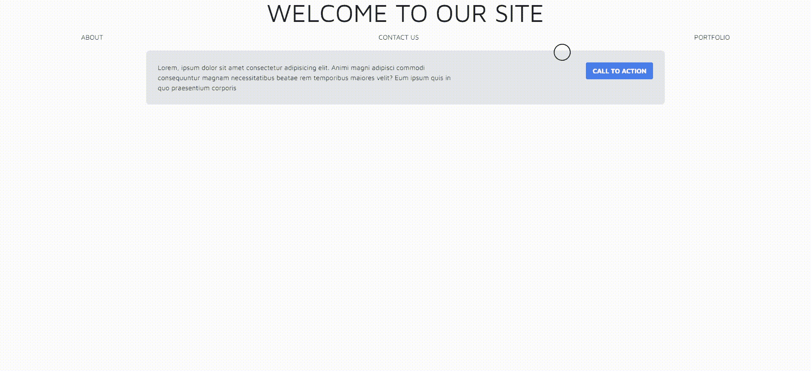
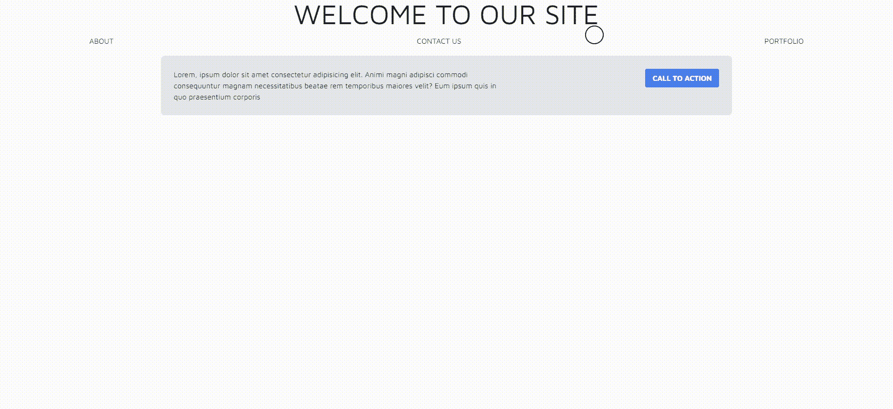
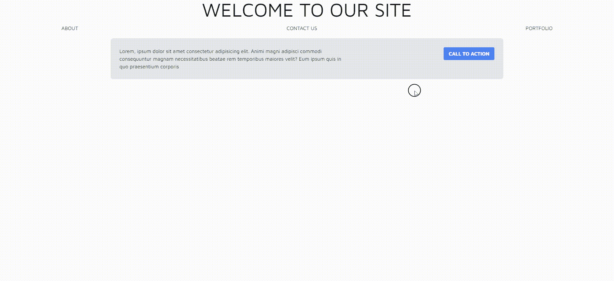

# 如何在 React 中创建自定义 CSS 指针

> 原文：<https://javascript.plainenglish.io/how-to-create-a-custom-css-pointer-in-react-2d4684215564?source=collection_archive---------1----------------------->



现代网站的一个最新趋势(至少在几年前，TBH)是自定义 CSS 指针，通常，这是通过用其他东西代替箭头(和链接的手)指针来实现的，通常，当悬停链接和点击时，会有某种动画效果的圆圈。

即使看起来很简单，替换指针也是一个棘手的问题，尤其是在 React 中处理它的时候。

## 指针替换在理论上如何工作

*   隐藏默认指针(即使一些网站保持它可见)
*   创建一个新指针(通常是一个新指针在里面的 div 或者是指针本身)并定位它*绝对*
*   不断监视屏幕上的鼠标位置，并相应地移动新指针
*   不断地检查我们是否在一个链接、一个按钮或者其他我们想要监控的东西上，并最终动画化指针到它的新状态
*   如果鼠标离开页面，隐藏新指针(比如进入浏览器标签或其他地方)
*   监控点击以最终激活或改变指针状态/外观
*   离开页面时停止监听上述事件(在 React 中尤其如此)
*   如果我们使用手机，请忽略所有这些

这需要大量的检查，并且很容易导致内存饱和和随之而来的延迟，不断地跟踪鼠标和更新一个 *div* 位置会填满内存，特别是在 React 中，如果事情一直在无限循环中渲染

## 我们要建造什么

我们正在用链接和按钮的悬停动画，点击的反馈动画来编码基本的 CSS 指针替换。指针将主要由钩子处理，它将存在于自己的组件中，因此可以在需要它的页面中导入。



## 先决条件

在开始之前，你应该对 React 如何工作有一个基本的了解，尤其是钩子，因为它的大部分逻辑都在它自己的 useEffect 钩子中。你还需要对 CSS 有一个基本的了解，所有的光标外观都将由 CSS 处理。了解一下 Tailwind CSS 是如何工作的也是有益的，一些样式会用到它。阅读以下指南，了解如何在 React 项目中安装并开始使用 Tailwind CSS

[](https://tailwindcss.com/docs/guides/create-react-app) [## 用 Create React App - Tailwind CSS 安装 Tailwind CSS

### 如果您还没有建立一个 Create React 应用程序项目，请从创建一个新的项目开始。最常见的方法是…

tailwindcss.com](https://tailwindcss.com/docs/guides/create-react-app) 

我还假设你已经创建了一个(空的)React 项目，要么使用普通 React，要么使用像 [Gatsby](https://www.gatsbyjs.com/) 或 [Next](https://nextjs.org/) 这样的框架

# 编写代码

## 索引页

一旦您有了空的 React 项目，我们就可以开始创建一个简单的主页，稍后我们将在其中附加光标组件。这个页面非常简单，它只包含几个无处可去的链接(使用 *<、一个>…</一个>* 标签)和一个按钮(使用 *<按钮>…</按钮>* 标签)，因此，一旦光标就位，我们就可以测试它与各种类型链接的交互性。这个页面是用 Tailwind CSS 设计的，但是这是完全可选的。

## 光标组件

在你的 *src* 文件夹下，新建一个文件夹，命名为 *components* ，在这个文件夹下新建一个 js 文件，命名为 Cursor.js

现在，我们可以在索引页面中导入该组件，并在页面中呈现光标组件:

```
import Cursor from '../components/Cursor';
...
return (
   <>
     <Cursor />
     <main className="container mx-auto px-2 md:px-0">
     ...
     </main>
   </>
)
...
```

此时，如果您打开索引页面，应该不会显示任何不同，我们需要开始设计代表光标的 *div* 的样式。
在你的 css 文件中添加以下内容:

这将转换您的。光标 div 在一个 40px 的圆中，有 2px 的边框和固定的位置。
我们现在要跟踪鼠标在页面上的移动，并将。光标移动到鼠标。
返回 Cursor.js，修改如下:

我们开始定义一个跟踪位置的 useState 钩子，然后当组件加载时，我们使用 useEffect 钩子将一个 mousemove 事件侦听器附加到文档，mousemove 回调将不断更新位置状态，这个状态用在。光标 div 相应地定位它。如果你现在访问这个页面，你应该会看到一个圆圈附在你的鼠标光标上，跟随它，但是在链接和按钮上没有交互，而且如果你把鼠标移到文档之外，这个圆圈将会停留在边框上



## 当我们离开文档时处理光标

按照光标逻辑，当我们离开文档时，我们应该从文档中移除/隐藏圆形光标(但我见过没有这样做的网站，所以除了逻辑之外，这是个人喜好的问题)。
为了实现这一点，我们将添加几个事件监听器来处理相对于文档的鼠标进入和鼠标离开，通过它的回调，我们可以更新一个新的状态钩子，该钩子通过类名定义光标可见性。先说 modyfing Cursor.js:

基于隐藏状态，我们将类( *c — hidden* )添加到我们的。光标 div 状态由我们添加的新事件侦听器处理。现在我们简单地将这个类添加到 CSS 中来隐藏 div(我们使用 transition 来显示不透明度)，我们还隐藏了页面中的标准指针:

```
html,body {
  cursor: none
}html *,body * {
  cursor: none;
}.c--hidden {
   opacity: 0;
}.cursor {
   ...
   transition: all 100ms ease;
   transition-property: opacity;
}
```

如果您现在运行页面，结果应该与之前类似，但是这一次当您将鼠标移出文档时，圆形指针将淡出



## 点击反馈

我们现在想为用户添加一个点击页面时的反馈；这项工作和以前一样，我们添加了两个新的侦听器(mouseup 和 mousedow ),我们将它们的回调“链接”到一个状态，然后我们使用该状态来添加/删除标识点击的类

使用点击状态，我们添加/删除一个 c-click 类。光标 div 点击反馈并不依赖于链接(尽管它也作用于链接)，而是在页面被点击时简单地给用户一个视觉反馈。css 现在变得个性化了，我决定减小圆形的大小，每次点击都用黑色填充(并在过渡列表中添加变换和背景色样式)

```
.c--clicked {
   transform: translate(-50%, -50%) scale(0.5);
   background-color: #121212;
}.cursor {
   ...
   transition: all 100ms ease;
   transition-property: opacity, background-color, transform;
}
```



## 悬停链接和按钮

你肯定想在用户处于“交互”状态时向他们提供反馈(通常是链接和按钮，但也可以扩展到其他 DOM 对象)，它仍然与事件监听器和状态挂钩一起工作，但这一次监听器被附加到 DOM 元素，在我们的例子中是 *a* 和*按钮*，但不同的链接有不同的行为会更细粒度。

我们遍历页面的所有链接和按钮，并且在每个元素上附加一个 mousover/mouseout 事件，该事件将回调以设置一个状态钩子来启用/禁用一个类。c-hover 类将简单地增加光标的大小:

```
.cursor--link-hovered {
   transform: translate(-50%, -50%) scale(1.25);
}
```



## 最后润色

很少有东西可以改进这个组件的功能；首先，我们可以检查我们是否在移动设备上，你可以使用一个库(如`react-device-detect`)或使用`navigator.userAgent`手动检查，如果你在移动设备上，你可以跳过事件监听器的设置和返回。

你可以在视觉上用更多的动画和更多的样式来改进光标，也许添加一个 svg 并在链接悬停时使其动画化，你也可以在链接上设置一个随机的动画(从动画列表中),当你点击某个东西时，你可以根据你所在的链接启用动画，等等。