# 如何在 React 中创建自定义光标—第 1 部分

> 原文：<https://javascript.plainenglish.io/how-to-create-a-custom-cursor-in-react-272314682285?source=collection_archive---------3----------------------->


How to create a custom cursor in React without any module

写这段代码时没有使用任何模块。

如果你正在寻找源代码，那么它可以在视频中找到。

请观看此视频以示支持。

# 基本 HTML —光标的 CSS 布局

我们将开始为光标点和光标轮廓编写 **JSX(HTML)** 。

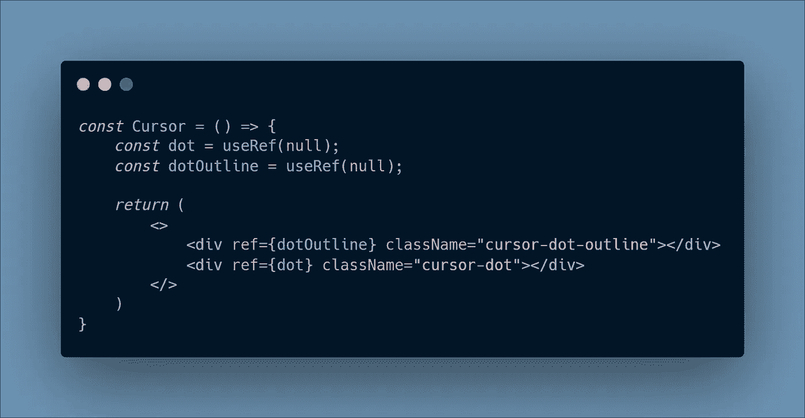

Cursor HTML/JSX (cursor.jsx)

我们还为这些元素创建了`ref`,这样我们可以在以后访问 DOM 元素。

接下来，我们将为这些元素添加 **CSS** 样式。

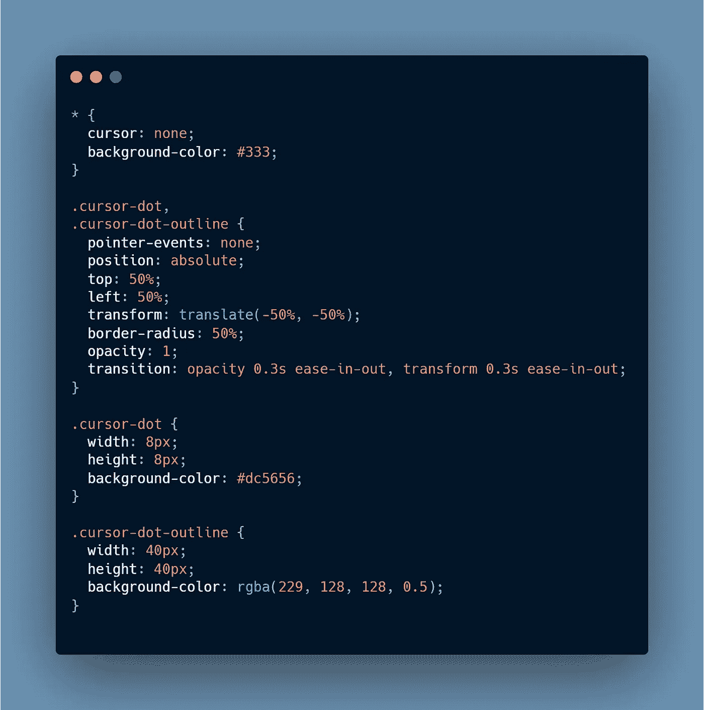

Cursor CSS

`cursor: none`被添加到通用选择器`*`中，因为我们想要隐藏默认光标。

`pointer-events: none`这样这个元素就不会成为指针事件的目标。 [MDN 指针事件](https://developer.mozilla.org/en-US/docs/Web/CSS/pointer-events)

```
position: absolute;
top: 50%;
left: 50%;
transform: translate(-50%, -50%);
```

这个代码片段用于将两个元素都移动到中间。

使用`opacity: 1;`是为了稍后我们可以根据`mouseenter`和`mouseleave`事件隐藏和显示我们的光标。这就是为什么`transition`也被用在`opacity`属性上。

使用`transform`上的过渡，以便我们可以根据一些鼠标事件(很快就会知道是哪一个)来增加和减少点和轮廓的大小。

它看起来会像这样。

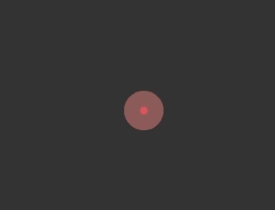

The basic layout of the cursor

# 添加图像以显示光标悬停效果

我们将添加一些图像来显示平滑的光标悬停过渡。

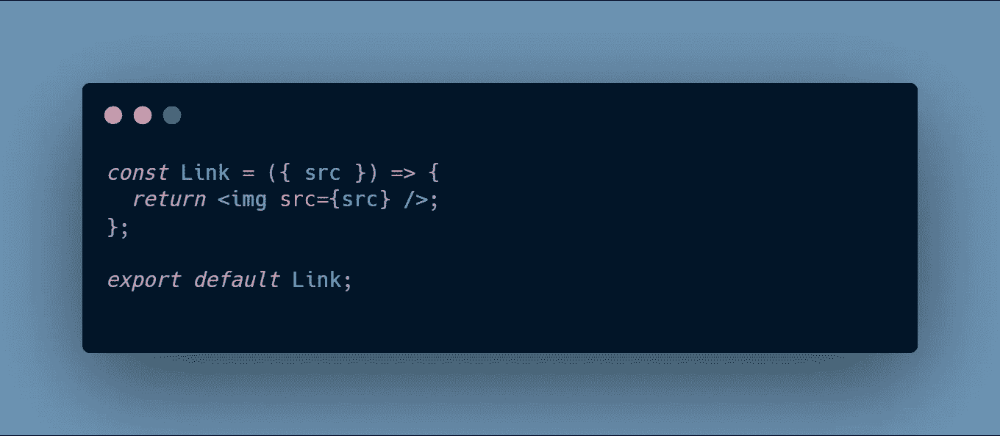

Link.jsx

创建了这个`<Link />`组件，可以重用它来显示图像。

现在，我们需要将它导入到我们的`<Cursor />`组件中，并传递图像。

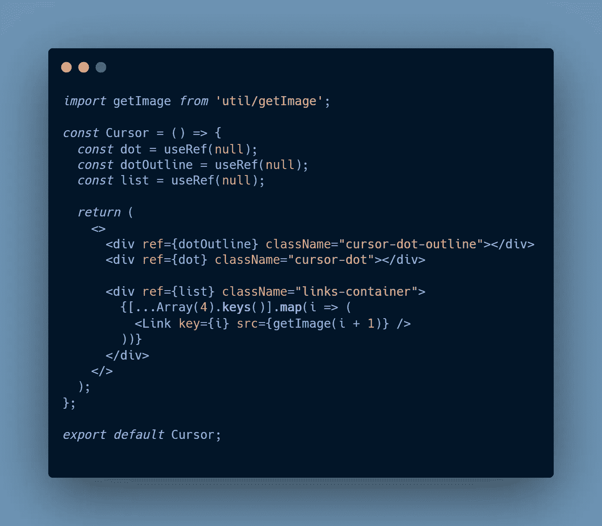

Updated cursor.jsx

我们将`ref`添加到它的容器中，因为我们将鼠标事件添加到所有这些图像中。

`getImage`是一个 **util** 函数，我创建它是为了根据 **map** 函数提供的**索引**值获取图像。您可以在源代码中找到该函数(没有添加任何图像，因为它不是那么重要。抱歉`getImage`功能！).

**奖励积分**

*   **导入语句的路径**

为了使用它，我使用了`jsconfig.json`。您可以将该文件添加到项目的根目录下，并在`compilerOptions`中添加`baseUrl`属性。

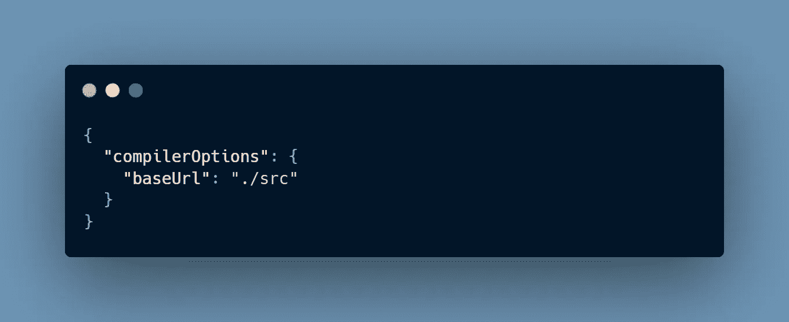

jsconfig.json

*   **`**[...Array(4).keys()]**`**代码片段****

**`Array(4)`将创建一个大小为 4 的空数组。**

**`**keys()**`方法返回一个新的**数组迭代器**对象，它包含数组中每个索引的键。**

**展开数组将得到一个数组— `[0, 1, 2, 3]`**

**好吧，让我们回到刚才的话题😅。**

**最后一件事是给我们的图片容器添加一些样式。**

**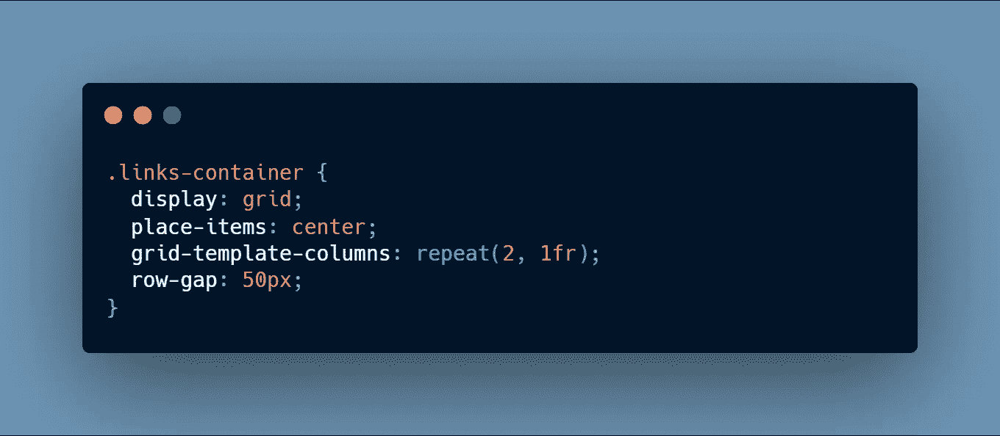**

**现在最终的结果会是这样的—**

**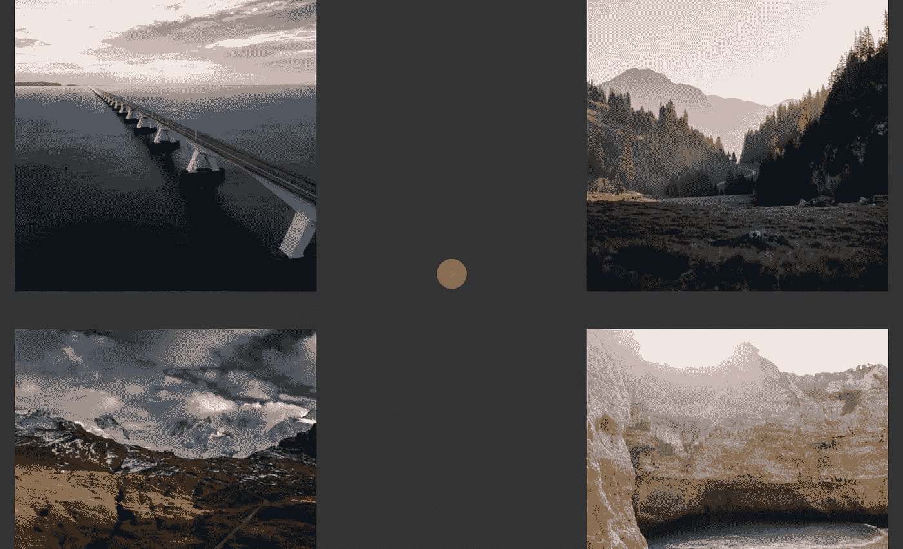**

# **给我们的光标添加动画**

**最后，是时候给我们的光标添加动画了(可怜的光标孤零零地坐在屏幕中央)。**

****添加参考变量****

**我们需要添加一些更多的`refs`到我们的**光标**组件，这样我们就可以更新更改。**

**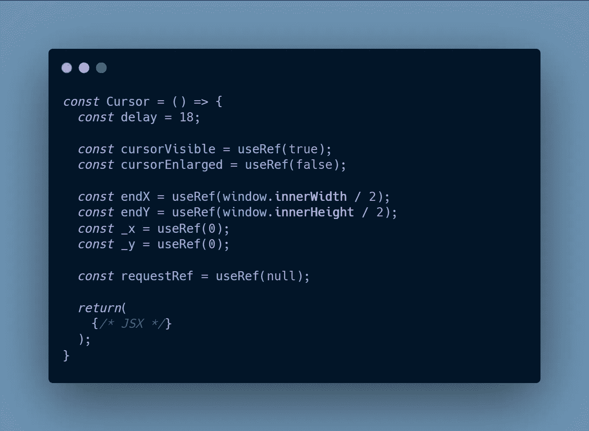**

****延迟**将被用作一个因子，通过它我们将改变光标轮廓跟随光标点的快慢。数字越大意味着越慢，反之亦然。**

****光标可见**将帮助切换光标的可见性。**

**光标变大的将有助于切换光标的大小。**

****endX** 是光标点的 X 位置。我们将在这个变量中保存点的 X 位置。它用`window.innerWidth/2`初始化，因为那是 X 轴的中点。**

****endY** 是光标点的 Y 轴位置。我们将在这个变量中保存点的 Y 位置。概念与 **endX** 相同。**

****_x** 是光标轮廓的 X 位置。我们将在这个变量中保存轮廓的 X 位置。它被初始化为 0，因为我们想显示运动动画。(从屏幕左上角到中点的轮廓，在应用程序开始时该点出现)。**

****_y** 是光标轮廓的 Y 位置。我们将在这个变量中保存轮廓的 Y 位置。概念与 **_x** 相同。**

****requestRef** 将保存从一个重要函数返回的 ID(当我们向光标轮廓添加动画时将会看到它)。**

****增加光标切换功能****

**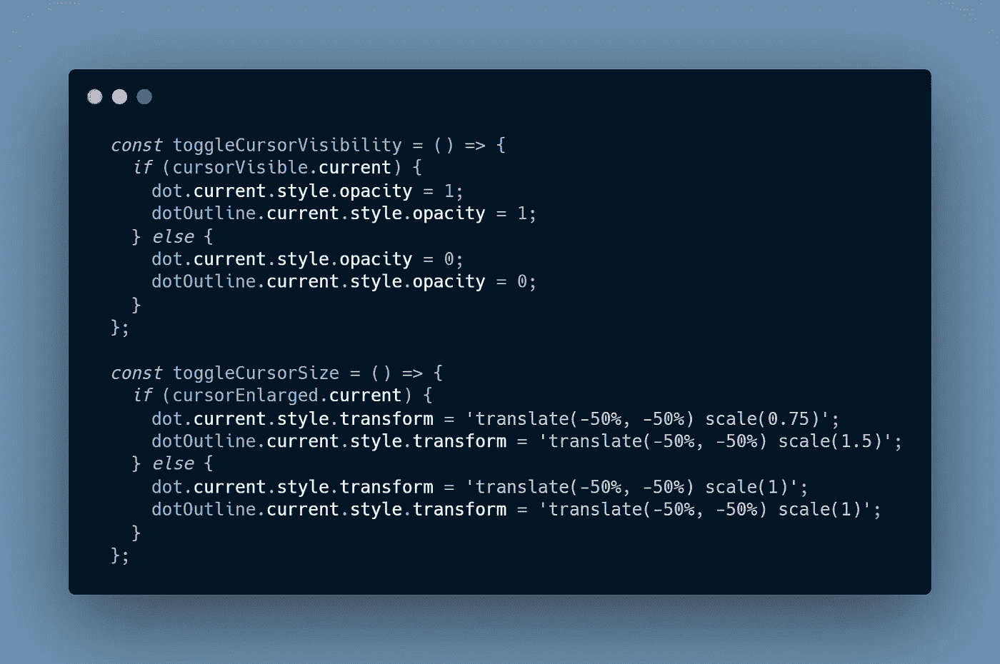**

*   ****toggleCursorVisibility—**如果光标可见，那么我们将把不透明度改为 1，否则我们将把它改为 0。**
*   ****toggleCursorSize —** 如果 cursorEnlarged 为真，那么我们将减小圆点的尺寸，增加轮廓的尺寸。如果是假的，我们会把它改回原来的尺寸。**

****添加结束、退出、回车、离开鼠标事件****

**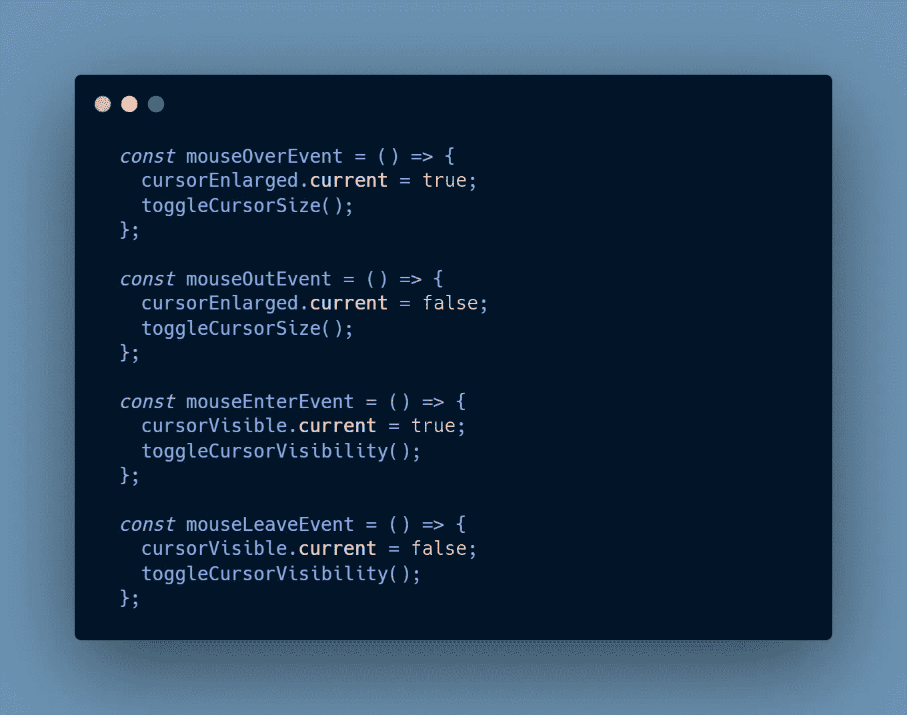**

****‘mouse over’—**当光标位于元素或其子元素之上时，触发 **mouseover** 事件。**

****‘mouseout’—**当光标不在元素或其子元素上时，触发 **mouseout** 事件。**

****‘mouse leave’—**当我们离开页面视窗时，触发 **mouseleave** 事件。**

****'mouseenter' —** 当我们进入页面视窗时，触发 **mouseenter** 事件。**

**现在，我们可以将 **mouseOverEvent** 和 **mouseOutEvent** 传递给我们的图像组件。**

**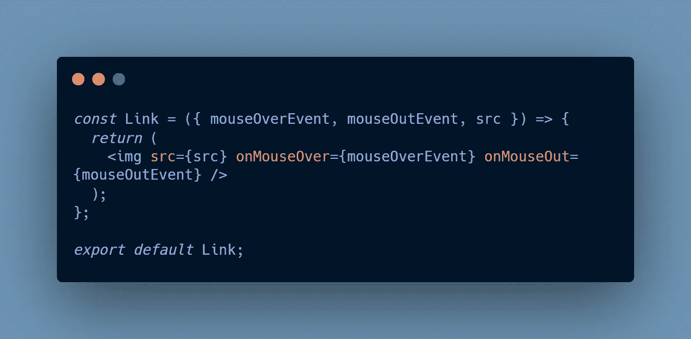**

**每当鼠标光标出现在图像上时，这些函数都会被调用。**

****添加鼠标移动事件****

**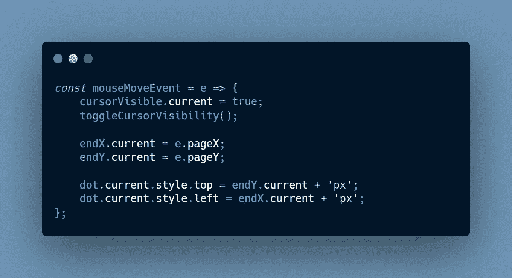**

**我们需要确保的第一件事是我们的光标是可见的，这就是为什么我们更新了 **currentVisible** 并调用了 **toggleCursorVisibility** 函数。**

**然后，我们在 **pageX** 和 **pageY 的帮助下获取光标的当前位置。**下一步是更新点光标的 top 和 left 属性，以显示它在页面上的移动。**

****P.S —** 这个 [StackOverflow](https://stackoverflow.com/questions/6073505/what-is-the-difference-between-screenx-y-clientx-y-and-pagex-y) 的回答很好的解释了 **clientX** 和 **pageX** 的区别。**

****添加光标轮廓动画****

**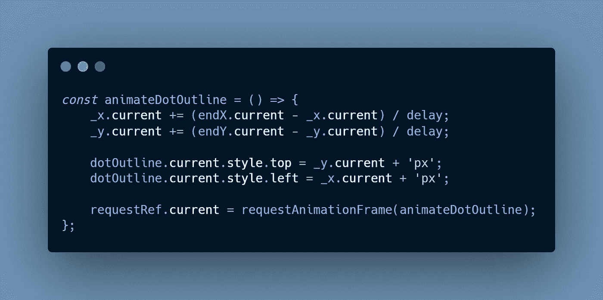**

**这是一个特殊的递归函数，我们在`requestAnimationFrame`函数内部调用它。在此功能中，我们根据**光标点的位置更新**光标轮廓**的位置。****

**本文的第 2 部分给出了对此的数学解释。**

**这篇[文章](http://www.javascriptkit.com/javatutors/requestanimationframe.shtml)非常有助于理解 **requestAnimationFrame** 是如何工作的以及为什么创建它。**

****调用所有事件函数****

**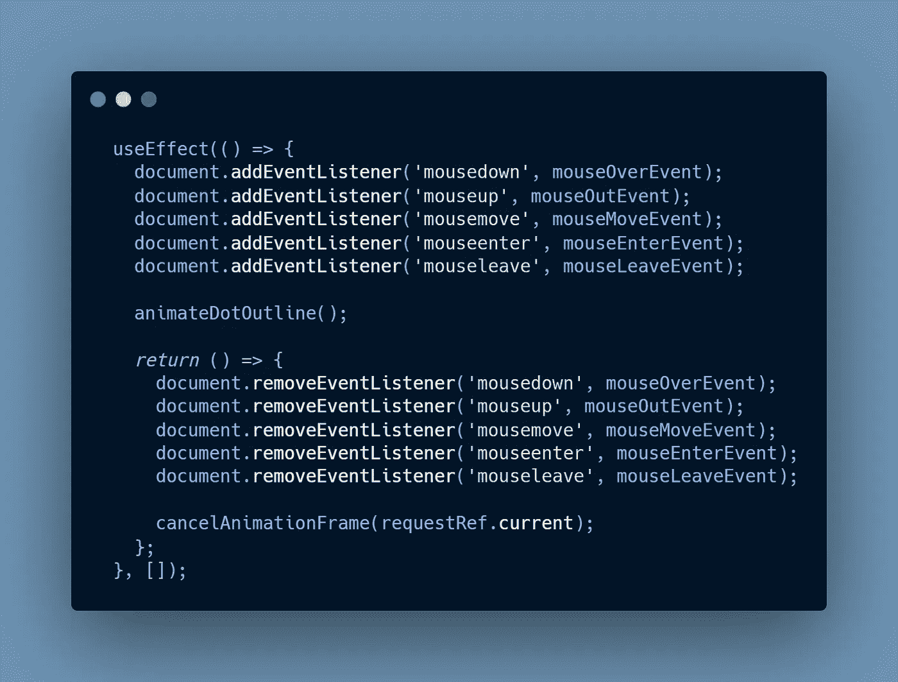**

**我们可以在`useEffect`(componentidmount)内部调用我们所有的事件函数。在卸载的时候，我们应该删除所有的事件监听器，并且使用 **cancelAnimationFrame** 函数取消 requestAnimationFrame。**

**有了这些功能，我们可怜的光标终于可以移动了。**

**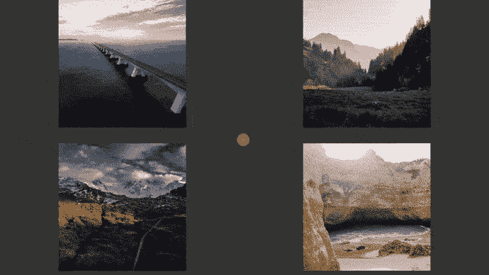**

**[文章的第二部分](https://germavinsmoke.medium.com/how-to-create-a-custom-cursor-in-react-part-2-mathematical-explanation-2193b52c43ba)有一点数学解释。所以你可以去看看。**

**一些重要的联系—**

*   **MDN request animation frame—[https://developer . Mozilla . org/en-US/docs/Web/API/window/request animation frame](https://developer.mozilla.org/en-US/docs/Web/API/window/requestAnimationFrame)**
*   **StackOverflow 对 requestAnimationFrame 的回答—[https://stack overflow . com/questions/52212703/using-requestAnimationFrame-in-react/52213728](https://stackoverflow.com/questions/52212703/using-requestanimationframe-in-react/52213728)**
*   **在 React 中使用 requestAnimationFrame—[https://CSS-tricks . com/using-requestAnimationFrame-with-React-hooks/](https://css-tricks.com/using-requestanimationframe-with-react-hooks/)**
*   **在 React 中使用事件监听器—[https://www . plural sight . com/guides/event-listeners-in-React-components](https://www.pluralsight.com/guides/event-listeners-in-react-components)**
*   **自定义光标的 VanillaJS 码笔—[https://codepen.io/kjbrum/pen/qooQJJ](https://codepen.io/kjbrum/pen/qooQJJ)**

***更多内容请看*[*plain English . io*](http://plainenglish.io/)**