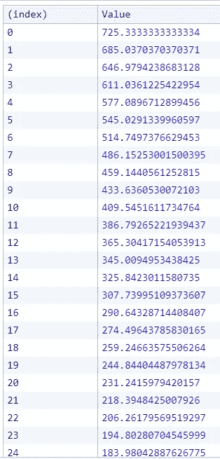

# 如何在 React 中创建自定义光标—第 2 部分[数学解释]

> 原文：<https://javascript.plainenglish.io/how-to-create-a-custom-cursor-in-react-part-2-mathematical-explanation-2193b52c43ba?source=collection_archive---------13----------------------->

如果你正在寻找源代码，那么它可以在视频中找到。

请观看此视频以示支持。😢

本文主要关注光标动画的数学部分(光标轮廓)。文章的第 1 部分与代码部分完全相关，如果你想了解它是如何工作的，你可以跟随它。

主要部分围绕这个功能—

**requestAnimationFrame** 也为我们提供了一个**时间戳**变量，我们可以用它来查看递归函数在什么时间间隔后被调用。

我们还需要在每次调用这个函数时存储 **x** 和 **y** 点。因此，我们可以创建一个函数来存储这三个属性。

我们还需要调整我们的 **animateOutline** 函数，以便获得想要的输出。

我们正在将**坐标对象**推入坐标**数组**中。

添加了新的条件来阻止 **requestAnimationFrame** 函数再次调用它。根据条件，我们会递归调用它，直到**光标轮廓的** **坐标**不等于**光标点的** **坐标**为止。

当坐标相等时，我们将记录控制台日志。我们将使用`console.table`函数，因为它提供了一个漂亮的输出表格视图。

The head of the data

The tail of the data

从这些数据中我们可以得出一些结论——

*   时间戳之间的差异几乎是恒定的，即 16–17 毫秒。如果你读了这篇文章，你就会知道它模拟的是 60FPS (1000/60)。这个 1000ms 除以 60 等于 16.67ms。
*   在动画的初始阶段，数据点有很大的差异，但随着时间的增加，差异会减小。

我们将新值和以前的值相加。endX 是常数，所以如果我们在每次迭代后从它减去 **x** ，分子将继续减少。最终它变得有点接近 0。

The head data of the difference in between dot and outline

The tail data of the difference in between dot and outline

如果我们画出关于时间戳的 x 点，我们会得到这样一个图

有点像对数图和放松三次贝塞尔函数。在初始阶段增加很快，然后增长率下降。

就是这样，这就是我们如何能够在 JavaScript 的帮助下，实现这种平滑的过渡。🤩🥳

*更多内容看*[***plain English . io***](http://plainenglish.io/)