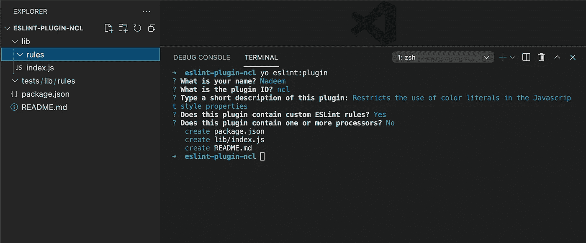
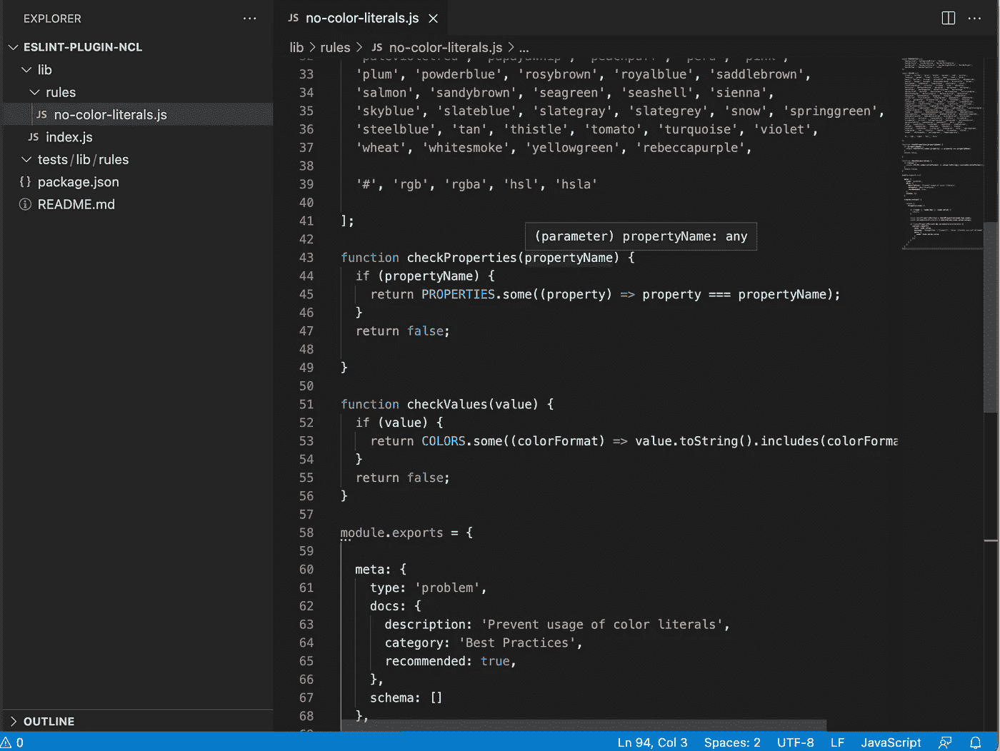
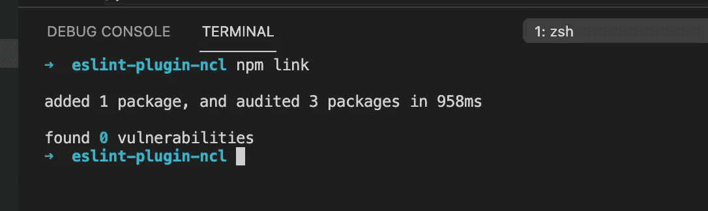
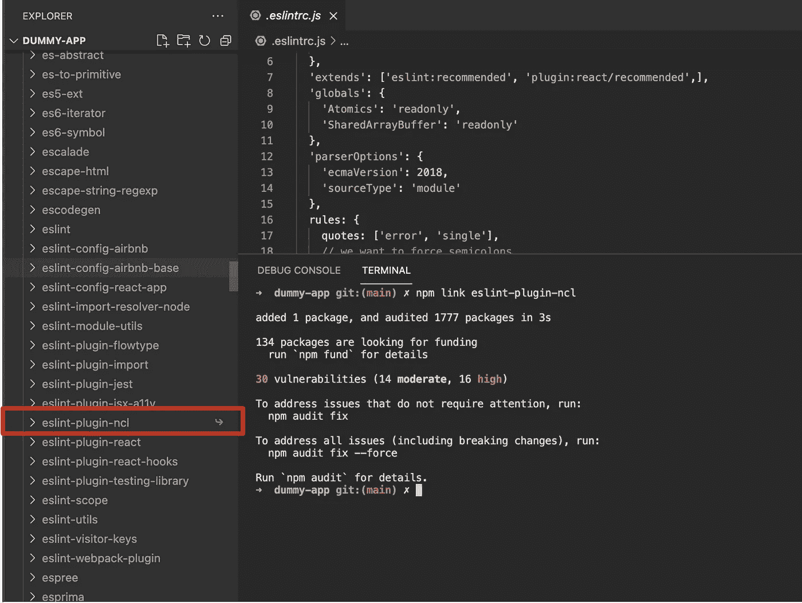
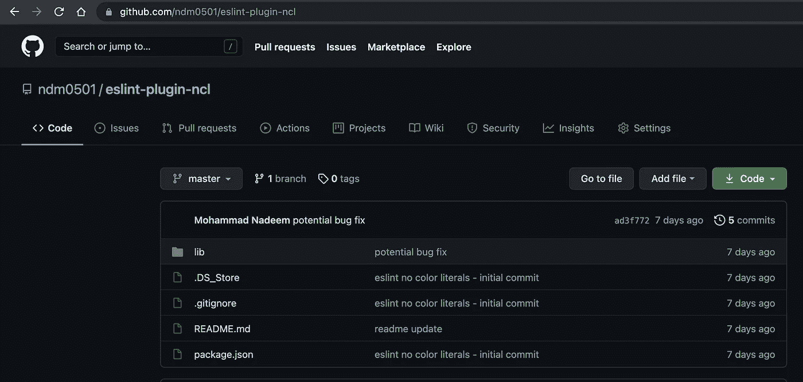
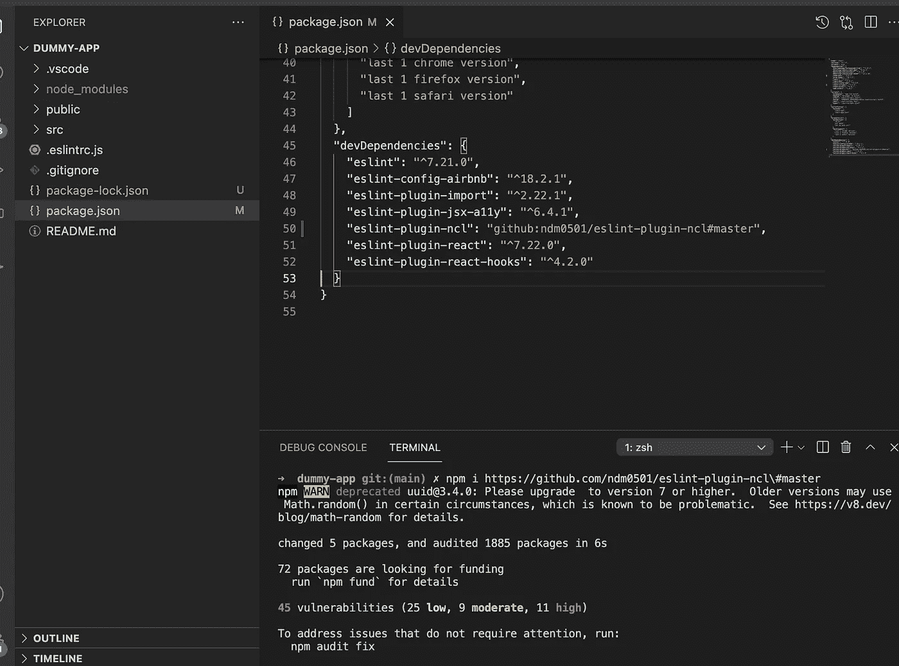

# 如何创建自定义的 ESLint 配置和可共享插件？—第二部分

> 原文：<https://javascript.plainenglish.io/how-to-create-a-custom-eslint-configuration-and-shareable-plugin-part-2-22d4b03d218?source=collection_archive---------10----------------------->

> 这是我上一篇文章[如何创建一个定制的 ESLint 配置和共享插件的续篇？第一部分](https://medium.com/geekculture/how-to-create-a-custom-eslint-configuration-and-shareable-plugin-part-1-78732dcafe81)。强烈建议在继续之前先阅读第 1 部分。


Image 1: Image credits timesofindia

在上一篇文章中，我们看到了如何创建一个定制的 ESLint 配置。在这一部分，我们将看到如何创建一个可共享的插件，以便在项目间使用自定义配置。

在我们继续创建一个可共享的插件之前，我们需要在配置中添加一些细节。

## 添加元信息

将`meta`块(如下所示)添加到`no-color-literals.js`文件中。

```
module.exports = { /* code to be added */
  meta: {
    type: 'problem',
    docs: {
      description: 'Prevent usage of color literals',
      category: 'Best Practices',
      recommended: true,
    },
  schema: []
  }, /* our existing code */
  create(context) {
    ...
    ...
  }
};
```

`meta`对象暗示了关于我们的 ESLint 配置的附加信息。

`type`表示规则的类型，可以取`problem`、`suggestion`和`layout`中的一个值。因为我们需要规则抛出一个错误(硬停止),所以我们在这里使用了`problem`。

在`docs`对象中，我们可以添加关于我们配置的附加信息。你可以在这里阅读更多关于`docs`、`schema`、[等](https://eslint.org/docs/developer-guide/working-with-rules#:~:text=in%20the%20AST.-,docs,-(object)%20is%20required)。

# 创建可共享插件的时间到了

为了创建一个可共享的插件，我们将使用一个方便的插件生成器[Yeoman(eslint-generator)](https://www.npmjs.com/package/generator-eslint)。

## 安装约曼

在您的终端中运行以下命令:

`npm i -g yo`

`npm i -g generator-eslint`

这将在您的机器中全局安装`yo`和`generator-eslint`。

## 创建和命名文件夹

创建一个名称以`eslint-plugin-`开头的文件夹很重要，这样当我们安装插件时，ESLint 可以识别我们的自定义插件。

让我们在这里创建一个名为`eslint-plugin-ncl`
的文件夹，`ncl`代表没有颜色文字。你可以把`ncl`换成任何你想要的。

接下来，打开终端并导航到我们创建的文件夹(在我们的例子中是`eslint-plugin-ncl`)。*你可以用 VSCode(或任何其他编辑器)打开文件夹，并使用它的集成终端(我将用它来截图)*

在终端中，运行命令`yo eslint:plugin`

在创建所需的文件和文件夹之前，此命令将引导您完成不同的问题集，如下所示:



Image 2: Generating plugin

***重要提示:对于“插件 ID 是什么？”·确保在*** `***eslint-plugin-***` ***后输入你所添加的文件夹名称。***

完成调查问卷后，将在根文件夹中创建几个文件和文件夹。(`eslint-plugin-ncl`文件夹在我们这里)

## 添加自定义规则/配置

接下来，我们只需要将我们的`no-color-literals.js`放入规则文件夹中。

手动将`no-color-literals.js`复制粘贴到规则目录中。

现在，我们的文件夹结构应该是这样的:



Image 3: Plugin folder structure

瞧吧！我们做到了。我们已经成功地创建了我们的定制 ESLint 插件。

# 安装插件

我们已经成功地创建了自定义的 ESLint 插件，可以插入到使用 ESLint 的不同应用程序中。问题是怎么做？我们将在这里看到不同的方法。

## 方式一:

## 将插件链接到我们的本地"`npm”`库

使用这种方法，我们可以在本地系统中跨应用程序测试我们的`eslint-plugin-ncl`插件。 ***在这种方法中，插件仅限于我们本地机器上的*** *。*

## **第一步:**

打开终端，导航到`eslint-plugin-ncl`文件夹(*同样可以使用代码编辑器的终端本身*)。

运行以下命令:

```
npm link
```



Image 4: Linking plugin to npm

这将在本地机器的 npm 库中安装`eslint-plugin-ncl`。

## **第二步:**

现在我们可以尝试将我们的插件安装到任何其他应用程序中。

**打开终端，导航到您想要使用该自定义插件的应用程序。**

> 这里我使用一个已经有 ESLint 配置的 React 应用程序(dummy-app)。你可以使用任何配置了 ESLint 的应用程序，如果没有，你可以像我们在[第一部分](https://medium.com/geekculture/how-to-create-a-custom-eslint-configuration-and-shareable-plugin-part-1-78732dcafe81)中那样配置 ESLint

接下来，运行命令:***NPM link * plugin-name **** *在我们的例子中，它是* `*eslint-plugin-ncl*`

```
npm link eslint-plugin-ncl
```

这将把`eslint-plugin-ncl`安装到我们的应用程序中。

如果您搜索您的`node_modules`文件夹，您将能够看到如下的包:



Image 5: Installing the plugin

*Woohoo！我们已经成功安装了定制的 ESLint 插件。*展开文件夹，试着查看内容。试着做一会儿夏洛克·福尔摩斯。*😜*

> 注意:要将**从您机器的 npm 存储库中卸载/解除**的链接，您可以运行命令`npm unlink eslint-plugin-ncl`

## 方式二:

## 使用 GitHub 存储库安装配置

这种方法可以用来通过一个公共的 GitHub 库在互联网上共享你的插件，并且可以被世界上任何人访问和安装(*只要他们连接到互联网*😛)

让我们看看它是如何做到的。

**第一步:**

创建一个 ***公共*** Git 库，并推送`eslint-plugin-ncl`插件。我已经将我的推送到 GitHub，变化在`master`分支。

> 没有分享将插件推送到 Git repo 的步骤。我觉得这超出了本文的范围。

**存储库链接:**

`github.com/ndm0501/eslint-plugin-ncl`



Image 6: github repo

至此，我们已经使我们的插件全球化了。世界上任何地方的任何人都可以访问它(*因为它是一个公共回购*)。*显然，需要互联网。*

**第二步:**

由于我们的插件可以通过互联网获得，让我们试着安装同样的插件。

**打开终端，导航到您想要使用该自定义插件的应用程序。**

> 这里我使用一个已经有 ESLint 配置的 React 应用程序(dummy-app)。您可以使用任何配置了 ESLint 的应用程序，如果没有，您可以像我们在[第一部分](https://medium.com/geekculture/how-to-create-a-custom-eslint-configuration-and-shareable-plugin-part-1-78732dcafe81)中所做的那样配置 ESLint

接下来，运行命令

```
npm install [https://github.com/ndm0501/eslint-plugin-ncl\#master](https://github.com/scripbox/eslint-plugin-ncl#master)
```

这里，`#master`表示`master`分支的名称，因为我的插件存在于`master`分支本身中。
*注意* `*\*` *就在* `*#master*` *之前。这在运行命令时很重要。*



Image 7: Installing plugin

您将能够在`node_modules`文件夹中找到`eslint-plugin-ncl`文件夹。

这样，我们就成功地通过互联网安装了我们的插件。这个库，如果公开的话，可以被世界上任何地方的任何人用来安装插件(我知道，我知道，我在重复我自己😁)

## 方式三:

我们可以遵循的另一种方法是在`npm`库中发布我们的包，然后可以通过命令`npm i package-name`进行安装

> 发布到`npm`存储库超出了本文的范围。

> 希望这两篇文章内容丰富，值得一读。再次，建议，欣赏，评论，批评是受欢迎的。*😇*

*更多内容请看*[***plain English . io***](http://plainenglish.io/)