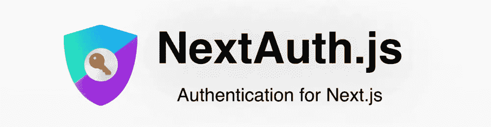
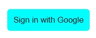

# 使用 NextAuth.js 创建自定义登录页面

> 原文：<https://javascript.plainenglish.io/how-to-create-a-custom-sign-in-page-in-next-auth-1612dc17beb7?source=collection_archive---------0----------------------->

## 如何使用 NextAuth.js 创建自定义登录页面



今天，我们将看到如何用 NextAuth.js 构建一个自定义的登录页面。

在我之前的一篇文章中，我们看到了什么是 NextAuth 以及如何用它来构建 Google 认证。如果你还没有读过，你可以在这里查看一下[。](https://medium.com/geekculture/why-and-how-to-get-started-with-next-auth-61740558b45b)

## 我们开始吧

在 ***[…nextauth]。js*** ，我们将在提供者下面添加一个 pages 属性，如下所示:

```
pages: {
signIn: "/signin",
},
```

现在，我们的 ***[…nextauth]。js*** 应该是这样的

## 创建登录页面

在 pages 目录中，我们将创建一个新页面 ***signin.js*** 。

我们将需要从下一个认证/客户端包导入一堆。这是所有的进口货:

```
import { providers, signIn, getSession, csrfToken } from "next-auth/client";
```

我们现在将创建一个简单的 React 功能组件:

## 显示所有提供商

在我们的组件中，我们将绘制出所有的提供者，在这种情况下，我们只有谷歌登录。

我们首先需要获得所有的提供者，我们将使用 getServerSideProps 来获得所有的提供者:

这将给出我们在 ***[…nextauth]中添加的所有提供者。我们将收到提供者作为道具。***

这将给我们一个简单的按钮，上面写着**‘使用 Google 登录’**。如果我们单击此按钮，我们的登录流程应该仍能正常工作。现在，如果我们登录，我们将被重定向到登录页面，而不是主页。

我们现在来看看如何解决这个问题。

在`getServerSideProps`函数中，我们将添加以下内容:

现在，如果我们登录，我们将被重定向到主页，如果你想重定向用户到其他一些页面改变目的地的位置。

最终的 *signin.js* 看起来是这样的

## 设计页面样式

现在我将在按钮上应用一些简单的样式，并使其居中。我将使用 CSS 模块的风格，因为它是内置的，你可以使用任何你喜欢的。

*   创建一个文件***sign in . module . CSS***

我将向容器 div 和按钮添加一个类名，如下所示

我们将从***sign in . module . CSS***导入样式，如下所示

```
import styles from "../styles/Signin.module.css";
```

*   最后，我们将在***sign in . module . CSS***中添加样式，使其看起来更好

应用这些样式后，我们得到一个居中的、好看的按钮。



我希望你能用下一个身份验证创建你的第一个自定义登录页面。

**有用链接:**

[Github 库](https://github.com/avneesh0612/next-auth-custom-login)

[NextJS 文档](https://nextjs.org/docs)

[下一个授权](https://next-auth.js.org/)

[所有社交](https://avneesh-links.vercel.app/)

*更多内容请看*[***plain English . io***](http://plainenglish.io)