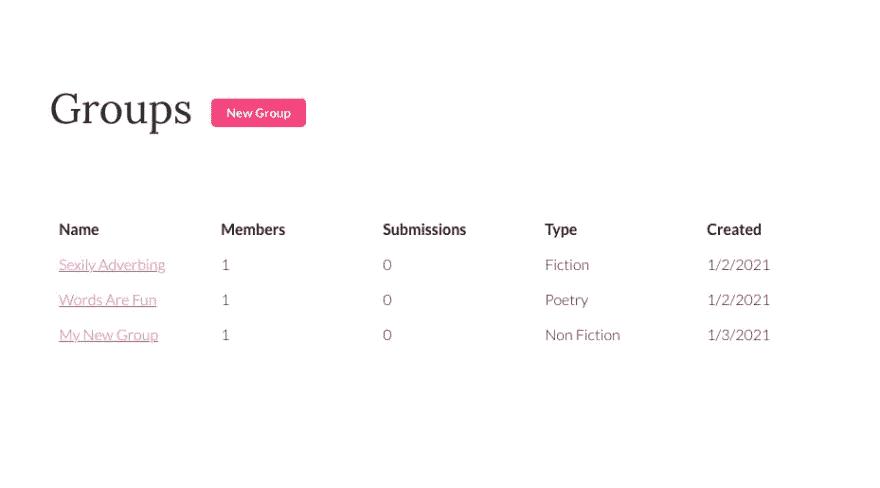

# 如何在 React 中创建自定义表格组件

> 原文：<https://javascript.plainenglish.io/how-to-create-a-custom-table-component-in-react-7c37ad7a6518?source=collection_archive---------3----------------------->


桌子到处都是。即使 web(谢天谢地)不再使用表格来布局网站，你仍然可以在很多地方找到表格。许多列表都是从表格中构建的。用户网格、偏好、收藏夹、提要等。因为表无处不在，所以作为 React 开发人员，您会发现自己正在做两件事情中的一件:使用库来构建表，或者手动构建自己的表。如果你属于后一类，这篇文章就是为你准备的。

我们将在 React 中创建一个定制的、可重用的表格组件。为了做到这一点，我们需要建立一些高层次的目标。这些是我在当前项目 [Perligo](https://perligo.io/) 中应用于表格的目标，我认为它们适用于所有项目。

*   该表必须可以在不同的上下文中多次使用(这一点似乎很明显，但放在这里是为了确保正确)。
*   表格应该包含两个数据属性:表头标签和表体数据。
*   该表应该允许根据表的用途应用自定义类。

记住这一点，让我们开始吧。我不打算经历整个“设定-你的反应-项目-启动”的过程。但是，您显然需要一个 React 项目来继续。

我们的 table 组件实际上将是一个容器，它包含另外两个组件:TableHeadItem 和 TableRow。

# 表格组件

表格组件是最重要的，因为它是您将导入到您计划使用表格的页面中的内容。让我们现在创建它。

```
import React from "react";
import TableRow from "./TableRow";
import TableHeadItem from "./TableHead";

const Table = ({ theadData, tbodyData, customClass }) => {
    return (
        <table className={customClass}>
            <thead>
                <tr>
                    {theadData.map((h) => {
                        return <TableHeadItem key={h} item={h} />;
                    })}
                </tr>
            </thead>
            <tbody>
                {tbodyData.map((item) => {
                    return <TableRow key={item.id} data={item.items} />;
                })}
            </tbody>
        </table>
    );
};

export default Table;
```

您可以看到我们正在导入 TableHeadItem 和 TableRow 组件。我们还没有建立这些，但我们将很快。

表格组件接受三个道具:`theadData`、`tbodyData`和`customClass`。`customClass` prop 满足了我对可重用表格组件的需求列表中的最后一个需求。如果传递了一个，table 元素将拥有那个类。否则，该类将是未定义的。

另外两个道具，`theadData`和`tbodyData`都是数组。请记住，我们希望我们的表组件是可重用的，并且不关心传入的数据。要做到这一点，我们需要标准化数据属性。数组最适用于表。您很快就会看到，`theadData`应该是一个字符串数组，而`tbodyData`应该是一个数组数组。

您将很快看到这是如何工作的。让我们继续讨论 TableHeadItem 组件。

# TableHeadItem 组件

```
import React from "react";

const TableHeadItem = ({ item }) => {
    return (
        <td title={item}>
            {item}
        </td>
    );
};

export default TableHeadItem;
```

没什么。如果您还记得，我们在 Table 组件中映射了我们的`theadData`数组，所以传递给 TableHeadItem 组件的结果是一个我们只需要呈现的字符串。

最后，让我们构建 TableRow 组件。

# 表行组件

```
import React from "react";

const TableRow = ({ data }) => {
    return (
        <tr>
            {data.map((item) => {
                return <td key={item}>{item}</td>;
            })}
        </tr>
    );
};

export default TableRow;
```

同样，这是一个非常简单的组件。如果你还记得，T0 是一个数组。在我们的 Table 组件中，我们在根级别数组上进行映射，并将单个数组返回给每个被呈现的 TableRow 组件。在 TableRow 组件中，我们映射到单个数组，并返回该行的列。

# 把这一切放在一起

我们现在已经建造了我们需要的一切。让我们连接这个组件，并向它传递一些数据。您可以从任何您想要呈现表格数据的组件中完成这项工作。让我们从数据的形状开始:

```
const theadData = ["Name", "Email", "Date"];

const tbodyData = [
{
  id: "1", 
  items: ["John", "john@email.com", "01/01/2021"]
}, 
{
  id: "2", 
  items: ["Sally", "sally@email.com", "12/24/2020"]
},
{
  id: "3", 
  items: ["Maria", "maria@email.com", "12/01/2020"]
},
]
```

你会注意到我的`tbodyData`变量实际上不是数组的数组。它是一个对象数组，每个对象都有一个嵌套的数组。这很简单，因为当映射到数据时，我更喜欢在 React 中为我的关键角色使用唯一的标识符。你没必要这么做。正如我最初建议的那样，您可以很容易地剥离对象并返回一个数组。

在我们想要渲染表格的组件中，您可以做类似的事情:

```
import React from "react";
import Table from "../../Reusables/Table";

const Example = () => {
    const theadData = ["Name", "Email", "Date"];

    const tbodyData = [
        {
            id: "1",
            items: ["John", "john@email.com", "01/01/2021"],
        },
        {
            id: "2",
            items: ["Sally", "sally@email.com", "12/24/2020"],
        },
        {
            id: "3",
            items: ["Maria", "maria@email.com", "12/01/2020"],
        },
    ];
    return (
        <div>
            <Table theadData={theadData} tbodyData={tbodyData} />
        </div>
    );
};

export default Example;
```

您也可以选择将`customClass`道具传到您的桌子组件上。这个表组件现在非常可重用，可以快速插入，并且准备您作为道具发送的数据很容易。

我正在我的应用程序中使用这个定制组件(还没有发布，但是可以进行预发布注册)， [Perligo](https://perligo.io/) 。您可以看到这些表在数据传入的情况下呈现得有多好，就像我上面构建的那样。



# 结论

有大量的库和框架专门用于表组件，或者提供完整的组件数组。然而，如果您想要一个轻量级的、可定制的解决方案，自己动手总是一个有效的方法。我希望这个快速教程有所帮助。

喜欢这篇文章吗？如果是这样，通过 [**订阅我们的 YouTube 频道**](https://www.youtube.com/channel/UCtipWUghju290NWcn8jhyAw?sub_confirmation=true) **获取更多类似内容！**