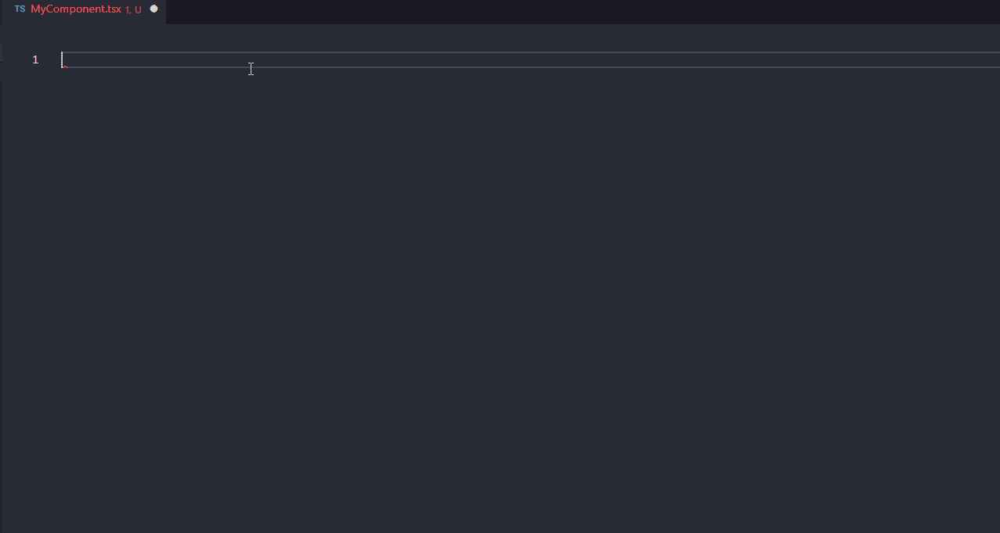
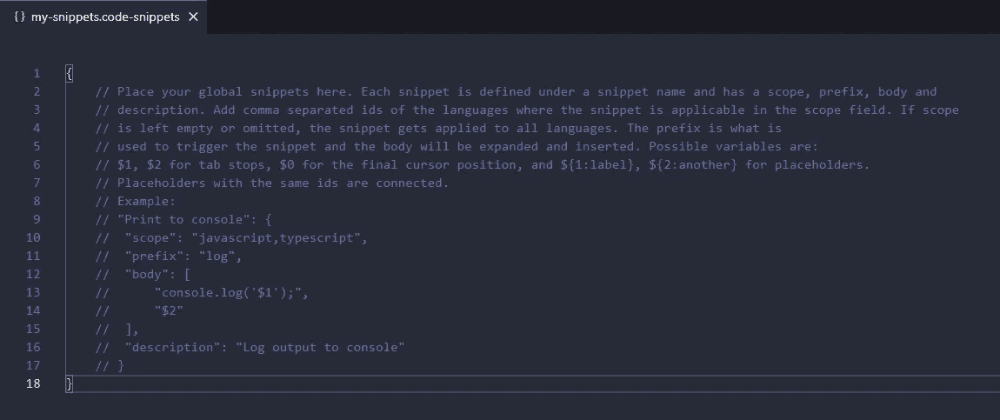
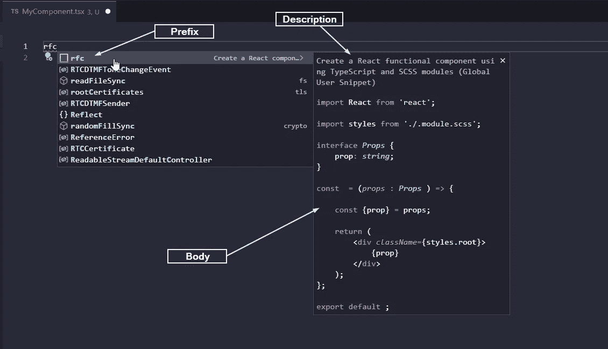

# 如何创建定制的 VS 代码片段来搭建 React 组件

> 原文：<https://javascript.plainenglish.io/how-to-create-a-custom-vs-code-snippet-to-scaffold-your-react-components-ebace25b6b6f?source=collection_archive---------5----------------------->

Photo by [Mohammad Rahmani](https://unsplash.com/@afgprogrammer?utm_source=medium&utm_medium=referral) on [Unsplash](https://unsplash.com?utm_source=medium&utm_medium=referral)

正如我在我的[以前的一篇文章](https://adrianmanduc.medium.com/vs-code-extensions-for-react-frontend-developers-d1c2f878dbe3)中提到的，我总是试图找到工具&技术来帮助我更快更好地编码。除了安装和使用扩展的能力，另一个令人惊叹的 VS 代码工具是 [**代码片段**](https://code.visualstudio.com/docs/editor/userdefinedsnippets) 。代码片断基本上是一种快捷方式，它允许您对经常重复的代码使用模板(例如导入模块或创建 React 组件)。

> VS 代码有一些内置的片段。您可以通过 IntelliSense ( `*Ctrl+Space*`)或从专用的代码片段选择器中使用它们——使用`*Ctrl+Shift+P*`调出命令面板并选择**插入代码片段。**

我在编写 React 代码时经常使用的 VS 代码扩展之一是[ES7 React/Redux/graph QL/React-Native snippets](https://marketplace.visualstudio.com/items?itemName=dsznajder.es7-react-js-snippets)。这个扩展依赖于定制的代码片段，使开发人员能够更快地编写代码。最初，我只将其用于导入，但后来慢慢地开始使用其他代码片段，直到我问自己— *如果我可以创建自己的代码片段，满足我的特定需求，会怎么样？*

在我目前的一个项目中，我将 Next.js 与 Typescript 和 CSS 模块(实际上是 SCSS)一起使用，我经常发现自己在创建新的 React 组件时做同样的事情:

1.  进口反应，
2.  导入 SCSS 模块，
3.  创建道具界面，
4.  创建反应组件，
5.  破坏道具，
6.  返回一个具有*class name*T3 的`div`容器，
7.  导出 React 组件。

让我们创建一个自动执行此操作的自定义片段:

Result

# 创建全局代码片段文件

默认情况下，代码段由以下人员全局共享或限定范围:

*   编程语言(JS，C++等。)
*   该项目

> 为了简单起见，在这个例子中，我们将创建一个全局代码片段文件，其中只有一个代码片段，但是，对于更高级的用法，请务必查看[文档](https://code.visualstudio.com/docs/editor/userdefinedsnippets#_snippet-scope)以正确理解可用选项。

要创建全局代码片段文件，请转到文件>首选项(或代码>首选项，如果在 macOS 上)>**用户代码片段**，并选择**新建全局代码片段文件**选项。为您的文件选择任意名称，然后按`Enter`。

将生成一个 JSON 格式的文件:

New global snippets file

# 创建代码片段

接下来，用以下代码替换生成文件的内容，并保存更改:

Snippet for creating a React component

这是怎么回事？起初，它看起来有点乱——让我们深入了解一下:

如前一节所述，代码片段文件具有 JSON 格式。这个 JSON 中的每个键都是一个代码片段的名称，每个代码片段都有以下属性:

*   前缀
*   身体
*   描述(可选)
*   范围(可选)

## 前缀

定义用于在 IntelliSense 中显示代码段的触发词的字符串或字符串数组。

## 身体

这就是有趣的地方。主体是一个字符串或字符串数组，当插入代码片段时，将对其进行连接和格式化。它可以包含特殊语法，包括制表位、占位符、选项、变量等。

在我们的示例中，我们使用了 2 个制表位和 1 个变量:

`**$1**` —制表位，用于指定光标位置并允许用户自定义组件的名称

`**$0**` —制表位最终光标位置

`**${TM_FILENAME_BASE}**` —获取当前文件名的变量

> 有关主体语法的更详细指南，请在此处参考可用的文档[。](https://code.visualstudio.com/docs/editor/userdefinedsnippets#_snippet-syntax)

## 描述

将由 IntelliSense 显示的说明字符串。

## 范围

此属性可在全局代码段文件中使用，以指定该代码段应适用的语言。正如您所注意到的，在我们的代码片段中，这个属性丢失了。如果没有指定范围，那么代码片断将对所有语言都可用。

# 使用片段

该代码片段现在可以使用了。只需创建一个新的`.tsx`或`.ts`文件，并输入触发字(前缀)`**rfc**`:

Using the custom snippet

接下来，按`Tab`、`Enter`或点击第一个结果，代码片段将被插入:

Using the custom snippet

插入代码片段后，请注意文件名被用作组件的名称。有 4 个光标(使用`$1`放置)允许您轻松修改组件名称。通过按 tab，您的光标移动到呈现的`div`(其中`$0`被放置在代码片段的主体中)。

这是一个简单的例子，但是基于您的项目，您可以构建更加复杂的代码片段。

我是 VS 代码片段的忠实粉丝，最近每天都在使用它们。我认为它们是一个强大的工具，可以提高开发人员的工作效率。

另一篇文章你可能也会觉得有用:

 [## 面向(React)前端开发人员的 VS 代码扩展

### 为前端开发人员提供的有用的 VS 代码扩展列表，可以显著提高编写代码的效率。

adrianmanduc.medium.com](https://adrianmanduc.medium.com/vs-code-extensions-for-react-frontend-developers-d1c2f878dbe3) 

编码快乐！

*更多内容看* [***说白了. io***](http://plainenglish.io/) ***。*** *报名参加我们的* [***免费每周简讯***](http://newsletter.plainenglish.io/) ***。***