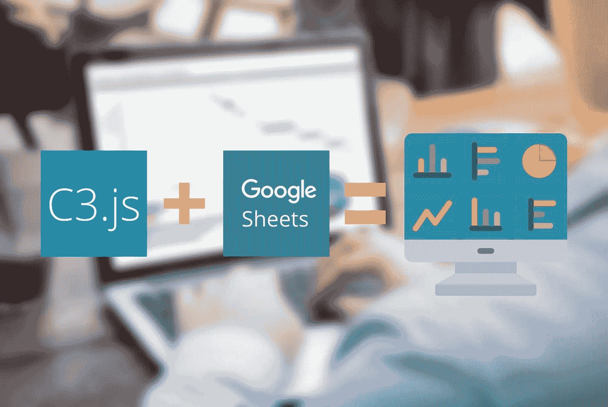
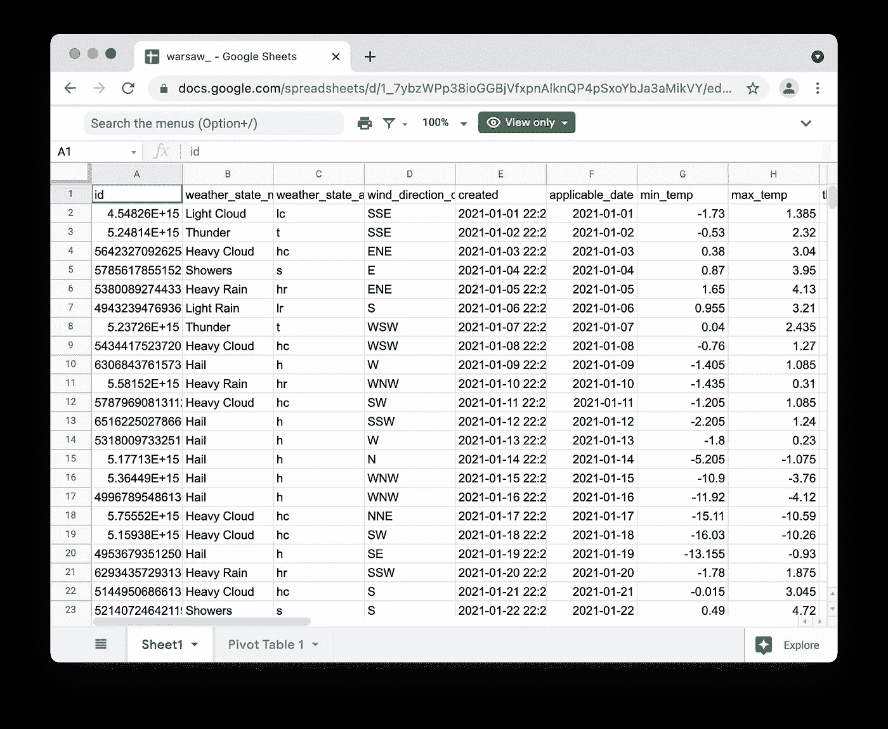
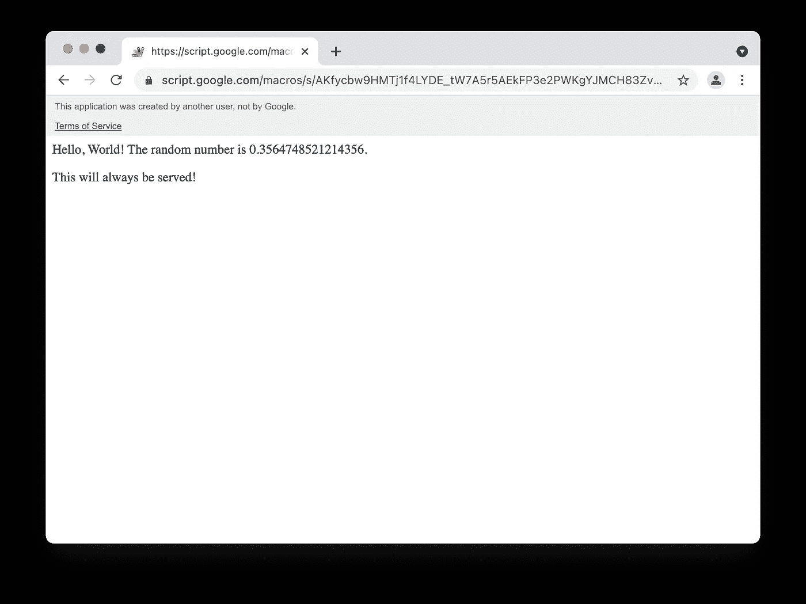
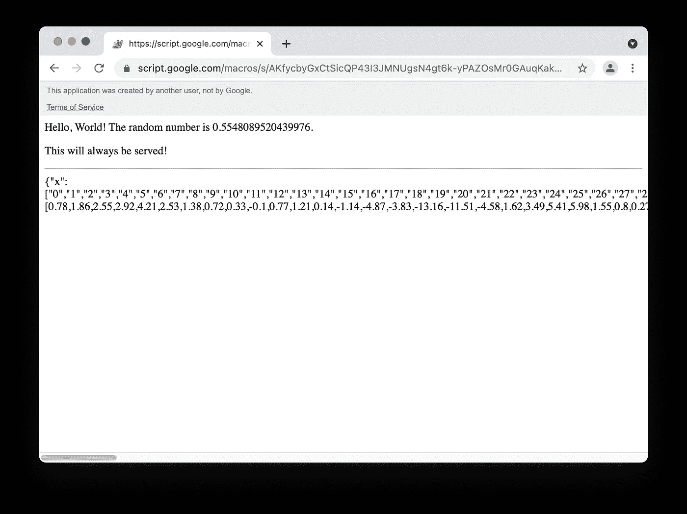
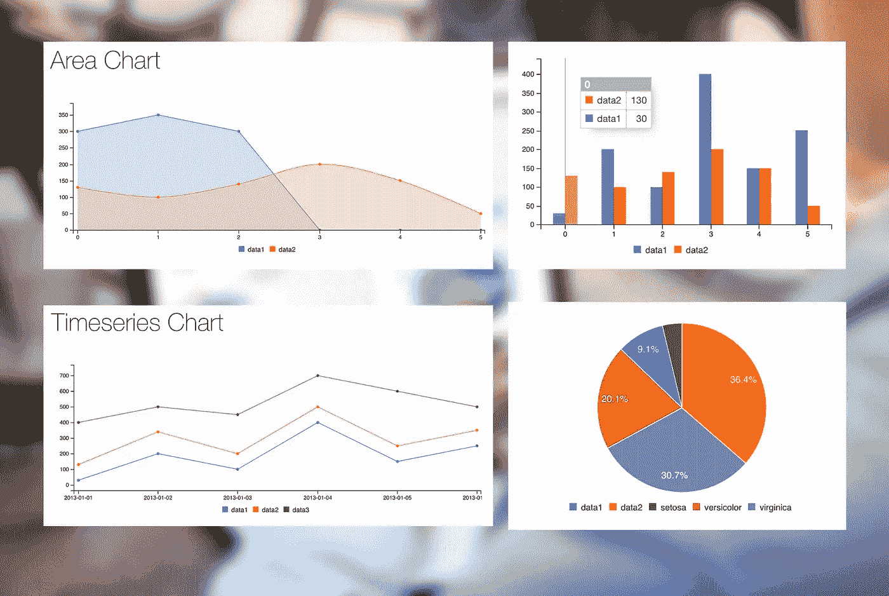
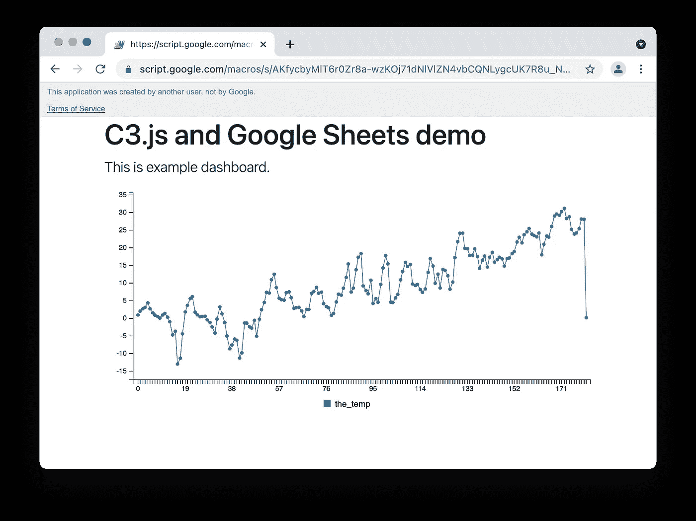
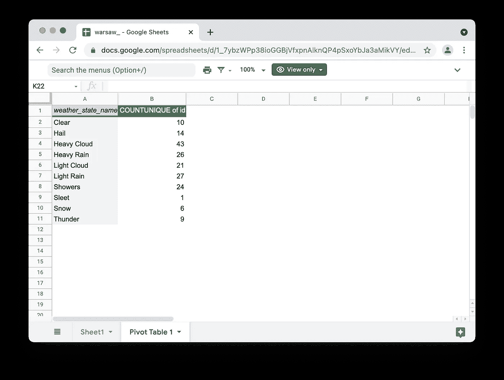
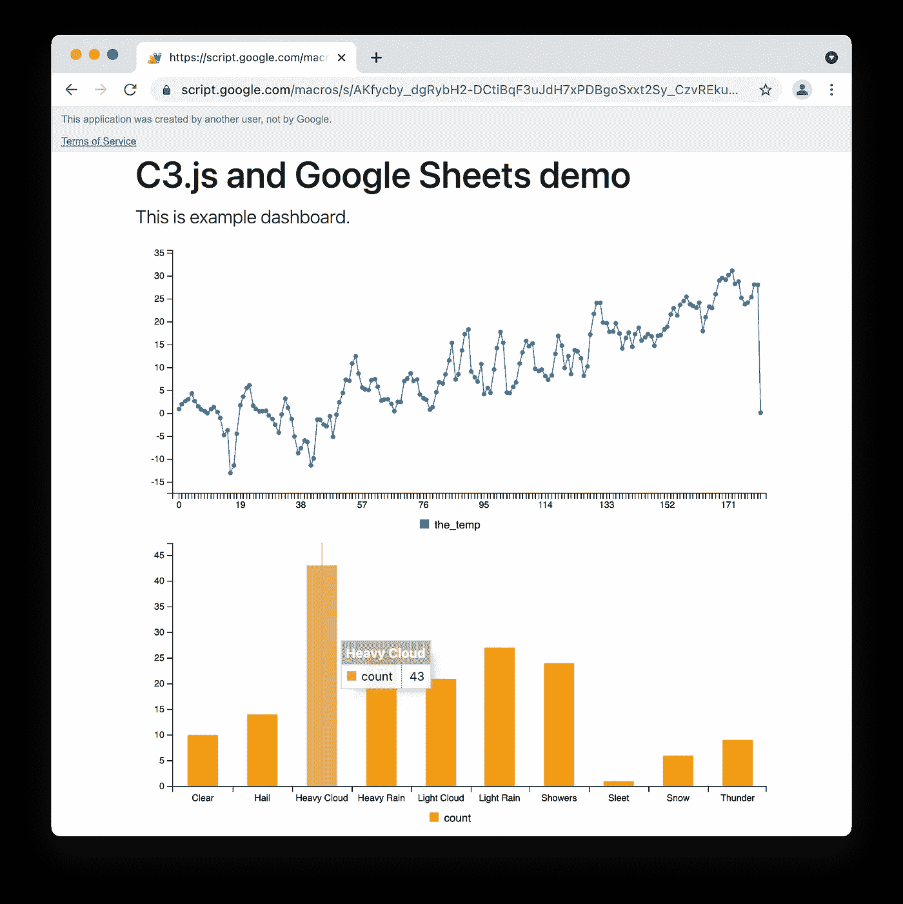

# 如何用 Google Sheets 和 C3.js 免费创建仪表板

> 原文：<https://javascript.plainenglish.io/how-to-create-a-dashboard-for-free-with-google-sheets-and-c3-js-ef8477cae3a7?source=collection_archive---------7----------------------->

## 使用 Google Sheets 和 C3.js 免费创建一个仪表板——电子表格数据的在线可视化。

Unless stated otherwise, all pictures in the article are by the author.

我们经常需要跟踪一些业务数据。我们收集、处理并存储在电子表格中，然后创建图表。然而，有时需要面向非技术受众。有许多服务可以用来构建看起来不错的图表和仪表盘，比如 Tableau、Qlikview 或 Google Data Studio。

然而，它们通常太贵或太有限，不适用于任何情况。幸运的是，可以直接从 Google Apps 脚本中提供静态 HTML 和 JavaScript 文件。

在本文中，我将向您展示如何使用来自 Google Sheet 和 C3.js 的数据创建一个简单的仪表板。接下来，我们将它与 C3.js 集成。然后，我们将从 Google Sheets 获取数据(例如，更新仪表板中的信息)并将其插入模板。这个项目可能会成为创建许多不同的仪表板和可视化的脚手架。

[🔔想要更多这样的文章？在这里签名。](https://fischerbach.medium.com/membership)

# 情况

我们有一个包含某个城市天气数据的电子表格。

Google Sheets 让我们有可能通过使用例如 Google Forms 或 API 服务来定期更新这些数据。

# 从 Google Apps 脚本提供模板化 HTML

首先，我们创建或打开一个包含数据的 Google Sheets 文件。只需复制提供的示例文件:
[https://docs . Google . com/spreadsheets/d/1 _ 7 ybzwpp 38 iogggbjvfxpnalknqp 4 psxoybja 3 amik vy/edit # GID = 514443929](https://docs.google.com/spreadsheets/d/1_7ybzWPp38ioGGBjVfxpnAlknQP4pSxoYbJa3aMikVY/edit#gid=514443929)

*示例数据来自*[*metaweather.com*](https://www.metaweather.com/api/)*API。*

接下来，我们需要创建一个新的应用程序脚本项目。点击`Tools > Script editor`。在`Code.gs`文件中，粘贴以下代码:

函数`doGet`在每次收到应用程序的 GET 请求时显示`Index.html`的内容，例如通过浏览器访问其 URL。`doGet`为工作需要`Index.html`文件，所以让我们创建它并用一些 HTML 填充它:

与其他服务器端语言一样，在 Apps 脚本中，我们可以使用变量并将它们直接插入到 HTML 响应中。如果你熟悉 PHP，你大概知道`<? ?>`和`<?= ?>`是做什么的。将在服务器端评估`<?`和`?>`之间的代码。要将评估结果直接插入 HTML 内容，只需使用`<?=` `?>`。现在，我们已经准备好部署我们应用程序的第一次迭代。

点击`Deploy > New deployment > Web app`。设置选项很重要:

*   执行为:`me`，
*   谁有权限:`Anyone`。

部署后，如果您转到 web 应用程序的 URL，您应该会看到结果:

Google automatically adds an annotation at the top of the page, for user safety reasons.

现在，我们准备让应用程序处理电子表格中的数据。将`getDataFromSheet`功能的代码替换为:

为了将该函数的结果插入到我们的模板中，我们需要在`Index.html`文件中的`</body>`之前添加以下代码:

在我们部署新版本之前，点击`Run > setup`。它会将我们的项目与图纸文件连接起来。部署完成后，转到 web 应用程序 URL，我们应该会看到类似这样的内容:

每次刷新时，都会从电子表格中获取数据并显示出来！您可以通过修改电子表格中的数据，然后刷新 web 应用程序来检查这一点。它会呈现给你变化了的价值观。

**在这一节之后，每个文件的源代码应该是这样的:** `Code.gs` [https://gist . github . com/fischer Bach/ECD 57561 c 02610 ee 3a 8609 DCA 491237 a](https://gist.github.com/fischerbach/ecd57561c02610ee3a8609dca491237a)

`Index.html` [https://gist . github . com/fischer Bach/f 288 c 595 aa 0261586 b7e 896 f 523 fdbdc](https://gist.github.com/fischerbach/f288c595aa0261586b7e896f523fdbdc)

# 用 C3.js 显示图表

我们有一个前端模板和一个向其中插入数据的机制。现在，让我们添加一些情节和图表。我们将使用 [C3.js](https://c3js.org/) ，一个基于 D3 的图表库。

> c3 是一个基于 D3 的可重用图表库，支持将图表更深入地集成到 web 应用程序中。—c3js.org

多亏了 C3，创建图表并将其集成到应用程序中变得相对容易。这与直接使用 D3.js 形成对比，一开始使用 D3 . js 可能会让人不知所措。

首先，我们需要在 Index.html 的 HTML 模板中添加一些行来使用 C3.js。由于 web 开发有点超出了本文的范围，我建议您只需使用这个现成的模板(用 Bootstrap 准备的)。它已经集成了 C3.js 库。

如你所见，我们可以通过在前端代码中放置`<?= ?>`来同步后端应用脚本和前端 JavaScript 之间的数据。

> 注意:这不是将数据从后端放到前端的最佳方式。更合适的解决方案是准备 JSON API，并使用 HTTP 请求获取数据。然而，对于简单的临时解决方案，这可能是多余的，所以我省略了这种方式。如果你对这个主题感兴趣，我推荐这篇文章:

 [## 如何使用 SurveyJS 和 Google Sheets 免费创建在线调查

### 作为 web 应用程序数据库的电子表格

netlabe.com](https://netlabe.com/how-to-create-online-survey-for-free-with-surveyjs-and-google-sheets-d9a782d0f458) 

现在，让我们部署并转到 web 应用程序 URL:

**在这一节之后，每个文件的源代码应该是这样的:** `Code.gs` [https://gist . github . com/fischer Bach/ECD 57561 c 02610 e 3 a 8609 DCA 491237 a](https://gist.github.com/fischerbach/ecd57561c02610ee3a8609dca491237a)

`Index.html` https://gist . github . com/fischer Bach/496 e 5015 b 255 e 411100 f 936984 abb 83 b

# 用数据透视表和 C3.js 创建直方图

C3.js 提供了许多类型的图表。因此，让我们创建一个直方图来显示什么类型的天气在所研究的地区占主导地位。我们需要包含给定值出现次数的数据。幸运的是，我们可以使用数据透视表汇总数据:

接下来，我们将功能`getHistogramData`添加到`Code.gs`中:

之后，我们修改`Index.html`:

最后，部署应用程序并转到 URL。您应该会看到类似这样的内容:

Final dashboard

您可以亲自尝试最终版本:

[https://script . Google . com/macros/s/AKfycby _ dgrybh 2-dctibqf 3 ujdh 7 xpdbgosxxt 2 sy _ czvrekukc 9 rgao _ 5k of mou 6 gksznut/exec](https://script.google.com/macros/s/AKfycby_dgRybH2-DCtiBqF3uJdH7xPDBgoSxxt2Sy_CzvREkuC9rgaO_5KOFmOu6gKSznUT/exec)

# 摘要

使用电子表格中的数据并创建仪表板并不需要太多工作。另一个优点是可以使用几乎免费的工具，并且在设置好之后，可以在没有太多监督的情况下完成工作。

# 参考

**Google Apps 脚本&工作表** https://developers . Google . com/Apps-Script/guides/html/templates

**C3 . js
T7[https://c3js.org/gettingstarted.html](https://c3js.org/gettingstarted.html)T10[https://c3js.org/examples.html](https://c3js.org/examples.html)**

2021 年，拉法日里布尼克

*更多内容看* [***说白了. io***](http://plainenglish.io/)