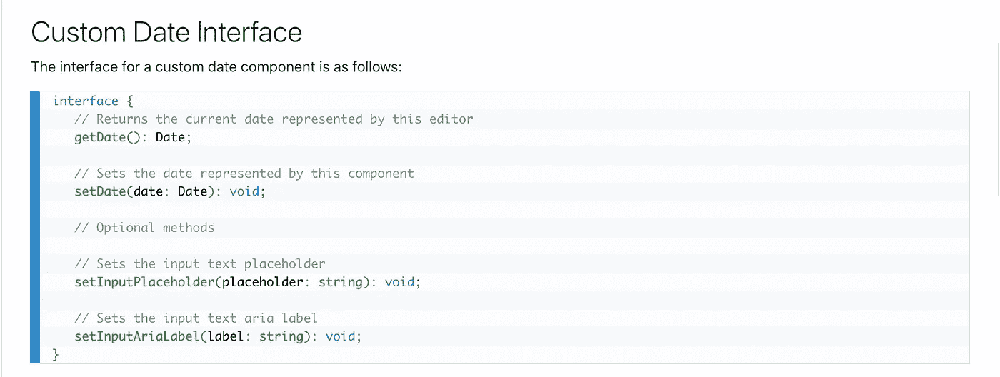
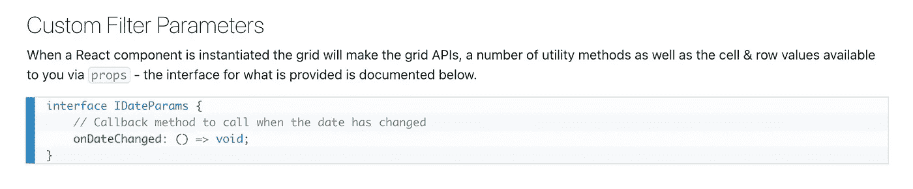

# 如何在 Ag-Grid/React 中创建日期时间过滤器

> 原文：<https://javascript.plainenglish.io/how-to-create-a-datetime-filter-in-ag-grid-react-e2e1ba2fc80?source=collection_archive---------1----------------------->

Photo by [Nubelson Fernandes](https://unsplash.com/@nubelsondev?utm_source=medium&utm_medium=referral) on [Unsplash](https://unsplash.com?utm_source=medium&utm_medium=referral)

[*堆叠演示*](https://stackblitz.com/edit/custom-datetime-filter-component-for-ag-grid?file=src/DTPicker.jsx)

我使用 AG-Grid 的反应版[作为我个人和专业项目的数据网格。社区版附带大量现成的免费功能，以及很好的、易于阅读的文档](https://www.ag-grid.com/react-grid/)。

在最近的一个项目中，我发现自己需要一个日期时间过滤器来过滤我的一个专栏。通过阅读文档，您可以看到 AG-Grid 提供了一个非常有效的[日期过滤器](https://www.ag-grid.com/react-grid/filter-date/)，但是它没有提供基于时间过滤的默认选项。根据 GitHub 上的 ag-Grid 问题部分，尽管对该功能的需求相对较高，但 ag-Grid 团队没有实施该功能的计划。

GitHub user @gportela85 提供了一个基于 [jQuery 的解决方案](https://github.com/ag-grid/ag-grid/issues/2233#issuecomment-765008771)，该解决方案与普通的 ag-Grid JS 版本配合使用效果很好，但是[我们不应该在我们的 React 项目](https://stackoverflow.com/questions/51304288/what-is-the-right-way-to-use-jquery-in-react?fbclid=IwAR1iQfEi3i-F7DmCzeLehzlwcNBKlwJwxvHtXm3W3JDV_b4ZU0k5BPN_iJA)中使用 jQuery。那么，当开发人员需要一个他们正在使用的包没有提供的组件时，他们会怎么做呢？当然，他们创造了自己的。

如果我们看一下 AG-Grid 文档中非常简短的[自定义过滤器页面](https://www.ag-grid.com/react-grid/filter-custom/)，我们会看到第三个选项是我们可以创建自己的自定义日期组件并自定义自己的日期选择器。

如果我们遵循链接，我们会进入[日期组件](https://www.ag-grid.com/react-grid/component-date/)的界面，该界面向我们展示了强制和可选的方法。就在这下面，您将看到日期参数对象，它在初始化时被传递给网格组件。我们需要在应用程序中实现这些方法:

对于我们的 DateTime 组件，我们将利用 React 的`[forwardRef](https://reactjs.org/docs/forwarding-refs.html)`钩子。`forwardRef`钩子接受一个带有`props`和`ref`参数的函数，其中`props`保存组件的属性，`ref`保存传递给组件的引用，然后返回一个 JSX 元素。我们将从这样设置组件开始:

# **DTPicker.jsx**

接下来，让我们添加日期的初始状态，以及一个在日期被选中时处理状态变化的函数:

# **DTPicker.jsx**

就在我们的`onDateChanged`函数之后，我们可以实例化我们的日期时间选择器实例。对于这个演示，我们将使用 [Flatpickr](https://flatpickr.js.org/) ，但是有很多很好的选项可供选择。如果您在本地跟进，只需运行`npm i flatpickr`来安装这个包。我们将为 Flatpickr 实例设置一个 ref，并设置一个状态变量来跟踪任何更改。我们还将为实际的输入字段设置一个 ref。需要记住的一点是，当我们在 ag-Grid 中使用第三方组件时，我们无法控制它们，这意味着当用户点击日历选择器时，无法实现`preventDefault`。我们可以通过向 picker 元素添加`ag-custom-component-popup`类来解决这个问题:

现在，我们必须从自定义日期接口实现强制的`getDate`和`setDate`方法以及可选的`setInputPlaceholder`和`setInputAriaLabel`方法。为此，我们将使用 React 的`[useImperativeHandle](https://reactjs.org/docs/hooks-reference.html#useimperativehandle)` [钩子](https://reactjs.org/docs/hooks-reference.html#useimperativehandle)。`useImperativeHandle`允许我们通过引用暴露子组件内部的函数。出于我们的目的，我们希望向 ag-Grid 实例公开的函数是`getDate`、`setDate`和其余的方法。我们使用的`ref`是我们和`props`一起传递给组件的`ref`。代码将如下所示:

# DTPicker.jsx

好了，这就是组件的构建，但是我们如何将它实现到我们的 AG-Grid 中呢？嗯，如果我们回头看看 [AG-Grid 文档中关于如何注册组件的章节](https://www.ag-grid.com/react-grid/components/#mixing-javascript-and-react)，我们会发现我们必须导入我们的自定义组件，并将其传递给 AG-Grid 的`frameworkComponents` prop。让我们将它添加到我们的表中:

# App.jsx

现在，我们应该有一个成功集成到 AG-Grid 实例中的工作日期时间过滤器。Flatpickr 有一大堆开箱即用的样式，所以你可以试着找一个你喜欢的。下面是我们组件的最终代码:

## DTPicker.jsx

这里有一个建立在 StackBlitz 上的工作的[演示供你使用](https://stackblitz.com/edit/medium-datetime-filter-component-for-ag-grid-flatpickr?file=src/DTPicker.jsx)。感谢阅读！

我发现一些有用的资源，我想你也会喜欢:

*   [AG-Grids 定制过滤器](https://www.ag-grid.com/react-grid/filter-custom/)
*   [React 的 useImperativeHandle 制作简单](https://levelup.gitconnected.com/reacts-useimperativehandle-made-simple-81035a21eef0)
*   [了解 React 中的参考转发](https://blog.bitsrc.io/understanding-ref-forwarding-in-react-80accd93ed74)
*   [Flatpickr 文档](https://flatpickr.js.org/)
*   [使用 CRUD 和 React 挂钩在 ag-Grid 中进行下一级单元格编辑](https://blog.ag-grid.com/next-level-cell-editing-in-ag-grid-with-crud-and-react-hooks/#date-picker)
*   [HTML 日期时间-本地输入](https://developer.mozilla.org/en-US/docs/Web/HTML/Element/input/datetime-local)

[*更多内容看 plainenglish.io*](http://plainenglish.io/)