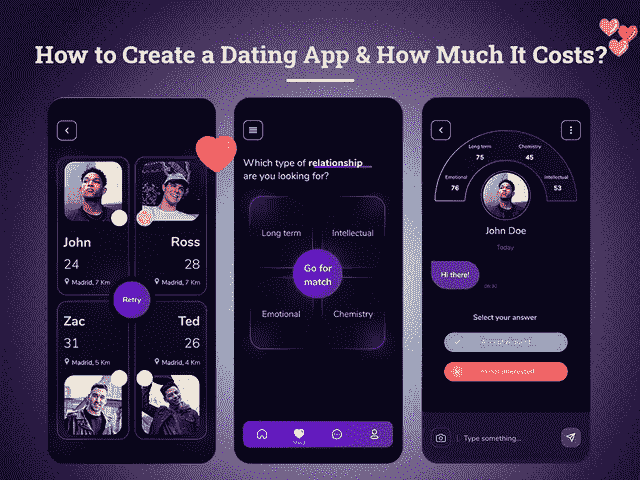
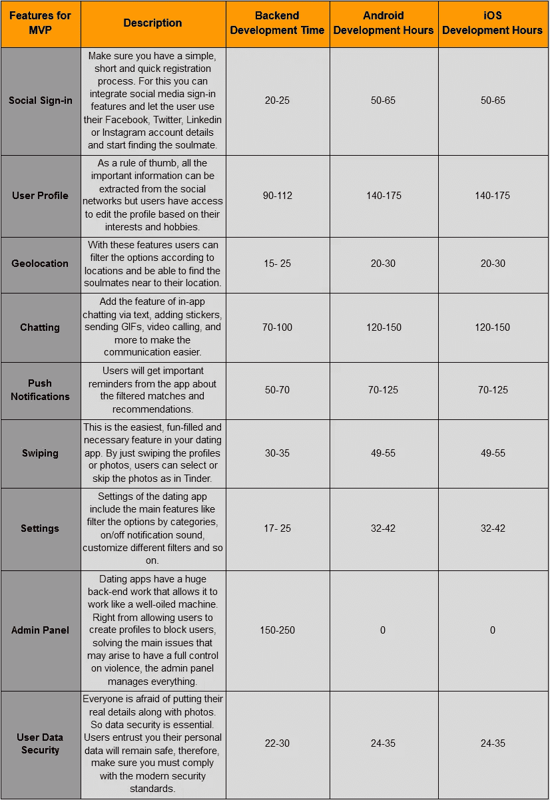
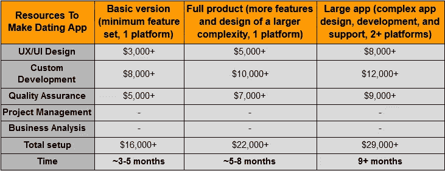
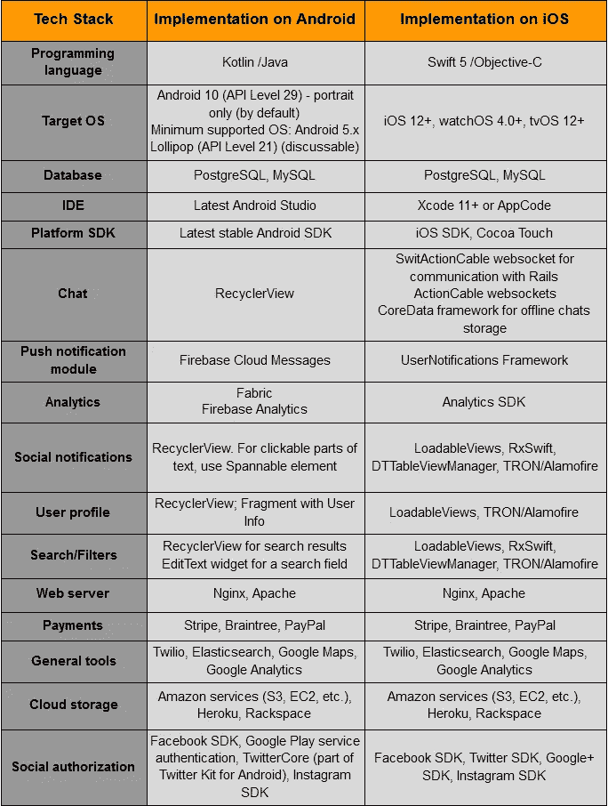
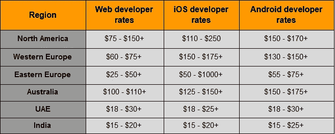

# 如何创建一个约会 App，要花多少钱？

> 原文：<https://javascript.plainenglish.io/how-to-create-a-dating-app-and-how-much-does-it-cost-you-c73e9e9979b?source=collection_archive---------9----------------------->

## 2021 年创建一个约会 App 需要多少钱

你是如何找到你的灵魂伴侣的？当你和某人处于健康的关系中时，这是第二个人最常问的问题之一。

***但是在这个数字化的时代，答案已经从媒人转移到了手机交友 app 上！***

虽然移动应用开发领域的新兴技术和创新一直在影响着每个行业，并将它们推向新的高度，但社交媒体应用也未能幸免。事实上，它们正占据着中心舞台，并以飞快的速度蓬勃发展，丝毫没有减速的迹象。

如果你仍然有疑虑，那么考虑一下现在有 1500 个约会应用程序或网站可供情侣们寻找他们的灵魂伴侣[。虽然婚介是现存最古老的行业之一，但随着其功能的巨大进步，现在这些应用程序有了自己的空间。](https://blog.marketresearch.com/dating-services-industry-in-2016-and-beyond)

然而，随着现有的约会应用程序如 Tinder，Bumble 或 Grinder，似乎市场已经被这些市场领导者占领，并使企业家陷入两难境地 2021 年是否值得开发一个约会应用程序？

据统计，仅在美国，2021 年在线约会收入的增长就已经达到了 10 亿美元。

*还没完，* [*大约 15%的美国成年人或者 5000 万美国人*](https://www.toptal.com/finance/business-model-consultants/online-dating-industry) *都在使用这些交友应用。*

从提供“休闲到严肃”的约会光谱，领先的婚介应用程序根据仅仅一眼就为潜在的联系配对，每天进行超过 1500 万次配对，18-44 岁的人广泛使用这款应用程序。

> 疫情的影响将约会应用的使用推向了一个新的高度。

因此，毫无疑问，约会应用市场正在增长，客户的需求也在增长。由于人们正在寻找具有新特性和功能的约会应用程序，因此，这是抓住机会的正确时机，并向 Tinder、Bumble 等领导者看齐，为自己创建一个成功的应用程序。

# **如何构建手机交友应用:应用功能和特性**

开发约会应用程序是最复杂的任务之一，因为你的应用程序要根据你存储在应用程序中的照片和数据来寻找灵魂伴侣。那么是什么技巧让它工作得如此顺利呢？是什么特性让访问变得如此令人兴奋？

在这里，我们已经涵盖了在约会应用程序开发过程中占有重要地位的核心技术和功能。

> 因此，如果你想知道如何构建一个功能不错的约会应用，那么考虑以下组件:

## ***支持手机交友 app 中匹配算法的核心功能***

这是最重要的功能之一，它让你的应用程序发挥作用，并由一组属性驱动。由于理解和开发应用程序中的这一功能是一项具有挑战性的任务，所以最好 [**雇佣应用程序开发人员**](https://www.xicom.biz/solutions/hire-developers/) 为你的约会应用程序提供正确的匹配算法，并进行适当的匹配。所以这里有几个配对选项供你选择:

## **1。数学算法**

基于数学的匹配基本上依赖于算法，并分析用户在个人资料中提供的信息。算法用于分析配置文件的主要信息有:

*   *性格特征(年龄或性别)*
*   *兴趣兼容(爱好、喜欢、不喜欢、激情、音乐品味、阅读兴趣)*
*   *身体状态(身高、体质)*
*   *建立更好的信任和用户安全的朋友关系(使用来自社交网络的数据)*

基于数学的匹配非常流行，但它往往是不完美的。这是因为，人们经常在个人资料中放一些关于自己的虚假信息，比如他们喜欢旅游、音乐或文学，但实际上，他们对此一无所知。因此，为了更好地了解一个人的性格，建议选择行为分析和地理数据。

## **2。用 AI & AR** 进行高级配对

随着人工智能和增强现实等新兴技术的出现，在约会应用中实现高级匹配算法成为可能。

就像网飞和亚马逊等各种领先的应用程序一样，约会应用程序也可以根据复杂的数据分析推荐最佳匹配。从面部识别到生物数据使用，它涵盖了数据分析和提供更有效匹配的所有内容。

这些是为数不多的匹配分析算法， [**移动应用程序开发公司**](https://www.xicom.biz/services/mobile-app-development/) 可以选择将其集成到开发流程中，以允许用户与他们选择的灵魂伴侣建立联系。

但为了改善使用约会应用程序的体验，实现高级通信的独特功能选择是值得的。

## **3。行为分析**

行为分析比使用数学匹配要复杂得多，因为分析是基于一个人的真实数字足迹。换句话说，约会应用程序访问社交媒体上的信息，搜索历史，YouTube 播放列表，访问过的页面，电影偏好，访问过的地方，喜欢的页面等等。行为分析有助于你描绘用户档案的真实情况。但是这种类型的分析只有在大数据解决方案中才有可能。

## **4。使用地理定位**

使用地理位置数据进行匹配将有助于您根据位置对个人资料进行分类。这些类型的算法真的很有帮助，因为它们使你能够在一个首选位置找到一个完美的匹配。

# ***MVP 交友 App 必备功能***

尽管你努力创建一个具有独特特性和功能的未来约会应用程序，但作为一家初创公司，你总是致力于创建一个符合你最初预算的约会应用程序，并选择 [**雇用一名移动应用程序开发人员**](https://www.xicom.biz/offerings/hire-mobile-developers/) 。因此，开发一个具有所有基本功能的 MVP 模型将是一个明智的决定，以验证应用程序的想法和用户体验。下面是您可以选择实现的一组功能:

## ***交友 App 开发的附加功能***

一旦你创建了你的约会应用程序的 MVP 版本，在创建了一个稳定的受众后，你肯定会期待增加更多的功能。因此，是时候考虑实现新功能了，这些新功能可以拓宽功能范围并提供现代用户体验。

*   **个人资料验证:**知道和你聊天的人是真实的、真诚的总是好的。许多著名的约会应用程序都有适当的验证程序，要求向版主发送单独的照片，告诉你那个人已经过验证。因为定制它是一个复杂的功能，尽管你可以选择雇佣一个 [**应用开发公司**](https://www.xicom.biz/offerings/hire-mobile-developers/) 。
*   **视频通话:**为什么用简单无聊的应用内文字聊天来限制用户？一旦匹配者彼此很了解，他们就可以安排视频通话来面对面聊天。除此之外，对于不能很快见面的跨河比赛来说，这是一个非常好的功能。
*   人工智能聊天机器人:你有那么多耐心打电话给客户支持寻求帮助的日子已经一去不复返了。人工智能聊天机器人无处不在，因为它们的主要目的是帮助人们获得即时支持。他们会选择第一句话开始对话，营造一个舒适的聊天环境。

## **制作一款成熟的约会应用需要多少成本**

一旦你对开发一个聊天应用程序的功能和特性有了想法，你当然会好奇你需要在开发过程中投资多少钱。

但是，不幸的是，这个问题没有直接的答案，因为有许多因素会影响约会应用程序开发的最终成本。这一部分已经包括了有关价格的一切。

*   **应用程序的复杂性:**应用程序的复杂性由您选择在应用程序中实现的特性和功能决定。它可以分为三个版本，如简单，适度和复杂的版本。开发具有上述功能和单一平台的基本应用程序或 MVP 模型的平均成本可能在 12，000 美元到 15，000 美元之间，甚至可能高达 50，000 美元以上。
*   **应用平台的选择:** Android 和 iOS 是最受欢迎的发布约会应用的平台，因为它们拥有大多数用户。但开发两个原生 Android 和 iOS 应用的成本可能会增加你的应用开发预算，因为这两个平台都使用专用的编程语言来编写代码。

节省成本的简单方法是寻找一家 [**跨平台应用程序开发公司**](https://www.xicom.biz/offerings/cross-platform-app-development/) ，它可以帮助你使用相同的代码库构建一个在多个平台上运行的应用程序。

开发跨平台应用程序已经成为一种流行的选择，因为这是一种快速启动应用程序并节省约会应用程序开发成本的方法。开发两个不同的原生应用比创建一个混合应用要贵 40%。

*   **App 开发所需资源:**你真的对 Tinder 这样的交友 App 印象深刻吗？期待打造一款像 Tinder 或者 Bumble 这样的交友 app？您需要由以下人员组成的合适的开发团队:

*   **开发一个令人惊叹的 UI/UX 设计:**应用程序的界面应该是交互式的，引人入胜的，朗朗上口的，这样用户在开始访问你的应用程序时会有积极的感觉。因此，与其倾向于通过 [**雇佣一个应用程序开发者**](https://www.xicom.biz/solutions/hire-developers/) 来创建一个花哨而复杂的应用程序界面，保持一个简单而独特的设计是值得的。你的用户想要的是一个清晰的 UX/用户界面，不会让他们感到困惑。至于用户界面，明亮的颜色和清晰的按钮肯定会是一个不错的选择。根据研究，根据应用程序的复杂程度，设计一个应用程序需要 50 到 150 个小时甚至 250 多个小时。
*   **所需的技术组合:**你用于约会应用开发的技术会带来应用开发成本的巨大变化。高端技术将支持越复杂的应用结构，尽管你需要雇佣经验和专业知识水平更高的移动应用开发者。

> 但是这里我们提到的是你可以用来构建约会应用的最佳技术选择。

*   **应用开发者的地理位置:**根据应用开发者的地理位置或国家的不同，应用约会应用的开发成本会有很大的不同。所以在你雇佣一家 [**约会应用开发公司**](https://www.xicom.biz/services/mobile-app-development/) 之前，确保你对那个特定地点的开发者的时薪有个概念:

这些是几个重要的参数，可以极大地影响约会应用的应用开发成本。在你与任何软件开发公司签订合同之前，你需要对这些参数有一个深入的了解，以便对应用程序开发成本进行可靠的估算。

## **你的手机交友 App 能赚多少钱？**

当应用程序价格昂贵时，这些都是过时的趋势。如今，几乎每个应用程序都可以免费下载，并允许您覆盖大量的受众群。那么，如何从你的约会应用中赚钱是商家最关心的问题？

因此，在回顾了市场策略并了解了精明的应用程序创作者广泛接受的最佳货币化策略后，我们列出了一份货币化方法的候选名单。

*   **提升用户账户:**你可以向用户收取月费或季费来提升他们的个人资料，让他们在有限的时间内出现在搜索列表的首位。
*   **智能滑动:**这一功能非常罕见，市场上唯一使用这一功能的应用程序是 Tinder。你能做的就是整合机器学习算法，改变用户看你照片的方式。根据浏览您个人资料的用户的兴趣，您照片的顺序将完全改变。
*   **无限制的个人资料滑动:**在免费应用版本中，用户对个人资料滑动的访问是有限的。因此，人们可以使用高级应用程序进行无限次数的右刷。

# **结论:如何创建交友 App 的底线？**

寻找灵魂伴侣从来都不是一件容易的事情。但有了技术驱动的约会应用，越来越接近未来只是成为几个刷卡的任务。

因此，如果你打算创建一个约会应用程序，那么聘请一家能够帮助你将应用程序想法转化为完美解决方案的 [**移动应用程序开发公司**](https://www.xicom.biz/services/mobile-app-development/) 是一个完美的选择。你可以与应用程序开发人员交谈，让你能够将最好的约会产品推向市场。

这篇博客已经涵盖了与约会应用程序开发相关的所有主要参数；但是，如果你对如何开始使用自己的约会应用程序有任何疑问，或者有一个想将约会应用程序转化为应用程序的想法，那么你可以 [**联系我们**](https://www.xicom.biz/contact/) 或者在下面提出疑问！

*plain English . io 的更多内容*