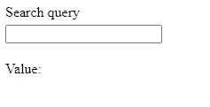

# 使用合成 API 在 Vue 3 中创建一个去抖 Ref

> 原文：<https://javascript.plainenglish.io/how-to-create-a-debounced-ref-in-vue-3-using-composition-api-c464cc39c82a?source=collection_archive---------7----------------------->


本文最初发表在[通往*之路*企业](https://theroadtoenterprise.com/blog/how-to-create-a-debounced-ref-in-vue-3-using-composition-api)博客上。

随着组合 API 的引入，我们得到了一种新的编写反应式逻辑的方式，即 *ref* 和 *reactive* 方法。在本文中，我想向您展示如何创建一个去抖 ref，它只在指定的延迟后更新其值。例如，如果您有一个带有自动完成功能的输入字段，其中在搜索查询状态改变后发出一个 API 请求，那么公开的 ref 可能非常有用。



去抖动是一个很好的优化模式，如果没有它，每次击键后都会发出一个 API 请求。攻击服务器不是最佳选择，所以让我们开始吧。

# 项目设置

为了展示这个例子，我用 [Vite](https://vitejs.dev) 创建了一个新项目。如果你想继续，你可以通过运行*yarn create @ vite js/app de bounce-ref-template vue*或*NPM init @ vite js/app de bounce-ref-template vue*来创建一个。你也可以在[这个 GitHub repo](https://github.com/ThomasFindlay/debounced-ref) 中找到完整的代码示例。

## App.vue

正如我在开始时提到的，当用户在输入字段中输入搜索标准时，去抖 ref 可以用来延迟 API 请求。下面你可以看到它的设置。

```
<template>
  <div>
    <label :class="$style.label">Search query</label>
    <input :class="$style.input" v-model="query" type="text" />
    <div>Value: {{ query }}</div>
  </div>
</template>

<script>
import { watch } from 'vue'
import useDebouncedRef from './composables/useDebouncedRef'
export default {
  setup() {
    const query = useDebouncedRef('', 400)

    watch(query, newQuery => {
      console.log({ newQuery })
      // init an API request
    })

    return {
      query,
    }
  },
}
</script>

<style module>
.label {
  display: block;
}

.input {
  margin-top: 5px;
  margin-bottom: 20px;
}
</style>
```

在模板中，我们有一个*标签*、*输入*和包含*查询*值的 *div* 。当我们完成时，您将看到值只是在一段延迟之后才更新。在 *setup* 方法中，我们使用 *useDebouncedRef* 函数创建一个去抖 ref，并传递一个空字符串作为初始值以及 400，即去抖延迟。我们将在稍后创建它。除此之外，我们还有一个观察器来观察查询引用。在那里你可以初始化一个函数来执行一个 API 请求。


[《Vue——企业之路》](https://theroadtoenterprise.com/?utm_source=medium&utm_medium=post&utm_campaign=easter)现已七折发售。立即购买，获取奖励视频，内容包括:

-组合 API 简介
-复合组件模式
-如何使用现代 JavaScript 特性编写更简洁的代码

## useDebouncedRef.js

下面是*useDebouncedRef*composable 的实现。

```
import { ref, customRef } from 'vue'

const debounce = (fn, delay = 0, immediate = false) => {
  let timeout
  return (...args) => {
    if (immediate && !timeout) fn(...args)
    clearTimeout(timeout)

    timeout = setTimeout(() => {
      fn(...args)
    }, delay)
  }
}

const useDebouncedRef = (initialValue, delay, immediate) => {
  const state = ref(initialValue)
  const debouncedRef = customRef((track, trigger) => ({
    get() {
      track()
      return state.value
    },
    set: debounce(
      value => {
        state.value = value
        trigger()
      },
      delay,
      immediate
    ),
  }))
  return debouncedRef
}

export default useDebouncedRef
```

在 *_useDebouncedRef.js_* 文件中，我们有*去抖*和 *useDebouncedRef* 函数。*去抖*功能负责在指定的延迟时间过后执行回调功能。除了回调函数和延迟数之外，它还接受第三个名为 *immediate* 的参数。顾名思义，它用于指示回调是否应该立即执行。这个小助手函数可以抽象成自己的实用程序文件，并在应用程序的其他部分重用。

在*useDebouncedRef*composable 中，我们使用从 *vue* 包导入的 *ref* 方法声明了一个新的反应值。然而，我们还使用了一个 *customRef* ，这就是神奇之处。 *customRef* 为我们提供了对跟踪依赖性和触发状态更新的显式控制。getter 调用 *track* 方法并返回当前*状态*值。对于 setter，我们分配一个*反跳*函数的结果，该函数接收一个回调作为第一个参数，并转发*延迟*和*立即*参数。在回调中，我们更新*状态* ref 并触发 *customRef* 的更新。仅此而已。如果您尝试在输入字段中输入内容，您应该会看到，值文本只有在您停止输入一段时间后才会更新。

## 结论

我希望这篇文章对你有用。如果您想了解更多与 Vue 相关的技巧、高级模式、技术和最佳实践，您可能想要查看[“Vue—通往企业之路”](https://theroadtoenterprise.com/?utm_source=theroadtoenterprise_blog&utm_medium=article_learn_more&utm_campaign=vue_the_road_to_enterprise)一书，注册[时事通讯](https://theroadtoenterprise.com/blog/subscribe?utm_source=theroadtoenterprise_blog&utm_medium=article_learn_more&utm_campaign=vue_the_road_to_enterprise)，并在 [Twitter](https://twitter.com/@thomasfindlay94) 上关注我。

*更多内容请看*[***plain English . io***](https://plainenglish.io/)