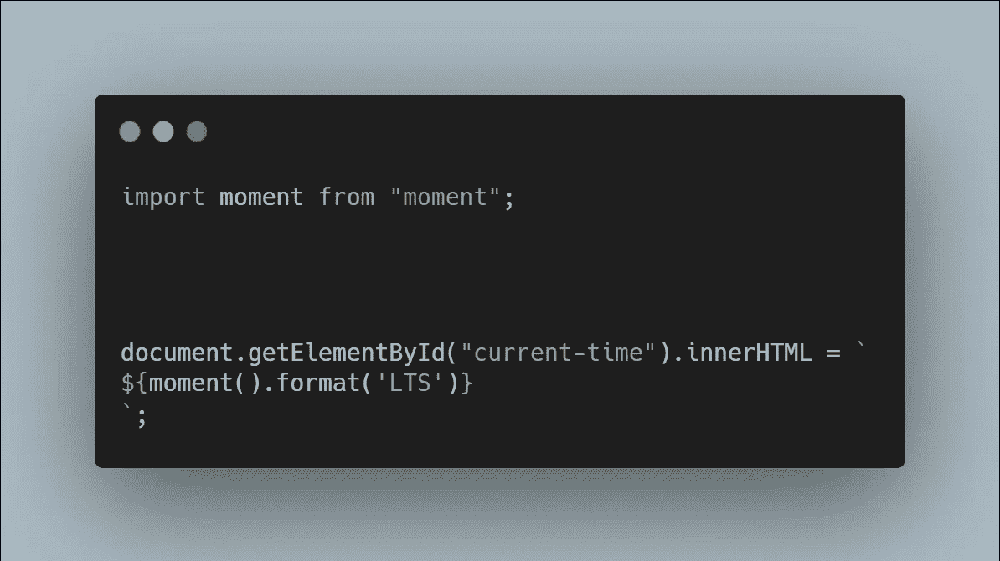

# 如何使用 Moment.js 创建数字时钟

> 原文：<https://javascript.plainenglish.io/how-to-create-a-digital-clock-using-moment-js-8cd40c7b0899?source=collection_archive---------9----------------------->

## 仅使用普通 JavaScript 和 Moment.js 库在浏览器中创建时钟的指南。

Photo by [Yasin Hasan](https://unsplash.com/@yasin?utm_source=medium&utm_medium=referral) on [Unsplash](https://unsplash.com?utm_source=medium&utm_medium=referral)

掌握 JavaScript 的一种方法是构建项目。

在今天的帖子中，我们将只使用普通的 JavaScript 和库 [Moment.js.](https://momentjs.com/) 创建一个工作时钟

让我们直接在浏览器中创建我们的全功能时钟。

# 添加我们的 HTML

在开始添加 JavaScript 来创建时钟之前，我们必须先添加一些 HTML 标记。

这个标记将充当我们时钟的 UI，并允许我们在想要显示当前时间时使用一些 DOM 元素。

代码如下所示:

HTML Markup

# 添加 JavaScript

现在我们有了 HTML，是时候添加一些 JavaScript 了。

我们需要做的第一件事是获取对我们之前添加的 H1 元素的引用。

这将允许我们更改 H1 元素中的文本，并依次显示当前时间。

我们将通过使用 *document.getElementByID* 函数并向它传递一个对“当前时间”的 H1 id 的引用来实现这一点。

在我们获得对所述 H1 标签的引用后，我们将使用 *innerHTML* 来改变其中显示的文本以显示当前时间。

将使用 Moment.js *format()* 函数显示时间。

这方面的代码如下所示:

Don’t Forget to import moment into your project

如果一切顺利，你应该会在你的网页上看到这个:

*注意:如果您在使用 Moment.js 时遇到问题，您可以使用来自此* [*链接*](https://cdnjs.com/libraries/moment.js) *的 CDN，并将其导入到 script.js 文件*之前的脚本标签中

# 让我们的时钟每秒更新一次

太好了！我们差不多完成了。

我们唯一要做的就是每秒更新一次时间，这样我们的时钟就会显示当前时间，而不仅仅是页面第一次初始化时的时间。

我们将通过使用 JavaScript[setInterval()](https://developer.mozilla.org/en-US/docs/Web/API/setInterval)方法每秒运行一次 JavaScript 代码来实现这一点。

这方面的代码如下所示:

SetInterval Allows our code above to run every second

*注意:SetInterval 函数需要毫秒* ***而不是*** *秒，所以 1000 等于 1 秒。你可以在 MDN 文章链接* [*这里*](https://developer.mozilla.org/en-US/docs/Web/API/setInterval) *了解更多。*

# 完成我们的时钟

如果您遵循了上述步骤，您应该有一个工作时钟，如下所示:

Working Clock Right in the Browser!

如果你仍然迷路了，你可以在这个 CodeSandbox 链接[这里](https://codesandbox.io/s/agitated-darkness-i3vwc?file=/src/styles.css)查看完整的代码。

# 可选:添加自定义样式

现在我们已经使用纯普通的 JavaScript 完成了一个数字时钟！

我不知道你，但我是黑暗主题的粉丝。下面的 CSS 将我们的代码更改为黑色主题:

Feel Free to add your Own Colors to make this project your own!

*注意:创建完你的风格后，记得把它们添加到你的网站上，要么使用< link >标签，要么把它导入到你的 JavaScript 文件中。如果你不确定如何给网页添加 CSS，你可以按照本文* [*这里*](https://www.csstutorial.net/css_misc_inserting.php) *中链接的步骤操作。*

# 结论

感谢您阅读完我的文章**“如何在 React Navigation 中创建堆栈导航器”**。我希望你有美好的一天。

如果你是中级新手，你可以点击这里的[链接](https://bookeraziz.medium.com/membership)加入

以下是我的进一步解读:

 [## 如何在 React 和 React Native 中以正确的方式实现条件呈现

### 在 Web 和移动应用中使用动态用户界面

javascript.plainenglish.io](/how-to-implement-conditional-rendering-in-react-and-react-native-the-right-way-f00e2fa7a730)  [## 你绝对需要了解的 8 个 React 原生库

### 当谈到使用 React Native 创建应用程序时，找到正确的库可以使开发过程变得更加…

javascript.plainenglish.io](/8-react-native-libraries-you-absolutely-need-to-know-about-28f6038d0b76) 

*更多内容请看*[*plain English . io*](http://plainenglish.io/)*。报名参加我们的* [*免费周报在这里*](http://newsletter.plainenglish.io/) *。*