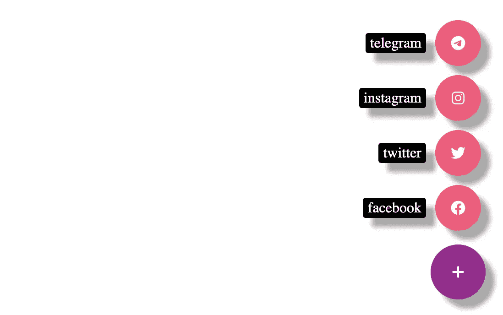
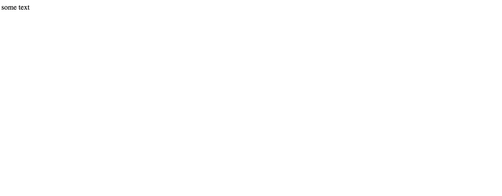
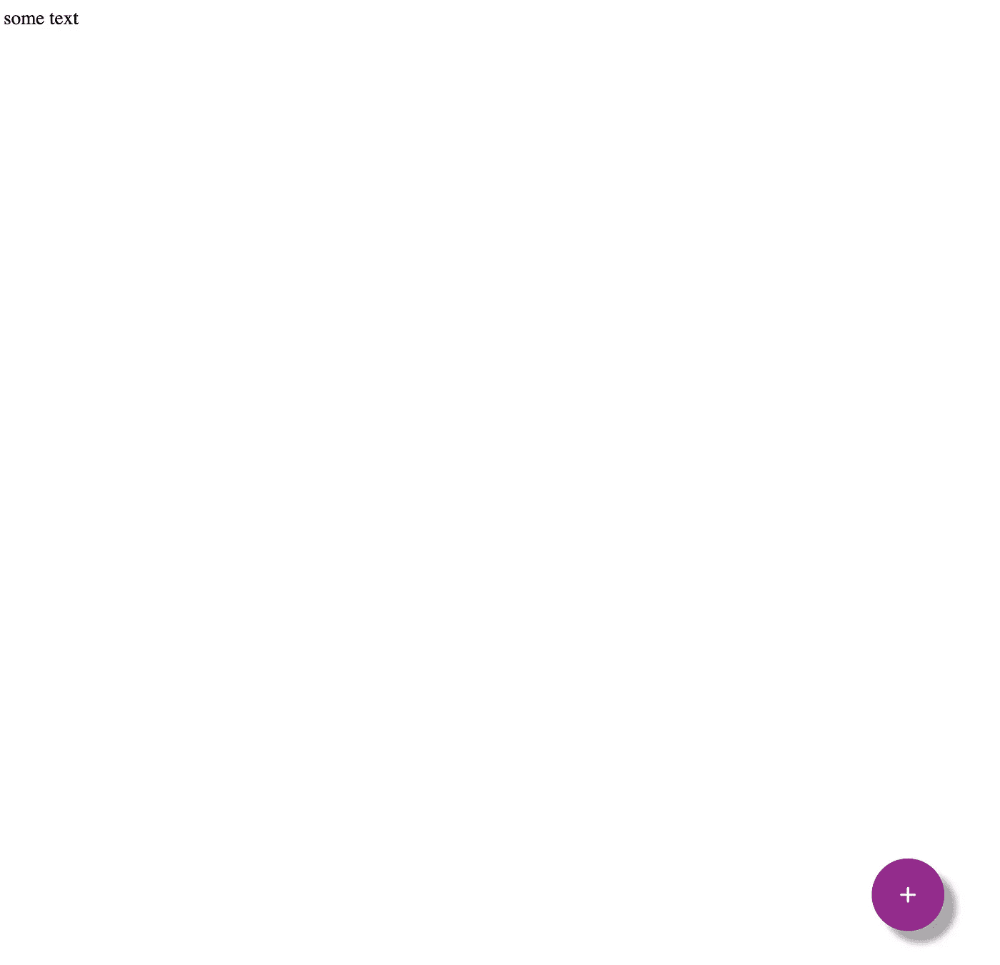
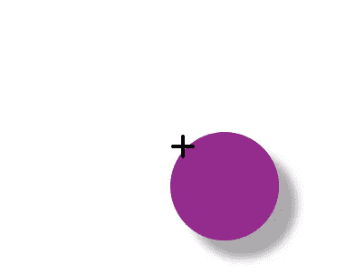
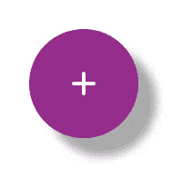
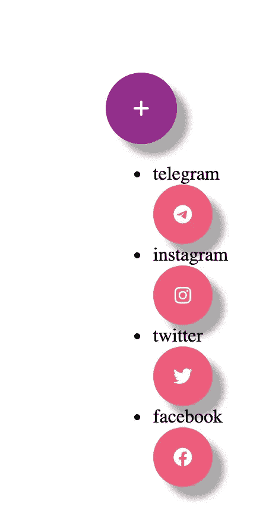
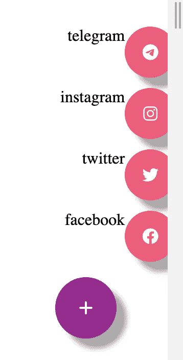
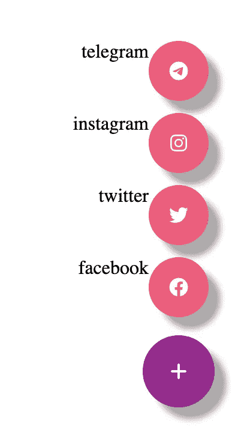
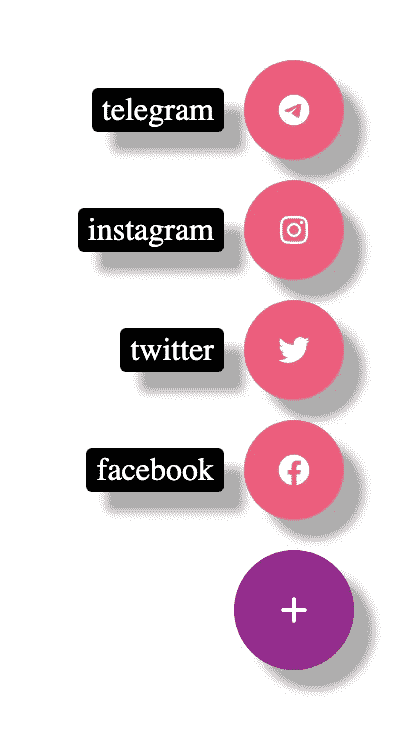

# 如何创建一个纯 CSS 定位的浮动动作按钮

> 原文：<https://javascript.plainenglish.io/how-to-create-a-floating-action-button-with-pure-css-positioning-e52ba498083f?source=collection_archive---------0----------------------->

## 第 1 部分—了解如何使用 CSS 定位和 flexbox

在这篇文章中，我们将使用纯 CSS 创建浮动动作按钮(FAB)。我们会用很多 CSS 定位来打造这个 FAB，比如`fixed`和`absolute`。



首先，我们添加一个

，里面有一些单词。我们还插入了 fontawesome CDN。

```
<!DOCTYPE html><html lang="en"><head><meta charset="UTF-8"><meta http-equiv="X-UA-Compatible" content="IE=edge"><meta name="viewport" content="width=device-width, initial-scale=1.0"><title>Document</title><link rel="stylesheet" href="https://cdnjs.cloudflare.com/ajax/libs/font-awesome/6.0.0-beta2/css/all.min.css"integrity="sha512-YWzhKL2whUzgiheMoBFwW8CKV4qpHQAEuvilg9FAn5VJUDwKZZxkJNuGM4XkWuk94WCrrwslk8yWNGmY1EduTA=="crossorigin="anonymous" referrerpolicy="no-referrer" /></head><body><div>some text</div></body></html>
```

## 添加大按钮



现在我们想在右下角创建一个大按钮。所以我们加上下面的

s。

上一篇

下。我们添加一个来包装所有的按钮。我们想把所有这些东西放在页面的右下角

```
<body><div>some text</div><div class="fab-container"><div class="button iconbutton"><i class="fa-solid fa-plus"></i></div></div></body>
```

*工厂容器*

所以我们添加 CSS 规则，设置位置固定，从底部 50px，从右边 50px。添加光标:指针，使它看起来像一个按钮。

```
.fab-container{position:fixed;bottom:50px;right:50px;cursor:pointer;}
```

*图标按钮*

然后我们添加

来包装 fontawesome plus 图标。

`iconbutton`是用粉色创建圆形图标按钮，下面有阴影。

`button`是创建一个更大的按钮，这样以后用户可以通过点击这个大的“+”按钮来触发所有的选项。

```
.iconbutton{width:50px;height:50px;border-radius: 100%;background: #FF4F79;box-shadow: 10px 10px 5px #aaaaaa;}.button{width:60px;height:60px;background:#A11692;}
```

*将图标居中*



您可以看到大按钮创建正确，但“+”符号不在中心。我们需要通过添加以下 CSS 规则来使其居中。我们还将文本颜色设置为白色。

```
.iconbutton i{display:flex;align-items:center;justify-content:center;height: 100%;color:white;}
```



## 添加选项列表

在大按钮下，我们添加了一个选项列表。我们再次使用带有“iconbutton”类的

来包装所有的图标。我们还在每个按钮旁边添加了标签。

```
<ul class="options"><li><span class="btn-label">telegram</span><div class="iconbutton"><i class="fa-brands fa-telegram"></i></div></li><li><span class="btn-label">instagram</span><div class="iconbutton"><i class="fa-brands fa-instagram"></i></div></li><li><span class="btn-label">twitter</span><div class="iconbutton"><i class="fab fa-twitter"></i></div></li><li><span class="btn-label">facebook</span><div class="iconbutton"><i class="fab fa-facebook"></i></div></li></ul>
```



*制作底部的大按钮*

为了制作底部的大按钮，我们可以通过添加`position:absolute`将选项列表从正常流程中取出。

然后我们删除所有的列表样式，这样就没有项目符号了。最后从底部设置为 70px。

```
list-style-type: none;position:absolute;bottom:70px;
```

## 标签

你可以看到标签在每个图标按钮的顶部。我们希望将它们并排放置，并将所有内容推到每一行的末尾。

所以我们添加以下样式

```
.options li{display:flex;justify-content:flex-end;padding:5px;}
```

`flex-end`:物品朝向伸缩方向的末端包装



现在标签和按钮是并排的。然而，列表是靠右的，并且它的一部分已经在屏幕之外。

所以我们需要在 CSS 文件的选项下添加一个规则。

```
.options{list-style-type: none;position:absolute;bottom:70px;**right:0;**}
```

将定位的

元素 0px 的右边缘设置在其最近的定位祖先的右边缘的左侧。

现在选项列表位于正确的位置。



*标签样式*

我们可以继续设计标签。添加 2px 垂直填充和 5px 水平填充。右边增加 10px 边距，这样在按钮和标签之间留一些空间。

将自身居中对齐，使其与按钮垂直居中对齐。将`user-select`设为 none，这样文本就不能被复制。

将背景颜色设置为黑色，文本颜色设置为白色。设置边框半径为 3px，并添加一些阴影。

```
.btn-label{padding:2px 5px;margin-right:10px;align-self: center;user-select:none;background-color: black;color:white;border-radius: 3px;box-shadow: 10px 10px 5px #aaaaaa;}
```



*更多内容看* [***说白了. io***](http://plainenglish.io/) *。报名参加我们的* [***免费周报在这里***](http://newsletter.plainenglish.io/) *。*