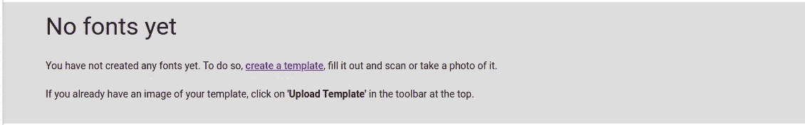
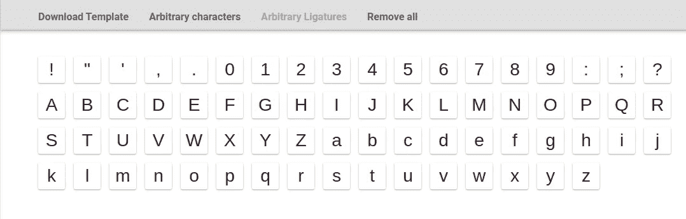
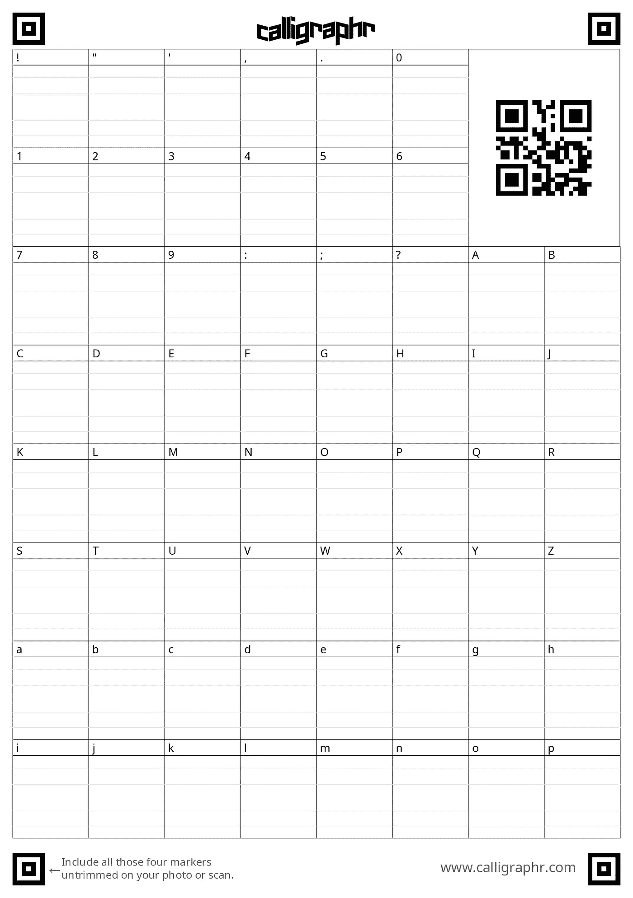
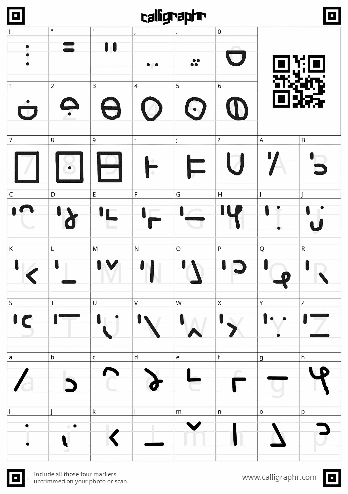
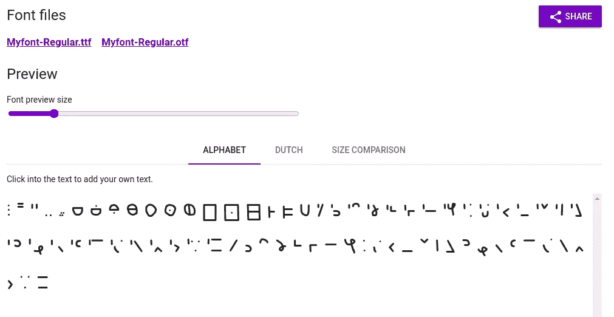
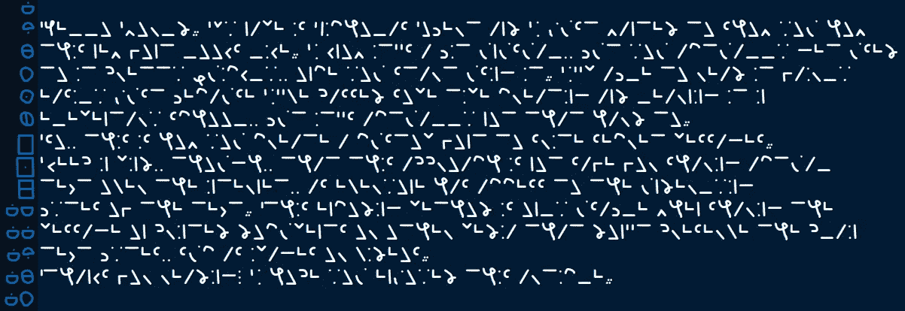

# 如何创建隐藏秘密信息的字体

> 原文：<https://javascript.plainenglish.io/how-to-create-a-font-to-hide-secret-messages-c583acc37e65?source=collection_archive---------13----------------------->

## 如何使用这个简单的在线工具制作精美的字体

Photo by [Jeremy Bezanger](https://unsplash.com/@jeremybezanger?utm_source=medium&utm_medium=referral) on [Unsplash](https://unsplash.com?utm_source=medium&utm_medium=referral)

有无数种字体，每一种都有其用途。有些看起来很花哨，有些可读性更强。字体的另一个用途是对你想避开窥探的文字信息进行编码。

在我们继续之前，我需要提到一点，不可读的字体不能取代传统的加密，如果有人可以访问实际的文本，这种字体是完全没有用的，因为字体只是修改了字符的显示方式。此方法仅适用于打印的文档或图像中的文本，因为您无法访问实际的文本字节。

## 字体制作工具

在本文中，我将使用[书法家](https://www.calligraphr.com/en/)，这是一个创建自定义字体的伟大工具。我不是这个组织的赞助人或成员，尽管我相信他们提供了一个很棒的产品。有很多其他的选择，但这是我目前为止发现的最好的。

为了开始，你需要[在书法家网站上创建一个账户](https://www.calligraphr.com/en/accounts/register/)。注册是完全免费的，即使你没有购买专业许可证，你有有限的功能。无论如何，这不是一个问题，因为你可以用免费层做任何你需要的事情。

书法家让你轻松创作。png 或者。pdf 字体模板，然后您可以打印或直接用图像编辑软件编辑。一旦你用手或电脑完成了自定义字符的创建，你只需要将新创建的字体上传到他们的网站上。如果你选择打印你的模板，你自然需要在上传之前扫描你的作品。

## 创建字体

登录后，点击“创建模板”开始创建新字体。

你将会看到一个清晰的屏幕，告诉你如何组成你的字体字符集。对于这个项目，我选择使用免费提供的“最少的英语”和“最少的数字”模板。

完成后，点击“下载模板”,按照说明下载你的字体模板。现在，你既可以打印出来手工处理，也可以用软件直接编辑。

在这个项目中，模板如下所示:

一旦你到了这里，是时候开始画你的新的自定义字体了。这是我的样子:

这实际上是我在小学时创作的一种字体。我有时会在里面写秘密信息，只是为了好玩。

当你完成你的字体绘制后，你只需要点击“我的字体”部分的“上传模板”按钮就可以上传到书法家了。如果您决定在模板上打印和手写，您可能需要扫描它。注意，你可以一次添加多个文件到你的字体中。

然后，您可以点击“编辑字体详细信息”，根据自己的喜好更改字体名称和其他特征。一旦你完成了，点击“建立字体”,并按照对话框的指示。最后会出现一个对话框，让你下载新的自定义字体。ttf 或者。otf 格式。

我个人决定下载。ttf 文件，但两者都是有效的选项。

剩下要做的最后一件事是安装字体。大多数现代操作系统都提供了一种内置的轻松安装字体的方式。你通常需要用文件管理器打开它所在的文件夹——在我的例子中是“下载”。根据您的系统，以下过程可能略有不同。

*   在 Windows 10 上，右键点击字体文件。您应该会看到一个“安装”按钮。
*   在 macOS 上，双击字体文件打开字体簿。现在，你只需要点击“安装字体”。
*   在 Linux 和其他类似 UNIX 的系统上，没有标准的方法。不过，许多发行版都提供了一些简单的 GUI 或命令行工具来安装字体。如果您的发行版没有，您可以通过简单的互联网搜索找到一个。

现在你已经安装了新字体，是时候开始使用它了。打开您选择的文本编辑器，将文本字体设置为您刚刚创建的字体。我不会展示这一步，因为它可能非常不同，这取决于您使用的文本编辑软件。

这是这种新字体的一个实例。如果可以的话，试着读一读。

## 结论

总结一下，我们已经看到了如何使用书法家和你的想象力创建一个自定义字体。只有记住不要使用这种技术，如果你真的想隐藏互联网上的秘密短信。

感谢阅读！如果你喜欢这篇文章，你可以看看下面的故事，也是关于字体的:

 [## 编程的最佳字体

### 使用 Fira Code(一种为程序员创建的字体)提高代码的可读性和美观性。

javascript.plainenglish.io](/the-best-font-for-programming-35f37018df05) 

*更多内容看* [*说白了. io*](http://plainenglish.io/) *。在这里注册我们的* [*免费周报*](http://newsletter.plainenglish.io/) *。*